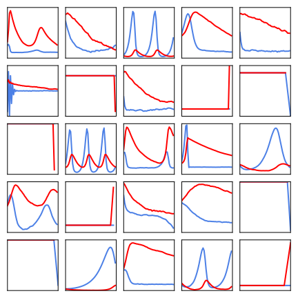
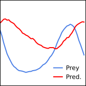
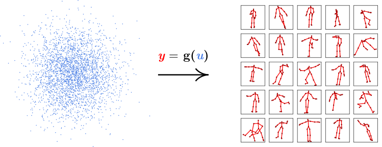
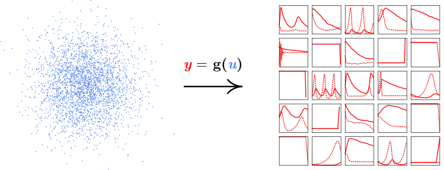
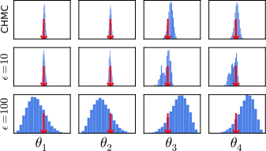
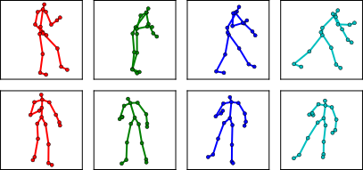
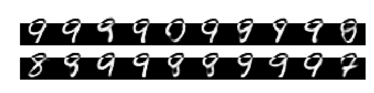

<h2>
 Conditional inference  
 in differentiable  
 generative models
</h2>

Matt Graham 
DTC Neuroinformatics / ANC  
Joint work with Amos Storkey

---

## Conditional inference

Inference given partial observation of system state

$\underbrace{\boldsymbol{y}\_\textrm{obs}}\_{\textrm{obs. pixels}} =$
 
$\qquad \Rightarrow  \qquad  \underbrace{\boldsymbol{y}\_{\textrm{rest}}}\_{\textrm{other pixels}} = \textrm{?}$

$\underbrace{\left\lbrace \boldsymbol{x}^{(i)} \right\rbrace}\_{\textrm{2D proj.}} =$
 
$\qquad \Rightarrow  \qquad \underbrace{\boldsymbol{\phi},\,\boldsymbol{\psi},\,\boldsymbol{\ell}}\_{\textrm{3D pose}} = \textrm{?}$

$\underbrace{\boldsymbol{x}}\_{\textrm{obs. pops.}} =$ 
 
$\qquad \Rightarrow  \qquad \underbrace{\boldsymbol{\theta}}\_{\textrm{model params.}} = \textrm{?}$

---

## Differentiable generator networks

 
e.g. Variational Autoencoder, Generative Adversial Network.

Assume: $\frac{\partial\mathrm{\mathbf{g}}}{\partial \boldsymbol{u}}$ exists and 
$M \geq N$.

----

## Example: MNIST images

<button style='margin: 0; background: none; border: none; color: #38e;' 
    onclick="toggle_visibility('vae-equations');">Show/hide detail</button>

Gaussian VAE trained on MNIST dataset

$$
    \boldsymbol{y} = 
    \boldsymbol{\mu}(\boldsymbol{z}) + 
    \boldsymbol{\sigma}(\boldsymbol{z}) \odot \boldsymbol{n}
    \qquad
    \boldsymbol{u} = \left[ \boldsymbol{z};\, \boldsymbol{n} \right]
$$

----

## Example: Human poses

<button style='margin: 0; background: none; border: none; color: #38e;' 
    onclick="toggle_visibility('pose-equations');">Show/hide detail</button>

$$
    \overbrace{\boldsymbol{x}^{(i)}}^{\text{2D joint positions}} = 
    \mathbf{C}(\overbrace{{\boldsymbol{\phi}}}^{\text{cam. params.}})
    \mathbf{r}^{(i)}(\overbrace{\boldsymbol{\psi}}^{\text{joint angles}},\,
                 \overbrace{\boldsymbol{\ell}}^{\text{bone lengths}}) + 
    \overbrace{\epsilon \boldsymbol{n}^{(i)}}^{\text{obs. noise}}
$$

$$
   \boldsymbol{y} = \left[ \left\lbrace\boldsymbol{x}^{(i)}\right\rbrace;\,
   \boldsymbol{\phi};\,\boldsymbol{\psi};\,\boldsymbol{\ell} \right]
   \quad 
   \left[\boldsymbol{\phi};\,\boldsymbol{\psi};\,\boldsymbol{\ell} \right]
   = \mathbf{p}(\boldsymbol{z})
   \quad
   \boldsymbol{u} = \left[\boldsymbol{z};\,\left\lbrace\boldsymbol{n}^{(i)}\right\rbrace\right]
$$

---

## Simulator models

Many generative models involve simulation of
stochastic dynamical systems e.g. 
in systems biology

----

## Example: Lotka-Volterra model

 

Model of prey ($x_1$) and predator ($x_2$) populations

$$
    \textrm{d} x_1 = (\theta_1 x_1 - \theta_2 x_1 x_2) \textrm{d} t + \textrm{d} n_1
$$

$$
    \textrm{d} x_2 = (-\theta_3 x_2 + \theta_4 x_1 x_2) \textrm{d} t + \textrm{d} n_2
$$

where $n_1$ and $n_2$ are white noise processes.

----

## Example: Lotka-Volterra model

Simulate at $T$ discrete time-steps

$$\small
    x_1^{(t+1)} = x_1^{(t)} + (\theta_1 x_1^{(t)} - \theta_2 x_1^{(t)} x_2^{(t)})\delta t + \sqrt{\delta t} n_1^{(t)}
$$

$$\small
    x_2^{(t+1)} = x_2^{(t)} + (-\theta_3 x_2^{(t)} + \theta_4 x_1^{(t+1)} x_2^{(t)})\delta t + \sqrt{\delta t} n_2^{(t)}
$$

$$
    \boldsymbol{x} = 
    \left[ 
        x_1^{(1)},\, x_2^{(1)} \dots x_1^{(T)},\,x_2^{(T)}
    \right]
    \qquad
    \boldsymbol{\theta} = \exp(\boldsymbol{z} - \boldsymbol{\mu})
$$

$$
    \boldsymbol{u} = \left[ \boldsymbol{z};\,\boldsymbol{n} \right]
    \qquad
    \boldsymbol{y} = \left[ \boldsymbol{x};\,\boldsymbol{\theta} \right]
$$

----

## Example: Lotka-Volterra model

Note:

Dynamics unstable for many parameter settings.

---

<!-- .slide: data-transition="none" -->
## Approximate Bayesian Computation (ABC)

----

<!-- .slide: data-transition="none" -->
## Approximate Bayesian Computation (ABC)

 

----

<!-- .slide: data-transition="none" -->
## Approximate Bayesian Computation (ABC)

 

----

<!-- .slide: data-transition="none" -->
## Approximate Bayesian Computation (ABC)

 

----

<!-- .slide: data-transition="none" -->
## Approximate Bayesian Computation (ABC)

 

---

## Conditioning as a constraint

---

## Constrained Hamiltonian Monte Carlo (CHMC)

<video controls>
  <source data-src="images/chmc-animation.mp4" type="video/mp4" />
</video>

---

## Experiments

  1. Parameter inference in Lotka-Volterra model
  2. Monocular pose and camera model inference
  3. Digit image in-painting with MNIST model

All generative models coded using Theano.

----

### Lokta-Volterra parameter inference

----

### Monocular pose estimation

----

### MNIST in-painting

Note:

Find in-paintings for bottom of digit image given observation of
top pixels.

Dynamic able to move between range of plausible in-filling consistent with
observations.

---

## Conclusions

  * Inference method for differentiable generative models
  * Consider conditioning as constraint on inputs
  * CHMC updates expensive but explore state space well
  * Asymptotically exact inference in likelihood-free models

---

<h2 style='font-size: 250%;'>References</h2>

<!-- .slide: style="font-size: 50%" -->

> M. A. Brubaker, M. Saelzmann, and R. Urtasun.
> A family of MCMC methods on implicitly defined manifolds. 
> *AISTATS*, 2012.

> I. Goodfellow, Y. Bengio, and A. Courville. 
> Deep learning, Chapter 20: Deep Generative Models. 
> *Book in preparation for MIT Press*, 2016.

> D. P. Kingma and M. Welling. 
> Auto-encoding variational Bayes. 
> *ICLR*, 2014.

> I. Goodfellow, J. Pouget-Abadie, M. Mirza, B. Xu, D. Warde-Farley, S. Ozair, 
> A. Courville, and Y. Bengio.
> Generative adversarial nets. 
> *NIPS*, 2014.

> I. Akhter and M. J. Black. 
> Pose-conditioned joint angle limits for 3D human pose reconstruction. 
> *IEEE CVPR*, 2015.

> J.-M. Marin, P. Pudlo, C. P. Robert, and R. J. Ryder. 
> Approximate Bayesian computational methods. 
> *Statistics and Computing*, 2012.

---

## Acknowledgements

   
   

       Doctoral Training Centre in Neuroinformatics and Computational Neuroscience
   
 

Many thanks to the DTC funders

   
   
    

---

## Thanks for listening. 
## Any questions?

 

`python` constrained HMC code

http://github.com/matt-graham/hmc

Paper pre-print with more details

http://arxiv.org/abs/1605.07826

---

## Automatic differentiation

Image source: Wikipedia <!-- .element: style="font-size: 50%" -->

---

## Approximate Bayesian Computation (ABC)

Inference when cannot evaluate 
$\small\mathbb{P}\left[\mathbf{X} = \boldsymbol{x} \,|\,\mathbf{\Theta} = \boldsymbol{\theta}\right]$?

Approximate likelihood

$$\small
    \mathbb{P}\left[
        \tilde{\mathbf{X}} = \tilde{\boldsymbol{x}}
        \,|\,
        \mathbf{\Theta} = \boldsymbol{\theta}
    \right] =
    \int_{\mathcal{X}}
      \mathbb{P}\left[
          \tilde{\mathbf{X}} = \tilde{\boldsymbol{x}} \,|\, \mathbf{X} = \boldsymbol{x}
      \right]
      \mathbb{P}\left[
          \mathbf{X} = \boldsymbol{x} \,|\, \mathbf{\Theta} = \boldsymbol{\theta}
      \right]
    \, \mathrm{d}\boldsymbol{x}.
$$

$$
   \textrm{e.g. }
      \mathbb{P}\left[
          \tilde{\mathbf{X}} = \tilde{\boldsymbol{x}} \,|\, \mathbf{X} = \boldsymbol{x}
      \right]
      \propto
      \mathbb{I}\left[
        \left\Vert \tilde{\boldsymbol{x}} - \boldsymbol{x}\right\Vert_2 < \epsilon
      \right]
$$

---

## Approximate Bayesian Computation (ABC)

Unbiased estimator

$$\small
    \mathbb{P}\left[
        \tilde{\mathbf{X}} = \tilde{\boldsymbol{x}}
        \,|\,
        \mathbf{\Theta} = \boldsymbol{\theta}
    \right]
    \approx
    \frac{1}{S} \sum_{s=1}^S \left\lbrace 
        \mathbb{P}\left[
            \tilde{\mathbf{X}} = \tilde{\boldsymbol{x}} \,|\, \mathbf{X} = \boldsymbol{x}^{(s)}
        \right]
    \right\rbrace
$$

$$\small
    \boldsymbol{x}^{(s)} \sim 
      \mathbb{P}\left[
          \mathbf{X} = \boldsymbol{x}^{(s)} \,|\, \mathbf{\Theta} = \boldsymbol{\theta}
      \right]
    ~~
    \forall s \in \left\lbrace1,\dots S\right\rbrace.
$$

---

## Constrained Hamiltonian Monte Carlo (CHMC)

System subject to holonomic constraint $\mathbf{c}(\boldsymbol{u}) = \boldsymbol{0}$

$$\small
    H(\boldsymbol{u}, \boldsymbol{p}) = 
    -\log\mathbb{P}\left[\boldsymbol{U} = \boldsymbol{u}\right] + \frac{1}{2} \boldsymbol{p}^{\rm T}\mathbf{M}^{-1}\boldsymbol{p} + \mathbf{c}^{\rm T}\boldsymbol{\lambda} 
$$

$$\small
    \frac{{\rm d}\boldsymbol{u}}{{\rm d}t} = \mathbf{M}^{-1}\boldsymbol{p}
    \qquad
    \frac{{\rm d}\boldsymbol{u}}{{\rm d}t} = \frac{\partial \log\mathbb{P}\left[\boldsymbol{U} = \boldsymbol{u}\right]}{\partial \boldsymbol{u}} -  \frac{\partial \mathbf{c}}{\partial \boldsymbol{u}}^{\rm T} \boldsymbol{\lambda}
$$

$$\small
    \mathbf{c}(\boldsymbol{u}) = \boldsymbol{0}
    \qquad
    \frac{\partial \mathbf{c}}{\partial \boldsymbol{u}} \mathbf{M}^{-1} \boldsymbol{p} = \boldsymbol{0}
$$
