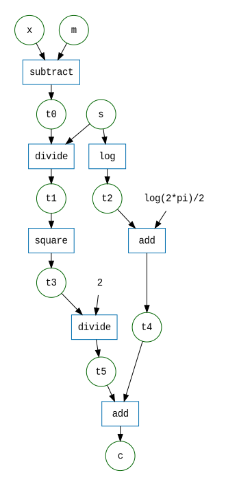
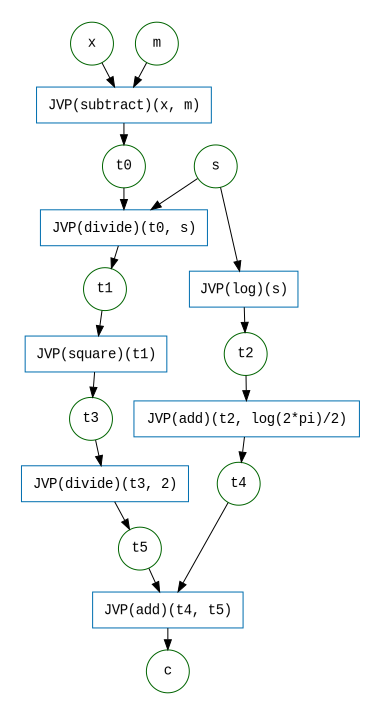

# <small>A brief introduction to</small> <br /> Automatic Differentiation


## Matt Graham <small>[&lt;matt-graham.github.io&gt;](http://matt-graham.github.io)</small>

---

## What is automatic <br />differentiation (AD)?

<!-- .element: class="fragment fade-in-then-semi-out" data-fragment-index="1" --> An approach for computing the derivatives of a function composed of *primitive operations* with known derivatives by algorithmically applying the rules of differentiation.


<!-- .element: class="fragment" data-fragment-index="2" --> Distinct from but related to both *numerical differentiation* and *symbolic differentiation*.

----

## History

AD has a long history dating back to the 1960s.

<span class="fragment" data-fragment-index="1">R.E. Wengert. *A simple automatic derivative evaluation program*.
CACM 7(8):463&ndash;4, 1964.</span>

> <!-- .element: class="fragment" data-fragment-index="2" -->
> A procedure for automatic evaluation of total  / partial derivatives of
> arbitrary algebraic functions is presented ...
> The key to the method is the decomposition of the given function, by
> introduction of intermediate variables, into a series of elementary
> functional steps.


In machine learning reverse-mode AD was historically known as backpropagation.
<!-- .element: class="fragment" data-fragment-index="3" -->

----

## Advantages of AD

  * <!-- .element: class="fragment fade-in-then-semi-out" data-fragment-index="1" --> **Efficient**: can evaluate the Jacobian of a function $f : \reals^N \to \reals^M$ at a computational cost which is $\mathcal{O}\left(\min(M, N)\right)$ times the cost of evaluating $f$.
  * <!-- .element: class="fragment fade-in-then-semi-out" data-fragment-index="2" --> **Expressive**: applicable to any differentiable function which can be expressed algorithmically including use of control flow.
  * <!-- .element: class="fragment" data-fragment-index="3" --> **Exact**: provides exact derivatives of a function (modulo usual errors from using floating-point arithmetic).

---

## Numerical differentiation

Finite difference methods based on limit definitions of (partial) derivatives.
<!-- .element: class="fragment semi-fade-out" data-fragment-index="1" -->

For example for a smooth function $f : \reals^N \to \reals^M$ if $\mathbf{e}_i$ is the length $N$ vector with 1 at the $i$th entry and zeros elsewhere then for a small positive $h$
<!-- .element: class="fragment" data-fragment-index="1" -->

$$
  \partial_i\, f(x) \approx \frac{f(x+h\mathbf{e}_i)-f(x)}{h}
$$
<!-- .element: class="fragment" data-fragment-index="1" -->

(first order forward finite difference formula).
<!-- .element: class="fragment" data-fragment-index="2" -->

----

## Numerical differentiation

To approximate the full $M\times N$ Jacobian matrix $\partial f$ need to compute finite differences for each of $\mathbf{e}_1 \dots \mathbf{e}_N$ $\implies$ cost $\mathcal{O}(N)$ evaluations of $f$.
<!-- .element: class="fragment semi-fade-out" data-fragment-index="1" -->

This is particularly burdensome for calculating the gradient of scalar functions of a large number of variables ($M=1$, $N \gg 1$).
<!-- .element: class="fragment fade-in-then-semi-out" data-fragment-index="1" -->

For small $h$ can become numerically instable.
<!-- .element: class="fragment" data-fragment-index="2" -->


----

## Symbolic differentiation

Implementations of rules of calculus in computer algebra systems (e.g. Mathematica, SymPy).
<!-- .element: class="fragment semi-fade-out" data-fragment-index="1" -->

Gives human-readable expressions as output but verbose for complicated compositions of functions and redundancy between partial derivatives.
<!-- .element: class="fragment fade-in-then-semi-out" data-fragment-index="1" -->

AD instead exploits modularity of functions, computing derivatives in terms of intermediate values rather than expanding in terms of inputs.
<!-- .element: class="fragment" data-fragment-index="2" -->


---

## Jacobians

For a function $f : \reals^N \to \reals^M$ the Jacobian $\partial f(x)$ at an input $x \in \reals^N$ can be represented as a $M \times N$ matrix of partial derivatives

$$ \partial f(x) = \begin{bmatrix}
  \partial_1{f_1}(x) & \dots & \partial_N f(x) \\\\
  \vdots & \ddots & \vdots \\\\
  \partial_1 f_M(x) & \dots & \partial_N f_M(x)
  \end{bmatrix}.
$$
<!-- .element: class="fragment" data-fragment-index="1" -->

More generally the Jacobian is a linear map from the domain to the codomain of a function.
<!-- .element: class="fragment" data-fragment-index="2" -->

----

## Jacobian vector products

<p class="fragment semi-fade-out" data-fragment-index="1">As the Jacobian $\partial f(x)$ is a linear map $\reals^N \to \reals^M$ we can apply it to a vector $v \in \reals^N$. We term this operation a *Jacobian vector product* (`JVP`)</p>

$$\texttt{JVP}(\,f)(x)(v) := \partial f(x) v$$
<!-- .element: class="fragment semi-fade-out" data-fragment-index="1" -->

Cost of $\texttt{JVP}(\,f)(x)(v)$ = $\mathcal{O}(1)\times \,$ cost of  $f(x)$.
<!-- .element: class="fragment" data-fragment-index="1" -->

----

## Vector Jacobian products

<p class="fragment semi-fade-out" data-fragment-index="1">The *transpose* of the Jacobian $\partial f(x)\tr$ is a linear map $\reals^M \to \reals^N$ can be applied to a vector $v \in \reals^M$. We term this a *vector Jacobian product* (`VJP`) (cf. adjoint operator)</p>

$$\texttt{VJP}(\,f)(x)(v) := \partial f(x)\tr v = \left( v\tr \partial f(x)\right)\tr$$
<!-- .element: class="fragment semi-fade-out" data-fragment-index="1" -->

Cost of $\texttt{VJP}(\,f)(x)(v)$ = $\mathcal{O}(1)\times \,$ cost of  $f(x)$.
<!-- .element: class="fragment" data-fragment-index="1" -->

----

## Chain rule

Chain rule for functions $f : \set{X} \to \set{Y}$ and $g : \set{Y} \to \set{Z}$
<!-- .element: class="fragment semi-fade-out" data-fragment-index="1" -->

$$\partial (\,f\circ g) = (\partial f \circ g) \, \partial g$$
<!-- .element: class="fragment semi-fade-out" data-fragment-index="1" -->

or equivalently if $y = g(x)$ and $z = f(y)$
<!-- .element: class="fragment" data-fragment-index="1" -->

$$\pd{z}{x} = \pd{z}{y} \pd{y}{x} = \partial f(y) \partial g(x).$$
<!-- .element: class="fragment" data-fragment-index="1" -->

----

## Forward-mode accumulation

\begin{align}
  \texttt{JVP}(\,f\circ g)(x)(v)
  &= \partial (\,f\circ g)(x) \, v
  \\\\
  &= (\partial f \circ \underbrace{g(x)}_{y=g(x)}) \, \partial g(x) \, v
  \\\\
  &= \partial f(y) \, \partial g(x) v
  \\\\
  &=  \texttt{JVP}(\,f)(y)(\texttt{JVP}(g)(x)(v))
\end{align}

Can evaluate $g(x)$ at same time as $\texttt{JVP}(g)(x)$.
<!-- .element: class="fragment" data-fragment-index="1" -->

----

## Reverse-mode accumulation

\begin{align}
  \texttt{VJP}(\,f\circ g)(x)(v)
  &=  \partial (\,f\circ g)(x)\tr v
  \\\\
  &= \partial g(x) \tr (\partial f \circ \underbrace{g(x)}_{y=g(x)}) \tr v
  \\\\
  &= \partial g(x) \tr \, \partial f(y) \tr v
  \\\\
  &=  \texttt{VJP}(g)(x)(\texttt{VJP}(\,f)(y)(v))
\end{align}

<p class="fragment" data-fragment-index="1">
Need to evaluate $g(x)$ *before* evaluating $\texttt{VJP}(g)(x)$.
</p>

----

## Forward- and reverse-mode AD

<p class="fragment semi-fade-out" data-fragment-index="1">
For a function which is an arbitrary composition of primitives which we can evaluate `JVP`s or
`VJP`s for, by iteratively applying the chain rule we can compute a `JVP` or `VJP` for the whole function.
</p>

<p class="fragment" data-fragment-index="1">
In the case of reverse-mode accumulation using `VJP`s we must first compute and store all intermediate values in a *forward pass* before propagating the derivatives from the outputs to inputs in a *backwards pass*.
</p>

----

## Computing gradients

For a scalar-valued function $f : \reals^N \to \reals$ we can express its gradient as a `VJP`

$$\nabla f(x) \tr = \partial f(x)\tr [1] = \texttt{VJP}(\,f)(x)([1]).$$
<!-- .element: class="fragment" data-fragment-index="1" -->

Using reverse-mode accumulation we can therefore compute $\nabla f(x)$ at similar cost to evaluating $f(x)$.
<!-- .element: class="fragment" data-fragment-index="2" -->

---

## Normal negative log density example

Consider computing the derivatives negative log density of a univariate normal distribution with mean $m$ and standard deviation $s$ at a point $x$

$$ c = \frac{1}{2}\left(\frac{x-m}{s}\right)^2 + \log (s) + \frac{1}{2}\log (2\pi) $$
<!-- .element: class="fragment" data-fragment-index="1" -->

----

## <a href='https://live.sympy.org/?evaluate=x%2C%20m%2C%20s%20%3D%20symbols(%27x%20m%20s%27)%0Ac%20%3D%20((x-m)%2Fs)**2%20%2F%202%20%2B%20log(s)%20%2B%20log(2%20*%20pi)%20%2F%202%0Asimplify((diff(c%2C%20x)%2C%20diff(c%2C%20m)%2C%20diff(c%2C%20s)))%0A%23--%0A'>Symbolic differentiation: SymPy</a>

```Python
import sympy as sp

x, m, s = sp.symbols('x m s')
c = ((x - m) / s)**2 / 2 + sp.log(s) + sp.log(2 * sp.pi) / 2
sp.simplify((sp.diff(c, x), sp.diff(c, m), sp.diff(c, s)))
```
<!-- .element: class="fragment" data-fragment-index="1" -->

<span class="fragment" data-fragment-index="2" style='font-size: 70%'>
$$\left ( \frac{- m + x}{s^{2}}, \quad \frac{m - x}{s^{2}}, \quad \frac{s^{2} - \left(m - x\right)^{2}}{s^{3}}\right )$$
</span>

Each derivative is evaluated separately and no sharing of common subexpressions.
<!-- .element: class="fragment" data-fragment-index="3" -->

----

## Numerical differentiation: NumPy

```Python
import numpy as np

def neg_log_dens(x, m, s):
    return ((x - m) / s)**2 / 2 + np.log(s) + np.log(2 * np.pi) / 2

x, m, s, h = 0.5, 1.2, 1.1, 1e-8
c = neg_log_dens(x, m, s)
(
    (neg_log_dens(x + h, m, s) - c) / h,
    (neg_log_dens(x, m + h, s) - c) / h,
    (neg_log_dens(x, m, s + h) - c) / h
)

# Output: (-0.5785124, 0.5785124, 0.5409467)
```
<!-- .element: class="fragment small-code" data-fragment-index="1" -->

Four evaluations of function and approximate output.
<!-- .element: class="fragment" data-fragment-index="2" -->

----

## Automatic differentiation: Autograd


```python
import autograd.numpy as np
from autograd import grad

def neg_log_dens(x, m, s):
    return ((x - m) / s)**2 / 2 + np.log(s) + np.log(2 * np.pi) / 2

x, m, s = 0.5, 1.2, 1.1
grad(neg_log_dens, argnum=(0, 1, 2))(x, m, s)

# Output: (array(-0.5785124), array(0.5785124), array(0.54094666))
```
<!-- .element: class="fragment small-code" data-fragment-index="1" -->

One forward and backward pass to evaluate all 3 derivatives and 'exact' output.
<!-- .element: class="fragment" data-fragment-index="2" -->

----

## Computational graph

```python
t0 = x - m
t1 = t0 / s
t2 = np.log(s)
t3 = t1**2
t4 = t2 + np.log(2 * np.pi) / 2
t5 = t3 / 2
c = t4 + t5
```
<!-- .element: class="fragment" data-fragment-index="1" -->


<!--
```graphviz

digraph G
{
    rankdir = "LR";
    bgcolor="transparent";
    graph [pad="0.3", ranksep="0.3", nodesep="0.3"];
    subgraph vars {
        node [color=DarkGreen fontname=Courier shape=circle width=0.6];
        x; m; s; t0; t1; t2; t3; t4; t5; c
    }
    subgraph consts {
        node [shape=plaintext fontname=Courier];
        halflog2pi[label="log(2*pi)/2"];
        two[label="2"]
    }
    subgraph ops {
        node [shape=box color="#006EAF" fontname=Courier];
        xm_t0[label="subtract"];
        t0s_t1[label="divide"];
        s_t2[label="log"];
        t1_t3[label="square"];
        t2halflog2pi_t4[label="add"];
        t3half_t5[label="divide"];
        t4t5_c[label="add"]
    }
    subgraph edges {
        {x m} -> xm_t0 -> t0;
        {t0 s} -> t0s_t1 -> t1;
        s -> s_t2 -> t2;
        t1 -> t1_t3 -> t3;
        {t2 halflog2pi} -> t2halflog2pi_t4 -> t4;
        {t3 two} -> t3half_t5 -> t5;
        {t4 t5} -> t4t5_c -> c;
    }
}
```
-->

----

## Forward-mode accumulation




<!--

-->

<!--
```Python
dt0_dx, dt0_dm, dt0_ds = 1, -1, 0
dt1_dx, dt1_dm, dt1_ds = (1 / s) * dt0_dx, (1 / s) * dt0_dm, -t0 / s**2
dt2_dx, dt2_dm, dt2_ds = 0, 0, 1 / s
dt3_dx, dt3_dm, dt3_ds = (2 * t1) * dt1_dx, (2 * t1) * dt1_dm , (2 * t1) * dt1_ds
dt4_dx, dt4_dm, dt4_ds = dt2_dx, dt2_dm, dt2_ds
dt5_dx, dt5_dm, dt5_ds = (1 / 2) * dt3_dx, (1 / 2) * dt3_dm, (1 / 2) * dt3_ds
dc_dx, dc_dm, dc_ds = dt4_dx + dt5_dx, dt4_dm + dt5_dm, dt4_ds + dt5_ds
```


```Python
dt0_dx, dt0_dm = 1, -1
dt1_dx, dt1_dm, dt1_ds = (1 / s) * dt0_dx, (1 / s) * dt0_dm, -t0 / s**2
dt2_ds = 1 / s
dt3_dx, dt3_dm, dt3_ds = dt1_dx * (2 * t1), dt1_dm * (2 * t1), dt1_ds * (2 * t1)
dt4_ds = dt2_ds
dt5_dx, dt5_dm, dt5_ds = dt3_dx * 0.5, dt3_dm * 0.5, dt3_ds * 0.5
dc_dx, dc_dm, dc_ds = dt5_dx, dt5_dm, dt4_ds + dt5_ds
```
-->

----

## Reverse-mode accumulation


<!--

```graphviz

digraph G
{
    rankdir = "BT";
    bgcolor="transparent";
    graph [pad="0.3", ranksep="0.3", nodesep="0.3"];
    subgraph vars {
        node [color=DarkGreen fontname=Courier shape=circle width=0.6];
        x[label=<<o>x</o>>];
        m[label=<<o>m</o>>];
        s[label=<<o>s</o>>];
        t0[label=<<o>t0</o>>];
        t1[label=<<o>t1</o>>];
        t2[label=<<o>t2</o>>];
        t3[label=<<o>t3</o>>];
        t4[label=<<o>t4</o>>];
        t5[label=<<o>t5</o>>];
        c[label=<<o>c</o>>];
    }
    subgraph ops {
        node [shape=box color="#006EAF" fontname=Courier];
        xm_t0[label="VJP(subtract)(x, m)"];
        t0s_t1[label="VJP(divide)(t0, s)"];
        s_t2[label="VJP(log)(s)"];
        t1_t3[label="VJP(square)(t1)"];
        t2_t4[label="VJP(add)(t2, log(2*pi)/2)"];
        t3_t5[label="VJP(divide)(t3, 2)"];
        t4t5_c[label="VJP(add)(t5, t4)"]
    }
    subgraph edges {
        t0 -> xm_t0 -> {x m};
        t1 -> t0s_t1 -> {t0 s};
        t2 -> s_t2 -> s;
        t3 -> t1_t3 -> t1;
        t4 -> t2_t4 -> t2;
        t5 -> t3_t5 -> t3;
        c -> t4t5_c -> {t4 t5};
    }
}
```
-->

<!--

```Python
dc_dt4, dc_dt5 = 1, 1
dc_dt3 = dc_dt5 * (1 / 2)
dc_dt2 = dc_dt4
dc_dt1 = dc_dt3 * (2 * t1)
dc_ds = dc_dt2 * (1 / s)
dc_dt0, dc_ds = dc_dt1 * (1 / s), dc_ds + dc_dt1 * (-t0 / s**2)
dc_dx, dc_dm = dc_dt0, -dc_dt0
```

```Python
dc_dc = 1
dc_dt4, dc_dt5 = dc_dc, dc_dc
dc_dt3 = dc_dt5 * 0.5
dc_dt2 = dc_dt4
dc_dt1 = dc_dt3 * (2 * t1)
dc_dt0 = dc_dt1 * (1 / s)
dc_ds = dc_dt2 * (1 / s) + dc_dt1  * (-t1 / s**2)
dc_dx = dc_dt0
dc_dm = -dc_dt0
```

-->

----

## Computational frameworks

Increasing number of numerical computing frameworks with AD functionality, e.g.

<table class='image-table align-table fragment' data-fragment-index="2">
<tr>
<td>

</td>
<td>

</td>
<td>

</td>
<td>
</td>
</tr>
<tr>
<td>
<span style='font-size: 150%;'>Autograd</span>
</td>
<td>

</td>
<td>

</td>
</tr>
</table>


---

## AD in computational statistics

AD an increasingly important tool in many computational methods in statistics.
<!-- .element: class="fragment" data-fragment-index="1" -->

Enabled advances in both modelling and inference.
<!-- .element: class="fragment" data-fragment-index="2" -->

Computational statistic use cases often require 'advanced' AD functionality - e.g. higher order derivatives, differentiating through control flow / equation solvers.
<!-- .element: class="fragment" data-fragment-index="3" -->

----

## Probabilistic programming

<table class='image-table align-table'>
<tr>
<td>

<p style='text-align: center; margin: 0;'>Stan</p>
</td>
<td>

</td>
<td>
</td>
<td>

<p style='text-align: center; margin: 0;'>Pyro</p>
</td>
<td>

<p style='text-align: center; margin: 0;'>Turing.jl</p>
</td>
</tr>
</table>

  * Programmatic definition of probabilistic models.
  * Syntax for sampling and observing random variables. <!-- .element: class="fragment" data-fragment-index="1" -->
  * Constructs function to evaluate unnormalised (log) density for posterior distribution. <!-- .element: class="fragment" data-fragment-index="2" -->
  * AD used to compute gradient of log density $\rightarrow$ gradient-based inference methods - e.g. MALA, HMC, ADVI. <!-- .element: class="fragment" data-fragment-index="3" -->

----

## Measure transport and normalizing flows


  * Distribution constructed mapping samples from reference distribution through a differentiable function. 
  * Aim: pushforward distribution to approximate a target specified by unnormalised density or samples. <!-- .element: class="fragment" data-fragment-index="1" -->
  * Typically trained by stochastic gradient descent on divergence between target and approximation. <!-- .element: class="fragment" data-fragment-index="2" -->

----

## Geometric MCMC methods

<video width="540" height="540" autoplay loop>
  <source src="images/constrained-hmc-on-lifted-distribution.mp4" type="video/mp4">
  Your browser does not support the video tag.
</video>

---

## References and further reading

  1. Griewank, A., 2012. Who Invented the Reverse Mode of Differentiation?. *Documenta Mathematica*, Extra Volume ISMP, pp.389-400.
  2. Baydin, A.G., Pearlmutter, B.A., Radul, A.A. and Siskind, J.M., 2018. Automatic differentiation in machine learning: a survey. *Journal of Machine Learning Research*, 18, pp.1-43.
