# Sidestepping intractability   by augmentation
## Auxiliary variable inference methods

Matt Graham &lt;[matt-graham.github.io](http://matt-graham.github.io)&gt;
  

#### IMS Bayesian Computation workshop

----

## Acknowledgements

   
   
<small>Amos Storkey</small>

   
   
<small>Iain Murray</small>

----

## Outline 
### Part 1 (14:00-14:50)

<!--
  * Factor graphs and notation
-->
  * Intractable densities <!-- .element: class="fragment" data-fragment-index="1" -->
  * Pseudo-marginal methods  <!-- .element: class="fragment" data-fragment-index="2" -->
    * Pseudo-marginal Metropolis-Hastings
    * Importance sampling squared
    * Variational Bayes for intractable likelihoods
  * PM methods as inference on an extended space <!-- .element: class="fragment" data-fragment-index="3" -->

<!--
    * Gaussian latent variable model example
    * Gaussian process classification example
-->

----

## Outline
### Part 2 (15:00-15:40)

  * Auxiliary pseudo-marginal MCMC <!-- .element: class="fragment" data-fragment-index="1" --> 
  * Slice sampling <!-- .element: class="fragment" data-fragment-index="2" -->
  * Elliptical slice sampling <!-- .element: class="fragment" data-fragment-index="3" -->
  * Pseudo-marginal slice sampling <!-- .element: class="fragment" data-fragment-index="4" -->
  * Correlated pseudo-marginal methods <!-- .element: class="fragment" data-fragment-index="5" -->

<!--
    * Gaussian latent variable model example
    * Ising model example
    * Blowfly model example
-->

----

## Outline
### Part 3 (16:00-16:50)

  * Automatic differentiation <!-- .element: class="fragment" data-fragment-index="1" -->
  * Differentiable generative models (DGMs) <!-- .element: class="fragment" data-fragment-index="2" -->
  * Pseudo-marginal Hamiltonian Monte Carlo <!-- .element: class="fragment" data-fragment-index="3" -->
  * Constrained HMC for 'exact' inference in DGMs <!-- .element: class="fragment" data-fragment-index="4" -->

---

# Part 1

----

## Factor graphs

<table class='image-table'>
  <tr class="fragment" data-fragment-index="1">
    <td> Marginal factor </td>
    <td>  </td>
    <td> $f(\vct{z})$</td>
  </tr>
  <tr class="fragment" data-fragment-index="2">
    <td> Conditional factor </td>
    <td>  </td>
    <td> $f(\vct{x}\gvn\vct{z})$</td>
  </tr>
  <tr class="fragment" data-fragment-index="3">
    <td> Undirected factor </td>
    <td>  </td>
    <td> $f(\vct{x},\vct{z})$</td>
  </tr>
  <tr class="fragment" data-fragment-index="4">
    <td> Function factor </td>
    <td>  </td>
    <td> $\delta\lpa \vct{x} - f(\vct{z})\rpa$</td>
  </tr>
</table>

----

## Notation

$\range{M}{N}$ denotes the set of integers from $M$ to $N$ inclusive and $\vct{x}_{1:N}$ the indexed set $\lbrace \vct{x}_n \rbrace_{n=1}^N$ .

For a measure $\mu$ on a space $\set{X}$ and a measurable function $f: \set{X} \to \reals$ <!-- .element: class="fragment" data-fragment-index="1" -->

$$\mu[f] := \int_{\set{X}} f(\vct{x}) \,\mu(\dr\vct{x}).$$ 
<!-- .element: class="fragment" data-fragment-index="1" -->

----

## Notation

Random variables will be denoted in sans-serif,  
e.g. $\rvct{x}$, and the expectation operator as $\expc$.

$\rvct{x} \sim \mu$ indicates $\rvct{x}$ has distribution $\mu$ with
$$\rvct{x} \sim \mu \Rightarrow \expc[f(\rvct{x})] = \mu[f].$$
<!-- .element: class="fragment" data-fragment-index="1" -->

The operation of sampling a value $\vct{x}$ from a distribution $\mu$ will be denoted $\vct{x} \leftarrow \mu$. <!-- .element: class="fragment" data-fragment-index="2" -->

----

## Inference task

Given a target distribution $\pi$ on unknowns $\rvct{z} \in \set{Z}$
 we wish to estimate expectations $\pi[h]$ for one or more measurable functions $h : \set{Z} \to \reals$.

Usually integrals with respect to $\pi$ are intractable  
$\Rightarrow$ apply approximate inference methods. <!-- .element: class="fragment" data-fragment-index="1" -->

----

## Approximate inference

*Typical assumption*:
we can evaluate a density $p : \set{Z} \to [0, \infty)$ of $\pi$ with respect to a reference measure $\varpi$ up to a normalising constant

$$\pi(\dr\vct{z}) = \frac{p(\vct{z})\, \varpi(\dr\vct{z})}{\varpi[p]}.$$

In this case there are a wide range of approximate inference methods we can apply e.g. MCMC, SMC, variational approaches. <!-- .element: class="fragment" data-fragment-index="1" -->

----

## Intractable densities

Sometimes evaluating $p$ is itself intractable but we can evaluate an *unbiased* and *non-negative* estimator of $p$ using a Monte Carlo method. 

Denoting the random variables used in the density estimator as $\rvct{u} \in \set{U}$ with $\rvct{u} \sim \rho$ then a estimator is a function $\hat{p} : \set{Z} \times \set{U} \to [0,\infty)$ satisfying <!-- .element: class="fragment" data-fragment-index="1" -->

$$
  p(\vct{z}) \propto \expc[\hat{p}(\vct{z},\rvct{u})].
$$
<!-- .element: class="fragment" data-fragment-index="1" -->

----

## Averaging unbiased estimators

Given an unbiased estimator $\hat{p}$ we can trivially construct a lower variance estimator as

$$
  \hat{p}_N(\vct{z},\vct{u}_{1:N}) = 
  \frac{1}{N}\sum_{n=1}^N \hat{p}(\vct{z}, \vct{u}_n),
$$

$$
  \rho^N(\dr\vct{u}_{1:N}) = \prod_{n=1}^N \rho(\dr\vct{u}_n).
$$

Will later discuss results on choosing $N$. <!-- .element: class="fragment" data-fragment-index="1" -->

----

## Example 1: undirected models

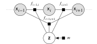

$$
    f(\vct{x}, \vct{z}) = \prod_{i,j\in\set{N}} f_{i,j}(x_i,x_j, \vct{z}),
    \quad
    n(\vct{z}) = \varphi[f(\plch,  \vct{z})]
$$

$$
  \phi(\dr \vct{x} \gvn \vct{z}) = 
  \frac{f(\vct{x}, \vct{z})}{n(\vct{z})} \varphi(\dr\vct{x}),
  \quad
  p(\vct{z}) = \frac{f(\vct{x}, \vct{z})}{n(\vct{z})}\, m(\vct{z})
$$

e.g. Ising model:  
$\set{X} = \lbrace -1,+1\rbrace^D$, $\vct{z} = [J, h]$,   
$\set{N} =$ indices of neighbours in lattice,
$$
  f_{i,j}(x_i,x_j, \vct{z}) = \exp((1-\delta_{i,j}) J x_i x_j + \delta_{i,j} h x_i).
$$

----

## Auxiliary variable method <a class='ref' href='#references-1'>(M&oslash;ller+, 2006)</a>

If we can generate from $\phi(\cdot\gvn\vct{z})$ using perfect sampling we can estimate reciprocal of $n(\vct{z})$.

$$
  \rvct{u} \sim \rho \Rightarrow 
  \vct{s}(\rvct{u}\gvn\vct{z}) \sim \phi(\cdot\gvn\vct{z}),
$$ 
<!-- .element: class="fragment" data-fragment-index="1" -->

$$
  \hat{p}(\vct{z}; \vct{u}) = 
  f(\vct{x}, \vct{z}) \, m(\vct{z}) \,
  \frac
    {f(\vct{s}(\vct{u}\gvn\vct{z}), \vct{z}^*)}
    {f(\vct{s}(\vct{u}\gvn\vct{z}), \vct{z})}.
$$
<!-- .element: class="fragment" data-fragment-index="2" -->

$$
  \expc\left[ 
  \frac
    {f(\vct{s}(\rvct{u}\gvn\vct{z}), \vct{z}^\ast)}
    {f(\vct{s}(\rvct{u}\gvn\vct{z}), \vct{z})}
  \right]
  =
  \frac{n(\vct{z}^\ast)}{n(\vct{z})}
  \Rightarrow
  \expc\left[ \hat{p}(\vct{z}; \rvct{u}) \right] = 
  n(\vct{z}^\ast) p(\vct{z}).
$$
<!-- .element: class="fragment current-visible-alt" data-fragment-index="3" -->

This single ratio estimator can be high-variance.
<!-- .element: class="fragment" data-fragment-index="4" -->

Instead using an AIS <a class='ref' href='#references-1'>(Neal, 2001)</a> estimator gives *multiple auxiliary variable method* <a class='ref' href=
'#references-1'>(Murray+, 2006)</a>.

----

## Example 2: latent variable models

$$
  \phi(\dr \vct{x} \gvn \vct{z}) = 
  f(\vct{x} \gvn \vct{z}) \,\varphi(\dr\vct{x})
$$

$$
  p(\vct{z}) = \ell(\vct{y}\gvn\vct{z}) \,m(\vct{z}),
  \quad
  \ell(\vct{y}\gvn\vct{z}) = \phi[h(\vct{y}\gvn\plch,\vct{z})].
$$

e.g. Gaussian process classification  
(labels $\vct{y} \in \lbrace -1,+1\rbrace^N$, input features $\mtx{D}\in \reals^{N\times D}$)

$$
  f(\vct{x}\gvn\vct{z}) = 
  \mathcal{N}(\vct{x}\gvn\vct{0},\mtx{C}(\mtx{D},\vct{z})),
  \quad
  h(\vct{y}\gvn\vct{x},\vct{z}) = \prod_{n=1}^N \Phi(y_n x_n).
$$

e.g. state space models 
    
$$
  f(\vct{x}_{1:T}\gvn\vct{z}) = 
  f_1(\vct{x}_1 \gvn \vct{z}) 
  \prod_{t=2}^T f_t(\vct{x}_{t}\gvn \vct{x}_{t-1},\vct{z}),
$$

$$
  h(\vct{y}_{1:T}\gvn\vct{x}_{1:T}) = 
  \prod_{t=1}^T h_t(\vct{y}_t\gvn\vct{x}_t,\vct{z}).
$$

----

## Importance sampling estimator

Compute an approximation to the latent posterior

$$
  \psi(\dr\vct{x}\gvn\vct{z},\vct{y}) = 
  q(\vct{x}\gvn\vct{z},\vct{y}) \,\varphi(\dr\vct{x})
  \approx 
  \frac
    {h(\vct{y}\gvn\vct{x},\vct{z})}
    {\ell(\vct{y}\gvn\vct{z})}\phi(\dr \vct{x} \gvn \vct{z}),
$$

$$
  \rvct{u} \sim \rho \Rightarrow 
  \vct{s}(\rvct{u}\gvn \vct{z},\vct{y}) \sim 
  \psi(\plch\gvn\vct{z},\vct{y}).
$$
<!-- .element: class="fragment" data-fragment-index="1" -->

A non-negative and unbiased estimator of $p$ is then <!-- .element: class="fragment" data-fragment-index="2" -->

$$
  \hat{p}(\vct{z},\vct{u}) = 
  \frac
   {h(\vct{y}\gvn\vct{x}_{\vct{u}})\,f(\vct{x}_{\vct{u}}\gvn\vct{z})\,m(\vct{z})}
   {q(\vct{x}_{\vct{u}}\gvn\vct{y},\vct{z})},
   \quad
   \vct{x}_{\vct{u}} = \vct{s}(\vct{u}\gvn \vct{z},\vct{y}).
$$
<!-- .element: class="fragment" data-fragment-index="2" -->

----

## Example 3: generative models

a.k.a. simulator, programmatic or implicit models.

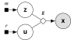

Model defined implicitly by program which given values for $\rvct{z}$ and random inputs $\rvct{u}$ simulates $\rvct{x}$. <!-- .element: class="fragment" data-fragment-index="1" -->

$$
  p(\vct{z}) = 
  \int_{\set{U}} \delta(\vct{x} -\vct{g}(\vct{u}, \vct{z}))\,
  \rho(\dr\vct{u}) \,m(\vct{z})
$$
<!-- .element: class="fragment current-visible-alt" data-fragment-index="2" -->

----

## Approximate Bayesian Computation

ABC methods relax condition simulated $\rvct{x}$ exactly matches the observed data via a kernel $k_{\epsilon}$.

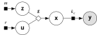

$$
  p_\epsilon(\vct{z}) =
  \int_{\set{U}} 
  k_{\epsilon}(\vct{y}\gvn \vct{g}(\vct{u}, \vct{z}))\,
  \rho(\dr\vct{u})\,m(\vct{z})
$$ 
<!-- .element: class="fragment current-visible-alt" data-fragment-index="1" -->

$$
  \hat{p}_\epsilon(\vct{z},\vct{u}) = 
  k_{\epsilon}(\vct{y}\gvn\vct{g}(\vct{u}, \vct{z})) 
  \,m(\vct{z})
$$
<!-- .element: class="fragment current-visible-alt" data-fragment-index="1" -->

$$ 
  \lim_{\epsilon\to 0} k_{\epsilon}(\vct{y}\gvn\vct{x}) = \delta(\vct{y}-\vct{x})
  \implies
$$
<!-- .element: class="fragment" data-fragment-index="2" -->

$$
  \lim_{\epsilon\to 0} p_{\epsilon}(\vct{z}) = p(\vct{z})
$$ 
<!-- .element: class="fragment" data-fragment-index="2" -->

----

## Summary statistics in ABC

In practice, usually summaries $\vct{t}=\vct{h}(\vct{y})$ of the data are compared to simulated summaries $\rvct{s} = \vct{h}(\rvct{x})$.

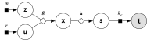

$$
  p_{\epsilon,\mkern1mu\vct{h}}(\vct{z}) =
  \int_{\set{U}} 
  k_{\epsilon}(\vct{h}(\vct{y})\gvn \vct{h}\circ\vct{g}(\vct{u}, \vct{z}))\,
  \rho(\dr\vct{u})\,m(\vct{z})
$$ 
<!-- .element: class="fragment current-visible-alt" data-fragment-index="1" -->

$$
  \hat{p}_{\epsilon,\mkern1mu\vct{h}}(\vct{z},\vct{u}) = 
  k_{\epsilon}(\vct{h}(\vct{y})\gvn \vct{h}\circ\vct{g}(\vct{u}, \vct{z}))
  \,m(\vct{z})
$$
<!-- .element: class="fragment current-visible-alt" data-fragment-index="1" -->

For non-sufficient $\vct{h}$ then generally<!-- .element: class="fragment" data-fragment-index="2" -->

$$\lim_{\epsilon\to 0} p_{\epsilon,\mkern1mu\vct{h}}(\vct{z}) \neq p(\vct{z}).$$
<!-- .element: class="fragment" data-fragment-index="2" -->

----

## Pseudo-marginal Metropolis-Hastings

Proposed by <a href='#references-1'>Beaumont (2003)</a> with subsequent analysis (and naming) in <a href='#references-1'>Andrieu &amp; Roberts (2009).</a>

Defines a MH proposal kernel of the form <!-- .element: class="fragment" data-fragment-index="1" -->

$$
  \kappa(\dr\vct{z}',\dr\vct{u}'\gvn\vct{z},\vct{u}) =
  q(\vct{z}'\gvn\vct{z})\,\varpi(\dr\vct{z}')\,
  \rho(\dr\vct{u}'),
$$
<!-- .element: class="fragment" data-fragment-index="1" -->

with corresponding acceptance probability <!-- .element: class="fragment" data-fragment-index="2" -->

$$
  a(\vct{z}',\vct{u}'\gvn\vct{z},\vct{u}) =
  \min \left\lbrace 
    1, \frac{\hat{p}(\vct{z}',\vct{u}')\,q(\vct{z}\gvn\vct{z}')}{\hat{p}(\vct{z},\vct{u})\,q(\vct{z}'\gvn\vct{z})}
  \right\rbrace.
$$
<!-- .element: class="fragment" data-fragment-index="2" -->

Marginally leaves $\pi$ invariant: 'exact approximation'. <!-- .element: class="fragment" data-fragment-index="3" -->

----

## Importance sampling squared <a href='#references-1-2' class='ref'>(Tran+, 2013)</a>

Given a proposal distribution $q(\vct{z})\varpi(\dr\vct{z})$ define a (unnormalised) importance weighting function<!-- .element: class="fragment" data-fragment-index="1" -->

$$
  w(\vct{z}, \vct{u}) = \frac{\hat{p}(\vct{z},\vct{u})}{q(\vct{z})},
$$
<!-- .element: class="fragment" data-fragment-index="1" -->

then if $\vct{u}_n \leftarrow \rho,\, \vct{z}_n \leftarrow q\varpi ~~\forall n \in \range{1}{N}$ <!-- .element: class="fragment" data-fragment-index="2" -->

$$
  \pi[h] \approx 
  \frac
    {\sum_{n=1}^N w(\vct{z}^n,\vct{u}^n)\,h(\vct{z}^n)}
    {\sum_{n=1}^N w(\vct{z}^n,\vct{u}^n)}.
$$
<!-- .element: class="fragment" data-fragment-index="2" -->

----

## Variational Bayes with intractable likelihood <a href='#references-1-2' class='ref'>(Tran+, 2017)</a>

For a family of distributions $q(\vct{z}\gvn\vct{\theta}_n)\,\varpi(\dr\vct{z})$ parameterised by $\vct{\theta}$ define a variational objective<!-- .element: class="fragment" data-fragment-index="1" -->

$$
  \mathcal{{L}}(\vct{\theta}) =
  \int_{\set{U}\times\set{Z}} 
    \log \frac{q(\vct{z}\gvn\vct{\theta})}{\hat{p}(\vct{z},\vct{u})} \,
    q(\vct{z}\gvn\vct{\theta})\,
  \varpi(\dr\vct{z})\,\rho(\dr\vct{u}).
$$
<!-- .element: class="fragment" data-fragment-index="1" -->

The gradient of $\mathcal{L}$ can then be written <!-- .element: class="fragment current-visible-alt" data-fragment-index="2" -->

$$
  \pd{\mathcal{{L}}}{\vct{\theta}} =\mkern-5mu
  \int_{\set{U}\times\set{Z}}\mkern-18mu
    \pd{\log q(\vct{z}\gvn\vct{\theta}) }{\vct{\theta}}
    \log \frac{q(\vct{z}\gvn\vct{\theta})}{\hat{p}(\vct{z},\vct{u})}
    \,
    q(\vct{z}\gvn\vct{\theta})\,
  \varpi(\dr\vct{z})\,\rho(\dr\vct{u}).
$$
<!-- .element: class="fragment current-visible-alt" data-fragment-index="2" -->

Definining $\hat{\vct{g}}(\vct{\theta},\vct{z},\vct{u}) = \pd{\log q(\vct{z}\gvn\vct{\theta}) }{\vct{\theta}}
\log \frac{q(\vct{z}\gvn\vct{\theta})}{\hat{p}(\vct{z},\,\vct{u})}$,<!-- .element: class="fragment" data-fragment-index="3" -->

$$
  \pd{\mathcal{{L}}}{\vct{\theta}} =\expc\left[\hat{\vct{g}}(\vct{\theta},\rvct{z},\rvct{u})\right],
  ~~
  \rvct{u} \sim \rho,
  \,
  \rvct{z} \sim q(\cdot\gvn\vct{\theta}_n)\,\varpi.
$$
<!-- .element: class="fragment" data-fragment-index="3" -->

----

## Variational Bayes with intractable likelihood <a href='#references-1-2' class='ref'>(Tran+, 2017)</a>

Use stochastic gradient descent to minimise $\mathcal{L}$

$$
  \vct{\theta}_{n+1} = 
  \vct{\theta}_n - 
  \epsilon_n \,\hat{\vct{g}}(\vct{\theta}_n,\vct{z}_n,\vct{u}_n),
  ~~
  \vct{u}_n \leftarrow \rho,
  \,
  \vct{z}_n \leftarrow q(\cdot\gvn\vct{\theta}_n)\,\varpi.
$$

The *score-function* estimator $\hat{\vct{g}}$ is high-variance - need to use multiple samples or control variates.

A lower variance *reparameterised* estimator can be used if $\pd{\log\hat{p}}{\vct{z}}$ is computable 
<a href='#references-1-2' class='ref'>(Moreno+, 2016)</a>.

----

## Black box estimators

Each of PM MH, IS2 and VBIL is analagous to a 'standard' approximate inference algorithm with exact density evaluations replaced with estimates.

The algorithms allow 'black-box' use of an estimator - only need access to computed density estimates, no need to explicitly deal with auxiliary $\rvct{u}$ variables or their distribution $\rho$.<!-- .element: class="fragment" data-fragment-index="1" -->

----

## PM methods as inference in an extended space

<!-- In proofs of correctness of the algorithms,-->
Generally $\rho$ is assumed to have a density $r$ with respect to some reference measure $\varrho$ 

$$\rho(\dr\vct{u}) = r(\vct{u})\varrho(\dr\vct{u}).$$

We can then define a extended joint target density <!-- .element: class="fragment" data-fragment-index="2" -->

$$j(\vct{z},\vct{u}) = \hat{p}(\vct{z},\vct{u})\,r(\vct{u}),$$
<!-- .element: class="fragment" data-fragment-index="2" -->

which by construction admits $p$ as a marginal: $\varrho[j(\vct{z},\plch)] = p(\vct{z})$. <!-- .element: class="fragment" data-fragment-index="2" -->

----

## PM methods as inference in an extended space

$$
  a(\vct{z}'\mkern-5mu,\vct{u}'\mkern-2mu\gvn\vct{z},\vct{u}) =
  \min \left\lbrace 
    1, 
    \frac
      {\hat{p}(\vct{z}'\mkern-5mu,\vct{u}')\,r(\vct{u}')\,q(\vct{z}\gvn\vct{z}')\,r(\vct{u})}
      {\hat{p}(\vct{z},\vct{u})\,r(\vct{u})\,q(\vct{z}'\mkern-2mu\gvn\vct{z})\,r(\vct{u}')}
  \right\rbrace
$$
 
$$
  w(\vct{z}, \vct{u}) = 
  \frac
    {\hat{p}(\vct{z},\vct{u})\,r(\vct{u})}
    {q(\vct{z})\,r(\vct{u})}
$$
 
$$
  \mathcal{{L}}(\vct{\theta}) =
  \int_{\set{U}\times\set{Z}} \mkern-12mu
    \log
    \frac
      {q(\vct{z}\gvn\vct{\theta})\,r(\vct{u})}
      {\hat{p}(\vct{z},\vct{u})\,r(\vct{u})}
    \,
    q(\vct{z}\gvn\vct{\theta})\,
  \varpi(\dr\vct{z})\,\rho(\dr\vct{u})
$$

$$
  a(\vct{z}'\mkern-5mu,\vct{u}'\mkern-2mu\gvn\vct{z},\vct{u}) =
  \min \left\lbrace 
    1, 
    \frac
      {\hat{p}(\vct{z}'\mkern-5mu,\vct{u}')\,\faded{r(\vct{u}')}\,q(\vct{z}\gvn\vct{z}')\,\faded{r(\vct{u})}}
      {\hat{p}(\vct{z},\vct{u})\,\faded{r(\vct{u})}\,q(\vct{z}'\mkern-2mu\gvn\vct{z})\,\faded{r(\vct{u}')}}
  \right\rbrace
$$
 
$$
  w(\vct{z}, \vct{u}) = 
  \frac
    {\hat{p}(\vct{z},\vct{u})\,\faded{r(\vct{u})}}
    {q(\vct{z})\,\faded{r(\vct{u})}}
$$
 
$$
  \mathcal{{L}}(\vct{\theta}) =
  \int_{\set{U}\times\set{Z}} \mkern-12mu
    \log
    \frac
      {q(\vct{z}\gvn\vct{\theta})\,\faded{r(\vct{u})}}
      {\hat{p}(\vct{z},\vct{u})\,\faded{r(\vct{u})}}
    \,
    q(\vct{z}\gvn\vct{\theta})\,
  \varpi(\dr\vct{z})\,\rho(\dr\vct{u})
$$

----

## PM methods as inference in an extended space

In all three cases the proposal (approximation) is chosen such that the $\vct{u}$ variables are assumed to be independent of $\vct{z}$ with marginal distribution $\rho$.

This leads to cancellations in density ratios (Radon-Nikodym derivatives) between the (joint) target and proposal distributions $\Rightarrow$ no explicit $\vct{u}$ dependence.<!-- .element: class="fragment" data-fragment-index="1" -->

However $\vct{z}$ and $\vct{u}$ are dependent under the extended joint target $j(\vct{z},\vct{u})\,\varpi(\dr\vct{z})\,\varrho(\dr\vct{u})$.<!-- .element: class="fragment" data-fragment-index="2" -->

----

## Estimator variance vs.   auxiliary variable dependence

Typically it is considered important to control the *variance* of the density estimator $\hat{p}$ in PM methods.

Equivalently we can consider decreasing the dependence between $\vct{z}$ and $\vct{u}$ in the joint target<!-- .element: class="fragment" data-fragment-index="1" -->

$$j(\vct{z},\vct{u}) = \hat{p}(\vct{z},\vct{u})\,r(\vct{u})$$
<!-- .element: class="fragment" data-fragment-index="1" -->

such that a proposal / approximate distribution with $\vct{z} \perp \vct{u}$ becomes a closer match to the target.
<!-- .element: class="fragment" data-fragment-index="1" -->

----

## Averaging unbiased estimators

If using an estimator formed by averaging multiple (i.i.d.) unbiased estimates then the corresponding extended joint target density is
$$
  j_N(\vct{z},\vct{u}_{1:N}) =
  \frac{1}{N}\sum_{n=1}^N\hat{p}(\vct{z},\vct{u}_n) 
  \prod_{m=1}^N r(\vct{u}_m).
$$

If we marginalise over all auxiliary variable replicates except $\vct{u}_n$, then the density on $\vct{u}_n$ and $\vct{z}$ is 
<!-- .element: class="fragment" data-fragment-index="1" -->

<!--
$\vct{u}_{1:N\setminus n} = \lbrace \vct{u}_m \rbrace_{m\in 1:N\setminus n}$

$$
  j_n(\vct{z},\vct{u}_{n}) =
  \int_{\set{U}^{N-1}} 
     j_N(\vct{z},\vct{u}_{1:N}) 
     \varrho^{N-1}(
       \dr\vct{u}_{1:N\setminus n}
     )
$$
-->

$$
  j_n(\vct{z},\vct{u}_{n}) = 
    \frac{N-1}{N} p(\vct{z})r(\vct{u}_n) + 
    \frac{1}{N} \hat{p}(\vct{z},\vct{u}_n)\,r(\vct{u}_n).
$$
<!-- .element: class="fragment" data-fragment-index="1" -->

----

## Averaging unbiased estimators

In the case of PM MH applied in an ABC setting with $k_{\epsilon}(\vct{y}\gvn\vct{x}) \propto \mathbb{1}_{[0,\epsilon]}(|\vct{y} -\vct{x}|)$ and assuming that the cost of evaluating $\hat{p}_N$ is $\propto N$, <a href='#references-1-2' >Bornn et al. (2017)</a> showed that using $N=1$ is close to optimal.

<a href='#references-1-2'>Sherlock et al. (2017)</a> 
extended this result to the general case of averages of $N$ density estimates again assuming a linear scaling of cost with $N$.

Fixed costs in estimator or parallel compute may mean cost of evaluation is not proportional to $N$.

----

## Questions

  * Are there alternative MCMC algorithms which retain the 'black-box' quality of PM MH while improving robustness / efficiency? <!-- .element: class="fragment" data-fragment-index="1" -->
  * If we assume more knowledge of the density estimator (e.g. evaluating $r$, computing derivatives) can we exploit this to use more efficient MCMC methods in the extended space? <!-- .element: class="fragment" data-fragment-index="2" -->

  Partial answers forthcoming in parts 2 and 3! <!-- .element: class="fragment" data-fragment-index="3" -->

----

<!-- .slide: id="references-1" -->

## References <a href="javascript:history.go(-2)">&laquo;</a>

<ul class='reference-list'>

<li>
Neal (2001). Annealed importance sampling. *Statistics and Computing*, 11(2), pp. 125-139.
</li>

<li>
Beaumont (2003). Estimation of population growth or decline in genetically monitored populations. *Genetics*, 164(3), pp.1139-1160.
</li>

<li>
M&oslash;ller, Pettitt, Reeves and Berthelsen (2006). An efficient Markov chain Monte Carlo method for distributions with intractable normalising
constants. *Biometrika*, 93(2), pp.451-458.
</li>

<li>
Murray, Ghahramani and MacKay (2006). MCMC for doubly-intractable distributions. In *Proceedings of the 22nd Annual Conference on Uncertainty in Artificial Intelligence*, pp. 359-366.
</li>

<li>
Andrieu and Roberts (2009). The pseudo-marginal approach for efficient Monte Carlo computations. *The Annals of Statistics*, 37(2), pp.697-725.
</li>

</ul>

----

<!-- .slide: id="references-1-2" -->

## References <a href="javascript:history.go(-2)">&laquo;</a>

<ul class='reference-list'>

<li>
Tran, Scharth, Pitt and Kohn (2013). Importance sampling squared for Bayesian inference in latent variable models. *arXiv pre-print*, 1309.3339.
</li>

<li>
Moreno, Adel, Meeds, Rehg and Welling (2016). Automatic variational ABC. *arXiv pre-print*, 1606.08549.
</li>

<li>
Tran, Nott and Kohn (2017). Variational Bayes with intractable likelihood. *Journal of Computational and Graphical Statistics*, 26(4), pp.873-882.
</li>

<li>
Bornn, Pillai, Smith and Woodward (2017). The use of a single pseudo-sample in approximate Bayesian computation. *Statistics and Computing*, 27(3), pp.583-590.
</li>

<li>
Sherlock, Thiery and Lee (2017). Pseudo-marginal Metropolis-Hastings using averages of unbiased estimators. *Biometrika*, 104(3), pp.727-734.
</li>

</ul>

---

<!-- .slide: id="part-2" -->

# Part 2

----

## Auxiliary PM MCMC <a class='ref' href='#references-2'>(Murray &amp; Graham, 2016)</a>

Let $\tau_1(\dr\vct{u}'\gvn\vct{z},\vct{u})$ and $\tau_2(\dr\vct{z}'\gvn\vct{z},\vct{u})$ be Markov kernels leaving $j(\vct{z},\vct{u})\,\varpi(\dr\vct{z})\varrho(\dr\vct{u})$ invariant.

Auxiliary pseudo-marginal (APM) Markov transition: <!-- .element: class="fragment" data-fragment-index="1" -->
  1. $\vct{u}_{n+1} \leftarrow \tau_1(\plch \gvn\vct{z}_n,\vct{u}_n)$, <!-- .element: class="fragment" data-fragment-index="1" -->
  2. $\vct{z}_{n+1} \leftarrow \tau_2(\plch \gvn\vct{z}_n,\vct{u}_{n+1})$. <!-- .element: class="fragment" data-fragment-index="1" -->

Naming convention: *APM <1> + <2>*  
where *<1>* and *<2>* are acronyms&ast; describing the algorithms used to define $\tau_1$ and  $\tau_2$ respectively.

<small class="fragment" data-fragment-index="3">&ast; MI - Metropolis independence, MH - Metropolis Hastings, SS - slice sampling.</small>

----

## APM MI + MH

$\tau_1$: Metropolis independence transition <!-- .element: class="fragment" data-fragment-index="1" -->

$$
  \kappa_1(\dr\vct{u}'\gvn\vct{z},\vct{u}) = \rho(\dr\vct{u}'),
$$
<!-- .element: class="fragment" data-fragment-index="1" -->

$$
  a_1(\vct{u}'\gvn\vct{z},\vct{u}) =
  \min \left\lbrace 
    1, 
    \frac
      {\hat{p}(\vct{z},\vct{u}')}
      {\hat{p}(\vct{z},\vct{u})}
  \right\rbrace.
$$
<!-- .element: class="fragment" data-fragment-index="1" -->

$\tau_2$: Metropolis-Hasting transition <!-- .element: class="fragment" data-fragment-index="2" -->

$$
  \kappa_2(\dr\vct{z}'\gvn\vct{z},\vct{u}) = 
  q(\vct{z}'\gvn\vct{z})\varpi(\dr\vct{z}'),
$$
<!-- .element: class="fragment" data-fragment-index="2" -->

$$
  a_2(\vct{z}'\gvn\vct{z},\vct{u}) =
  \min \left\lbrace 
    1, 
    \frac
      {\hat{p}(\vct{z}',\vct{u})\,q(\vct{z}\gvn\vct{z}')}
      {\hat{p}(\vct{z},\vct{u})\,q(\vct{z}'\gvn\vct{z})}
  \right\rbrace.
$$
<!-- .element: class="fragment" data-fragment-index="2" -->

----

## APM MI + MH

<ul>
  <li class="fragment" data-fragment-index="1">
  Maintains 'black-box' nature of PM MH providing we can get/set random number generator state.
  </li>
  <li class="fragment" data-fragment-index="2">
  Requires twice as many $\hat{p}$ evaluations as PM MH per joint update. </li>
  <li class="fragment" data-fragment-index="3">
  Empirically we have found often to be more efficient than PM MH and also simplifies tuning.
  </li>
  <li class="fragment" data-fragment-index="4"> 
  <a href='#references-2'>Lee &amp; Holmes (2010)</a> discusses the same idea in a particle MCMC context.
  </li>
</ul>

----

## Slice sampling <a href='#references-2' class='ref'>(Neal, 2003)</a>

Family of auxiliary variable MCMC algorithms which adaptively scale the proposed moves.

Able to propose bold large moves in the target space before exponentially backing off to increasingly conservative local moves.<!-- .element: class="fragment" data-fragment-index="1" -->

Compared to random-walk Metropolis methods performance is less sensitive to algorithm parameters, though higher cost per iteration can mean well tuned MH methods will perform better.<!-- .element: class="fragment" data-fragment-index="2" -->

----

## Linear slice sampling <a href='#references-2' class='ref'>(Neal, 2003)</a>

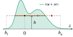

----

## Reflecting in the hypercube

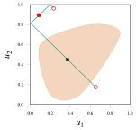
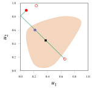

----

## Elliptical slice sampling <a href='#references-2' class='ref'>(Murray+, 2010)</a>

Extension of slice sampling idea which samples from elliptical rather than linear paths. 

Suited to target distributions well approximated by a Gaussian $\mathcal{N}(\vct{m},\mtx{C})$ - e.g. a Gaussian prior or variational approximation. <!-- .element: class="fragment" data-fragment-index="1" -->

Compared to linear slice sampling no need to set an initial bracket width $w$ and can accept proposals with only one density evaluation. <!-- .element: class="fragment" data-fragment-index="2" -->

----

## Elliptical slice sampling <a href='#references-2' class='ref'>(Murray+, 2010)</a>

Given current state $\vct{u}_n$ and auxiliary $\vct{v}_n \leftarrow \mathcal{N}(\vct{m},\mtx{C})$ an elliptical path parameterised by $\theta$ is defined

$$
  \vct{u}_{n}^\ast(\theta) = 
  (\vct{u}_n - \vct{m}) \cos \theta + (\vct{v}_n - \vct{m})\sin\theta + \vct{m}
$$

For any fixed $\theta$, the Markov kernel corresponding to $\vct{u}_{n+1} \leftarrow \vct{u}_{n}^\ast(\theta)$ leaves $\mathcal{N}(\vct{m},\mtx{C})$ exactly invariant - 'Crank-Nicolson' update <a class='ref' href='#references-2'>(Neal, 1999; Beskos+ 2008)</a>.

Elliptical slice sampling algorithm uses an efficient slice sampling procedure for adaptively setting $\theta$ which leaves the target distribution invariant. <!-- .element: class="fragment" data-fragment-index="2" -->

----

## Elliptical slice sampling <a href='#references-2' class='ref'>(Murray+, 2010)</a>

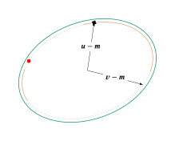

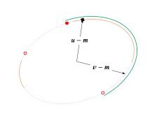
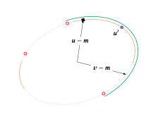

----

## Pseudo-marginal slice sampling

Within APM framework natural to consider using slice sampling algorithms for $\tau_1$ and $\tau_2$:

$\tau_1$ (slice sampling $\rvct{u}$) - for common cases where $\rvct{u}$ is a vector of independent uniform or Gaussian variables then reflective linear SS and elliptical SS are natural choices respectively.<!-- .element: class="fragment" data-fragment-index="1" -->

$\tau_2$ (slice sampling $\rvct{z}$) - for general target distributions random-direction linear SS offers performance robust to choice of $w$.<!-- .element: class="fragment" data-fragment-index="2" -->

----

## Correlated pseudo-marginal MCMC 

In concurrent work <a href='#references-2'>Deligiannidis et al. (2015)</a> and <a href='#references-2'>Dahlin et al. (2015)</a> independently proposed applying alternative MCMC transition operators to the extended joint distribution $j(\vct{z},\vct{u})\,\varpi(\dr\vct{z})\varrho(\dr\vct{u})$.

A key assumption in both works is that $\vct{u}$ is a vector of independent standard normal variables i.e.<!-- .element: class="fragment" data-fragment-index="1" -->

$$
  r(\vct{u}) = \mathcal{N}(\vct{u}\gvn \vct{0},\mathbf{I}),
$$
<!-- .element: class="fragment" data-fragment-index="1" -->

with $\varrho(\dr\vct{u}) = \dr\vct{u}$ the Lebesgue measure on $\set{U}$.<!-- .element: class="fragment" data-fragment-index="1" -->

----

## Correlated pseudo-marginal MCMC 

Under this assumption a Metropolis-Hastings transition with the following proposal kernel,

\begin{gather}
  \kappa(\dr\vct{z}'\mkern-3mu,\dr\vct{u}'\mkern-3mu\gvn\vct{z},\vct{u}) =\\\\
  \mathcal{N}\left(
    \vct{u}'\mkern-3mu\gvn 
    \rho\,\vct{u},\,
    (1-\rho^2)\mathbf{I}
    \right)
    \dr\vct{u}'\,
  q(\vct{z}'\mkern-3mu\gvn\vct{z})\,\varpi(\dr\vct{z}'),
\end{gather}

with $\rho\in[-1,1]$ and acceptance probability,

$$
  a(\vct{z}'\mkern-3mu,\vct{u}'\mkern-3mu\gvn\vct{z},\vct{u}) =
  \min\left\lbrace
    1,
    \frac
      {\hat{p}(\vct{z}',\vct{u}')\,q(\vct{z}\gvn\vct{z}')}
      {\hat{p}(\vct{z},\vct{u})\,q(\vct{z}'\gvn\vct{z})}
  \right\rbrace,
$$
<!-- .element: class="fragment" data-fragment-index="1" -->

leaves the extended joint distribution invariant.<!-- .element: class="fragment" data-fragment-index="1" -->

----

## Correlated pseudo-marginal MCMC 

The update proposal for the auxiliary variables $\vct{u}$ is exactly the Crank-Nicolson type proposal that elliptical slice sampling generalises, with $\rho = \cos\theta$.

For $\rho=0$ the update reverts to the standard PM MH algorithm while for $|\rho| > 0$ the update introduces correlation between the current and proposed auxiliary variable values.<!-- .element: class="fragment" data-fragment-index="1" -->

----

## Correlated pseudo-marginal MCMC 

Jointly updating $\vct{z}$ and $\vct{u}$ means only one evaluation of $\hat{p}$ is required for each chain iteration, compared to at least two evaluations for APM methods.

Both <a href='#references-2'>Deligiannidis et al. (2015)</a> and <a href='#references-2'>Dahlin et al. (2015)</a> suggest heuristics for tuning $\rho$. 

If a good global value for $\rho$ can be found the correlated PM transition is likely to be more efficient than a corresponding APM SS+MH transition using elliptical SS.

----

## Gaussian latent variable model

As an initial toy example we consider the following Gaussian latent variable model

\begin{gather}
  m(\vct{z}) = \nrm(\vct{z}\gvn\vct{0},\idmtx),
  \quad
  f(\vct{x}_{1:M}\gvn\vct{z}) = 
  \prod_{m=1}^M \nrm(\vct{x}_m \gvn\vct{0},\sigma^2\idmtx),\\\\[-2mm]
  h(\vct{y}_{1:M}\gvn\vct{x}_{1:M},\vct{z}) = 
  \prod_{m=1}^M \nrm(\vct{y}_m \gvn\vct{x}_m,\epsilon^2\idmtx).
\end{gather}

----

## Gaussian latent variable model

In this case due to the self-conjugacy of the Gaussian distribution exact inference is possible

$$
  p(\vct{z}) = 
  \nrm\left(
    \vct{z}\gvn
    \frac{\sum_{m=1}^M\vct{y}_m}{M+\sigma^2+\epsilon^2},
    \frac{\sigma^2+\epsilon^2}{M+\sigma^2+\epsilon^2}\idmtx
  \right)
$$

giving a ground-truth to compare the approximate inference results to.

----

## Gaussian latent variable model

We use an importance sampling estimator with

$$ 
  q(\vct{x}_{1:M}\gvn\vct{z},\vct{y}_{1:M}) = 
  \nrm(\vct{z}\gvn\vct{0},\idmtx)\,
  \prod_{m=1}^M \nrm(\vct{x}_m \gvn\vct{0},\sigma^2\idmtx)
$$

which as it ignores the observed values results in a relatively high-variance density estimator

$$\textstyle
  \hat{p}(\vct{z},\vct{u}_{1:M}) = 
  \prod_{m=1}^M \nrm(\vct{y}_m \gvn\sigma\vct{u}_m+\vct{z},\epsilon^2\idmtx),
$$
$$\textstyle
  r(\vct{u}_{1:M}) = \prod_{m=1}^M \nrm(\vct{u}_{m}\gvn\vct{0},\idmtx).
$$

----

## Gaussian latent variable model

Compare the performance of:

PM MH with $q(\vct{z}'\gvn\vct{z}) = \nrm(\vct{z}'\gvn\vct{z},\lambda^2\idmtx)$ for $\lambda \in [0, 1]$,<!-- .element: class="fragment" data-fragment-index="1" -->

APM MI+MH with $q(\vct{z}'\gvn\vct{z})$ as above,<!-- .element: class="fragment" data-fragment-index="2" -->

APM SS+MH with elliptical SS &amp; $q(\vct{z}'\gvn\vct{z})$ as above,<!-- .element: class="fragment" data-fragment-index="3" -->

APM MI+SS with linear SS of $\vct{z}$ with $w\in[0,10]$. <!-- .element: class="fragment" data-fragment-index="4" -->

----

## Single estimator results

<table class='image-table align-table'>

<tr><td>PM MH</td><td>APM MI+MH</td></tr>

<tr>
<td>
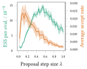
</td>
<td>
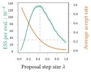
</td>
</tr>

<tr><td>APM SS+MH</td><td>APM MI+SS</td></tr>

<tr>
<td>
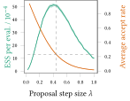
</td>
<td style='padding-right: 50px;'>
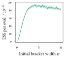
</td>
</tr>

</table>

----

## Example traces and histograms

<table class='image-table align-table'>

<tr>PM MH $\lambda=0.550$</tr>

<tr>
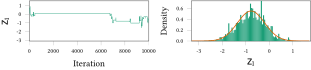
</tr>

<tr>APM MI+MH $\lambda=0.425$</tr>

<tr>
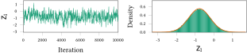
</tr>

</table

----

## Example traces and histograms

<table class='image-table align-table'>

<tr>APM MI+MH $\lambda=0.425$</tr>

<tr>
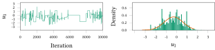
</tr>

<tr>APM SS+MH $\lambda=0.425$</tr>

<tr>
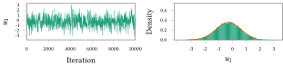
</tr>

</table>

----

## Averaged estimator results

<table class='image-table align-table'>

<tr><td>PM MH ($N=8$)</td><td>APM MI+MH ($N=8$)</td></tr>

<tr>
<td>
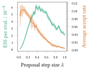
</td>
<td>
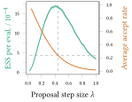
</td>
</tr>

<tr><td>PM MH ($N=32$)</td><td>APM MI+MH ($N=32$)</td></tr>

<tr>
<td>
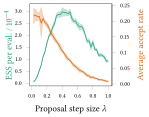
</td>
<td>
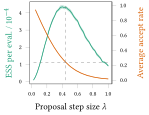
</td>
</tr>

</table>

----

## Ising model - experiment details

We used an Ising model on a $10\times 30$ toroidal square lattice with a isotropic interaction $z_1 = J$ and magnetic field $z_2 = h$ parameters.<!-- .element: class="fragment" data-fragment-index="1" -->

A uniform prior was placed on the parameters<!-- .element: class="fragment" data-fragment-index="2" -->

$$m(\vct{z}) = \mathcal{U}(z_1 \gvn 0, 0.4)\,\mathcal{U}(z_2 \gvn -1, 1).$$
<!-- .element: class="fragment" data-fragment-index="2" -->

The data was simulated as an exact sample using $z_1 = 0.3$ and $z_2 =0$ using the summary states algorithm <a class='ref' href='#references-2'>(Childs+, 2001)</a>.

----

## Ising model - experiment details

Compare the performance of:

PM MH with $q(z_i'\gvn\vct{z}) = \nrm(z_i'\gvn z_i,0.04^2)$ for $i\in\range{1}{2}$,<!-- .element: class="fragment" data-fragment-index="1" -->

APM MI+MH with $q(z_i'\gvn\vct{z})$ as above for $i\in\range{1}{2}$,<!-- .element: class="fragment" data-fragment-index="2" -->

APM SS+MH with reflective SS with $w=0.1$ and $q(z_i'\gvn\vct{z})$ as above for $i\in\range{1}{2}$,<!-- .element: class="fragment" data-fragment-index="3" -->

APM MI+SS with reflective SS of $\vct{z}$ with $w=0.1$.<!-- .element: class="fragment" data-fragment-index="4" -->

----

## Ising model - results

<table class='image-table align-table'>

<tr><td>SAVM</td></tr>

<tr>
<td>
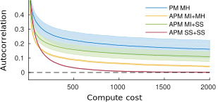
</td>
</tr>

<tr class='fragment' data-fragment-index='1'><td>MAVM ($K=35$ AIS steps)</td></tr>

<tr class='fragment' data-fragment-index='1'>
<td>
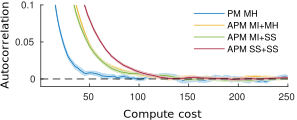
</td>
</tr>

</table>

----

## Gaussian process classification

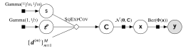

Infer covariance function hyperparameters $\rvar{z}_1 = \log\rvar{s}$ and $\rvct{z}_{2:10} = \log\rvct{\ell}$ in Gaussian process probit regression problem.

----

## GP classification - setup

Following <a href='#references-2'>Fillipone &amp; Girolami (2014)</a> we used the UCI Wisconsin breast cancer data set. The data $\lbrace \vct{d}_{1:M}, y_{1:M} \rbrace$ consists of $M=682$ input features $\vct{d}_m\in\reals^9$ and labels $y_m\in\lbrace -1,+1\rbrace$.

Also following <a href='#references-2'>Fillipone &amp; Girolami (2014)</a> we use an importance sampling estimator with

$$ 
  q(\vct{x}_{1:M}\gvn\vct{x}_{1:M},\vct{y}_{1:M}) = 
  \nrm(\vct{z}\gvn\vct{\mu}(\vct{z},\vct{y}),\mtx{\Sigma}(\vct{z},\vct{y}))\,
$$

with $\vct{\mu}(\vct{z},\vct{y}),\mtx{\Sigma}(\vct{z},\vct{y})$ the parameters of a Laplace approximation to the latent posterior.

----

## GP classification  - experiment details

Compare the performance of:

PM MH with $q(\vct{z}'\gvn\vct{z}) = \nrm(\vct{z}'\gvn\vct{z},\lambda^2\idmtx)$ with $\lambda$ adapted to give mean acceptance in $[0.15,0.3]$,<!-- .element: class="fragment" data-fragment-index="1" -->

APM MI+MH with $q(\vct{z}'\gvn\vct{z})$ as above,<!-- .element: class="fragment" data-fragment-index="2" -->

APM SS+MH with elliptical SS &amp; $q(\vct{z}'\gvn\vct{z})$ as above,<!-- .element: class="fragment" data-fragment-index="3" -->

APM SS+SS with elliptical SS of $\vct{u}$ and linear SS of $\vct{z}$ with $w=4$.<!-- .element: class="fragment" data-fragment-index="4" -->

In all cases $N=50$ importance samples used.<!-- .element: class="fragment" data-fragment-index="5" -->

----

## GP classification - results

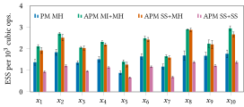

----

## GP classification - results

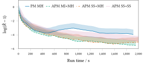

----

## Conclusions

  * APM MI+MH maintains black-box operation of PM MH while allowing easier tuning and increased robustness / efficiency. <!-- .element: class="fragment" data-fragment-index="1" -->
  * Applying SS updates to target variables removes need to tune step-sizes however generally less efficient than well tuned MH. <!-- .element: class="fragment" data-fragment-index="2" -->
  * Applying elliptical SS to auxiliary variables is a simple drop-in for estimators using Gaussian auxiliary variables with no free parameters to set. <!-- .element: class="fragment" data-fragment-index="3" -->

----

<!-- .slide: id="references-2" -->

## References <a href="javascript:history.go(-2)">&laquo;</a>

<ul class='reference-list'>

<li>
Neal (1999). Regression and classification using Gaussian process priors. In  *Bayesian Statistics 6*, pp. 475-501.
</li>

<li>
Neal (2003). Slice sampling. *Annals of Statistics*, 31(3), pp. 705-767.
</li>

<li>
Childs, Patterson and  MacKay (2006). Exact sampling from nonattractive distributions using summary states. *Physical Review E*, 63:036113.
</li>

<li>
Beskos, Roberts, Stuart and Voss (2008). MCMC methods for diffusion bridges. *Stochastics and Dynamics*, 8(03), pp. 319-350.
</li>

<li>
Murray, Adams and MacKay (2010). Elliptical slice sampling. In *Proceedings of the 13th International Conference on Artificial Intelligence and Statistics*, pp. 541-548.
</li>

</ul>

----

<!-- .slide: id="references-2-2" -->

## References <a href="javascript:history.go(-2)">&laquo;</a>

<ul class='reference-list'>

<li>
Lee and Holmes (2010). Discussion of 'Particle Markov chain Monte Carlo methods'. *Journal of the Royal Statistical Society*, Series B, 72(327), pp. 327.
</li>

<li>
Filippone and Girolami (2014). Pseudo-marginal Bayesian inference for Gaussian processes. IEEE Transactions on Pattern Analysis and Machine Intelligence, 36(11), pp. 2214-2226.
</li>

<li>
Deligiannidis, Doucet and Pitt (2015). The correlated pseudo-marginal method. *arXiv pre-print*, 1511.04992.
</li>

<li>
Dahlin, Lindsten, Kronander and Sch&ouml;n (2015). Accelerating pseudo-marginal Metropolis-Hastings by correlating auxiliary variables. *arXiv pre-print*, 1511.05483.
</li>

<li>
Murray and Graham (2016). Pseudo-marginal slice sampling. In *Proceedings of the 20th International Conference on Artificial Intelligence and Statistics*, pp.911-919.
</li>

</ul>

---

<!-- .slide: id="part-3" -->

# Part 3

----

## Automatic differentiation

Efficient algorithmic application of chain rule to compute derivatives of functions defined in code.

Two main variants: *forward-* and *reverse-mode*.

For a function $\vct{f} : \reals^N \to \reals^M$:

  * Forward model will calculate $\pd{\vct{f}}{\vct{x}}\vct{v}$ for $\vct{v}\in\reals^N$ at a constant factor of cost evaluation of $\vct{f}(\vct{x})$.
  * Reverse mode will calculate $\vct{v}\tr\pd{\vct{f}}{\vct{x}}$ for $\vct{v}\in\reals^M$ at a constant factor of cost evaluation of $\vct{f}(\vct{x})$.

----

## Computation graph - forward pass

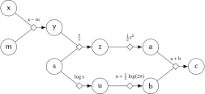

----

## Computation graph - reverse pass

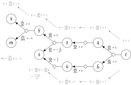

----

<!-- .slide: id="references-3" -->

## References <a href="javascript:history.go(-2)">&laquo;</a>

<ul class='reference-list'>

<li>
Lindsten and Doucet (2016). Pseudo-marginal Hamiltonian Monte Carlo. *arXiv pre-print*, 1607.02516.
</li>

<li>
Graham and Storkey (2017). Asymptotically exact inference in differentiable generative models. *Electronic Journal of Statistics*, 11(2), pp.5105-5164.
</li>

<li>
Graham and Storkey (2017). Asymptotically exact inference in differentiable generative models. *Proceedings of the 21st International Conference on Artificial Intelligence and Statistics*,  pp.499-508.
</li>

</ul>
