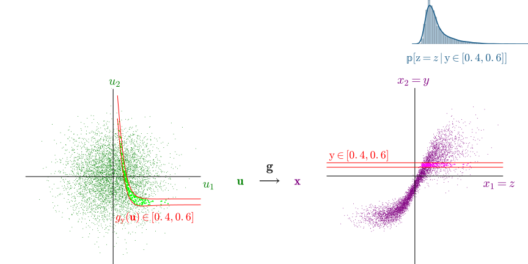
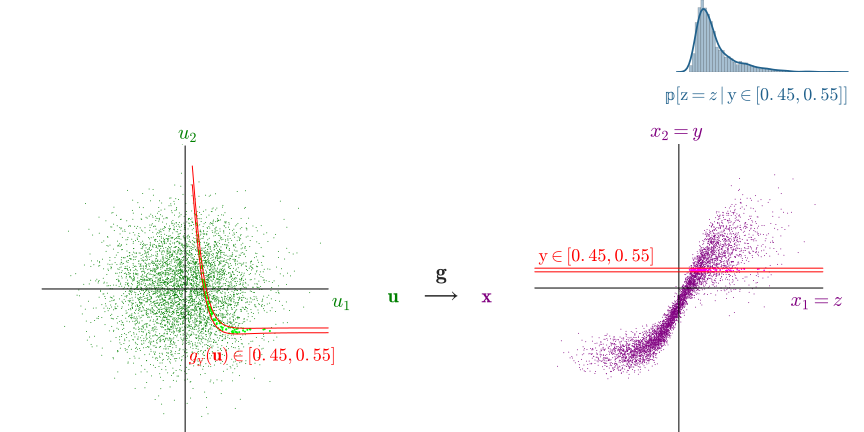
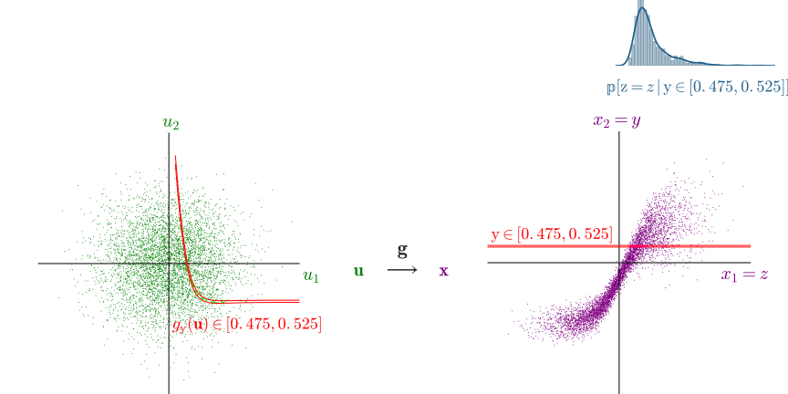
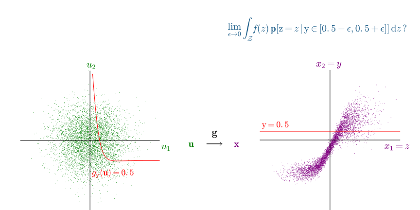
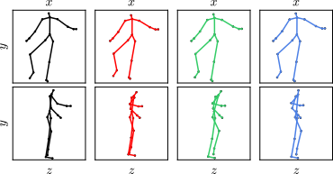
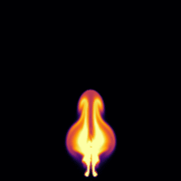

  <h1 class='title-heading'> 
    Inference in differentiable generative models
  </h1>
  
  
   
**Matt Graham &lt;[matt-graham.github.io](http://matt-graham.github.io)&gt;**  

*Joint work with Amos Storkey*


---

### Problem description

<div class="fragment" data-fragment-index="0">

*Given:* Probabilistic model of 

<p>
    $\observed{\rvct{y}}$ <span class="observed">: observed variables</span>
</p>
<p>
    $\latent{\rvct{z}}$ <span class="latent">: latent variables</span>
</p>

</div>

<p class="fragment" data-fragment-index="1">
where we can only generate $(\observed{\rvct{y}},\,\latent{\rvct{z}})$ pairs.	
</p>

<p class="fragment" data-fragment-index="2">
*Task:* estimate conditional expectations of latent variables
$\expc{f(\latent{\rvct{z}}) \gvn \observed{\rvct{y} = \vct{y}}}$.
</p>


---

### Differentiable generative models

Model defined by a differentiable *generator function* $\vctfunc{g}$
and *random inputs* $\input{\rvct{u}}$ drawn from a *base density* $\rho(\input{\vct{u}})$.

$$
  \input{\rvct{u}} \sim \rho
  \qquad
  \output{\rvct{x}} = \vctfunc{g}(\input{\rvct{u}})
  \qquad
  \output{\rvct{x}} = \left[\observed{\rvct{y}};\,\latent{\rvct{z}}\right]
$$

 <!-- .element: class="fragment" data-fragment-index="1" -->

Assumptions: $\dim(\input{\set{U}}) \geq \dim(\output{\set{X}})$ and $\pd{\vctfunc{g}}{\input{\vct{u}}}$ exists $\forall \input{\vct{u}} \in \input{\set{U}}$. <!-- .element: class="fragment" data-fragment-index="2" -->

----

### Example: MNIST Variational Autoencoder decoder <small>Kingma and Welling, 2013</small>

$$
  \output{\rvct{x}} = 
  \vctfunc{m}(\input{\rvct{u}_1}) + 
  \vctfunc{s}(\input{\rvct{u}_1}) \odot \input{\rvct{u}_2}
$$<!-- .element: class="fragment" data-fragment-index="1" -->


----

### Example: Pose projection generator

$$
  \overset
  {\textrm{joint angles}}
  {\latent{\rvct{z}\_{a}} = \vctfunc{f}\_a(\input{\rvct{u}\_a})}
  \qquad
  \overset
  {\textrm{bone lengths}}
  {\latent{\rvct{z}\_{b}} = \vctfunc{f}\_b(\input{\rvct{u}\_b})}
  \qquad
  \overset
  {\textrm{camera parameters}}
  {\latent{\rvct{z}\_{c}} = \vctfunc{f}\_c(\input{\rvct{u}\_c})}
$$

$$
  \overset
  {\textrm{2D proj.}}
  {\observed{\rvct{y}_j}} = 
  \overset
  {\textrm{camera matrix}}
  {\mtxfunc{C}\lpa\latent{\rvct{z}_c}\rpa}
  \overset
  {\textrm{3D pos.}}{
  \vctfunc{r}_j\lpa
    \latent{\rvct{z}_a},\,
    \latent{\rvct{z}_b}
  \rpa} + 
  \overset
  {\textrm{obs. noise}}
  {\sigma\,\input{\rvct{u}_j}} 
  \quad\forall j \in \lbrace 1 \dots J \rbrace
$$ <!-- .element: class="fragment" data-fragment-index="2" -->

$$
  \output{\rvct{x}} = 
  \lsb
    \observed{\rvct{y}\_{1} \dots \rvct{y}\_{J}};\,
    \latent{\rvct{z}\_a};\,
    \latent{\rvct{z}\_b};\,
    \latent{\rvct{z}\_c}
  \rsb
  \quad
  \input{\vct{u}} = 
  \lsb 
    \input{\rvct{u}\_{1} \dots \rvct{u}\_{J}};\,
    \input{\rvct{u}\_a};\,
    \input{\rvct{u}\_b};\,
    \input{\rvct{u}\_c}
  \rsb
$$ <!-- .element: class="fragment current-visible" data-fragment-index="3" -->


---

### Simulator models

Many simulators with continuous outputs can be expressed as differentiable generators. <!-- .element: class="fragment" data-fragment-index="1" -->

Usually defined procedurally in code:<!-- .element: class="fragment" data-fragment-index="2" -->

```Python
def generator(rng):
    params = sample_from_prior(rng)
    outputs = simulate(params, rng)
    return outputs, params
```
<!-- .element: class="fragment" data-fragment-index="2" -->

----

### Example: Lotka-Volterra model


 

Continuous variant of model of prey ($\observed{y_1}$) and predator ($\observed{y_2}$) populations

$$
    \textrm{d} \observed{y_1} = 
    (\latent{\theta_1} \observed{y_1} - \latent{\theta_2} \observed{y_1 y_2}) \textrm{d} t + 
    \textrm{d} n_1
$$ <!-- .element: class="fragment" data-fragment-index="1" -->

$$
    \textrm{d} \observed{y_2} = 
    (-\latent{\theta_3} \observed{y_2} + \latent{\theta_4} \observed{y_1 y_2}) \textrm{d} t + 
    \textrm{d} n_2
$$ <!-- .element: class="fragment" data-fragment-index="1" -->

where $n_1$ and $n_2$ are white noise processes. <!-- .element: class="fragment" data-fragment-index="2" -->

----

### Example: Lotka-Volterra model

Simulate at $T$ discrete time-steps

```Python
def sample_from_prior(rng):
  return np.exp(rng.normal(size=4) - mu)
    
def simulate(params, rng):
  y1_seq, y2_seq = [], []
  y1, y2 = y1_init, y2_init
  for t in range(T):
    y1 += ( params[0]*y1 - params[1]*y2) * dt + rng.normal()*dt**.5
    y2 += (-params[2]*y2 + params[3]*y1) * dt + rng.normal()*dt**.5
    y1_seq.append(y1)
    y2_seq.append(y2)
  return np.array(y1_seq), np.array(y2_seq)
```
<!-- .element: class="fragment" data-fragment-index="1" -->


$$
    \input{\rvct{u}} = 
    \lsb \input{\textrm{draws from random number generator}} \rsb
    \qquad
    \output{\rvct{x}} = 
    \lsb \observed{\rvct{y}};\, \latent{\rvct{\theta}} \rsb
$$ <!-- .element: class="fragment" data-fragment-index="2" -->

----

### Example: Lotka-Volterra model


---

### Calculating derivatives


How do we propagate derivatives through complex generative models / simulators?

<div class="fragment" data-fragment-index="1">
  <p>Reverse mode automatic differentation</p>
  
  
  
</div>

----

### Automatic differentation


<small>Image source: Wikipedia</small>

---

<!-- .slide: data-transition="none" -->
### Toy example

 

----

<!-- .slide: data-transition="none" -->
### Toy example

 

----

<!-- .slide: data-transition="none" -->
### ABC in input space

 

----

<!-- .slide: data-transition="none" -->
### ABC in input space

 

----

<!-- .slide: data-transition="none" -->
### ABC in input space

 

----

<!-- .slide: data-transition="none" -->
### Conditioning as a constraint

 

---

### Inference in differentiable generators

<div class="fragment" data-fragment-index="0" style='padding-bottom: 1em;'>
Define sub-manifold embedded in input space

$$
  \set{M}\_{\vct{y}} = \lbr \vct{u} \in \set{U} : \vctfunc{g}\_{\mathrm{y}}(\vct{u}) = \vct{y} \rbr.
$$
</div>

<div class="fragment" data-fragment-index="1">
Conditional expectations correspond to integrals over $\set{M}\_{\vct{y}}$

$$
  \expc{f(\rvct{z}) \gvn \rvct{y} = \vct{y}} = 
  \frac{1}{C}
  \int\_{\set{M}\_{\vct{y}}}
    f \circ \vctfunc{g}\_{\mathrm{z}}(\vct{u})
    \rho(\vct{u})	
    \left| 
      \pd{\vctfunc{g}\_{\mathrm{y}}}{\vct{u}} 
      \pd{\vctfunc{g}\_{\mathrm{y}}}{\vct{u}}\tr
    \right|^{-\frac{1}{2}} 
  \mathcal{H}\_{\mathcal{M}\_{\vct{y}}}\lbr\dr\vct{u}\rbr
$$

<small style='font-size: 80%;'>(Diaconis, Holmes & Shahshahani; 2013)</small>
</div>

----

### Inference in differentiable generators

If we can sample $\lbr \vct{u}^{(s)} \rbr_{s=1}^S$ from a Markov chain such that:

<p class="fragment" data-fragment-index="1"> all samples are restricted to $\set{M}\_{\vct{y}}$, </p>

<p class="fragment" data-fragment-index="2">
  and stationary distribution has density proportional to $\rho(\vct{u})	
    \left| 
      \pd{\vctfunc{g}\_{\mathrm{y}}}{\vct{u}} 
      \pd{\vctfunc{g}\_{\mathrm{y}}}{\vct{u}}\tr
    \right|^{-\frac{1}{2}} $,
</p>

<div class="fragment" data-fragment-index="3">
then we can calculate consistent estimators

$$
  \expc{f(\rvct{z}) \gvn \rvct{y} = \vct{y}} = 
  \lim\_{S \to \infty} \frac{1}{S} \sum\_{s=1}^S \lbr f \circ \vctfunc{g}\_{\mathrm{z}}(\vct{u}^{(s)}) \rbr.
$$
</div>

---

### Constrained Hamiltonian Monte Carlo <small>Hartmann and Schutte, 2005; Leli&egrave;vre, 2012; Brubaker et al. 2012</small>

Use simulated constrained Hamiltonian dynamic to propose moves on implicitly defined embedded manifold $\vct{c}(\vct{u}) = \vct{0}$. <!-- .element: class="fragment" data-fragment-index="1" -->

$$
  \td{\vct{u}}{t} = \vct{p}
  \qquad
  \td{\vct{p}}{t} = \pd{\log \pi}{\vct{u}} - \pd{\vctfunc{c}}{\vct{u}}\tr\vct{\lambda}
$$ <!-- .element: class="fragment" data-fragment-index="2" -->

subject to $\vctfunc{c}(\vct{u}) = \vct{0}$ and $\pd{\vctfunc{c}}{\vct{u}}\vct{p} = \vct{0}$. <!-- .element: class="fragment" data-fragment-index="2" -->

<p class="fragment" data-fragment-index="3">Integrators such as RATTLE <small style='font-size: 80%;' >(Andersen, 1983)</small> time-reversible and measure preserving <small style='font-size: 80%;' >(Leimkuhler and Skeel, 1994)</small>.</p>

---

### Geodesic step

 

----

### Geodesic step

 

----

### Geodesic step

 

----

### Geodesic step

 

----

### Geodesic step

 

----

### Geodesic step

 

----

### Geodesic step

 

----

### Geodesic step

 

----

### Geodesic step

 

----

### Geodesic step

 

----

### Geodesic step

 

---

### Constrained HMC in toy example

<video autoplay loop>
  <source data-src="images/chmc-animation-io.mp4" type="video/mp4" />
</video>

---

### Alternative: Hamiltonian Gaussian ABC

<div class="fragment" data-fragment-index="1" style='padding-bottom: 1em;'>
Gaussian ABC likelihood on $\rvct{u}$

$$\prob{\rvct{u} = \vct{u} \gvn \rvct{y} = \vct{y}} \propto \exp\lbr -\frac{1}{2\epsilon^2}\left| \vctfunc{g}\_{\mathrm{y}}(\vct{u}) - \vct{y} \right|^2 - \log \rho(\vct{u})\rbr$$
</div>

<div class="fragment" data-fragment-index="2" style='padding-bottom: 1em';>
Augment with Gaussian distributed momenta $\rvct{p}$

$$H(\vct{u},\,\vct{p}) = \frac{1}{2\epsilon^2} \left| \vctfunc{g}\_{\mathrm{y}}(\vct{u}) - \vct{y} \right|^2 +  \log \rho(\vct{u}) + \frac{1}{2}\vct{p}\tr\vct{p}$$
</div>

<p style='font-size: 80%;' class="fragment" data-fragment-index="3">
cf. Pseudo-Marginal Hamiltonian Monte Carlo, Lindsten and Doucet, 2016; Hamiltonian ABC, Meeds, Leenders and Welling 2015.
</p>

----

### Gaussian ABC posterior in toy example


<div style='height: 100%'>

</div>

----

### HMC on Gaussian ABC posterior in toy example

<video autoplay loop>
  <source data-src="images/abc-hmc-animation-io.mp4" type="video/mp4" />
</video>

---

### Lotka-Volterra parameter inference

<div class='fragment' data-fragment-index='1' style='padding-bottom: 1em;'>
$\input{\rvct{u} = [\vct{u}\_{\mathrm{z}};\, \vct{u}\_{\mathrm{y}}]}$ with $\rho(\input{\vct{u}}) = \mathcal{N}\lpa\input{\vct{u}};\,\vct{0},\,\mtx{I}\rpa$
</div>

<div class='fragment' data-fragment-index='2' style='padding-bottom: 1em;'>
$\vctfunc{g}\_{\mathrm{z}}(\input{\vct{u}\_{\mathrm{z}}}) = \exp(\input{\vct{u}\_{\mathrm{z}}} - \vct{\mu})$  
$\latent{\rvct{z} = [ \theta_1,\,\theta_2,\, \theta_3,\, \theta_4]}$
</div>

<div class='fragment' data-fragment-index='3' style='padding-bottom: 1em;'>
$\vctfunc{g}\_{\mathrm{y}}(\latent{\vct{z}},\,\input{\vct{u}_{\mathrm{y}}})$: Euler-Maruyama integration of SDEs  

$\output{\rvct{y} = [ \rvar{y}_1^{(1)}, \,\dots \rvar{y}_1^{(100)},\, \rvar{y}_2^{(1)},\, \dots \rvar{y}_2^{(100)} ]}$
</div>

<p class='fragment' data-fragment-index='4' style='padding-bottom: 1em;'>
Compare to ABC MCMC approach using pseudo-marginal slice sampling <small>(Murray and Graham, 2016)</small>.
</p>

----

### Lotka-Volterra parameter inference

 <!-- .element: class="fragment" data-fragment-index="1" -->

----

### Lotka-Volterra parameter inference

 <!-- .element: class="fragment" data-fragment-index="2" -->
 <!-- .element: class="fragment" data-fragment-index="3" -->

---

### Conclusions

  * Inference method for differentiable generative models.  <!-- .element: class="fragment" data-fragment-index="1" -->
  * Consider conditioning as constraint on inputs. <!-- .element: class="fragment" data-fragment-index="2" -->
  * Use of gradients allows high-dimensional inference. <!-- .element: class="fragment" data-fragment-index="3" -->
  * Asymptotically exact alternative to ABC where applicable. <!-- .element: class="fragment" data-fragment-index="4" -->

---

<!-- .slide: style="font-size: 70%" -->

<h3 style='font-size: 200%;'>References</h3>

*  M. M. Graham and A. J. Storkey.  
   Asymptotically exact inference in differentiable generative models.   
   To appear in *AISTATS*, 2017.
   
*  H. C. Andersen.  
   RATTLE: A 'velocity' version of the SHAKE algorithm for molecular dynamics calculations.  
   *Journal of Computational Physics.*, 1983.
   <!-- .element: class="fragment" data-fragment-index="1"-->
   
*  M. A. Brubaker, M. Saelzmann, and R. Urtasun.  
   A family of MCMC methods on implicitly defined manifolds.  
   *AISTATS*, 2012.
   <!-- .element: class="fragment" data-fragment-index="1"-->

*  P. Diaconis, S. Holmes and M. Shahshahani.  
   Sampling from a Manifold.  
   *Advances in Modern Statistical Theory and Applications*, 2013.
   <!-- .element: class="fragment" data-fragment-index="1"-->

----

<!-- .slide: style="font-size: 70%" -->

<h3 style='font-size: 200%;'>References</h3>
   
*  C. Hartmann and C. Schutte.  
   A constrained hybrid Monte Carlo algorithm and the problem of calculating the free energy in several variables.  
   *ZAMM-Zeitschrift f&uuml;r Angewandte Mathematik*, 2005.
   
*  D. P. Kingma and M. Welling.  
   Auto-encoding variational Bayes.  
   *ICLR*, 2014.
   
*  B. J. Leimkuhler and R. D. Skeel.  
   Symplectic numerical integrators in constrained Hamiltonian systems.  
   *Journal of Computational Physics*, 1994.
   
*  T. Leli&egrave;vre, M. Rousset and G. Stoltz.  
   Langevin dynamics with constraints and computation of free energy differences.  
   *Mathematics of Computation*, 2012.

---

### Acknowledgements


<div style='display: inline-block; padding: 10px;'>
   
   <div><small>Amos Storkey</small></div>
</div>


<div style='display: inline-block;'>
   
   <div style='display: inline-block; width: 200px; vertical-align: middle; text-transform: uppercase; font-size: 35%;'>
       Doctoral Training Centre in Neuroinformatics and Computational Neuroscience
   </div> 
</div>

<div>
   
   
    
</div>

---

## Thanks for listening. 
## Any questions?

<br />

`python` constrained HMC code

http://github.com/matt-graham/hmc

Paper pre-print with more details

http://arxiv.org/abs/1605.07826

---

### Binocular pose estimation

  <!-- .element: class="fragment current-visible" data-fragment-index="1" -->

  <!-- .element: class="fragment" data-fragment-index="2" -->

----

### Monocular pose estimation



----

### MNIST in-painting


---

### Differentiable fluid simulation




Fluid simulation implemented in Theano.  <!-- .element: class="fragment" data-fragment-index="1" -->

Currently derivative calculation very slow.  <!-- .element: class="fragment" data-fragment-index="2" -->
