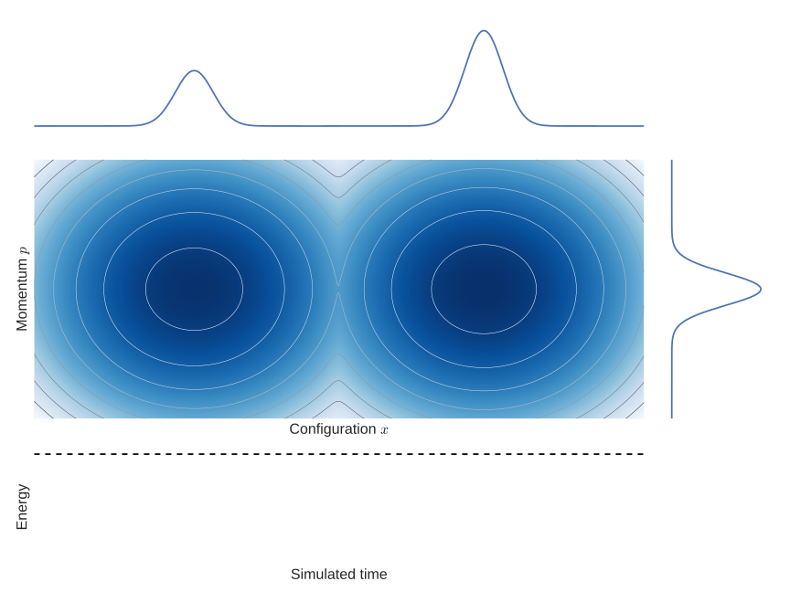
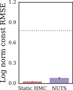
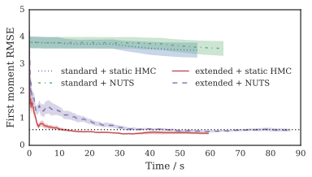
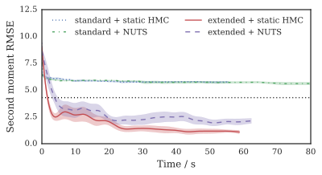

  

    <h1 class='title-heading'> 
      Continuously tempered Hamiltonian Monte Carlo
    </h1>
  

**Matt Graham &lt;[matt-graham.github.io](http://matt-graham.github.io)&gt;**  
*Joint work with Amos Storkey*

---

<!-- .slide: data-background-video="images/20d-bmr-example-1.mp4" data-background-video-loop="true" data-->

### Task

Given a (unnormalised) target density on $\vct{x} \in \set{X} \subseteq \reals^D$ <!-- .element: class="fragment" data-fragment-index="1" -->

\[
  \tgtden{\vct{x}} \propto \exp\lsb-\phi(\vct{x})\rsb,  
\] <!-- .element: class="fragment" data-fragment-index="1" -->

how can we estimate expectations with respect to $\pi$  <!-- .element: class="fragment" data-fragment-index="2" -->

\[
  \mathbb{E}\_{\pi} \lsb f \rsb = \int\_{\set{X}} f(\vct{x}) \,\tgtden{\vct{x}} \,\dr\vct{x}
\] <!-- .element: class="fragment" data-fragment-index="2" -->

and the unknown normalising constant of the density <!-- .element: class="fragment" data-fragment-index="3" -->

\[
  Z = \int_{\set{X}} \exp\lsb-\phi(\vct{x})\rsb \,\dr\vct{x} ?
\] <!-- .element: class="fragment" data-fragment-index="3" -->

---

<!-- .slide: data-background-video="images/2d-density-hmc.mp4" data-background-video-loop="true" -->

----

<!-- .slide: data-background-video="images/2d-density-hmc.mp4" data-background-video-loop="true" data-state="dim-bg-video" -->

### Hybrid / Hamiltonian Monte Carlo (HMC) <small>Duane et al., 1987; Neal, 2011</small>

$\vct{x} \in \reals^D$
$\to (\vct{x},\,\vct{p}) \in \reals^D \times \reals^D$ 

\[
  \pi\lsb\vct{x},\,\vct{p}\rsb \propto 
  \exp \underbrace{
    \lsb  -\phi(\vct{x}) - \frac{1}{2}\vct{p}\tr\mtx{M}^{-1}\vct{p} \rsb
  }_{-H(\vct{x},\,\vct{p})}
\] <!-- .element: class="fragment" data-fragment-index="3" -->

\[
  \td{\vct{x}}{t} = \mtx{M}^{-1}\vct{p},
  \quad
  \td{\vct{p}}{t} = -\pd{\phi}{\vct{x}}
\] <!-- .element: class="fragment" data-fragment-index="4" -->

----

### Black-box inference with HMC

  * Long-range moves in high-dimensional $\set{X}$. <!-- .element: class="fragment" data-fragment-index="1" -->

  * $\pd{\phi}{\vct{x}}$: automatic differentiation. <!-- .element: class="fragment" data-fragment-index="2" -->

  * Need to tune step-size $\delta t$ and integration time $\tau$. <!-- .element: class="fragment" data-fragment-index="3" -->

  * Adaptive: No U-Turns Sampler (NUTS) <small>Hoffman and Gelman, 2014.</small>
<!-- .element: class="fragment" data-fragment-index="4" -->

  

    
    
Stan

  

  

    
  

---

### HMC in multimodal targets

----

### HMC in multimodal targets

----

### HMC in multimodal targets

----

### HMC in multimodal targets

----

### HMC in multimodal targets

----

### HMC in multimodal targets

----

### HMC in multimodal targets

---

<!-- .slide: data-background-image="images/geometric-bridge-beta-ensemble.svg" data-background-size="contain" data-state="dim-bg" -->

### Thermodynamic ensembles

\[
  \pi\lpa \vct{x} \gvn \beta \rpa =
  \frac{1}{\mathcal{Z}(\beta)}
  \exp\lsb -\beta \phi(\vct{x}) - (1 - \beta) \psi(\vct{x}) \rsb
\] <!-- .element: class="fragment" data-fragment-index="1" -->

\[
  \mathcal{Z}(\beta) = \int_{\set{X}} \exp\lsb -\beta \phi(\vct{x}) - (1 - \beta) \psi(\vct{x}) \rsb \,\dr\vct{x}
\] <!-- .element: class="fragment" data-fragment-index="2" -->

----

<!-- .slide: data-background-image="images/geometric-bridge-beta-ensemble.svg" data-background-size="contain" -->

---

<!-- .slide: data-background-image="images/1d-gm-continuous-inv-temp-joint.svg" data-background-size="contain" -->

### Continuous inverse temperature $\beta$? 

----

<!-- .slide: data-background-image="images/1d-gm-adiabatic-monte-carlo-trajectory.svg" data-background-size="contain" data-state="dim-bg" -->

### Adiabatic Monte Carlo <small>Betancourt, 2014</small>

Flat target marginal $\pi(\beta) = 1$,  $\beta \in [0,\,1]$. <!-- .element: class="fragment current-visible" data-fragment-index="1" -->

\begin{align}
  \pi(\vct{x},\,\vct{p},\,\beta) 
  &=
  \pi(\vct{x} \gvn \beta) \pi(\beta) \pi(\vct{p})\\\\
  &=
  \exp\underbrace{\lsb 
    -\beta\phi(\vct{x}) - 
    \lpa 1 - \beta\rpa \psi(\vct{x}) -
    \frac{1}{2}\vct{p}\tr\mtx{M}^{-1}\vct{p} - 
    \color{red}{\log \mathcal{Z}(\beta)}
  \rsb}\_{H\_c(\vct{x},\,\vct{p},\,\beta)}
\end{align}<!-- .element: style="font-size:90%;" class="fragment" data-fragment-index="2" -->

----

<!-- .slide: data-background-image="images/1d-gm-adiabatic-monte-carlo-trajectory.svg" data-background-size="contain" -->

----

<!-- .slide: data-background-image="images/1d-gm-adiabatic-monte-carlo-stalled-trajectory.svg" data-background-size="contain" -->

---

### Extended Hamiltonian approach to continuous tempering <small>Gobbo and Leimkuhler, 2016</small>

\[
  \tilde{H}(\vct{x},\,u,\,\vct{p},\,v) =
  \beta(u) \phi(\vct{x}) + \omega(u) + \frac{1}{2}\vct{p}\tr\mtx{M}^{-1}\vct{p} + \frac{v^2}{2m}
\]<!-- .element: class="fragment" data-fragment-index="1" -->

\[
  \pi\lsb\vct{x} \gvn {-\theta_1} \leq |u| \leq \theta_1\rsb \propto 
  \exp\lsb-\phi(\vct{x})\rsb
\]<!-- .element: class="fragment current-visible" data-fragment-index="3" -->

Molecular dynamics simulation with Langevin updates.<!-- .element: class="fragment" data-fragment-index="4" -->

----

<!-- .slide: data-background-image="images/1d-gm-gaussian-u-joint-trajectory.svg" data-background-size="contain" -->

----

### Metadynamics <small>Laio and Parrinello, 2002</small>

\[
  \pi(u)
  \propto 
  \exp\lsb-\omega(u)\rsb
  \color{red}{\int\_{\set{X}} \exp\lsb-\beta(u)\phi(\vct{x})\rsb\,\dr\vct{x}}
\]<!-- .element: class="fragment current-visible" data-fragment-index="1" -->

  
  $$u$$
  <small>Alessandro Laio, <a href='http://people.sissa.it/~laio/Research/Images/meta.gif'>http://people.sissa.it/~laio/Research/Images/meta.gif</a></small>

---

### Our approach

\begin{align}
  \tilde{H}(\vct{x},\,u,\,\vct{p},\,v) =&\,
  \beta(u) \lsb \phi(\vct{x}) + \color{blue}{\log \zeta} \rsb + 
  \color{red}{\lsb 1 - \beta(u) \rsb \psi(\vct{x})} + \,\\\\ & \,
  \frac{1}{2}\vct{p}\tr\mtx{M}^{-1}\vct{p} + \frac{v^2}{2m}
\end{align}<!-- .element: class="fragment" data-fragment-index="1" -->

  $\color{blue}{\log{\zeta} \approx \log Z}$

  $\qquad\color{red}{\exp\lsb -\psi(\vct{x}) \rsb
  \stackrel{\scriptscriptstyle\textrm{moments}}{\approx}
  \frac{1}{Z}\exp\lsb-\phi(\vct{x})\rsb}$.

----

### Our approach

\begin{align}
  \tilde{H}(
    \color{green}{\underbrace{\vct{x},u}\_{\vct{\tilde{x}}}},\,
    \color{purple}{\underbrace{\vct{p},v}\_{\vct{\tilde{p}}}}
  ) =& \,
  \color{green}{\overbrace{\\beta(u) \lsb \phi(\vct{x}) + \log\zeta \rsb + \lsb 1 - \beta(u) \rsb \psi(\vct{x})}^{\tilde{\phi}(\vct{\tilde{x}})}} + \,\\\\ &\,
  \color{purple}{\underbrace{\frac{1}{2}\vct{p}\tr\mtx{M}^{-1}\vct{p} + \frac{v^2}{2m}}\_{\frac{1}{2}\vct{\tilde{p}}\tr\mtx{\tilde{M}}^{-1}\vct{\tilde{p}}}}
\end{align}

\[
  \td{\vct{\tilde{x}}}{t} = \mtx{\tilde{M}}^{-1}\vct{\tilde{p}},
  \quad
  \td{\vct{\tilde{p}}}{t} = -\pd{\tilde\phi}{\vct{\tilde{x}}}
\]<!-- .element: class="fragment" data-fragment-index="1" -->

----

<!-- .slide: data-background-image="images/1d-gm-circular-u-joint-trajectory.svg" data-background-size="contain" -->

---

<!-- .slide: data-background-image="images/1d-gm-norm-const-est.svg" data-background-size="contain" -->

### Estimating $Z$

\[
  Z = 
  \frac{1 - \theta\_2}{\theta\_1}
  \frac{\mathbb{E}\_{\pi}\lsb \mathbb{1}[0 \leq |u| \leq \theta\_1]\rsb}
  {\mathbb{E}\_{\pi}\lsb\mathbb{1}[\theta\_2 \leq |u| \leq 1]\rsb}\zeta
\]<!-- .element: class="fragment current-visible" data-fragment-index="-1" -->

\[
  Z \approx
  \frac{1 - \theta\_2}{\theta\_1}
  \frac
  {\sum\_{s=1}^S\lbr \mathbb{1}\lsb 0 \leq |u^{(s)}| \leq \theta\_1 \rsb\rbr}
  {\sum\_{s=1}^S\lbr \mathbb{1}\lsb \theta\_2 \leq |u^{(s)}| \leq 1 \rsb\rbr} \zeta
\]<!-- .element: class="fragment" data-fragment-index="-1" -->

----

<!-- .slide: data-background-image="images/1d-gm-norm-const-est.svg" data-background-size="contain" data-state="dim-bg" -->

### Estimating $Z$

\[
  Z = 
  \frac{1 - \theta\_2}{\theta\_1}
  \frac{\mathbb{E}\_{\pi}\lsb \mathbb{1}[0 \leq |u| \leq \theta\_1]\rsb}
  {\mathbb{E}\_{\pi}\lsb\mathbb{1}[\theta\_2 \leq |u| \leq 1]\rsb}\zeta
\]<!-- .element: class="fragment current-visible" data-fragment-index="1" -->

\[
  Z \approx
  \frac{1 - \theta\_2}{\theta\_1}
  \frac
  {\sum\_{s=1}^S\lbr \mathbb{1}\lsb 0 \leq |u^{(s)}| \leq \theta\_1 \rsb\rbr}
  {\sum\_{s=1}^S\lbr \mathbb{1}\lsb \theta\_2 \leq |u^{(s)}| \leq 1 \rsb\rbr} \zeta
\]<!-- .element: class="fragment" data-fragment-index="2" -->

---

### 1D Gaussian mixture example

  

     
  

  

    
 

---

<!-- .slide: data-background-video="images/20d-bmr-example-1.mp4" data-background-video-loop="true" -->

### Boltzmann machine relaxation

----

### Boltzmann machine relaxation results

   

     
  

  

     
  

  

     
  

   

     
  

  

     
  

  

     
  

----

### Boltzmann machine relaxation results

   

     
  

  

     
  

  

     
  

   

     
  

  

     
  

  

     
  

---

### Conclusions

  * Thermodynamic HMC augmentation which improves mode-hopping and allows estimation of $Z$.<!-- .element: class="fragment" data-fragment-index="1" -->
  * Given $\zeta$ and $\psi$ can be easily used with existing HMC code.<!-- .element: class="fragment" data-fragment-index="2" -->
  * Exploits cheap deterministic approximations to $\pi(\vct{x})$ while still allowing asymptotic exactness.<!-- .element: class="fragment" data-fragment-index="3" -->

---

### Acknowledgements

   

     
     
<small>Amos Storkey</small>

  

  

    
    
<small>Ben Leimkuhler</small>

  

   
   

       Doctoral Training Centre in Neuroinformatics and Computational Neuroscience
   
 

   
   
    

---

### References

<ul style='font-size: 65%;'>
  
  <li>
  Hybrid Monte Carlo. 
  *Physics Letters B*, Duane, Kennedy, Pendleton & Roweth (1987).  
  </li>
  <li>
  MCMC using Hamiltonian dynamics. 
  *Handbook of Markov Chain Monte Carlo*, Neal (2011).  
  </li>
  <li>
  The No-U-turn sampler: adaptively setting path lengths in Hamiltonian Monte Carlo. 
  *Journal of Machine Learning Research*, Hoffman & Gelman (2014).  
  </li>
  <li>
  Adiabatic Monte Carlo. 
  *arXiv preprint arXiv:1405.3489*, Betancourt (2014).  
  </li>
  <li>
  Extended Hamiltonian approach to continuous tempering. 
  *Physical Review E*, Gobbo & Leimkuhler (2015). 
  </li>
  <li>
  Escaping free-energy minima. 
  *Proceedings of the National Academy of Sciences*, Laio & Parrinello (2002).  
  </li>
</ul>
