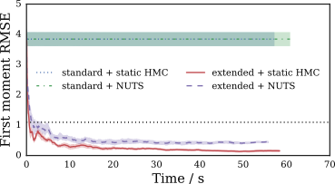
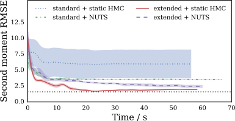
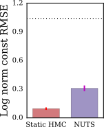

  

    <h1 class='title-heading'> 
      Continuously tempered Hamiltonian Monte Carlo
    </h1>
  

**Matt Graham &lt;[matt-graham.github.io](http://matt-graham.github.io)&gt;**  
*Joint work with Amos Storkey*

Note:

Hi. I'm Matt Graham a PhD student at University of Edinburgh. I am going to talk to you about continuously tempered Hamiltonian Monte Carlo which is joint work with my supervisor Amos Storkey.

---

<!-- .slide: data-background-video="images/20d-bmr-example-1.mp4" data-background-video-loop="true" data-->

### Task

Given a (unnormalised) target density on $\vct{x} \in \set{X} \subseteq \reals^D$ <!-- .element: class="fragment" data-fragment-index="1" -->

\[
  \tgtden{\vct{x}} \propto \exp\lsb-\phi(\vct{x})\rsb,  
\] <!-- .element: class="fragment" data-fragment-index="1" -->

how can we estimate expectations with respect to $\pi$  <!-- .element: class="fragment" data-fragment-index="2" -->

\[
  \mathbb{E}\_{\pi} \lsb f \rsb = \int\_{\set{X}} f(\vct{x}) \,\tgtden{\vct{x}} \,\dr\vct{x}
\] <!-- .element: class="fragment" data-fragment-index="2" -->

and the unknown normalising constant of the density <!-- .element: class="fragment" data-fragment-index="3" -->

\[
  Z = \int_{\set{X}} \exp\lsb-\phi(\vct{x})\rsb \,\dr\vct{x} ?
\] <!-- .element: class="fragment" data-fragment-index="3" -->

Note:

Specific problem I will be considering is performing approximate inference with high-dimensional densities with a potentially large number of separated modes. 

As a particular motivating example, what is being shown in the animation is a three dimensional projection of samples of a structured form of a Gaussian mixture model. 

As we can see even within this 3D projection there are multiple separated high density regions evident. 

These sort of multimodal densities are typically very challenging for approximate inference methods to deal with. However as we'll see later the method being presented is often able to allow accurate inference in these settings. *click*

To be concrete with notation, the task I will be considering is, given a usually unnormalised density defined by a potential function $\phi$ over a $D$-dimensional real valued state space, *click* can we both compute expectations of functions $f$ with respect to the target *click* and further can we estimate the normalising constant of the density. 

---

<!-- .slide: data-background-video="images/2d-density-hmc.mp4" data-background-video-loop="true" data-state="dim-bg-video" -->

### Hybrid / Hamiltonian Monte Carlo (HMC) <small>Duane et al., 1987; Neal, 2011</small>

$\vct{x} \in \reals^D$
$\to (\vct{x},\,\vct{p}) \in \reals^D \times \reals^D$ 

\[
  \pi\lsb\vct{x},\,\vct{p}\rsb \propto 
  \exp \underbrace{
    \lsb  -\phi(\vct{x}) - \frac{1}{2}\vct{p}\tr\mtx{M}^{-1}\vct{p} \rsb
  }_{-H(\vct{x},\,\vct{p})}
\] <!-- .element: class="fragment" data-fragment-index="3" -->

\[
  \td{\vct{x}}{t} = \mtx{M}^{-1}\vct{p},
  \quad
  \td{\vct{p}}{t} = -\pd{\phi}{\vct{x}}
\] <!-- .element: class="fragment current-visible" data-fragment-index="4" -->

\[
  a\lsb \vct{x}' \gvn \vct{x}\rsb =
  \min\lbr
    1,\,\exp\lsb H(\vct{x},\,\vct{p}) - H(\vct{x}',\,\vct{p}') \rsb
  \rbr
\] <!-- .element: class="fragment" data-fragment-index="5" -->

Note:

More specifically I will be considering Markov chain Monte Carlo methods and in particular Hybrid or Hamiltonian Monte Carlo. 
  
This is a method introduced in the statistical physics literature in the late 80s by Duane and colleagues. *click*
  
The key idea is that we augment our original configuration state $\vct{x}$ *click* with a momentum state $\vct{p}$ of the same dimensionality and which we choose to be independent of $\vct{x}$ and marginally Gaussian distributed *click*.
  
The negative logarithm of the resulting joint density is termed the Hamiltonian for the system in direct analogy to classical mechanics, and can be considered to be composed of a potential energy term $\phi$ from the target density and a quadratic kinetic energy term on the momentum *click*.
  
We simulate a Newtonian dynamic in the joint system, using a leapfrog integrator to step forward a number of time-steps from the current state, and using the end-point of the simulated trajectory as a Metropolis--Hastings proposal.
  
The exact dynamic is energy conserving which is approximately preserved by leapfrog integrator. As the probability of accepting moves depends on the change in Hamiltonian over a trajectory this usually gives a high probability of acceptance.

----

### Black-box inference with HMC

  

    
    
Stan

  

  

    
  

  * Long-range moves in high-dimensional $\set{X}$. <!-- .element: class="fragment" data-fragment-index="1" -->

  * Adaptive: No U-Turns Sampler (NUTS) <small>Hoffman and Gelman, 2014.</small>
<!-- .element: class="fragment" data-fragment-index="2" -->

  * However poor performance in multimodal targets.<!-- .element: class="fragment" data-fragment-index="3" -->

Note:

Though the algorithm just described might seem a little complicated, the very general purpose implementations in probabilistic programming frameworks such as Stan and PyMC3, mean that we don't necessarily need to deal with the implementation detail or calculation of model gradients which can be done with automatic differentation.

The energy-conserving property means that if we appropriately choose the step-size and number of steps, we are able to make long-range moves with a high-probability of acceptance even in high dimensional target state spaces.

An adaptive HMC variant called the No U-turn Sampler or NUTS, proposed by Hoffman and Gelman, is further able to automatically tune the step-size and number of integrator steps, allowing use of HMC in a very black-box manner.

A key issue however is that HMC like most MCMC algorithms performs poorly in multimodal densities.

----

### HMC in multimodal targets

Note:

As a particular example the figure shows a series of HMC samples from a one-dimensional two component Gaussian mixture and the corresponding empirical marginals on $x$ and $p$ and energy trace. We can see that the dynamic updates remain confined to one mode in $x$. The black dotted line on the energy trace represents the energy-barrier between the two modes and we can see after the intial warm-up transient, the system kinetic energy never gets close to being sufficiently large to allow this barrier to be crossed.

---

<!-- .slide: data-background-image="images/geometric-bridge-beta-ensemble.svg" data-background-size="contain" data-state="dim-bg" -->

### Thermodynamic ensembles

Introduce inverse temperature $\beta$<!-- .element: class="fragment" data-fragment-index="1" -->

and simple normalised base density $\exp\lsb-\psi(\vct{x})\rsb$ . <!-- .element: class="fragment" data-fragment-index="2" -->

\[
  \pi\lpa \vct{x} \gvn \beta \rpa =
  \frac{1}{\mathcal{Z}(\beta)}
  \exp\lsb -\beta \phi(\vct{x}) - (1 - \beta) \psi(\vct{x}) \rsb
\] <!-- .element: class="fragment" data-fragment-index="3" -->

\[
  \mathcal{Z}(\beta) = \int_{\set{X}} \exp\lsb -\beta \phi(\vct{x}) - (1 - \beta) \psi(\vct{x}) \rsb \,\dr\vct{x}
\] <!-- .element: class="fragment" data-fragment-index="4" -->

Note:

A common way to deal with multimodal distribution in MCMC is to introduce a inverse temperature variable $\beta$ and a unimodal base density defined by a potential $\psi$ which approximates the target density.

This geometrically bridge between target distribution at $\beta=1$ and base density at $\beta=0$.

The normalising term for this conditional distribution now dependent on $\beta$ and often termed the partition function.

----

<!-- .slide: data-background-image="images/geometric-bridge-beta-ensemble.svg" data-background-size="contain" -->

Note:

Idea is distributions at intermediate $\beta$ retain some structure from target distribution but are easier to sample from due to energy barriers being flattened out. If we vary the inverse temperature $\beta$ during sampling the hope is that at low $\beta$ we will be able to make large moves around the state space at low $\beta$ and thus be able to jump between modes at $\beta=1$.

Several methods such as simulated and parallel tempering have been proposed for defining a Markov chains on an augmented state space with $\beta$ defined on a finite set of values, however the performance of these methods are very sensitive to amongst other things the choice of the $\beta$ values and so they are difficult to use in a black box manner.

---

<!-- .slide: data-background-image="images/1d-gm-continuous-inv-temp-joint.svg" data-background-size="contain" -->

### Continuous inverse temperature $\beta$? 

Note:

Natural question: can we use a continuous inverse temperature variable?

Several methods proposed using this idea including path sampling by Gelman and Meng and Adiabatic Monte Carlo by Betancourt.

----

### Extended Hamiltonian approach to continuous tempering <small>Gobbo and Leimkuhler, 2016</small>

\[
  \tilde{H}(\vct{x},\,u,\,\vct{p},\,v) =
  \beta(u) \phi(\vct{x}) + \frac{u^2}{2 \sigma^2} + \frac{1}{2}\vct{p}\tr\mtx{M}^{-1}\vct{p} + \frac{v^2}{2m}
\]<!-- .element: class="fragment" data-fragment-index="2" -->

\[
  \pi\lsb\vct{x} \gvn {-\theta_1} \leq |u| \leq \theta_1\rsb \propto 
  \exp\lsb-\phi(\vct{x})\rsb
\]<!-- .element: class="fragment current-visible" data-fragment-index="3" -->

Molecular dynamics simulation with Langevin updates.<!-- .element: class="fragment" data-fragment-index="4" -->

Note:

More recently a statistical physics paper 'An extended Hamiltonian approach to continuous tempering' by Gianpaolo Gobbo and Ben Leimkuhler proposed a very elegant way of inlcuding an inverse temperature variable in a Hamiltonian system.

The main idea is to indirectly set the inverse temperature indirectly via a temperature control variable $u$. This is related to $\beta$ by a smooth piecewise defined function like that shown. Importantly between a lower threshold interval $u = \pm \theta_1$ the inverse temperature is exactly equal to 1. 

The extended Hamiltonian of the resulting system has the form shown. In their paper the authors assume an improper flat base density $\psi$ and so there is no second $\beta$ dependent term. The temperature control variable is given a Gaussian prior to ensure it remains bounded. Importantly the temperature control variable $u$ is associated with its own conjugate momenta $v$.

Because of the property that $\beta=1$ for $u$ between negative and positive $\theta_1$, we have that conditioned on $u$ being in this range the $\vct{x}$ configuration state has the desired target distribution, therefore we can estimate expecations with respect to the target just by averaging only over samples with $u$ in this range.

In their paper, Gobbo and Leimkuhler apply the method to molecular dynamic simulations and use a Langevin dynamic with Metropolis correction rather than full HMC.

----

### Exploring $u$ space

\[
  \pi(u)
  \propto 
  \exp\lsb-\frac{u^2}{2\sigma^2}\rsb
  \color{red}{\int\_{\set{X}} \exp\lsb-\beta(u)\phi(\vct{x})\rsb\,\dr\vct{x}}
\]<!-- .element: class="fragment" data-fragment-index="1" -->

Note:

The marginal density on the temperature control variable is formed of a product of the Gaussian prior and a partition function term. Because of the assumption of a improper flat base density this partition function term will typically vary significantly in magnitude as $\beta$ is changed, tending to infinity if $\beta$ was allowed to go to 0 due to the improper base density.

This results in a very non-flat marginal on $u$. The figure shows the free-energy on $u$ or negative log marginal for the two component Gaussian mixture target encountered earlier. We can see there are large barriers in the free energy surface and this tends to lead to $u$ remaining confined to small regions over long periods.

----

### Metadynamics <small>Laio and Parrinello, 2002</small>

  
  $u$
  <small>Alessandro Laio, <a href='http://people.sissa.it/~laio/Research/Images/meta.gif'>http://people.sissa.it/~laio/Research/Images/meta.gif</a></small>

Note:

The approach used by Gobbo and Leimkuhler to overcome this problem, is to use a method developed by Laio and Parrinello in the molecular dynamics community for flattening out a free energy function called metadynamics.

As illustrated by the animation, this adds an adaptive biasing potential to $u$ which helps to fill in the wells in the free energy surface and encourage movement around the full space.

Although metadynamics can work well in practice it adds extra implementation difficulty and also because of the non-Markovian history dependence introduced requires even a vanishing adaption durin an intial warm up phase or careful importance reweighting post-hoc to allow unbiased estimations of expectations.

---

### Our approach

\begin{align}
  \tilde{H}(\vct{x},\,u,\,\vct{p},\,v) =&\,
  \beta(u) \lsb \phi(\vct{x}) + \color{blue}{\log \zeta} \rsb + 
  \color{red}{\lsb 1 - \beta(u) \rsb \psi(\vct{x})} + \,\\\\ & \,
  \frac{1}{2}\vct{p}\tr\mtx{M}^{-1}\vct{p} + \frac{v^2}{2m}
\end{align}<!-- .element: class="fragment" data-fragment-index="1" -->

  $\color{blue}{\log{\zeta} \approx \log Z}$

  $\qquad\color{red}{\exp\lsb -\psi(\vct{x}) \rsb
  \stackrel{\scriptscriptstyle\textrm{moments}}{\approx}
  \frac{1}{Z}\exp\lsb-\phi(\vct{x})\rsb}$.

----

### Our approach

\begin{align}
  \tilde{H}(
    \color{green}{\underbrace{\vct{x},u}\_{\vct{\tilde{x}}}},\,
    \color{purple}{\underbrace{\vct{p},v}\_{\vct{\tilde{p}}}}
  ) =& \,
  \color{green}{\overbrace{\\beta(u) \lsb \phi(\vct{x}) + \log\zeta \rsb + \lsb 1 - \beta(u) \rsb \psi(\vct{x})}^{\tilde{\phi}(\vct{\tilde{x}})}} + \,\\\\ &\,
  \color{purple}{\underbrace{\frac{1}{2}\vct{p}\tr\mtx{M}^{-1}\vct{p} + \frac{v^2}{2m}}\_{\frac{1}{2}\vct{\tilde{p}}\tr\mtx{\tilde{M}}^{-1}\vct{\tilde{p}}}}
\end{align}

\[
  \td{\vct{\tilde{x}}}{t} = \mtx{\tilde{M}}^{-1}\vct{\tilde{p}},
  \quad
  \td{\vct{\tilde{p}}}{t} = -\pd{\tilde\phi}{\vct{\tilde{x}}}
\]<!-- .element: class="fragment" data-fragment-index="1" -->

----

<!-- .slide: data-background-image="images/1d-gm-circular-u-joint-trajectory.svg" data-background-size="contain" -->

---

<!-- .slide: data-background-image="images/1d-gm-norm-const-est.svg" data-background-size="contain" -->

----

<!-- .slide: data-background-image="images/1d-gm-norm-const-est.svg" data-background-size="contain" data-state="dim-bg" -->

### Estimating $Z$

\[
  Z \approx
  \frac{1 - \theta\_2}{\theta\_1}
  \frac
  {\color{green}{\sum\_{s=1}^S\lbr \mathbb{1}\lsb 0 \leq |u^{(s)}| \leq \theta\_1 \rsb\rbr}}
  {\color{purple}{\sum\_{s=1}^S\lbr \mathbb{1}\lsb \theta\_2 \leq |u^{(s)}| \leq 1 \rsb\rbr}} \zeta
\]<!-- .element: class="fragment" data-fragment-index="1" -->

---

### 1D Gaussian mixture example

  

     
  

  

    
 

---

<!-- .slide: data-background-video="images/20d-bmr-example-1.mp4" data-background-video-loop="true" -->

### Boltzmann machine relaxation

----

### Boltzmann machine relaxation results

   

     
  

  

     
  

  

     
  

   

     
  

  

     
  

  

     
  

---

### Conclusions

  * Thermodynamic HMC augmentation which improves mode-hopping and allows estimation of $Z$.<!-- .element: class="fragment" data-fragment-index="1" -->
  * Given $\zeta$ and $\psi$ can be easily used with existing HMC code.<!-- .element: class="fragment" data-fragment-index="2" -->
  * Exploits cheap deterministic approximations to $\pi(\vct{x})$ while still allowing asymptotic exactness.<!-- .element: class="fragment" data-fragment-index="3" -->
  * Statistical physics literature continues to be a rich resource for developing MCMC methods!<!-- .element: class="fragment" data-fragment-index="4" -->

---

### Acknowledgements

   

     
     
<small>Amos Storkey</small>

  

  

    
    
<small>Ben Leimkuhler</small>

  

   
   

       Doctoral Training Centre in Neuroinformatics and Computational Neuroscience
   
 

   
   
    

---

### References

<ul style='font-size: 65%;'>
  
  <li>
  Hybrid Monte Carlo. 
  *Physics Letters B*, Duane, Kennedy, Pendleton & Roweth (1987).  
  </li>
  <li>
  MCMC using Hamiltonian dynamics. 
  *Handbook of Markov Chain Monte Carlo*, Neal (2011).  
  </li>
  <li>
  The No-U-turn sampler: adaptively setting path lengths in Hamiltonian Monte Carlo. 
  *Journal of Machine Learning Research*, Hoffman & Gelman (2014).  
  </li>
  <li>
  Extended Hamiltonian approach to continuous tempering. 
  *Physical Review E*, Gobbo & Leimkuhler (2015). 
  </li>
  <li>
  Escaping free-energy minima. 
  *Proceedings of the National Academy of Sciences*, Laio & Parrinello (2002).  
  </li>
</ul>

---

<!-- .slide: data-background-image="images/1d-gm-adiabatic-monte-carlo-trajectory.svg" data-background-size="contain" data-state="dim-bg" -->

### Adiabatic Monte Carlo <small>Betancourt, 2014</small>

Flat target marginal $\pi(\beta) = 1$,  $\beta \in [0,\,1]$. <!-- .element: class="fragment current-visible" data-fragment-index="1" -->

\begin{align}
  \pi(\vct{x},\,\vct{p},\,\beta) 
  &=
  \pi(\vct{x} \gvn \beta) \pi(\beta) \pi(\vct{p})\\\\
  &=
  \exp\lsb 
    -\beta\phi(\vct{x}) - 
    \lpa 1 - \beta\rpa \psi(\vct{x}) -
    \frac{1}{2}\vct{p}\tr\mtx{M}^{-1}\vct{p} - 
    \color{red}{\log \mathcal{Z}(\beta)}
  \rsb
\end{align}<!-- .element: style="font-size:90%;" class="fragment" data-fragment-index="2" -->

\[
  \td{\vct{x}}{t} = \mtx{M}^{-1}\vct{p},~
  \td{\beta}{t} = -\vct{p}\tr \mtx{M}^{-1} \vct{p}
\]<!-- .element: style="font-size:90%;" class="fragment current-visible" data-fragment-index="3" -->

\[
  \td{\vct{p}}{t} = 
  -\beta \pd{\phi}{\vct{x}} - (1-\beta) \pd{\psi}{\vct{x}} +
  \lpa\phi(\vct{x}) - \psi(\vct{x}) + \color{red}{\pd{\log \mathcal{Z}}{\beta}}\rpa\vct{p}
\]<!-- .element:  style="font-size:90%;" class="fragment" data-fragment-index="4" -->

----

<!-- .slide: data-background-image="images/1d-gm-adiabatic-monte-carlo-trajectory.svg" data-background-size="contain" -->

----

<!-- .slide: data-background-image="images/1d-gm-adiabatic-monte-carlo-stalled-trajectory.svg" data-background-size="contain" -->

---

### Bounding the partition function

\[
  \pi(u) \propto \color{red}{\mathscr{Z}\lsb\beta(u)\rsb} = \frac{\color{blue}{\mathcal{Z}\lsb \beta(u)\rsb}}{\zeta^{\beta(u)}}
\] <!-- .element: class="fragment" data-fragment-index="1" -->

\[
  \color{blue}{\mathcal{Z}\lsb \beta(u)\rsb} =
  \int_{\set{X}} 
    \exp\lbr 
      \beta(u) \phi(\vct{x}) - \lsb 1 - \beta(u) \rsb \psi(\vct{x})
    \rbr
  \,\dr{\vct{x}}
\] <!-- .element: class="fragment current-visible" data-fragment-index="2" -->

\[
\beta(u) \lsb \log \frac{Z}{\zeta} - \color{green}{\mathbb{D}_{\rm KL}^{b\Vert t}} \rsb \leq
\log\color{red}{\mathscr{Z}\lsb\beta(u)\rsb} \leq
\beta(u) \log \frac{Z}{\zeta}
\] <!-- .element: class="fragment" data-fragment-index="3" -->

\[
  \color{green}{\mathbb{D}\_{\rm KL}^{b\Vert t}} =
  \int\_{\set{X}}
    \exp\lsb-\psi(\vct{x})\rsb 
    \log \frac{\exp\lsb-\psi(\vct{x})\rsb }{\frac{1}{Z}\exp\lsb-\phi(\vct{x})\rsb }
  \,\dr\vct{x}
\] <!-- .element: class="fragment" data-fragment-index="4" -->

----

### Bounding the partition function

\[
  \pi(u) \propto \color{red}{\mathscr{Z}\lsb\beta(u)\rsb} = \frac{\color{blue}{\mathcal{Z}\lsb \beta(u)\rsb}}{\zeta^{\beta(u)}}
\]

\[
  \color{blue}{\mathcal{Z}\lsb \beta(u)\rsb} =
  \int_{\set{X}} 
    \exp\lbr 
      \beta(u) \phi(\vct{x}) - \lsb 1 - \beta(u) \rsb \psi(\vct{x})
    \rbr
  \,\dr{\vct{x}}
\]<!-- .element: class="fragment current-visible" data-fragment-index="-1" -->

\[
\beta(u) \log \frac{Z}{\zeta} - \lsb 1 - \beta(u) \rsb \color{purple}{\mathbb{D}\_{\rm KL}^{t\Vert b}} \leq
\log\color{red}{\mathscr{Z}\lsb\beta(u)\rsb}
\] 

\[
  \color{purple}{\mathbb{D}\_{\rm KL}^{t\Vert b}} =
  \int\_{\set{X}}
    \frac{1}{Z}\exp\lsb-\phi(\vct{x})\rsb 
    \log \frac{\frac{1}{Z}\exp\lsb-\phi(\vct{x})\rsb }{\exp\lsb-\psi(\vct{x})\rsb }
  \,\dr\vct{x}
\] <!-- .element: class="fragment" data-fragment-index="1" -->

---

<!-- .slide: data-background-video="images/bmr-example-1.mp4" data-background-video-loop="true" data-state="dim-bg-video" -->

### Choosing a base distribution

Minimise $\color{green}{\mathbb{D}\_{\rm KL}^{b\Vert t}}$(and/or $\color{purple}{\mathbb{D}\_{\rm KL}^{t\Vert b}}$),<!-- .element: class="fragment" data-fragment-index="1" -->

subject to $\exp\lsb-\psi(\vct{x})\rsb$ being a simple (unimodal) density.<!-- .element: class="fragment" data-fragment-index="2" -->

Choose parametric $\exp\lsb-\psi(\vct{x})\rsb$ (e.g. Gaussian) and minimise variational objective with respect to parameters?<!-- .element: class="fragment current-visible" data-fragment-index="3" -->

Iteratively locally match moments with expectation propagation?<!-- .element: class="fragment current-visible" data-fragment-index="4" -->

Fit a multiple local variational approximations and match moments of mixture of local approximations.<!-- .element: class="fragment" data-fragment-index="5" -->

---

<!-- .slide: data-background-video="images/20d-bmr-example-1.mp4" data-background-video-loop="true" data-state="dim-bg-video" -->

### Boltzmann machine relaxation

\[
  \pi(\vct{s}) = 
  \frac{1}{Z_B} 
  \exp\lsb\frac{1}{2}\vct{s}\tr\mtx{W}\vct{s} + \vct{s}\tr\vct{b}\rsb
\]<!-- .element: class="fragment" data-fragment-index="1" -->

\[
  \pi(\vct{x}) \propto
  \exp\lsb-\frac{1}{2}\vct{x}\tr\vct{x} + \sum_{i=1}^{D_B}\log\cosh\lpa\vct{q}_i\tr\vct{x} + b_i \rpa\rsb
\]<!-- .element: class="fragment" data-fragment-index="2" -->

\[
  \mtx{W} + \mtx{D} = \mtx{Q}\mtx{Q}\tr
\]<!-- .element: class="fragment current-visible" data-fragment-index="3" -->

\[
  \log Z = \log Z_B + \frac{1}{2}\textrm{Tr}\lsb\mtx{D}\rsb + \frac{D}{2}\log(2\pi) - D_B \log(2)
\]<!-- .element: class="fragment" data-fragment-index="4" -->

\[
  \mathbb{E}\_\pi\lsb\vct{x}\rsb= \mtx{Q}\tr\mathbb{E}\_\pi\lsb\vct{s}\rsb
  \qquad
  \mathbb{E}\_\pi\lsb\vct{x}\vct{x}\tr\rsb = 
  \mtx{Q}\tr\mathbb{E}\_\pi\lsb \vct{s}\vct{s}\tr \rsb \mtx{Q} + \mtx{I}
\]<!-- .element: class="fragment" data-fragment-index="4" -->

----

### Boltzmann machine relaxation results

   

     
  

  

     
  

  

     
  

   

     
  

  

     
  

  

     
  

