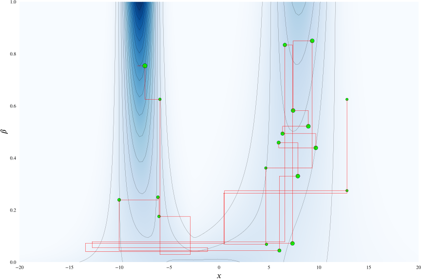
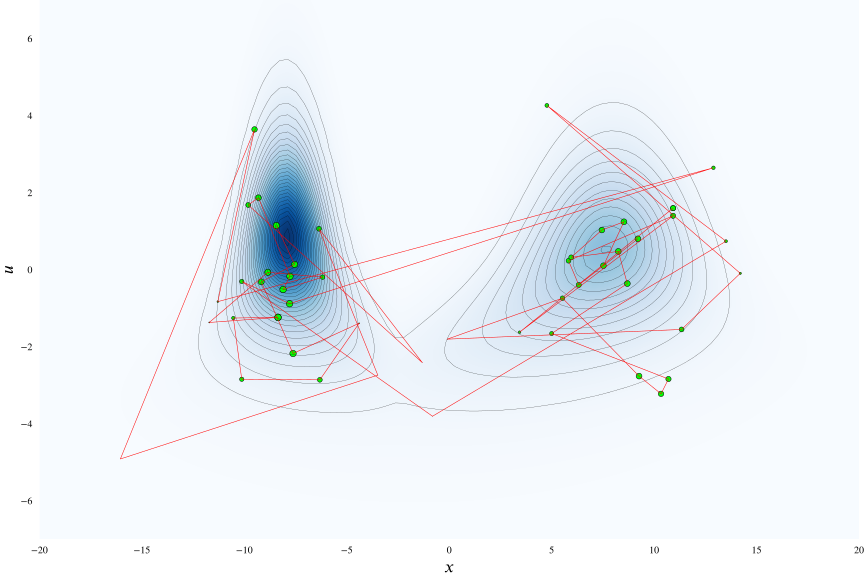
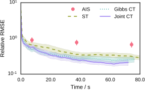

  

    <h1 class='title-heading'> 
      Continuously tempered Hamiltonian Monte Carlo
    </h1>
  

**Matt Graham &lt;[matt-graham.github.io](http://matt-graham.github.io)&gt;**  
*Joint work with Amos Storkey*

Note:

Hi. I'm Matt Graham a PhD student at University of Edinburgh. I am going to talk to you about continuously tempered Hamiltonian Monte Carlo which is joint work with my supervisor Amos Storkey.

---

<!-- .slide: data-background-image="images/2d-density-mcmc-0.svg" data-state="dim-bg" -->

### Task

Given a (unnormalised) target density on $\vct{x} \in \set{X} \subseteq \reals^D$ <!-- .element: class="fragment" data-fragment-index="1" -->

\[
  \tgtden{\vct{x}} \propto \exp\lpa-\phi(\vct{x})\rpa,  
\] <!-- .element: class="fragment" data-fragment-index="1" -->

how can we estimate expectations with respect to $\pi$  <!-- .element: class="fragment" data-fragment-index="2" -->

\[
  \mathbb{E}\_{\pi} \lsb f \rsb = \int\_{\set{X}} f(\vct{x}) \,\tgtden{\vct{x}} \,\dr\vct{x}
\] <!-- .element: class="fragment" data-fragment-index="2" -->

and the unknown normalising constant of the density <!-- .element: class="fragment" data-fragment-index="3" -->

\[
  Z = \int_{\set{X}} \exp\lpa-\phi(\vct{x})\rpa \,\dr\vct{x} ?
\] <!-- .element: class="fragment" data-fragment-index="3" -->

Note:

Specific problem I will be considering is performing approximate inference with high-dimensional densities with a potentially large number of separated modes. 

To be concrete with notation, the task I will be considering is, given a usually unnormalised density defined by a potential function $\phi$ over a $D$-dimensional real valued state space, *click* can we both compute expectations of functions $f$ with respect to the target *click* and further can we estimate the normalising constant of the density. 

----

<!-- .slide: data-background-image="images/2d-density-mcmc-0.svg" data-state="dim-bg" -->

e.g. Bayesian inference  <!-- .element: class="fragment" data-fragment-index="1" -->

\[
  \phantom{\pi\lpa\vct{x}\rpa =} 
  \pden{\vct{x} \gvn \vct{y}} = 
  \frac
  {\pden{\vct{y}\gvn\vct{x}}\pden{\vct{x}}}
  {\pden{\vct{y}}} 
  \phantom{= \frac{\exp\lpa -\phi(\vct{x})\rpa}{Z}}
\]  <!-- .element: class="fragment" data-fragment-index="2" -->

----

<!-- .slide: data-background-image="images/2d-density-mcmc-0.svg" data-state="dim-bg" -->

e.g. Bayesian inference 

\[
  \pi\lpa\vct{x}\rpa = 
  \pden{\vct{x} \gvn \vct{y}} = 
  \frac
  {\pden{\vct{y}\gvn\vct{x}}\pden{\vct{x}}}
  {\pden{\vct{y}}} =
  \frac{\exp\lpa -\phi(\vct{x})\rpa}{Z}
\] 

----

<!-- .slide: data-background-image="images/2d-density-mcmc-1.svg" -->

  

    <h3> 
      Markov chain Monte Carlo
    </h3>
  

----

<!-- .slide: data-background-image="images/2d-density-mcmc-2.svg" -->

  <h3> 
    Markov chain Monte Carlo
  </h3>

---

<!-- .slide: data-background-video="images/2d-density-hmc.mp4" data-background-video-loop="true" data-state="dim-bg-video" -->

### Hamiltonian Monte Carlo (HMC) <small>Duane et al., 1987</small>

$\vct{x} \in \reals^D$
$\to (\vct{x},\,\vct{p}) \in \reals^D \times \reals^D$ 

\[
  \pi(\vct{x},\,\vct{p}) \propto 
  \exp \underbrace{
    \lpa  -\phi(\vct{x}) - \frac{1}{2}\vct{p}\tr\mtx{M}^{-1}\vct{p} \rpa
  }_{-H(\vct{x},\,\vct{p})}
\] <!-- .element: class="fragment" data-fragment-index="3" -->

\[
  \td{\vct{x}}{t} = \mtx{M}^{-1}\vct{p},
  \quad
  \td{\vct{p}}{t} = -\pd{\phi}{\vct{x}}
\] <!-- .element: class="fragment current-visible" data-fragment-index="4" -->

\[
  a\lpa \vct{x}' \gvn \vct{x}\rpa =
  \min\lbr
    1,\,\exp\lpa H(\vct{x},\,\vct{p}) - H(\vct{x}',\,\vct{p}') \rpa
  \rbr
\] <!-- .element: class="fragment" data-fragment-index="5" -->

Note:

More specifically I will be considering Markov chain Monte Carlo methods and in particular Hybrid or Hamiltonian Monte Carlo. 
  
This is a method introduced in the statistical physics literature in the late 80s by Duane and colleagues. *click*
  
The key idea is that we augment our original configuration state $\vct{x}$ *click* with a momentum state $\vct{p}$ of the same dimensionality and which we choose to be independent of $\vct{x}$ and marginally Gaussian distributed *click*.
  
The negative logarithm of the resulting joint density is termed the Hamiltonian for the system in direct analogy to classical mechanics, and can be considered to be composed of a potential energy term $\phi$ from the target density and a quadratic kinetic energy term on the momentum *click*.
  
We simulate a Newtonian dynamic in the joint system, using a leapfrog integrator to step forward a number of time-steps from the current state, and using the end-point of the simulated trajectory as a Metropolis--Hastings proposal.
  
The exact dynamic is energy conserving which is approximately preserved by leapfrog integrator. As the probability of accepting moves depends on the change in Hamiltonian over a trajectory this usually gives a high probability of acceptance.

----

### Black-box inference with HMC

  

    
  

  

    
  

  * Long-range moves in high-dimensional $\set{X}$. <!-- .element: class="fragment" data-fragment-index="1" -->

  * Adaptive: No U-Turns Sampler (NUTS) <small>Hoffman and Gelman, 2014.</small>
<!-- .element: class="fragment" data-fragment-index="2" -->

  * However: <!-- .element: class="fragment" data-fragment-index="3" -->
    *  Poor performance in multimodal targets. <!-- .element: class="fragment" data-fragment-index="4" -->
    *  Non-trivial to use samples to estimate $Z$. <!-- .element: class="fragment" data-fragment-index="4" -->
Note:

Though the algorithm just described might seem a little complicated, the very general purpose implementations in probabilistic programming frameworks such as Stan and PyMC3, mean that we don't necessarily need to deal with the implementation detail or calculation of model gradients which can be done with automatic differentation.

The energy-conserving property means that if we appropriately choose the step-size and number of steps, we are able to make long-range moves with a high-probability of acceptance even in high dimensional target state spaces.

An adaptive HMC variant called the No U-turn Sampler or NUTS, proposed by Hoffman and Gelman, is further able to automatically tune the step-size and number of integrator steps, allowing use of HMC in a very black-box manner.

A key issue however is that HMC like most MCMC algorithms performs poorly in multimodal densities.

----

### HMC in multimodal targets

Note:

As a particular example the figure shows a series of HMC samples from a one-dimensional two component Gaussian mixture and the corresponding empirical marginals on $x$ and $p$ and energy trace. We can see that the dynamic updates remain confined to one mode in $x$. The potential barrier between the two modes is high, and the momentum is only very rarely resampled with a sufficiently high value to allow crossing the barrier.

---

<!-- .slide: data-background-image="images/bimodal-geometric-bridge-visualisation.svg" data-background-size="contain" data-state="dim-bg" -->

### Thermodynamic methods

Introduce inverse temperature $\beta$<!-- .element: class="fragment" data-fragment-index="1" -->

and simple normalised base density $\exp\lsb-\psi(\vct{x})\rsb$ . <!-- .element: class="fragment" data-fragment-index="2" -->

\[
  \pi\lpa \vct{x} \gvn \beta \rpa =
  \frac{1}{\mathcal{Z}(\beta)}
  \exp\lpa -\beta \phi(\vct{x}) - (1 - \beta) \psi(\vct{x}) \rpa
\] <!-- .element: class="fragment" data-fragment-index="3" -->

\[
  \mathcal{Z}(\beta) = \int_{\set{X}} \exp\lpa -\beta \phi(\vct{x}) - (1 - \beta) \psi(\vct{x}) \rpa \,\dr\vct{x}
\] <!-- .element: class="fragment" data-fragment-index="4" -->

Note:

A common way to deal with multimodal distribution in MCMC is to introduce a inverse temperature variable $\beta$ and a unimodal base density defined by a potential $\psi$ which approximates the target density.

This geometrically bridge between target distribution at $\beta=1$ and base density at $\beta=0$.

The normalising term for this conditional distribution now dependent on $\beta$ and often termed the partition function.

----

<!-- .slide: data-background-image="images/bimodal-geometric-bridge-visualisation.svg" data-background-size="contain" -->

Note:

Idea is distributions at intermediate $\beta$ retain some structure from target distribution but are easier to sample from due to energy barriers being flattened out. If we vary the inverse temperature $\beta$ during sampling the hope is that at low $\beta$ we will be able to make large moves around the state space at low $\beta$ and thus be able to jump between modes at $\beta=1$.

Several methods such as simulated and parallel tempering have been proposed for defining a Markov chains on an augmented state space with $\beta$ defined on a finite set of values, however the performance of these methods are very sensitive to amongst other things the choice of the $\beta$ values and so they are difficult to use in a black box manner.

---

<h3 style='font-size: 120%;'>Annealed importance sampling (AIS) <small>Neal 2001</small></g3>

----

<h3 style='font-size: 120%;'>Annealed importance sampling (AIS) <small>Neal 2001</small></g3>

----

<h3 style='font-size: 120%;'>Annealed importance sampling (AIS) <small>Neal 2001</small></g3>

----

<h3 style='font-size: 120%;'>Annealed importance sampling (AIS) <small>Neal 2001</small></g3>

----

<h3 style='font-size: 120%;'>Annealed importance sampling (AIS) <small>Neal 2001</small></g3>

----

<h3 style='font-size: 120%;'>Annealed importance sampling (AIS) <small>Neal 2001</small></g3>

---

### Simulated tempering (ST) <small>Marinari &amp; Parisi 1992</small>

----

### Simulated tempering (ST) <small>Marinari &amp; Parisi 1992</small>

----

### Simulated tempering (ST) <small>Marinari &amp; Parisi 1992</small>

----

### Simulated tempering (ST) <small>Marinari &amp; Parisi 1992</small>

----

### Simulated tempering (ST) <small>Marinari &amp; Parisi 1992</small>

----

### Simulated tempering (ST) <small>Marinari &amp; Parisi 1992</small>

----

### Rao-Blackwellised ST <small>Carlson et al. 2016</small>

---

### Gibbs continuous tempering (Gibbs-CT)

----

### Gibbs continuous tempering (Gibbs-CT)

----

### Gibbs continuous tempering (Gibbs-CT)

----

### Gibbs continuous tempering (Gibbs-CT)

----

### Gibbs continuous tempering (Gibbs-CT)

----

### Gibbs continuous tempering (Gibbs-CT)

---

### Joint continuous tempering (joint-CT)

----

### Joint continuous tempering (joint-CT)

----

### Joint continuous tempering (joint-CT)

----

### Joint continuous tempering (joint-CT)

----

### Joint continuous tempering (joint-CT)

---

### Choosing a base distribution

Minimise ${\mathbb{D}\_{\rm KL}^{b\Vert t}}$(and/or ${\mathbb{D}\_{\rm KL}^{t\Vert b}}$),<!-- .element: class="fragment" data-fragment-index="1" -->

subject to $\exp\lpa-\psi(\vct{x})\rpa$ being a simple (unimodal) density.<!-- .element: class="fragment" data-fragment-index="2" -->

Choose parametric $\exp\lpa-\psi(\vct{x})\rpa$ and minimise variational objective with respect to parameters, e.g. ADVI?<!-- .element: class="fragment current-visible" data-fragment-index="3" -->

Iteratively locally match moments with expectation propagation?<!-- .element: class="fragment current-visible" data-fragment-index="4" -->

Fit a multiple local variational approximations and match moments of mixture of local approximations.<!-- .element: class="fragment" data-fragment-index="5" -->

---

<!-- .slide: data-background-video="images/20d-bmr-example-1.mp4" data-background-video-loop="true" -->

### Gaussian mixture
### Boltzmann machine relaxations <small>Zhang et al. 2012</small> 

----

### Boltzmann machine relaxation results

   

     
     
<small>$\log Z$</small>

  

  

     
     
<small>$\expc{\vct{x}}$</small>

  

---

<!-- .slide: data-background-image="images/omniglot-samples.png" data-background-size="contain" data-state="dim-bg" -->

### IWAE marginal likelihood estimation <small>Burda et al. 2016; Wu et al. 2017</small> </h3>

----

<!-- .slide: data-background-image="images/mnist-samples.png" data-background-size="contain" data-state="dim-bg" -->

### IWAE marginal likelihood estimation <small>Burda et al. 2016; Wu et al. 2017</small> </h3>

---

### Hierarchical regression model <small>Gelman and Hill 2006</small> </h3>

----

### Hierarchical regression model results

---

### Conclusions

  * Thermodynamic HMC augmentation which improves mode-hopping and allows estimation of $Z$.<!-- .element: class="fragment" data-fragment-index="1" -->
  * Easily used within existing HMC implementations.<!-- .element: class="fragment" data-fragment-index="2" -->
  * Exploits cheap deterministic approximations to $\pi(\vct{x})$ while still allowing asymptotic exactness.<!-- .element: class="fragment" data-fragment-index="3" -->

---

### Acknowledgements

   

     
     
<small>Amos Storkey</small>

  

   
   

       Doctoral Training Centre in Neuroinformatics and Computational Neuroscience
   
 

   
   
    

---

## Thanks for listening. 
## Any questions?

 

<i class="fa fa-github fa-fw"></i> http://git.io/cthmc

---

### References

<ul style='font-size: 65%;'>
  
  <li>
  Hybrid Monte Carlo. 
  *Physics Letters B*, Duane, Kennedy, Pendleton & Roweth (1987).  
  </li>
  <li>
  The No-U-turn sampler: adaptively setting path lengths in Hamiltonian Monte Carlo. 
  *Journal of Machine Learning Research*, Hoffman & Gelman (2014).  
  </li>
  <li>
  Annealed importance sampling. 
  *Statistics and Computing*, Neal (2001).  
  </li>
  <li>
  Simulated tempering: a new Monte Carlo scheme.  
  *Europhysics Letters*, Marinari and Parsi (1992).
  </li>
  <li>
  Partition functions from Rao-Blackwellized tempered sampling.   
  *ICML*, Carlson, Stinson, Pakman and Paninski (2016). 
  </li>
  <li>
  Continuous relaxations for discrete Hamiltonian Monte Carlo.   
  *NIPS*, Zhang, Ghahramani, Storkey and Sutton (2012).
  </li>
  <li>
  Importance weighted autoencoders   
  *ICLR*, Burda, Grosse and Salakhutdinov (2016).
  </li>
  <li>
  On the quantitative analysis of decoder-based generative models.   
  *ICLR*, Wu, Burda, Salakhutdinov and Grosse (2017).
  </li>
  <li>
  Data analysis using regression and multilevel/hierarchical models.  
  *Camrbidge University Press*, Gelman and Hill (2006).
  </li>
</ul>

---

<!-- .slide: data-background-image="images/1d-gm-adiabatic-monte-carlo-trajectory.svg" data-background-size="contain" data-state="dim-bg" -->

### Adiabatic Monte Carlo <small>Betancourt, 2014</small>

Flat target marginal $\pi(\beta) = 1$,  $\beta \in [0,\,1]$. <!-- .element: class="fragment current-visible" data-fragment-index="1" -->

\begin{align}
  \pi(\vct{x},\,\vct{p},\,\beta) 
  &=
  \pi(\vct{x} \gvn \beta) \pi(\beta) \pi(\vct{p})\\\\
  &=
  \exp\lsb 
    -\beta\phi(\vct{x}) - 
    \lpa 1 - \beta\rpa \psi(\vct{x}) -
    \frac{1}{2}\vct{p}\tr\mtx{M}^{-1}\vct{p} - 
    \color{red}{\log \mathcal{Z}(\beta)}
  \rsb
\end{align}<!-- .element: style="font-size:90%;" class="fragment" data-fragment-index="2" -->

\[
  \td{\vct{x}}{t} = \mtx{M}^{-1}\vct{p},~
  \td{\beta}{t} = -\vct{p}\tr \mtx{M}^{-1} \vct{p}
\]<!-- .element: style="font-size:90%;" class="fragment current-visible" data-fragment-index="3" -->

\[
  \td{\vct{p}}{t} = 
  -\beta \pd{\phi}{\vct{x}} - (1-\beta) \pd{\psi}{\vct{x}} +
  \lpa\phi(\vct{x}) - \psi(\vct{x}) + \color{red}{\pd{\log \mathcal{Z}}{\beta}}\rpa\vct{p}
\]<!-- .element:  style="font-size:90%;" class="fragment" data-fragment-index="4" -->

----

<!-- .slide: data-background-image="images/1d-gm-adiabatic-monte-carlo-trajectory.svg" data-background-size="contain" -->

----

<!-- .slide: data-background-image="images/1d-gm-adiabatic-monte-carlo-stalled-trajectory.svg" data-background-size="contain" -->
