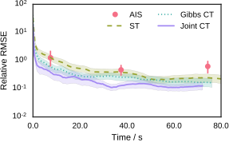

  

    <h1 class='title-heading'> 
      Continuously tempered Hamiltonian Monte Carlo
    </h1>
  

**Matt Graham &lt;[matt-graham.github.io](http://matt-graham.github.io)&gt;**  
*Joint work with Amos Storkey*

---

### TL;DR

  * Simple tempered dynamics extension to Hamiltonian Monte Carlo using continuous temperature variable. <!-- .element: class="fragment" data-fragment-index="1" -->
  * Improves exploration of multimodal target distributions and allows estimation of normalising constants. <!-- .element: class="fragment" data-fragment-index="2" -->
  * Straightforward to use in existing HMC implementations. <!-- .element: class="fragment" data-fragment-index="3" -->

----

<!-- .slide: data-background-image="images/2d-density-mcmc-0.svg" data-state="dim-bg" -->

### Task

Given a (unnormalised) target density on $\vct{x} \in \set{X} \subseteq \reals^D$ <!-- .element: class="fragment" data-fragment-index="1" -->

\[
  \tgtden{\vct{x}} \propto \exp\lpa-\phi(\vct{x})\rpa,  
\] <!-- .element: class="fragment" data-fragment-index="1" -->

how can we estimate expectations with respect to $\pi$  <!-- .element: class="fragment" data-fragment-index="2" -->

\[
  \mathbb{E}\_{\pi} \lsb f \rsb = \int\_{\set{X}} f(\vct{x}) \,\tgtden{\vct{x}} \,\dr\vct{x}
\] <!-- .element: class="fragment" data-fragment-index="2" -->

and the unknown normalising constant of the density <!-- .element: class="fragment" data-fragment-index="3" -->

\[
  Z = \int_{\set{X}} \exp\lpa-\phi(\vct{x})\rpa \,\dr\vct{x} ?
\] <!-- .element: class="fragment" data-fragment-index="3" -->

Note:

Specific problem I will be considering is performing approximate inference with high-dimensional densities with a potentially large number of separated modes. 

To be concrete with notation, the task I will be considering is, given a usually unnormalised density defined by a potential function $\phi$ over a $D$-dimensional real valued state space, *click* can we both compute expectations of functions $f$ with respect to the target *click* and further can we estimate the normalising constant of the density. 

----

<!-- .slide: data-background-image="images/2d-density-mcmc-1.svg" -->

  

    <h3> 
      Markov chain Monte Carlo
    </h3>
  

----

<!-- .slide: data-background-image="images/2d-density-mcmc-2.svg" -->

  <h3> 
    Markov chain Monte Carlo
  </h3>

---

<!-- .slide: data-background-video="images/2d-density-hmc.mp4" data-background-video-loop="true" data-state="dim-bg-video" -->

<h3 style='font-size: 110%;'>Hamiltonian Monte Carlo (HMC) Duane+ 1987</h3>

Auxiliary variable MCMC method - augments space with momentum. <!-- .element: class="fragment" data-fragment-index="1" -->

Simulate Hamiltonian dynamics in augmented space to generate proposed update. <!-- .element: class="fragment" data-fragment-index="2" -->

Accept or reject proposed update in Metropolis step. <!-- .element: class="fragment" data-fragment-index="3" -->

----

### Black-box inference with HMC

  

    
  

  

    
  

  * Long-range moves in high-dimensional $\set{X}$. <!-- .element: class="fragment" data-fragment-index="1" -->

  * Adaptive: No U-Turns Sampler (Hoffman & Gelman 2014).
<!-- .element: class="fragment" data-fragment-index="2" -->

  * However: <!-- .element: class="fragment" data-fragment-index="3" -->
    *  Poor performance in multimodal targets. <!-- .element: class="fragment" data-fragment-index="4" -->
    *  Non-trivial to use samples to estimate $Z$. <!-- .element: class="fragment" data-fragment-index="4" -->

---

<!-- .slide: data-background-image="images/bimodal-geometric-bridge-visualisation.svg" data-background-size="auto 95%" data-state="dim-bg" -->

### Thermodynamic methods

Introduce inverse temperature $\beta$<!-- .element: class="fragment" data-fragment-index="1" -->

and simple normalised <em>base density</em> $\exp\lpa-\psi(\vct{x})\rpa$. 

\[
  p\lpa \vct{x} \gvn \beta \rpa \propto
  \exp\lpa -\beta \phi(\vct{x}) - (1 - \beta) \psi(\vct{x}) \rpa
\] <!-- .element: class="fragment" data-fragment-index="3" -->

----

<!-- .slide: data-background-image="images/bimodal-geometric-bridge-visualisation.svg" data-background-size="auto 95%" -->

---

<!-- .slide: data-background-image="images/annealed-importance-sampling-0.svg" data-background-size="auto 95%"  -->

<h3 style='font-size: 110%;'>Annealed importance sampling (AIS) (Neal 2001)</small></h3>

----

<!-- .slide: data-background-image="images/annealed-importance-sampling-1.svg" data-background-size="auto 95%" -->

----

<!-- .slide: data-background-image="images/annealed-importance-sampling-2.svg" data-background-size="auto 95%" -->

----

<!-- .slide: data-background-image="images/annealed-importance-sampling-3.svg" data-background-size="auto 95%" -->

----

<!-- .slide: data-background-image="images/annealed-importance-sampling-4.svg" data-background-size="auto 95%" -->

----

<!-- .slide: data-background-image="images/annealed-importance-sampling-5.svg" data-background-size="auto 95%" -->

---

<!-- .slide: data-background-image="images/simulated-tempering-0.svg" data-background-size="auto 95%"  -->

<h3 style='font-size: 110%;'>Simulated tempering (ST) Marinari &amp; Parisi 1992</h3>

----

<!-- .slide: data-background-image="images/simulated-tempering-1.svg" data-background-size="auto 95%"  -->

----

<!-- .slide: data-background-image="images/simulated-tempering-2.svg" data-background-size="auto 95%"  -->

----

<!-- .slide: data-background-image="images/simulated-tempering-3.svg" data-background-size="auto 95%"  -->

----

<!-- .slide: data-background-image="images/simulated-tempering-4.svg" data-background-size="auto 95%"  -->

----

<!-- .slide: data-background-image="images/simulated-tempering-5.svg" data-background-size="auto 95%"  -->

----

<!-- .slide: data-background-image="images/simulated-tempering-6.svg" data-background-size="auto 95%"  -->

----

<!-- .slide: data-background-image="images/rb-simulated-tempering-0.svg" data-background-size="auto 95%"  -->

<h3 style='font-size: 100%;'>Rao-Blackwellized tempered sampling Carlson+ 2016</h3>

---

### Continuous tempering

Use continuous inverse temperature variable $\beta \in [0,1] \Rightarrow$

Avoid need to choose inverse temperature 'ladder'.

\[
  p(\vct{x},\beta) \propto \exp\lpa-\beta \lpa \phi(\vct{x}) + \log\zeta\rpa - (1- \beta)\psi(\vct{x})\rpa
\]<!-- .element: class="fragment" data-fragment-index="1" -->

$\log \zeta \approx \log Z$ $\Rightarrow$ $\frac{p(\beta=1)}{p(\beta=0)} \approx 1$

----

### Continuous tempering

Conditional density $\beta \gvn \vct{x}$ : truncated exponential

\[
  p(\beta\gvn\vct{x}) = \frac{\exp(-\beta \Delta(\vct{x}))\Delta(\vct{x})}{1- \exp(-\beta\Delta(\vct{x}))},
\]

\[
  \Delta(\vct{x}) = \phi(\vct{x}) + \log\zeta - \psi(\vct{x})
\]

Can generate independent samples from $p(\beta\gvn\vct{x})$.<!-- .element: class="fragment" data-fragment-index="1" -->

---

### Rao-Blackwellisation

If $\lbrace \vct{x}^{(s)} \rbrace_{s=1}^S$ samples from joint $p(\vct{x},\beta)$<!-- .element: class="fragment" data-fragment-index="1" -->

\[
  Z  \approx \sum_{s=1}^S \frac{p(\beta=1|\vct{x}^{(s)})}{p(\beta=0|\vct{x}^{(s)})} \,\zeta
\]<!-- .element: class="fragment" data-fragment-index="2" -->

\[
  \int\_{\set{X}} f(\vct{x})\,\pi(\vct{x})\,\dr\vct{x}  \approx \sum_{s=1}^S \frac{p(\beta=1|\vct{x}^{(s)}) \,f(\vct{x}^{(s)})}{p(\beta=1|\vct{x}^{(s)})}.
\]<!-- .element: class="fragment" data-fragment-index="3" -->

---

<!-- .slide: data-background-image="images/gibbs-continuous-tempering-0.svg" data-background-size="auto 95%"  -->

<h3 style='font-size: 110%;'>Gibbs continuous tempering (Gibbs-CT)</h3>

----

<!-- .slide: data-background-image="images/gibbs-continuous-tempering-1.svg" data-background-size="auto 95%"  -->

----

<!-- .slide: data-background-image="images/gibbs-continuous-tempering-2.svg" data-background-size="auto 95%"  -->

----

<!-- .slide: data-background-image="images/gibbs-continuous-tempering-3.svg" data-background-size="auto 95%"  -->

----

<!-- .slide: data-background-image="images/gibbs-continuous-tempering-4.svg" data-background-size="auto 95%"  -->

----

<!-- .slide: data-background-image="images/gibbs-continuous-tempering-5.svg" data-background-size="auto 95%"  -->

---

### Joint continuous tempering (joint-CT)

Jointly update $\beta$ and $\vct{x}$ with HMC? <!-- .element: class="fragment" data-fragment-index="1" -->

Reparameterise $\beta \in [0, 1] \to u \in \reals$ <!-- .element: class="fragment" data-fragment-index="2" -->

e.g. $\beta(u) = \frac{1}{1 + \exp(-u)}$ <!-- .element: class="fragment" data-fragment-index="3" -->

\[
  p(\vct{x},u) \propto \left|\pd{\beta}{u}\right| \exp\lpa\beta(u) \lpa \phi(\vct{x}) + \log\zeta \rpa - (1 - \beta(u)) \psi(\vct{x})\rpa 
\]

---

<!-- .slide: data-background-image="images/joint-continuous-tempering-0.svg" data-background-size="auto 95%"  -->

<h3 style='font-size: 110%;'>Joint continuous tempering (joint-CT)</h3>

----

<!-- .slide: data-background-image="images/joint-continuous-tempering-1.svg" data-background-size="auto 95%"  -->

----

<!-- .slide: data-background-image="images/joint-continuous-tempering-2.svg" data-background-size="auto 95%"  -->

----

<!-- .slide: data-background-image="images/joint-continuous-tempering-3.svg" data-background-size="auto 95%"  -->

----

<!-- .slide: data-background-image="images/joint-continuous-tempering-4.svg" data-background-size="auto 95%"  -->

---

<!-- .slide: data-background-image="images/fitting-base-distribution-0.svg"  data-state="dim-bg"-->

### Choosing a base density

Important in determining how flat $p(\beta)$ is.<!-- .element: class="fragment" data-fragment-index="1" -->

Ideally $\exp\lpa-\phi(\vct{x})\rpa \approx \zeta \exp\lpa-\psi(\vct{x})\rpa$.<!-- .element: class="fragment" data-fragment-index="2" -->

Smaller $\mathbb{D}_{\textrm{KL}}\lsb \exp\lpa-\psi(\vct{x})\rpa \,\Vert\, \frac{1}{Z}\exp\lpa-\phi(\vct{x})\rpa\rsb$ $\Rightarrow$ flatter $p(\beta)$.<!-- .element: class="fragment" data-fragment-index="3" -->

----

<!-- .slide: data-background-image="images/fitting-base-distribution-1.svg" -->

  
 
    $\exp\lpa-\psi(\vct{x})\rpa =$ prior?
  

----

<!-- .slide: data-background-image="images/fitting-base-distribution-2.svg" -->

  
 
    $\exp\lpa-\psi(\vct{x})\rpa =$ Gaussian variational approximation?
  

----

<!-- .slide: data-background-image="images/fitting-base-distribution-3.svg" -->

  
 
    $\exp\lpa-\psi(\vct{x})\rpa =$ mixture of approximations?
  

----

<!-- .slide: data-background-image="images/fitting-base-distribution-4.svg" -->

  
 
    $\exp\lpa-\psi(\vct{x})\rpa =$ Gaussian moment-matched to mixture of approximations?
  

---

<!-- .slide: data-background-video="images/20d-bmr-example-1.mp4" data-background-video-loop="true" -->

### Boltzmann machine relaxations 

Continuous relaxation of Boltzmann machine corresponding to structure Gaussian mixture model (Zhang+ 2012).

10 generated frustrated 30-unit systems - highly multimodal.<!-- .element: class="fragment" data-fragment-index="2" -->

Ground truth for $Z$ and $\expc{\vct{x}}$ by exhaustive summation.<!-- .element: class="fragment" data-fragment-index="3" -->

Base density: Gaussian moment matched to mixture of mean-field approximations.<!-- .element: class="fragment" data-fragment-index="4" -->

----

### Boltzmann machine relaxation results

\[ \log Z \]

----

### Boltzmann machine relaxation results

\[ \expc{\vct{x}} \]

---

<!-- .slide: data-background-image="images/omniglot-samples.png" data-background-size="contain" data-state="dim-bg" -->

### OMNIGLOT IWAE marginal likelihood 

Importance weighted autoencoder (Burda+ 2016) trained on binarised OMNIGLOT dataset.

Estimate log marginal likelihood of 1000 *generated* images under trained decoder model (1000$\times$50 latent dimensions).

Use bidirectional Monte Carlo  (Grosse+ 2015) to stochastically upper/lower bound log marginal likelihood.

Base density: Gaussian approximate latent posteriors from trained encoder model (Wu+ 2017).

----

### IWAE marginal likelihood results

---

### Hierarchical regression model 

Hierarchical linear regression model applied to household Radon measurement dataset (Gelman & Hill 2006).

919 data points and 92 free parameters.

Use ADVI (Kucukelbir+ 2016) to fit base density.

Use NUTS (Hoffman & Gelman 2014) in augmented space.

----

### Hierarchical regression model results

---

### Conclusions

  * Thermodynamic HMC augmentation which improves mode-hopping and allows estimation of $Z$.<!-- .element: class="fragment" data-fragment-index="1" -->
  * Easily used within existing HMC implementations.<!-- .element: class="fragment" data-fragment-index="2" -->
  * Exploits cheap deterministic approximations to $\pi(\vct{x})$ while still allowing asymptotic exactness.<!-- .element: class="fragment" data-fragment-index="3" -->

---

### Acknowledgements

   

     
     
<small>Amos Storkey</small>

  

   
   

       Doctoral Training Centre in Neuroinformatics and Computational Neuroscience
   
 

   
   
    

---

## Thanks for listening. 
## Any questions?

 

<i class="fa fa-github fa-fw"></i> http://git.io/cthmc

---

### References

<ul style='font-size: 50%;'>
  
  <li>
  Hybrid Monte Carlo.  
  *Physics Letters B*, Duane, Kennedy, Pendleton & Roweth (1987).  
  </li>
  <li>
  The No-U-turn sampler: adaptively setting path lengths in Hamiltonian Monte Carlo.  
  *JMLR*, Hoffman & Gelman (2014).  
  </li>
  <li>
  Annealed importance sampling.  
  *Statistics and Computing*, Neal (2001).  
  </li>
  <li>
  Simulated tempering: a new Monte Carlo scheme.  
  *Europhysics Letters*, Marinari and Parsi (1992).
  </li>
  <li>
  Partition functions from Rao-Blackwellized tempered sampling.   
  *ICML*, Carlson, Stinson, Pakman and Paninski (2016). 
  </li>
  <li>
  Continuous relaxations for discrete Hamiltonian Monte Carlo.   
  *NIPS*, Zhang, Ghahramani, Storkey and Sutton (2012).
  </li>
  <li>
  Importance weighted autoencoders   
  *ICLR*, Burda, Grosse and Salakhutdinov (2016).
  </li>
  <li>
  Sandwiching the marginal likelihood using bidirectional Monte Carlo.   
  *arXiv*, Grosse, Ghahramani and Adams (2015).
  <li>
  On the quantitative analysis of decoder-based generative models.   
  *ICLR*, Wu, Burda, Salakhutdinov and Grosse (2017).
  </li>
  <li>
  Data analysis using regression and multilevel/hierarchical models.  
  *Cambridge University Press*, Gelman and Hill (2006).
  </li>
  <li>Automatic differentiation variational inference.  
  *JMLR*, Kucukelbir, Tran, Ranganath, Gelman and Blei (2017).
  </li>
</ul>
