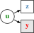
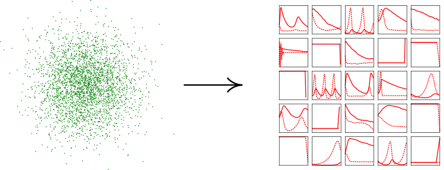
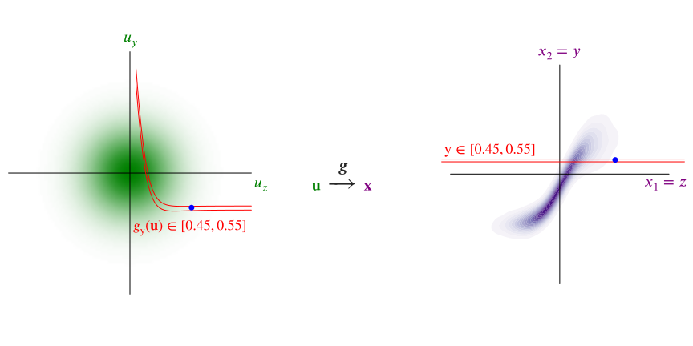
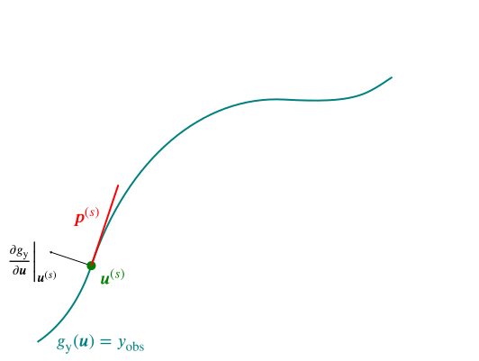
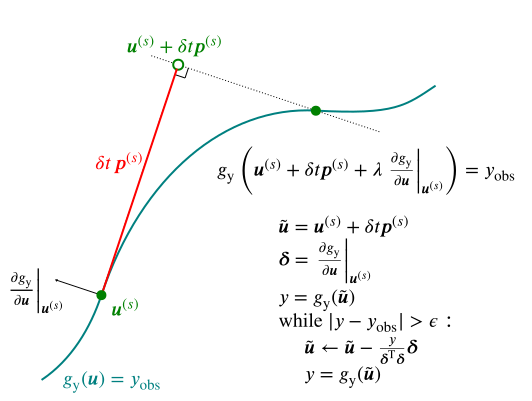
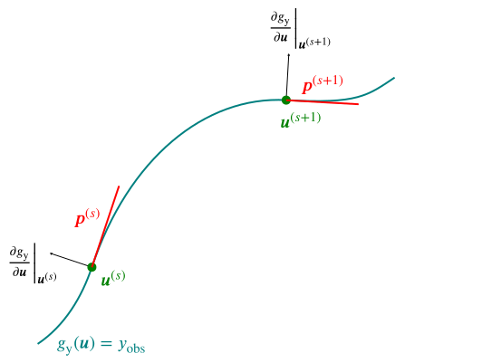
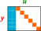
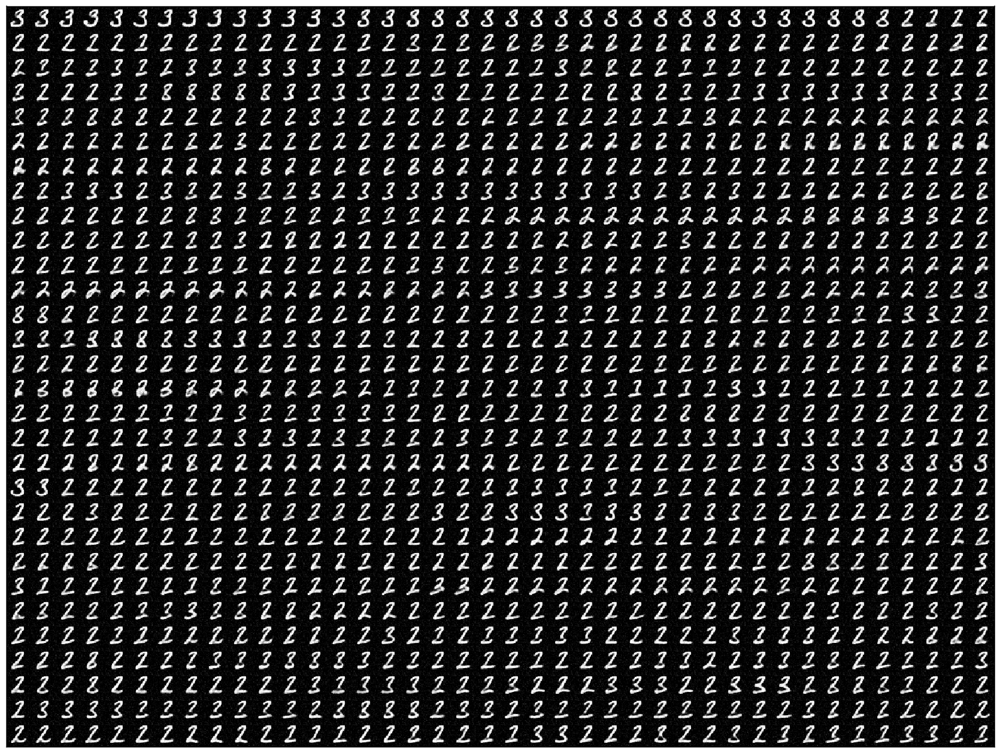

<h1 class='title-heading' style='font-size:140%;'> 
  Asymptotically exact inference in differentiable generative models
</h1>


   
<p style='font-size: 90%; font-weight: bold;'>
  Matt Graham &lt;[matt-graham.github.io](http://matt-graham.github.io)&gt;
</p>

<p style='font-size: 80%; font-style: italic;'>
  Joint work with Amos Storkey
</p>


---

### Problem description

<div class="fragment" data-fragment-index="0">

*Given:* Probabilistic model of 

<p>
    $\observed{\rvct{y}}$ <span class="observed">: observed variables $\in \observed{\set{Y}}$,</span>
</p>
<p>
    $\latent{\rvct{z}}$ <span class="latent">: latent variables $\in \latent{\set{Z}}$,</span>
</p>

</div>

<p class="fragment" data-fragment-index="1">
  where we can only generate $(\observed{\rvct{y}},\,\latent{\rvct{z}})$ pairs.	
</p>

<p class="fragment" data-fragment-index="2">
  *Task:* estimate conditional expectations
</p>

$$\expc{\,f(\latent{\rvct{z}}) \gvn \observed{\rvct{y} = \vct{y}\_{\textrm{obs}}}}.$$ <!-- .element: class="fragment" data-fragment-index="2" -->

---

### Differentiable generative models

Model defined by a differentiable *generator function* $\vctfunc{g}$
and *random inputs* $\input{\rvct{u}}$ drawn from a *base density* $\rho(\input{\vct{u}})$.

$$
  \input{\rvct{u}} \sim \rho
  \qquad
  \output{\rvct{x}} = \vctfunc{g}(\input{\rvct{u}})
  \qquad
  \output{\rvct{x}} = \left[\observed{\rvct{y}};\,\latent{\rvct{z}}\right]
$$

 <!-- .element: class="fragment" data-fragment-index="1" -->

Require that $\pd{\vctfunc{g}}{\input{\vct{u}}}$ exists almosts everywhere in $\input{\set{U}}$. <!-- .element: class="fragment" data-fragment-index="2" -->

----

### Directed and undirected models

<div>

<div class='half-column fragment' data-fragment-index='1'>
<p>*Undirected model*</p>

<div class='img-row'>


</div>

\begin{align}
  \latent{\rvct{z}} &= \vctfunc{g}\_{\latent{\rvct{z}}}(\input{\rvct{u}})\\\\
  \observed{\rvct{y}} &= \vctfunc{g}\_{\observed{\rvct{y}}}(\input{\rvct{u}})
\end{align}
</div>

<div class='half-column fragment' data-fragment-index='2'>
<p>*Directed model*</p>

<div class='img-row'>


</div>

\begin{align}
  \latent{\rvct{z}} &= \vctfunc{g}\_{\latent{\rvct{z}}}(\input{\rvct{u}\_{\rvct{z}}})\\\\
  \observed{\rvct{y}} &= \vctfunc{g}\_{\observed{\rvct{y}}}(\latent{\rvct{z}},\,\input{\rvct{u}\_{\rvct{y}}})
\end{align}
</div>

<div style='clear: both;'></div>

</div>

----

### Example: MNIST Variational Autoencoder decoder <small>Kingma and Welling, 2013</small>

$$
  \output{\rvct{x}} = 
  \vctfunc{m}(\input{\rvct{u}_1}) + 
  \vctfunc{s}(\input{\rvct{u}_1}) \odot \input{\rvct{u}_2}
$$<!-- .element: class="fragment" data-fragment-index="1" -->


----

### Example: Pose projection generator

$$
  \overset
  {\textrm{joint angles}}
  {\latent{\rvct{z}\_{a}} = \vctfunc{f}\_a(\input{\rvct{u}\_a})}
  \qquad
  \overset
  {\textrm{bone lengths}}
  {\latent{\rvct{z}\_{b}} = \vctfunc{f}\_b(\input{\rvct{u}\_b})}
  \qquad
  \overset
  {\textrm{camera parameters}}
  {\latent{\rvct{z}\_{c}} = \vctfunc{f}\_c(\input{\rvct{u}\_c})}
$$

$$
  \overset
  {\textrm{2D proj.}}
  {\observed{\rvct{y}_j}} = 
  \overset
  {\textrm{camera matrix}}
  {\mtxfunc{C}\lpa\latent{\rvct{z}_c}\rpa}
  \overset
  {\textrm{3D pos.}}{
  \vctfunc{r}_j\lpa
    \latent{\rvct{z}_a},\,
    \latent{\rvct{z}_b}
  \rpa} + 
  \overset
  {\textrm{obs. noise}}
  {\sigma\,\input{\rvct{u}_j}} 
  \quad\forall j \in \lbrace 1 \dots J \rbrace
$$ <!-- .element: class="fragment" data-fragment-index="2" -->


---

### Simulator models

Many simulators with continuous outputs can be expressed as directed differentiable generative models. <!-- .element: class="fragment" data-fragment-index="1" -->

Usually defined procedurally in code:<!-- .element: class="fragment" data-fragment-index="2" -->

```Python
def generator(rng):
    z = sample_from_prior(rng)
    y = simulate(z, rng)
    return y, z
```
<!-- .element: class="fragment" data-fragment-index="2" -->

----

### Example: Lotka-Volterra model


 

Continuous variant of model of prey ($\observed{y_1}$) and predator ($\observed{y_2}$) populations

$$
    \textrm{d} \observed{y_1} = 
    (\latent{z_1} \observed{y_1} - \latent{z_2} \observed{y_1 y_2}) \textrm{d} t + 
    \textrm{d} n_1
$$ <!-- .element: class="fragment" data-fragment-index="1" -->

$$
    \textrm{d} \observed{y_2} = 
    (-\latent{z_3} \observed{y_2} + \latent{z_4} \observed{y_1 y_2}) \textrm{d} t + 
    \textrm{d} n_2
$$ <!-- .element: class="fragment" data-fragment-index="1" -->

where $n_1$ and $n_2$ are white noise processes. <!-- .element: class="fragment" data-fragment-index="1" -->

----

### Example: Lotka-Volterra model

Simulate at $T$ discrete time-steps

```Python
def sample_from_prior(rng):
    return np.exp(rng.normal(size=4) - mu)
    
def simulate(z, rng):
    y1_seq, y2_seq = [], []
    y1, y2 = y1_init, y2_init
    for t in range(T):
        y1 += ( z[0]*y1 - z[1]*y2) * dt + rng.normal()*dt**0.5
        y2 += (-z[2]*y2 + z[3]*y1) * dt + rng.normal()*dt**0.5
        y1_seq.append(y1)
        y2_seq.append(y2)
    return np.array(y1_seq), np.array(y2_seq)
```
<!-- .element: class="fragment" data-fragment-index="1" -->


$$
    \input{\rvct{u}} = 
    \lsb \input{\textrm{random number generator draws}} \rsb
$$  <!-- .element: class="fragment" data-fragment-index="2" -->

$$
    \output{\rvct{x}} = 
    \lsb 
      \observed{
        \rvar{y}^{(1)}_1,\,\rvar{y}^{(1)}_2,
        \,\dots\,
        \rvar{y}^{(T)}_1,\,\rvar{y}^{(T)}_2
      }
      ;\, 
      \latent{
        \rvar{z_1},\,\rvar{z_2},\,\rvar{z_3},\,\rvar{z_4}
      } 
    \rsb
$$ <!-- .element: class="fragment" data-fragment-index="2" -->

----

### Example: Lotka-Volterra model



---

### Calculating derivatives


How do we propagate derivatives through complex generative models / simulators?

<div class="fragment" data-fragment-index="1">
  <p>Reverse mode automatic differentation</p>
  
  
  
</div>

---

<!-- .slide: data-transition="none" -->
### Toy example

 

----

<!-- .slide: data-transition="none" -->
### Toy example

 

----

<!-- .slide: data-transition="none" -->
### ABC in input space

 

----

<!-- .slide: data-transition="none" -->
### ABC in input space

 

----

<!-- .slide: data-transition="none" -->
### ABC in input space

 

---

<!-- .slide: data-transition="none" -->
### (Pseudo-marginal) ABC MCMC

Perturbatively update $\latent{\rvct{z}}$, independently sample $\observed{\rvct{y}}\gvn\latent{\rvct{z}}$

 

----

<!-- .slide: data-transition="none" -->
### (Pseudo-marginal) ABC MCMC

Perturbatively update $\latent{\rvct{z}}$, independently sample $\observed{\rvct{y}}\gvn\latent{\rvct{z}}$

 

---

### ABC expectations in input space

ABC approximates expectations by introducing *kernel* e.g.

\begin{equation}
k\_{\epsilon}\lpa\,\observed{\vct{y}\_{\textrm{obs}}};\,\observed{\vct{y}}\rpa
\propto
\mathbb{I}\lsb \left|\observed{\vct{y}\_{\textrm{obs}}} - \observed{\vct{y}}| < \epsilon\right|\rsb / \epsilon^{N\_y}
\end{equation}<!-- .element: class="fragment current-visible" data-fragment-index="1" -->

\begin{equation}
  \expc{\,f(\latent{\rvct{z}}) \gvn \observed{\rvct{y} = \vct{y}\_{\textrm{obs}}}} \approx \\\\
  \frac{1}{C}
  \int\_{\latent{\set{Z}}}\int\_{\observed{\set{Y}}}
    \hspace{-0.2em}
    f(\latent{\vct{z}})\,
    k\_{\epsilon}\lpa\,
      \observed{\vct{y}\_{\textrm{obs}}};\,
      \observed{\vct{y}}
    \rpa
    \pden{\observed{\rvct{y} = \vct{y}\_{\textrm{obs}}},\,
          \latent{\rvct{z} = \vct{z}}}\,
  \dr\observed{\vct{y}}\,\dr\latent{\vct{z}}
\end{equation}<!-- .element: class="fragment" data-fragment-index="2" -->

Using LOTUS expectations can be rewritten as<!-- .element: class="fragment" data-fragment-index="3" -->

\begin{equation}
  \expc{\,f(\latent{\rvct{z}}) \gvn \observed{\rvct{y} = \vct{y}\_{\textrm{obs}}}} \approx
  \frac{1}{C}
  \int\_{\input{\set{U}}}
    \hspace{-0.2em}
    f \circ \vctfunc{g}\_{\latent{\rvct{z}}}(\input{\vct{u}})\,
    \rho(\input{\vct{u}})\,
    k\_{\epsilon}\lpa\,
      \observed{\vct{y}\_{\textrm{obs}}};\,
      \vctfunc{g}\_{\observed{\rvct{y}}}(\input{\vct{u}})
    \rpa
  \dr\input{\vct{u}}
\end{equation}<!-- .element: class="fragment" data-fragment-index="3" -->

----

<!-- .slide: data-transition="none" -->
### $\epsilon \to 0$ : conditioning as a constraint

 

----

### Asymptotically exact inference

<div class="fragment" data-fragment-index="0" style='padding-bottom: 1em;'>
Define a manifold embedded in input space

$$
  \set{M}\_{\observed{\vct{y}\_{\textrm{obs}}}} = \lbr \input{\vct{u}} \in \input{\set{U}} : \vctfunc{g}\_{\observed{\rvct{y}}}(\input{\vct{u}}) = \observed{\vct{y}\_{\textrm{obs}}} \rbr.
$$
</div>

<div class="fragment" data-fragment-index="1">
Conditional expectations correspond to integrals over $\set{M}\_{\observed{\vct{y}\_{\textrm{obs}}}}$

\begin{equation}
  \expc{\,f(\latent{\rvct{z}}) \gvn \observed{\rvct{y} = \vct{y}\_{\textrm{obs}}}} = \\\\
  \frac{1}{C}
  \int\_{\set{M}\_{\observed{\vct{y}\_{\textrm{obs}}}}}
    \hspace{-0.2em}
    f \circ \vctfunc{g}\_{\latent{\rvct{z}}}(\input{\vct{u}})\,
    \rho(\input{\vct{u}})\,
    \left| 
      \pd{\vctfunc{g}\_{\observed{\rvct{y}}}}{\input{\vct{u}}}
      \pd{\vctfunc{g}\_{\observed{\rvct{y}}}}{\input{\vct{u}}}^{\rm{T}}
    \right|^{-\frac{1}{2}} 
  \mathcal{H}\_{\mathcal{M}\_{\observed{\vct{y}\_{\textrm{obs}}}}}\hspace{-0.2em}{\lbr\dr\input{\vct{u}}\rbr}
\end{equation}

<small style='font-size: 80%;'>(Diaconis, Holmes & Shahshahani; 2013)</small>
</div>

----

### Asymptotically exact inference

If we can sample $\lbr \input{\vct{u}^{(s)}} \rbr_{s=1}^S$ from a Markov chain such that:

<p class="fragment" data-fragment-index="1"> all samples are restricted to $\set{M}\_{\observed{\vct{y}\_{\textrm{obs}}}}$, </p>

<p class="fragment" data-fragment-index="2">
  and stationary distribution has density proportional to $\pi(\input{u}) \propto \rho(\input{\vct{u}})\,
    \left| 
      \pd{\vctfunc{g}\_{\observed{\rvct{y}}}}{\input{\vct{u}}} 
      \pd{\vctfunc{g}\_{\observed{\rvct{y}}}}{\input{\vct{u}}}\tr
    \right|^{-\frac{1}{2}} $,
</p>

<div class="fragment" data-fragment-index="3">
then we can calculate consistent estimators

$$
  \expc{\,f(\latent{\rvct{z}}) \gvn \observed{\rvct{y} = \vct{y}\_{\textrm{obs}}}} = 
  \lim\_{S \to \infty} \frac{1}{S} \sum\_{s=1}^S \lbr f \circ {\vctfunc{g}\_{\latent{\rvct{z}}}}\lpa\input{\vct{u}^{(s)}}\rpa \rbr.
$$
</div>

---

### Constrained Hamiltonian Monte Carlo <small>Hartmann and Schutte, 2005; Leli&egrave;vre, 2012; Brubaker et al. 2012</small>

Use simulated constrained Hamiltonian dynamic to propose moves on implicitly defined embedded manifold $\set{M}\_{\observed{\vct{y}\_{\textrm{obs}}}}$. <!-- .element: class="fragment" data-fragment-index="1" -->

$$
  \td{\input{\vct{u}}}{t} = \vct{p}
  \qquad
  \td{\vct{p}}{t} = \pd{\log \pi}{\input{\vct{u}}} - \pd{\vctfunc{g}\_{\observed{\rvct{y}}}}{\input{\vct{u}}}\tr\vct{\lambda}
$$ <!-- .element: class="fragment" data-fragment-index="2" -->

subject to $\vctfunc{g}\_{\observed{\rvct{y}}}(\input{\vct{u}}) = \observed{\vct{y}\_{\textrm{obs}}}$ and $\pd{\vctfunc{g}\_{\observed{\rvct{y}}}}{\input{\vct{u}}}\vct{p} = \vct{0}$. <!-- .element: class="fragment" data-fragment-index="2" -->

<p class="fragment" data-fragment-index="3">Integrators such as RATTLE <small style='font-size: 80%;' >(Andersen, 1983)</small> time-reversible and measure preserving <small style='font-size: 80%;' >(Leimkuhler and Skeel, 1994)</small>.</p>

----

### Constrained HMC in toy example

<video controls loop>
  <source data-src="images/chmc-animation-io.mp4" type="video/mp4" />
</video>

---

### Lotka-Volterra parameter inference

<div class='fragment' data-fragment-index='1' style='padding-bottom: 1em;'>
$\input{\rvct{u} = [\rvct{u}\_{\mathrm{z}};\, \rvct{u}\_{\mathrm{y}}]}$ with $\rho(\input{\vct{u}}) = \mathcal{N}\lpa\input{\vct{u}};\,\vct{0},\,\mtx{I}\rpa$
</div>

<div class='fragment' data-fragment-index='2' style='padding-bottom: 1em;'>
$\vctfunc{g}\_{\latent{\rvct{z}}}(\input{\vct{u}\_{\rvct{z}}}) = \exp(\input{\vct{u}\_{\rvct{z}}} - \vct{\mu})$  
$\latent{\rvct{z} = [ z_1,\, z_2,\, z_3,\, z_4]}$
</div>

<div class='fragment' data-fragment-index='3' style='padding-bottom: 1em;'>
$\vctfunc{g}\_{\observed{\rvct{y}}}(\latent{\vct{z}},\,\input{\vct{u}_{\rvct{y}}})$: Euler-Maruyama integration of SDEs  

$\observed{\rvct{y} = [ \rvar{y}_1^{(1)}, \, \rvar{y}_2^{(1)},\,\dots \rvar{y}_1^{(50)},\, \rvar{y}_2^{(50)} ]}$
</div>

<p class='fragment' data-fragment-index='4' style='padding-bottom: 1em;'>
Compare to ABC MCMC approach using pseudo-marginal slice sampling <small>(Murray and Graham, 2016)</small>.
</p>

----

### Lotka-Volterra parameter inference

 

----

### Lotka-Volterra parameter inference


----

### Lotka-Volterra parameter inference


---

### Pose inference

<video autoplay loop width="300" height="300" >
  <source data-src="images/pose-prior-small.mp4" type="video/mp4" />
</video>

<video autoplay loop width="300" height="300" >
  <source data-src="images/pose-hand-constrained-anim-1-small.mp4" type="video/mp4" />
</video>

<video autoplay loop width="300" height="300" >
  <source data-src="images/pose-hand-constrained-anim-2-small.mp4" type="video/mp4" />
</video>

----

### Binocular pose estimation

<br />


---

### Conclusions

  * Inference method for differentiable generative models.  <!-- .element: class="fragment" data-fragment-index="1" -->
  * Consider conditioning as constraint on inputs. <!-- .element: class="fragment" data-fragment-index="2" -->
  * Use of gradients allows high-dimensional inference. <!-- .element: class="fragment" data-fragment-index="3" -->
  * Asymptotically exact alternative to ABC where applicable. <!-- .element: class="fragment" data-fragment-index="4" -->

---

<!-- .slide: style="font-size: 70%" -->

<h3 style='font-size: 200%;'>References</h3>
   
*  H. C. Andersen.  
   RATTLE: A 'velocity' version of the SHAKE algorithm for molecular dynamics calculations.  
   *Journal of Computational Physics.*, 1983.
   
*  M. A. Brubaker, M. Saelzmann, and R. Urtasun.  
   A family of MCMC methods on implicitly defined manifolds.  
   *AISTATS*, 2012.

*  P. Diaconis, S. Holmes and M. Shahshahani.  
   Sampling from a Manifold.  
   *Advances in Modern Statistical Theory and Applications*, 2013.

*  I. Murray and M. M. Graham.  
   Pseudo-marginal slice sampling.  
   *AISTATS*, 2016.

----

<!-- .slide: style="font-size: 70%" -->

<h3 style='font-size: 200%;'>References</h3>

*  C. Hartmann and C. Schutte.  
   A constrained hybrid Monte Carlo algorithm and the problem of calculating the free energy in several variables.  
   *ZAMM-Zeitschrift f&uuml;r Angewandte Mathematik*, 2005.
   
*  D. P. Kingma and M. Welling.  
   Auto-encoding variational Bayes.  
   *ICLR*, 2014.
   
*  B. J. Leimkuhler and R. D. Skeel.  
   Symplectic numerical integrators in constrained Hamiltonian systems.  
   *Journal of Computational Physics*, 1994.
   
*  T. Leli&egrave;vre, M. Rousset and G. Stoltz.  
   Langevin dynamics with constraints and computation of free energy differences.  
   *Mathematics of Computation*, 2012.

---

### Acknowledgements


<div style='display: inline-block; padding: 10px;'>
   
   <div><small>Amos Storkey</small></div>
</div>


<div style='display: inline-block;'>
   
   <div style='display: inline-block; width: 200px; vertical-align: middle; text-transform: uppercase; font-size: 35%;'>
       Doctoral Training Centre in Neuroinformatics and Computational Neuroscience
   </div> 
</div>

<div>
   
   
    
</div>

---

## Thanks for listening. 
## Any questions?

<br />

<i class="fa fa-github fa-fw"></i> http://git.io/dgm

<i class="ai ai-arxiv fa-fw"></i> http://arxiv.org/abs/1605.07826

<i class="fa fa-file-o fa-fw"></i> Poster fP08

---

### Constrained step

 

----

### Constrained step

 

----

### Constrained step

 

----

### Constrained step

 

----

### Constrained step

 

----

### Constrained step

 

----

### Constrained step

 

----

### Constrained step

 

----

### Constrained step

 

----

### Constrained step

 

----

### Constrained step

 

---

### Alternative: Gaussian ABC + HMC

<div class="fragment" data-fragment-index="1" style='padding-bottom: 1em;'>
Gaussian ABC 'posterior' on $\input{\rvct{u}}$

$$\pden{\input{\rvct{u} = \vct{u}} \gvn \observed{\rvct{y} = \vct{y}\_{\textrm{obs}}}} \propto \exp\lbr -\frac{1}{2\epsilon^2}\left| \vctfunc{g}\_{\observed{\rvct{y}}}(\input{\vct{u}}) - \observed{\vct{y}\_{\textrm{obs}}} \right|^2 - \log \rho(\input{\vct{u}})\rbr$$
</div>

<div class="fragment" data-fragment-index="2" style='padding-bottom: 1em';>
Augment with Gaussian distributed momenta $\rvct{p}$

$$H(\input{\vct{u}},\,\vct{p}) = \frac{1}{2\epsilon^2} \left| \vctfunc{g}\_{\observed{\rvct{y}}}(\input{\vct{u}}) - \observed{\vct{y}\_{\textrm{obs}}} \right|^2 +  \log \rho(\input{\vct{u}}) + \frac{1}{2}\vct{p}\tr\vct{p}$$
</div>

<p style='font-size: 80%;' class="fragment" data-fragment-index="3">
cf. *Pseudo-Marginal Hamiltonian Monte Carlo*, Lindsten and Doucet, 2016; *Hamiltonian ABC*, Meeds, Leenders and Welling 2015.
</p>

----

### Gaussian ABC posterior in toy example


<div style='height: 100%'>

</div>

----

### Gaussian ABC + HMC in toy example

<video controls loop width="1080" height="540" >
  <source data-src="images/abc-hmc-animation-io.mp4" type="video/mp4" />
</video>

---

### Structure in generator Jacobian

<div>

<div class='half-column fragment' data-fragment-index='1'>
<p>*Independent*</p>

<div class='img-row'>


</div>

</div>

<div class='half-column fragment' data-fragment-index='2'>
<p>*Autoregressive*</p>

<div class='img-row'>


</div>

</div>

<div style='clear: both;'></div>

</div>


---

### MNIST in-painting

CHMC samples (consecutive)


HMC samples (thinned by factor 40)


----

### MNIST in-painting


