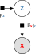
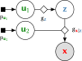

<h1 class='title-heading' style='font-size:140%;'>
  Inference in differentiable   generative models
</h1>

  Matt Graham &lt;[matt-graham.github.io](http://matt-graham.github.io)&gt;

  Joint work with Amos Storkey

---

### Problem description and notation

*Given:* Probabilistic model of

    $\observed{\rvct{x}}$ : observed variables $\in \observed{\set{X}}$,

    $\latent{\rvct{z}}$ : latent variables $\in \latent{\set{Z}}$.

  *Task:* estimate conditional expectations

$$\expc{\,f(\latent{\rvct{z}}) \gvn \observed{\rvct{x} = \obs{\vct{x}}}}.$$ <!-- .element: class="fragment" data-fragment-index="2" -->

---

### Probabilistic model specification

*Factor graph*

\begin{align}
  \latent{\rvct{z}} &\sim \pden{\latent{\rvct{z}}}\\\\
  \observed{\rvct{x}} \gvn \latent{\rvct{z}}  &\sim
  \pden{\observed{\rvct{x}}|\latent{\rvct{z}}}
\end{align}

*Probabilistic program*

<pre style='overflow: hidden;'>
<code data-trim data-noescape> 
def generate_z(rng):
    # ...
    return z
   
def generate_x_gvn_z(rng, z):
    # ...
    return x
  
def generate_x(rng):
    z = generate_z(rng)
    x = generate_x_gvn_z(
            rng, z)
    return x
</code>
</pre>

*Computation graph*

\begin{align}
  \latent{\rvct{z}} &= \vctfunc{g}\_{\latent{\rvct{z}}}(\input{\rvct{u}\_1})\\\\
  \observed{\rvct{x}} &= \vctfunc{g}\_{\observed{\rvct{x}}|\latent{\rvct{z}}}(\input{\rvct{u}\_2},\, \latent{\rvct{z}})
\end{align}

---

### Generative models

A generative model can be expressed in the form

$$
  \input{\rvct{u}} \sim \pden{\input{\rvct{u}}}
  \qquad
  \latent{\rvct{z}} = \vctfunc{g}\_{\latent{\rvct{z}}}(\input{\rvct{u}})
  \qquad
  \observed{\rvct{x}} = \vctfunc{g}\_{\observed{\rvct{x}}}(\input{\rvct{u}})
$$

$$
 \input{\rvct{u}} = (\input{\rvct{u}\_1}, \input{\rvct{u}\_2}) \qquad
 \vctfunc{g}\_{\observed{\rvct{x}}}(\input{\rvct{u}}) = \vctfunc{g}\_{\observed{\rvct{x}}|\latent{\rvct{z}}}(\input{\rvct{u}\_2}, \vctfunc{g}\_{\latent{\rvct{z}}}(\input{\rvct{u}\_1}))
$$<!-- .element: class="fragment current-visible" data-fragment-index="1" -->

Often $\pden{\observed{\rvct{x}},\latent{\rvct{z}}}$ not explicitly defined. How to perform inference? <!-- .element: class="fragment" data-fragment-index="2" -->

---

### Differentiable generative models

Concentrate on restricted case where

  * variables real-valued: $\input{\set{U}} \subseteq \reals^{D\_{\input{\rvct{u}}}}$, $\observed{\set{X}} \subseteq \reals^{D\_{\observed{\rvct{x}}}}$, $\latent{\set{Z}} \subseteq \reals^{D\_{\latent{\rvct{z}}}}$, <!-- .element: class="fragment" data-fragment-index="1" -->
  * input density $\pden{\input{\rvct{u}}}$ defined wrt Lebesgue measure on $\input{\set{U}}$, <!-- .element: class="fragment" data-fragment-index="2" -->
  * input density gradient $\pd{\pden{\input{\rvct{u}}}}{\input{\vct{u}}}$ exists almost everywhere, <!-- .element: class="fragment" data-fragment-index="3" -->
  * generator Jacobian $\pd{\vctfunc{g}\_{\observed{\rvct{x}}}}{\input{\vct{u}}}$ exists almost everywhere. <!-- .element: class="fragment" data-fragment-index="4" -->

---

<!-- .slide: data-transition="none" -->
<h3 style='font-size: 120%;'>Inference in generative models?</h3>

----

<!-- .slide: data-transition="none" -->
<h3 style='font-size: 120%;'> Approximate Bayesian Computation (ABC) </h3>

----

<!-- .slide: data-transition="none" -->
<h3 style='font-size: 120%;'> Approximate Bayesian Computation (ABC) </h3>

----

<!-- .slide: data-transition="none" -->
<h3 style='font-size: 120%;'> Approximate Bayesian Computation (ABC) </h3>

---

<!-- .slide: data-transition="none" -->
### $\epsilon \to 0$ : conditioning as a constraint

Exactly conditioning on observations restricts inputs to a manifold embedded in input space

$$
  \vctfunc{g}\_{\observed{\rvct{x}}}^{-1}(\observed{\obs{\vct{x}}}) = \lbr \input{\vct{u}} \in \input{\set{U}} : \vctfunc{g}\_{\observed{\rvct{x}}}(\input{\vct{u}}) = \observed{\vct{x}} \rbr.
$$

----

### Asymptotically exact inference

Conditional expectations are integrals over $\vctfunc{g}\_{\observed{\rvct{x}}}^{-1}(\observed{\obs{\vct{x}}})$

\begin{equation}
  \expc{\,f(\latent{\rvct{z}}) \gvn \observed{\rvct{x} = \vct{x}}} = \\\\
  \frac{1}{C}
  \int\_{\vctfunc{g}\_{\observed{\rvct{x}}}^{-1}(\observed{\vct{x}})}
    f \circ \vctfunc{g}\_{\latent{\rvct{z}}}(\input{\vct{u}})\,
    \left|
      \pd{\vctfunc{g}\_{\observed{\rvct{x}}}}{\input{\vct{u}}}
      \pd{\vctfunc{g}\_{\observed{\rvct{x}}}}{\input{\vct{u}}}^{\rm{T}}
    \right|^{-\frac{1}{2}}\hspace{-0.2em}
    \pden{\input{\rvct{u}}}(\input{\vct{u}})\,
  \mathcal{H}^{D\_{\input{\rvct{u}}}-D\_{\observed{\rvct{x}}}}\lpa\dr\input{\vct{u}}\rpa
\end{equation}
 
with $\mathcal{H}^{D\_{\input{\rvct{u}}}-D\_{\observed{\rvct{x}}}}$ the Hausdorff measure on $\vctfunc{g}\_{\observed{\rvct{x}}}^{-1}(\observed{\obs{\vct{x}}})$.

<small style='font-size: 80%;'>(Diaconis, Holmes & Shahshahani; 2013)</small>

----

### Asymptotically exact inference

Sample states of a Markov chain $\lbr \input{\vct{u}^{(s)}} \rbr_{s=1}^S$ such that:

 the chain is restricted to $\vctfunc{g}\_{\observed{\rvct{x}}}^{-1}(\observed{\obs{\vct{x}}})$, 

  and its stationary distribution has density wrt $\mathcal{H}^{D\_{\input{\rvct{u}}}-D\_{\observed{\rvct{x}}}}$ $\pi(\input{\vct{u}}) = 
    \left|
      \pd{\vctfunc{g}\_{\observed{\rvct{x}}}}{\input{\vct{u}}}
      \pd{\vctfunc{g}\_{\observed{\rvct{x}}}}{\input{\vct{u}}}\tr
    \right|^{-\frac{1}{2}}\,
    \pden{\input{\rvct{u}}}(\input{\vct{u}}) $,

then we can calculate consistent estimators

$$
  \expc{\,f(\latent{\rvct{z}}) \gvn \observed{\rvct{x} = \vct{x}}} =
  \lim\_{S \to \infty} \frac{1}{S} \sum\_{s=1}^S \lbr f \circ {\vctfunc{g}\_{\latent{\rvct{z}}}}\lpa\input{\vct{u}^{(s)}}\rpa \rbr.
$$

---

### Constrained Hamiltonian Monte Carlo <small>Hartmann and Schutte, 2005; Leli&egrave;vre, 2012; Brubaker et al. 2012</small>

Use simulated constrained Hamiltonian dynamic to propose moves on implicitly defined embedded manifold $\vctfunc{g}\_{\observed{\rvct{x}}}^{-1}(\observed{\obs{\vct{x}}})$. <!-- .element: class="fragment" data-fragment-index="1" -->

$$
  \td{\input{\vct{u}}}{t} = \vct{p}
  \qquad
  \td{\vct{p}}{t} = \pd{\log \pi}{\input{\vct{u}}} - \pd{\vctfunc{g}\_{\observed{\rvct{x}}}}{\input{\vct{u}}}\tr\vct{\lambda}
$$ <!-- .element: class="fragment" data-fragment-index="2" -->

subject to $\vctfunc{g}\_{\observed{\rvct{x}}}(\input{\vct{u}}) = \observed{\obs{\vct{x}}}$ and $\pd{\vctfunc{g}\_{\observed{\rvct{x}}}}{\input{\vct{u}}}\vct{p} = \vct{0}$. <!-- .element: class="fragment" data-fragment-index="2" -->

Integrators such as RATTLE <small style='font-size: 80%;' >(Andersen, 1983)</small> time-reversible and measure preserving <small style='font-size: 80%;' >(Leimkuhler and Skeel, 1994)</small>.

----

### Constrained HMC in toy example

<video autoplay controls loop>
  <source data-src="images/chmc-animation-io-points.mp4" type="video/mp4" />
</video>

---

### Conclusions

  * Inference method for differentiable generative models.  <!-- .element: class="fragment" data-fragment-index="1" -->
  * Consider conditioning as constraint on inputs. <!-- .element: class="fragment" data-fragment-index="2" -->
  * Asymptotically exact alternative to ABC where applicable: tractable inference with $\epsilon \to 0$ and full observed data. <!-- .element: class="fragment" data-fragment-index="3" -->

---

## Thanks for listening.

 

Python code at <i class="fa fa-github fa-fw"></i> [git.io/dgm](http://git.io/dgm)

M. M. Graham and A. J. Storkey. Asymptotically exact inference in differentiable generative models.  
*Electronic Journal of Statistics*, 2017.  
[dx.doi.org/10.1214/17-EJS1340SI](http://dx.doi.org/10.1214/17-EJS1340SI)

Shorter *AISTATS* 2017 conference paper  <i class="ai ai-arxiv fa-fw"></i> [arxiv.org/abs/1605.07826](https://arxiv.org/abs/1605.07826)

---

<!-- .slide: style="font-size: 70%" -->

<h3 style='font-size: 200%;'>References</h3>

*  H. C. Andersen.
   RATTLE: A 'velocity' version of the SHAKE algorithm for molecular dynamics calculations.
   *Journal of Computational Physics.*, 1983.

*  M. A. Brubaker, M. Saelzmann, and R. Urtasun.
   A family of MCMC methods on implicitly defined manifolds.
   *AISTATS*, 2012.

*  P. Diaconis, S. Holmes and M. Shahshahani.
   Sampling from a Manifold.
   *Advances in Modern Statistical Theory and Applications*, 2013.

----

<!-- .slide: style="font-size: 70%" -->

<h3 style='font-size: 200%;'>References</h3>

*  C. Hartmann and C. Schutte.
   A constrained hybrid Monte Carlo algorithm and the problem of calculating the free energy in several variables.
   *ZAMM-Zeitschrift f&uuml;r Angewandte Mathematik*, 2005.

*  B. J. Leimkuhler and R. D. Skeel.
   Symplectic numerical integrators in constrained Hamiltonian systems.
   *Journal of Computational Physics*, 1994.

*  T. Leli&egrave;vre, M. Rousset and G. Stoltz.
   Langevin dynamics with constraints and computation of free energy differences.
   *Mathematics of Computation*, 2012.

----

<!-- .slide: style="font-size: 70%" -->

<h3 style='font-size: 200%;'>References</h3>

*  G. Deligiannidis, A. Doucet and M. K. Pitt. 
   The Correlated Pseudo-Marginal Method. 
   *arXiv pre-print*, 2015.
   
*  J. Dahlin, F. Lindsten, J. Kronander and T. B. Sch&ouml;n. 
   Accelerating pseudo-marginal Metropolis-Hastings by correlating auxiliary variables. 
   *arXiv pre-print*, 2015.

*  I. Murray and M. M. Graham. 
   Pseudo-marginal slice sampling. 
   *AISTATS*, 2016.

*  T. Leli&egrave;vre, M. Rousset and G. Stoltz. 
   Pseudo-Marginal Hamiltonian Monte Carlo. 
   *arXiv pre-print*, 2016.
