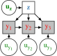

<h1 class='title-heading' style='font-size:140%;'> 
  Inference in implicit <br /> generative models
</h1>


   
<p style='font-size: 90%; font-weight: bold;'>
  Matt Graham &lt;[matt-graham.github.io](http://matt-graham.github.io)&gt;
</p>

<p style='font-size: 80%; font-style: italic;'>
  Joint work with Amos Storkey
</p>


---

### Problem description

<div class="fragment" data-fragment-index="0">

*Given:* Probabilistic model of 

<p>
    $\observed{\rvct{x}}$ <span class="observed">: observed variables $\in \observed{\set{X}}$,</span>
</p>
<p>
    $\latent{\rvct{z}}$ <span class="latent">: latent variables $\in \latent{\set{Z}}$.</span>
</p>

</div>

<p class="fragment" data-fragment-index="2">
  *Task:* estimate conditional expectations
</p>

$$\expc{\,f(\latent{\rvct{z}}) \gvn \observed{\rvct{x} = \vct{x}}}.$$ <!-- .element: class="fragment" data-fragment-index="2" -->

---

### Approximate inference

$$\expc{\,f(\latent{\rvct{z}}) \gvn \observed{\rvct{x} = \vct{x}}} = \int\_{\latent{\set{Z}}} f(\latent{\vct{z}})\, \frac{\pden{\latent{\rvct{z}},\observed{\rvct{x}}}(\latent{\vct{z}},\observed{\vct{x}})}{\pden{\observed{\rvct{x}}}(\observed{\vct{x}})}\,\dr\latent{\vct{z}} \propto \int\_{\latent{\set{Z}}} f(\latent{\vct{z}})\, \pi(\latent{\vct{z}})\,\dr\latent{\vct{z}}$$

<div>

<div class='half-column fragment' data-fragment-index='1'>
<p>*Markov chain Monte Carlo*</p>

  $$\expc{\,f(\latent{\rvct{z}}) \gvn \observed{\rvct{x} = \vct{x}}} \approx\\\\ \frac{1}{S}\sum\_{s=1}^S f(\latent{\vct{z}^{(s)}})$$

  $$ \pi(\latent{\vct{z}}) = \int\_{\latent{\set{Z}}} \mathsf{T}(\latent{\vct{z}}|\latent{\vct{z}'})\,\pi(\latent{\vct{z}'})\,\dr\latent{\vct{z}'}$$

</div>

<div class='half-column fragment' data-fragment-index='2'>
<p>*Variational inference*</p>

$$\expc{\,f(\latent{\rvct{z}}) \gvn \observed{\rvct{x} = \vct{x}}} \approx\\\\ \int\_{\latent{\set{Z}}} f(\latent{\vct{z}})\,q\_{\vct{\theta}} (\latent{\vct{z}})\,\dr\latent{\vct{z}}$$
<br />
$$ \min\_{\vct{\theta}} \mathbb{D}\_{\textrm{KL}}\lsb q\_{\vct{\theta}} \Vert \pi\rsb$$

</div>

<div style='clear: both;'></div>

</div>

---

### Generative models

Probabilistic models specified by a generative process.

<div  class="fragment" data-fragment-index="1">
Examples:

<ul>
  <li> Simulators of physical and biological processes. </li>
  <li> Models specified by differentiable networks (GANs, VAEs). </li>
  
</ul>

</div>

Often $\pden{\observed{\rvct{x}},\latent{\rvct{z}}}$ not explicitly defined. How to perform inference? <!-- .element: class="fragment" data-fragment-index="2" -->

---

### Generative models as transformations

Most (all?) generative models can be expressed in the form 

$$
  \input{\rvct{u}} \sim \rho
  \qquad
  \latent{\rvct{z}} = \vctfunc{g}\_{\latent{\rvct{z}}}(\input{\rvct{u}})
  \qquad
  \observed{\rvct{x}} = \vctfunc{g}\_{\observed{\rvct{x}}}(\input{\rvct{u}})
$$

where

<ul>
<li class="fragment" data-fragment-index="1">
  $\rho$ is density of distribution of *random inputs* $\input{\rvct{u}} \in \input{\set{U}}$,
</li>
<li class="fragment" data-fragment-index="2"> $\vctfunc{g}\_{\latent{\rvct{z}}} : \input{\set{U}} \to \latent{\set{Z}}$ and $\vctfunc{g}\_{\observed{\rvct{x}}} : \input{\set{U}} \to \observed{\set{X}}$ are *generator functions*. </li>
</ul>

----

### Directed and undirected models

<div>

<div class='half-column fragment' data-fragment-index='1'>
<p>*Undirected model*</p>

<div class='img-row'>
 
</div>

\begin{align}
  \latent{\rvct{z}} &= \vctfunc{g}\_{\latent{\rvct{z}}}(\input{\rvct{u}})\\\\
  \observed{\rvct{x}} &= \vctfunc{g}\_{\observed{\rvct{x}}}(\input{\rvct{u}})
\end{align}
</div>

<div class='half-column fragment' data-fragment-index='2'>
<p>*Directed model*</p>

<div class='img-row'>

</div>

\begin{align}
  \latent{\rvct{z}} &= \vctfunc{g}\_{\latent{\rvct{z}}}(\input{\rvct{u}\_1})\\\\
  \observed{\rvct{x}} &= \vctfunc{g}\_{\observed{\rvct{x}}|\latent{\rvct{z}}}(\input{\rvct{u}\_2},\, \latent{\rvct{z}})
\end{align}
</div>

<div style='clear: both;'></div>

</div>

---

### Differentiable generative models

Restricted case whereby

  * Variables real-valued $\input{\set{U}} \subseteq \reals^M$, $\observed{\set{X}} \subseteq \reals^{N\_{\rvct{x}}}$, $\latent{\set{Z}} \subseteq \reals^{N\_{\rvct{z}}}$
  * Input density gradient $\pd{\rho}{\input{\vct{u}}}$ exists almost everywhere,
  * Generator Jacobian $\pd{\vctfunc{g}\_{\observed{\rvct{x}}}}{\input{\vct{u}}}$ exists almost everywhere.

 <!-- .element: class="fragment" data-fragment-index="1" -->

---

### Example: Generalised Lambda

Distribution defined by quantile function

$f(q) = \lambda\_0 + \frac{1}{\lambda\_1}\lpa \frac{q^{\lambda\_2} - 1}{\lambda\_2} - \frac{(1-q)^{\lambda\_3} - 1}{\lambda\_3}\rpa$

<div class='fragment' data-fragment-index='1'>

Can be used to define a generative model  

$\input{\rvct{u} = [\rvct{u}\_1;\, \rvct{u}\_2]}$ with $\rho(\input{\vct{u}}) = \mathcal{N}\lpa\input{\vct{u}};\,\vct{0},\,\mtx{I}\rpa$

$\latent{\rvct{z}} = \lsb \sigma\_0 \input{\rvar{u}\_{1,0}} ,~ \sigma\_1\log\Phi(\input{\rvar{u}\_{1,1}}) ,~ \sigma\_2 \input{\rvar{u}\_{1,2}} ,~ \sigma\_3 \input{\rvar{u}\_{1,3}} \rsb\tr $

$\observed{\rvar{x}\_i} = \latent{\rvar{z}\_0} + \frac{1}{\latent{\rvar{z}\_1}} \lpa \frac{\Phi(\input{\rvar{u}\_{2,i}})^{\latent{\rvar{z}\_2}} - 1}{\latent{\rvar{z}\_2}} - \frac{\lpa 1 - \Phi(\input{\rvar{u}\_{2,i}})\rpa^{\latent{\rvar{z}\_3}} - 1}{\latent{\rvar{z}\_3}} \rpa $
</div>

Other quantile distributions include g-and-k, g-and-h. <!-- .element: class="fragment" data-fragment-index="2" -->


----

### Example: MNIST Variational Autoencoder decoder <small>Kingma and Welling, 2013</small>

<div class='fragment' data-fragment-index='1' style='padding-bottom: 1em;'>
$\input{\rvct{u} = [\rvct{u}\_1;\, \rvct{u}\_2]}$ with $\rho(\input{\vct{u}}) = \mathcal{N}\lpa\input{\vct{u}};\,\vct{0},\,\mtx{I}\rpa$

$$
  \output{\rvct{x}} = 
  \vctfunc{m}(\input{\rvct{u}_1}) + 
  \vctfunc{s}(\input{\rvct{u}_1}) \odot \input{\rvct{u}_2}
$$

</div>


----

### Example: Pose projection generator

$\input{\rvct{u} = [\rvct{u}\_a;\, \rvct{u}\_b;\, \rvct{u}\_c;\, \rvct{u}\_1 \,\dots\, \rvct{u}\_J]}$ with $\rho(\input{\vct{u}}) = \mathcal{N}\lpa\input{\vct{u}};\,\vct{0},\,\mtx{I}\rpa$

$$
  \overset
  {\textrm{joint angles}}
  {\latent{\rvct{z}\_{a}} = \vctfunc{f}\_a(\input{\rvct{u}\_a})}
  \qquad
  \overset
  {\textrm{bone lengths}}
  {\latent{\rvct{z}\_{b}} = \vctfunc{f}\_b(\input{\rvct{u}\_b})}
  \qquad
  \overset
  {\textrm{camera parameters}}
  {\latent{\rvct{z}\_{c}} = \vctfunc{f}\_c(\input{\rvct{u}\_c})}
$$

$$
  \overset
  {\textrm{2D proj.}}
  {\observed{\rvct{x}_j}} = 
  \overset
  {\textrm{camera matrix}}
  {\mtxfunc{C}\lpa\latent{\rvct{z}_c}\rpa}
  \overset
  {\textrm{3D pos.}}{
  \vctfunc{r}_j\lpa
    \latent{\rvct{z}_a},\,
    \latent{\rvct{z}_b}
  \rpa} + 
  \overset
  {\textrm{obs. noise}}
  {\sigma\,\input{\rvct{u}_j}} 
  \quad\forall j \in \lbrace 1 \dots J \rbrace
$$ <!-- .element: class="fragment" data-fragment-index="2" -->


---

### Simulator models

Many simulators with continuous outputs can be expressed as directed differentiable generative models. <!-- .element: class="fragment" data-fragment-index="1" -->

Usually defined procedurally in code:<!-- .element: class="fragment" data-fragment-index="2" -->

```Python
def generator(rng):
    z = sample_from_prior(rng)
    x = simulate(z, rng)
    return x, z
```
<!-- .element: class="fragment" data-fragment-index="2" -->

----

### Example: Lotka-Volterra model


 

Continuous variant of model of prey ($\observed{x_1}$) and predator ($\observed{x_2}$) populations

$$
    \textrm{d} \observed{x_1} = 
    (\latent{z_1} \observed{x_1} - \latent{z_2} \observed{x_1 x_2}) \textrm{d} t + 
    \textrm{d} n_1
$$ <!-- .element: class="fragment" data-fragment-index="1" -->

$$
    \textrm{d} \observed{x_2} = 
    (-\latent{z_3} \observed{x_2} + \latent{z_4} \observed{x_1 x_2}) \textrm{d} t + 
    \textrm{d} n_2
$$ <!-- .element: class="fragment" data-fragment-index="1" -->

where $n_1$ and $n_2$ are white noise processes. <!-- .element: class="fragment" data-fragment-index="1" -->

----

### Example: Lotka-Volterra model

Simulate at $T$ discrete time-steps

```Python
def sample_from_prior(rng):
    return np.exp(rng.normal(size=4) - mu)
    
def simulate(z, rng):
    x1_seq, x2_seq = [], []
    x1, x2 = x1_init, x2_init
    for t in range(T):
        x1 += ( z[0]*x1 - z[1]*x2) * dt + rng.normal()*dt**0.5
        x2 += (-z[2]*x2 + z[3]*x1) * dt + rng.normal()*dt**0.5
        x1_seq.append(x1)
        x2_seq.append(x2)
    return np.array(x1_seq), np.array(x2_seq)
```
<!-- .element: class="fragment" data-fragment-index="1" -->


$$
    \input{\rvct{u}} = 
    \lsb \input{\textrm{random number generator draws}} \rsb
$$  <!-- .element: class="fragment" data-fragment-index="2" -->

$$
    \observed{\rvct{x}} = 
    \lsb 
      \observed{
        \rvar{x}^{(1)}_1,\,\rvar{x}^{(1)}_2,
        \,\dots\,
        \rvar{x}^{(T)}_1,\,\rvar{x}^{(T)}_2
      }
   \rsb,
   \quad
   \latent{\rvct{z}} =
   \lsb
      \latent{
        \rvar{z_1},\,\rvar{z_2},\,\rvar{z_3},\,\rvar{z_4}
      } 
    \rsb
$$ <!-- .element: class="fragment" data-fragment-index="2" -->

----

### Example: Lotka-Volterra model


---

### Calculating derivatives


How do we propagate derivatives through complex generative models / simulators?

<div class="fragment" data-fragment-index="1">
  <p>Reverse mode automatic differentiation</p>
  
  
  
  
</div>

---

<!-- .slide: data-transition="none" -->
### Toy example

 

----

<!-- .slide: data-transition="none" -->
### Toy example

 

----

<!-- .slide: data-transition="none" -->
### ABC in input space

 

----

<!-- .slide: data-transition="none" -->
### ABC in input space

 

----

<!-- .slide: data-transition="none" -->
### ABC in input space

 

---

<!-- .slide: data-transition="none" -->
### (Pseudo-marginal) ABC MCMC

Perturbatively update $\latent{\rvct{z}}$, independently sample $\observed{\rvct{x}}\gvn\latent{\rvct{z}}$

 

----

<!-- .slide: data-transition="none" -->
### (Pseudo-marginal) ABC MCMC

Perturbatively update $\latent{\rvct{z}}$, independently sample $\observed{\rvct{x}}\gvn\latent{\rvct{z}}$

 

---

### ABC expectations in input space

ABC approximates expectations by introducing *kernel* e.g.

\begin{equation}
k\_{\epsilon}\lpa\,\observed{\vct{x}};\,\observed{\vct{y}}\rpa
\propto
\mathbb{I}\lsb \left|\observed{\vct{x}} - \observed{\vct{y}}| < \epsilon\right|\rsb / \epsilon^{N\_{\rvct{x}}}
\end{equation}<!-- .element: class="fragment current-visible" data-fragment-index="1" -->

\begin{equation}
  \expc{\,f(\latent{\rvct{z}}) \gvn \observed{\rvct{x} = \vct{x}}} \approx \\\\
  \frac{1}{C}
  \int\_{\latent{\set{Z}}}\int\_{\observed{\set{X}}}
    \hspace{-0.2em}
    f(\latent{\vct{z}})\,
    k\_{\epsilon}\lpa\,
      \observed{\vct{x}};\,
      \observed{\vct{y}}
    \rpa
    \pden{\observed{\rvct{x}},\latent{\rvct{z}}}(\observed{\vct{y}},\latent{\vct{z}})\,
  \dr\observed{\vct{y}}\,\dr\latent{\vct{z}}
\end{equation}<!-- .element: class="fragment" data-fragment-index="2" -->

ABC expectations can be rewritten as<!-- .element: class="fragment" data-fragment-index="3" -->

\begin{equation}
  \expc{\,f(\latent{\rvct{z}}) \gvn \observed{\rvct{x} = \vct{x}}} \approx
  \frac{1}{C}
  \int\_{\input{\set{U}}}
    \hspace{-0.2em}
    f \circ \vctfunc{g}\_{\latent{\rvct{z}}}(\input{\vct{u}})\,
    k\_{\epsilon}\lpa\,
      \observed{\vct{x}};\,
      \vctfunc{g}\_{\observed{\rvct{x}}}(\input{\vct{u}})
    \rpa\,
    \rho(\input{\vct{u}})\,
  \dr\input{\vct{u}}
\end{equation}<!-- .element: class="fragment" data-fragment-index="3" -->

----

### Alternative ABC MCMC operators

Construct an MCMC operator which leaves the distribution with density

$$\pi\_{\epsilon}(\vct{u}) = \frac{1}{C} k\_{\epsilon}\lpa\,
  \observed{\vct{x}};\,
  \vctfunc{g}\_{\observed{\rvct{x}}}(\input{\vct{u}})
\rpa\,
\rho(\input{\vct{u}}),$$

invariant, e.g. Hamiltonian Monte Carlo, slice sampling. 

For directed models we can maintain 'black-boxness' by alternating independent proposing updates to $\input{\rvct{u}\_2} \gvn \input{\rvct{u}\_1}$ and perturbatively updating $\input{\rvct{u}\_1} \gvn \input{\rvct{u}\_2}$. <!-- .element: class="fragment" data-fragment-index="1" -->

Perturbatively updating all variables in model however can give large gains in high dimensions.<!-- .element: class="fragment" data-fragment-index="2" -->


----

<!-- .slide: data-transition="none" -->
### $\epsilon \to 0$ : conditioning as a constraint

 

----

### Asymptotically exact inference

<div class="fragment" data-fragment-index="0" style='padding-bottom: 1em;'>
Define a manifold embedded in input space

$$
  \vctfunc{g}\_{\observed{\rvct{x}}}^{-1}[\observed{\vct{x}}] = \lbr \input{\vct{u}} \in \input{\set{U}} : \vctfunc{g}\_{\observed{\rvct{x}}}(\input{\vct{u}}) = \observed{\vct{x}} \rbr.
$$
</div>

<div class="fragment" data-fragment-index="1">
Conditional expectations are integrals over $\vctfunc{g}\_{\observed{\rvct{x}}}^{-1}[\observed{\vct{x}}]$
  
<div style='padding-top:10px'>
\begin{equation}
  \expc{\,f(\latent{\rvct{z}}) \gvn \observed{\rvct{x} = \vct{x}}} = \\\\
  \frac{1}{C}
  \int\_{\vctfunc{g}\_{\observed{\rvct{x}}}^{-1}[\observed{\vct{x}}]}
    f \circ \vctfunc{g}\_{\latent{\rvct{z}}}(\input{\vct{u}})\,
    \left| 
      \pd{\vctfunc{g}\_{\observed{\rvct{x}}}}{\input{\vct{u}}}
      \pd{\vctfunc{g}\_{\observed{\rvct{x}}}}{\input{\vct{u}}}^{\rm{T}}
    \right|^{-\frac{1}{2}}\hspace{-0.2em}
    \rho(\input{\vct{u}})\,
  \mathcal{H}^{M-N_{\rvct{x}}}\lpa\dr\input{\vct{u}}\rpa
\end{equation}
</div>

<small style='font-size: 80%;'>(Diaconis, Holmes & Shahshahani; 2013)</small>
</div>

----

### Asymptotically exact inference

If we can sample $\lbr \input{\vct{u}^{(s)}} \rbr_{s=1}^S$ from a Markov chain such that:

<p class="fragment" data-fragment-index="1"> all samples are restricted to $\vctfunc{g}\_{\observed{\rvct{x}}}^{-1}[\observed{\vct{x}}]$, </p>

<p class="fragment" data-fragment-index="2">
  and stationary distribution has density proportional to $\pi(\input{u}) \propto \rho(\input{\vct{u}})\,
    \left| 
      \pd{\vctfunc{g}\_{\observed{\rvct{x}}}}{\input{\vct{u}}} 
      \pd{\vctfunc{g}\_{\observed{\rvct{x}}}}{\input{\vct{u}}}\tr
    \right|^{-\frac{1}{2}} $,
</p>

<div class="fragment" data-fragment-index="3">
then we can calculate consistent estimators

$$
  \expc{\,f(\latent{\rvct{z}}) \gvn \observed{\rvct{x} = \vct{x}}} = 
  \lim\_{S \to \infty} \frac{1}{S} \sum\_{s=1}^S \lbr f \circ {\vctfunc{g}\_{\latent{\rvct{z}}}}\lpa\input{\vct{u}^{(s)}}\rpa \rbr.
$$
</div>

---

### Constrained Hamiltonian Monte Carlo <small>Hartmann and Schutte, 2005; Leli&egrave;vre, 2012; Brubaker et al. 2012</small>

Use simulated constrained Hamiltonian dynamic to propose moves on implicitly defined embedded manifold $\vctfunc{g}\_{\observed{\rvct{x}}}^{-1}[\observed{\vct{x}}]$. <!-- .element: class="fragment" data-fragment-index="1" -->

$$
  \td{\input{\vct{u}}}{t} = \vct{p}
  \qquad
  \td{\vct{p}}{t} = \pd{\log \pi}{\input{\vct{u}}} - \pd{\vctfunc{g}\_{\observed{\rvct{x}}}}{\input{\vct{u}}}\tr\vct{\lambda}
$$ <!-- .element: class="fragment" data-fragment-index="2" -->

subject to $\vctfunc{g}\_{\observed{\rvct{x}}}(\input{\vct{u}}) = \observed{\vct{x}}$ and $\pd{\vctfunc{g}\_{\observed{\rvct{x}}}}{\input{\vct{u}}}\vct{p} = \vct{0}$. <!-- .element: class="fragment" data-fragment-index="2" -->

<p class="fragment" data-fragment-index="3">Integrators such as RATTLE <small style='font-size: 80%;' >(Andersen, 1983)</small> time-reversible and measure preserving <small style='font-size: 80%;' >(Leimkuhler and Skeel, 1994)</small>.</p>

----

### Constrained HMC in toy example

<video controls loop>
  <source data-src="images/chmc-animation-io.mp4" type="video/mp4" />
</video>

---

### Alternative: Gaussian ABC + HMC

<div class="fragment" data-fragment-index="1" style='padding-bottom: 1em;'>
Gaussian ABC 'posterior' on $\input{\rvct{u}}$

$$\pden{\input{\rvct{u}} | \observed{\rvct{x}}}(\input{\vct{u}}\gvn\observed{\vct{x}}) \propto \exp\lbr -\frac{1}{2\epsilon^2}\left| \vctfunc{g}\_{\observed{\rvct{x}}}(\input{\vct{u}}) - \observed{\vct{x}} \right|^2 - \log \rho(\input{\vct{u}})\rbr$$
</div>

<div class="fragment" data-fragment-index="2" style='padding-bottom: 1em';>
Augment with Gaussian distributed momenta $\rvct{p}$

$$H(\input{\vct{u}},\,\vct{p}) = \frac{1}{2\epsilon^2} \left| \vctfunc{g}\_{\observed{\rvct{x}}}(\input{\vct{u}}) - \observed{\vct{x}} \right|^2 +  \log \rho(\input{\vct{u}}) + \frac{1}{2}\vct{p}\tr\vct{p}$$
</div>

<p style='font-size: 80%;' class="fragment" data-fragment-index="3">
cf. *Pseudo-Marginal Hamiltonian Monte Carlo*, Lindsten and Doucet, 2016; *Hamiltonian ABC*, Meeds, Leenders and Welling 2015.
</p>

----

### Gaussian ABC posterior in toy example


<div style='height: 100%'>

</div>

----

### Gaussian ABC + HMC in toy example

<video controls loop width="1080" height="540" >
  <source data-src="images/abc-hmc-animation-io.mp4" type="video/mp4" />
</video>

---

### Qauntile distribution inference

$\input{\rvct{u} = [\rvct{u}\_1;\, \rvct{u}\_2]}$ with $\rho(\input{\vct{u}}) = \mathcal{N}\lpa\input{\vct{u}};\,\vct{0},\,\mtx{I}\rpa$

$\latent{\rvct{z}} = \lsb 10 \input{\rvar{u}\_{1,0}} ,~ 10 \log\Phi(\input{\rvar{u}\_{1,1}}) ,~ 10 \input{\rvar{u}\_{1,2}} ,~ 10 \input{\rvar{u}\_{1,3}} \rsb\tr $

$\observed{\rvar{x}\_i} = \latent{\rvar{z}\_0} + \frac{1}{\latent{\rvar{z}\_1}} \lpa \frac{\Phi(\input{\rvar{u}\_{2,i}})^{\latent{\rvar{z}\_2}} - 1}{\latent{\rvar{z}\_2}} - \frac{\lpa 1 - \Phi(\input{\rvar{u}\_{2,i}})\rpa^{\latent{\rvar{z}\_3}} - 1}{\latent{\rvar{z}\_3}} \rpa$

Use 250 simulated observations with $\latent{\rvct{z} = [5,~ 1,~ 0.4, -0.1]}$. <!-- .element: class="fragment" data-fragment-index="1" -->

<p class="fragment" data-fragment-index="2">
Compare to custom ABC MCMC method for quantile distributions which uses interval bisection to tune proposed $\input{\rvct{u}_2}$ updates and a accept tolerance of $\epsilon = 0.01$ <small>(McVinish, 2012)</small>. </p>

----

### Quantile distribution posterior: ABC

 

----

### Quantile distribution posterior: CHMC

 

----

### Quantile distribution chain autocorrelations

 

---

### Lotka-Volterra parameter inference

<div class='fragment' data-fragment-index='1' style='padding-bottom: 1em;'>
$\input{\rvct{u} = [\rvct{u}\_1;\, \rvct{u}\_2]}$ with $\rho(\input{\vct{u}}) = \mathcal{N}\lpa\input{\vct{u}};\,\vct{0},\,\mtx{I}\rpa$
</div>

<div class='fragment' data-fragment-index='2' style='padding-bottom: 1em;'>
$\vctfunc{g}\_{\latent{\rvct{z}}}(\input{\vct{u}\_1}) = \exp(\input{\vct{u}\_1} - \vct{\mu})$  
$\latent{\rvct{z} = [ z_1,\, z_2,\, z_3,\, z_4]}$
</div>

<div class='fragment' data-fragment-index='3' style='padding-bottom: 1em;'>
$\vctfunc{g}\_{\observed{\rvct{x}}|\latent{\rvct{z}}}(\input{\vct{u}\_2},\,\latent{\vct{z}})$: Euler-Maruyama integration of SDEs  

$\observed{\rvct{x} = [ \rvar{x}_1^{(1)}, \, \rvar{x}_2^{(1)},\,\dots \rvar{x}_1^{(50)},\, \rvar{x}_2^{(50)} ]}$
</div>

<p class='fragment' data-fragment-index='4' style='padding-bottom: 1em;'>
Compare to ABC MCMC approach using pseudo-marginal slice sampling <small>(Murray and Graham, 2016)</small>.
</p>

----

### Lotka-Volterra parameter inference

 

----

### Lotka-Volterra parameter inference


----

### Lotka-Volterra parameter inference


---

### Pose inference

<video autoplay loop width="300" height="300" >
  <source data-src="images/pose-prior-small.mp4" type="video/mp4" />
</video>

<video autoplay loop width="300" height="300" >
  <source data-src="images/pose-hand-constrained-anim-1-small.mp4" type="video/mp4" />
</video>

<video autoplay loop width="300" height="300" >
  <source data-src="images/pose-hand-constrained-anim-2-small.mp4" type="video/mp4" />
</video>

----

### Binocular pose estimation

<br />


---

### Conclusions

  * Inference method for differentiable generative models.  <!-- .element: class="fragment" data-fragment-index="1" -->
  * Consider conditioning as constraint on inputs. <!-- .element: class="fragment" data-fragment-index="2" -->
  * Use of gradients allows high-dimensional inference. <!-- .element: class="fragment" data-fragment-index="3" -->
  * Asymptotically exact alternative to ABC where applicable. <!-- .element: class="fragment" data-fragment-index="4" -->

---

<!-- .slide: style="font-size: 70%" -->

<h3 style='font-size: 200%;'>References</h3>
   
*  H. C. Andersen.  
   RATTLE: A 'velocity' version of the SHAKE algorithm for molecular dynamics calculations.  
   *Journal of Computational Physics.*, 1983.
   
*  M. A. Brubaker, M. Saelzmann, and R. Urtasun.  
   A family of MCMC methods on implicitly defined manifolds.  
   *AISTATS*, 2012.

*  P. Diaconis, S. Holmes and M. Shahshahani.  
   Sampling from a Manifold.  
   *Advances in Modern Statistical Theory and Applications*, 2013.
   
*  R. McVinish.  
   Improving ABC for quantile distributions.  
   *Statistics and Computing*, 2012.

----

<!-- .slide: style="font-size: 70%" -->

<h3 style='font-size: 200%;'>References</h3>

*  C. Hartmann and C. Schutte.  
   A constrained hybrid Monte Carlo algorithm and the problem of calculating the free energy in several variables.  
   *ZAMM-Zeitschrift f&uuml;r Angewandte Mathematik*, 2005.
   
*  D. P. Kingma and M. Welling.  
   Auto-encoding variational Bayes.  
   *ICLR*, 2014.
   
*  B. J. Leimkuhler and R. D. Skeel.  
   Symplectic numerical integrators in constrained Hamiltonian systems.  
   *Journal of Computational Physics*, 1994.
   
*  T. Leli&egrave;vre, M. Rousset and G. Stoltz.  
   Langevin dynamics with constraints and computation of free energy differences.  
   *Mathematics of Computation*, 2012.

---

### Acknowledgements


<div style='display: inline-block; padding: 10px;'>
   
   <div><small>Amos Storkey</small></div>
</div>
<div style='display: inline-block; padding: 10px;'>
   
   <div><small>Iain Murray</small></div>
</div>


<div style='display: inline-block;'>
   
   <div style='display: inline-block; width: 200px; vertical-align: middle; text-transform: uppercase; font-size: 35%;'>
       Doctoral Training Centre in Neuroinformatics and Computational Neuroscience
   </div> 
</div>

<div>
   
   
    
</div>

---

## Thanks for listening. 
## Any questions?

<br />

<i class="fa fa-github fa-fw"></i> http://git.io/dgm

M. M. Graham and A. J. Storkey. Asymptotically exact inference in differentiable generative models. *AISTATS*, 2017.
<i class="ai ai-arxiv fa-fw"></i> https://arxiv.org/abs/1605.07826

I. Murray and M. M. Graham. Pseudo-marginal slice sampling. *AISTATS*, 2016.  
<i class="ai ai-arxiv fa-fw"></i> https://arxiv.org/abs/1510.02958

---

### Constrained step

 

----

### Constrained step

 

----

### Constrained step

 

----

### Constrained step

 

----

### Constrained step

 

----

### Constrained step

 

----

### Constrained step

 

----

### Constrained step

 

----

### Constrained step

 

----

### Constrained step

 

----

### Constrained step

 

---

### Structure in generator Jacobian

<div>

<div class='half-column fragment' data-fragment-index='1'>
<p>*Independent*</p>

<div class='img-row'>


</div>

</div>

<div class='half-column fragment' data-fragment-index='2'>
<p>*Autoregressive*</p>

<div class='img-row'>


</div>

</div>

<div style='clear: both;'></div>

</div>


---

### MNIST in-painting

CHMC samples (consecutive)


HMC samples (thinned by factor 40)


----

### MNIST in-painting


