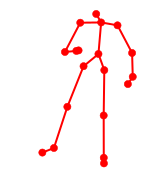
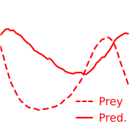
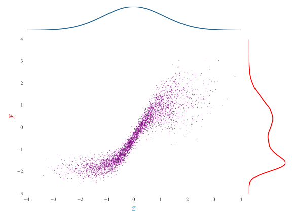
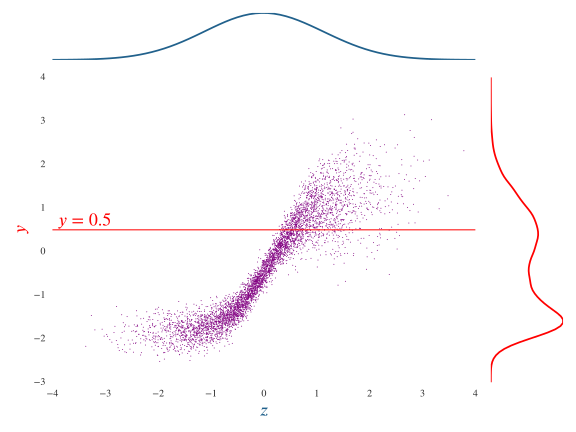

  <h1 class='title-heading'> 
    Inference in differentiable generative models
  </h1>
  
  
  
  
   
**Matt Graham &lt;[matt-graham.github.io](http://matt-graham.github.io)&gt;**


---

### Task: inference

Calculate probable values of unobserved variables $\latent{\rvct{z}}$ given observations $\observed{\rvct{y}}$ of system

<table class='align-table' width='100%'>
  <tr class='fragment' data-fragment-index="1">
    <td>
      $\observed{\underset{\textrm{observed pixels}}{\rvct{y}}}$
    </td>
    <td>
      $\observed{=}$
    </td>
    <td>
      
    </td>
    <td>
      $\Rightarrow$
    </td>
    <td>
      $\latent{\underset{\textrm{other pixels}}{\rvct{z}}}$
    </td>
    <td>
      $\latent{= \textrm{?}}$
    </td>
  </tr>
  <tr class='fragment' data-fragment-index="2">
    <td>
      $\observed{\underset{\textrm{2D projection}}{\mathbf{y}}}$
    </td>
    <td>
      $\observed{=}$
    </td>
    <td>
      
    </td>
    <td>
      $\Rightarrow$
    </td>
    <td>
      $\latent{\underset{\textrm{3D pose}}{\latent{\rvct{z}}}}$
    </td>
    <td>
      $\latent{= \textrm{?}}$
    </td>
  </tr>
  <tr class='fragment' data-fragment-index="3">
    <td>
      $\observed{\underset{\textrm{population data}}{\rvct{y}}}$
    </td>
    <td>
      $\observed{=}$
    </td>
    <td>
       
    </td>
    <td>
      $\Rightarrow$
    </td>
    <td>
      $\latent{\underset{\textrm{parameters}}{\latent{\rvct{z}}}}$
    </td>
    <td>
      $\latent{= \textrm{?}}$
    </td>
  </tr>
</table>

---

### Bayesian inference

<p class="fragment" data-fragment-index="0">
  $\observed{\rvct{y}}$ 
  <span class="observed">: observed variables</span>
</p>

<p class="fragment" data-fragment-index="1">
  $\latent{\rvct{z}}$ 
  <span class="latent">: latent / unobserved variables</span>
</p>

$$
  \underbrace{
    \prob{ 
      \latent{\rvct{z} = \vct{z}} \gvn
      \observed{\rvct{y} = \vct{y}} 
    }
  }\_{\textrm{posterior}}
  =
  \frac{
    \overbrace{
      \prob{ 
        \observed{\rvct{y} = \vct{y}} \gvn
        \latent{\rvct{z} = \vct{z}} 
      }
    }^{\textrm{likelihood}}
    \,
    \overbrace{
      \prob{
        \latent{\rvct{z} = \vct{z}}
      }
    }^{\textrm{prior}}
  }{
    \underbrace{
      \prob{
        \observed{\rvct{y} = \vct{y}}
      }
    }\_
    {\textrm{evidence}}
  }
$$<!-- .element: class="fragment" data-fragment-index="2" -->

How to sample $\latent{\rvct{z}}$ from posterior? <!-- .element: class="fragment" data-fragment-index="3" -->

---

<!-- .slide: data-background-image="images/2d-density-mcmc-0.svg" data-state="dim-bg" -->

### Markov chain Monte Carlo (MCMC)

Class of iterative sampling methods. <!-- .element: class="fragment" data-fragment-index="1" -->

Need to evaluate probability (density) function up to unknown normalising constant. <!-- .element: class="fragment" data-fragment-index="2" -->

$$
  \prob{
    \latent{\rvct{z} = \vct{z}} \gvn
    \observed{\mathbf{y} = \vct{y}}
  } \propto
  \prob{
    \observed{\rvct{y} = \vct{y}} ,\,
    \latent{\rvct{z} = \vct{z}}
  }
$$ <!-- .element: class="fragment" data-fragment-index="3" -->

----

<!-- .slide: data-background-image="images/2d-density-mcmc-1.svg" -->

----

<!-- .slide: data-background-image="images/2d-density-mcmc-2.svg" -->

----

<!-- .slide: data-background-image="images/2d-density-mcmc-2.svg" data-state="dim-bg" -->

### Markov chain Monte Carlo (MCMC)

Requires that we can evaluate joint $\prob{\observed{\rvct{y} = \vct{y}} ,\,
  \latent{\rvct{z} = \vct{z}}}$.  

How to perform inference when we cannot do this? <!-- .element: class="fragment" data-fragment-index="1" -->

---

### Differentiable generator networks <small>Goodfellow et al. 2016</small>

<p class="fragment" data-fragment-index="1">Model defined by differentiable *generator* function.</p>

 <!-- .element: class="fragment" data-fragment-index="2" -->
 
e.g. decoder of variational autoencoder (VAE) or generator of generative adversarial network (GAN). <!-- .element: class="fragment" data-fragment-index="3" -->

----

### Example: MNIST VAE decoder <small>Kingma and Welling, 2013</small>

$$
  \output{\vct{x}} = 
  \vctfunc{m}(\input{\vct{u}_1}) + 
  \vctfunc{s}(\input{\vct{u}_1}) \odot \input{\vct{u}_2}
$$<!-- .element: class="fragment" data-fragment-index="1" -->


----

### Example: Pose projection generator

$$
  \overset
  {\textrm{joint angles}}
  {\latent{\vct{z}\_{a}} = \vctfunc{f}\_a(\input{\vct{u}\_a})}
  \qquad
  \overset
  {\textrm{bone lengths}}
  {\latent{\vct{z}\_{b}} = \vctfunc{f}\_b(\input{\vct{u}\_b})}
  \qquad
  \overset
  {\textrm{camera parameters}}
  {\latent{\vct{z}\_{c}} = \vctfunc{f}\_c(\input{\vct{u}\_c})}
$$

$$
  \overset
  {\textrm{2D proj.}}
  {\observed{\vct{y}_j}} = 
  \overset
  {\textrm{camera matrix}}
  {\mtxfunc{C}\lpa\latent{\vct{z}_a}\rpa}
  \overset
  {\textrm{3D pos.}}{
  \vctfunc{r}_j\lpa
    \latent{\vct{z}_a},\,
    \latent{\vct{z}_b}
  \rpa} + 
  \overset
  {\textrm{obs. noise}}
  {\sigma\,\input{\vct{u}_j}} 
  \quad\forall j \in \lbrace 1 \dots J \rbrace
$$ <!-- .element: class="fragment" data-fragment-index="2" -->

$$
  \output{\vct{x}} = 
  \lsb
    \observed{\vct{y}\_{1} \dots \vct{y}\_{J}};\,
    \latent{\vct{z}\_a};\,
    \latent{\vct{z}\_b};\,
    \latent{\vct{z}\_c}
  \rsb
  \quad
  \input{\vct{u}} = 
  \lsb 
    \input{\vct{u}\_{1} \dots \vct{u}\_{J}};\,
    \input{\vct{u}\_a};\,
    \input{\vct{u}\_b};\,
    \input{\vct{u}\_c}
  \rsb
$$ <!-- .element: class="fragment current-visible" data-fragment-index="3" -->


---

### Simulator models

Many simulators with continuous outputs can be expressed as differentiable generators. <!-- .element: class="fragment" data-fragment-index="1" -->

Usually defined procedurally in code:<!-- .element: class="fragment" data-fragment-index="2" -->

```Python
def generator(rng):
    params = sample_from_prior(rng)
    outputs = simulate(params, rng)
    return outputs, params
```
<!-- .element: class="fragment" data-fragment-index="2" -->

----

### Example: Lotka-Volterra model


 

Model of prey ($\observed{y_1}$) and predator ($\observed{y_2}$) populations

$$
    \textrm{d} \observed{y_1} = 
    (\latent{\theta_1} \observed{y_1} - \latent{\theta_2} \observed{y_1 y_2}) \textrm{d} t + 
    \textrm{d} n_1
$$ <!-- .element: class="fragment" data-fragment-index="1" -->

$$
    \textrm{d} \observed{y_2} = 
    (-\latent{\theta_3} \observed{y_2} + \latent{\theta_4} \observed{y_1 y_2}) \textrm{d} t + 
    \textrm{d} n_2
$$ <!-- .element: class="fragment" data-fragment-index="1" -->

where $n_1$ and $n_2$ are white noise processes. <!-- .element: class="fragment" data-fragment-index="2" -->

----

### Example: Lotka-Volterra model

Simulate at $T$ discrete time-steps

```Python
def sample_from_prior(rng):
  return np.exp(rng.normal(size=4) - mu)
    
def simulate(params, rng):
  y1_seq, y2_seq = [], []
  y1, y2 = y1_init, y2_init
  for t in range(T):
    y1 += ( params[0]*y1 - params[1]*y2) * dt + rng.normal()*dt**.5
    y2 += (-params[2]*y2 + params[3]*y1) * dt + rng.normal()*dt**.5
    y1_seq.append(y1)
    y2_seq.append(y2)
  return np.array(y1_seq), np.array(y2_seq)
```
<!-- .element: class="fragment" data-fragment-index="1" -->


$$
    \input{\vct{u}} = 
    \lsb \input{\textrm{draws from random number generator}} \rsb
    \qquad
    \output{\vct{x}} = 
    \lsb \observed{\vct{y}};\, \latent{\vct{\theta}} \rsb
$$ <!-- .element: class="fragment" data-fragment-index="2" -->

----

### Example: Lotka-Volterra model


---

<!-- .slide: data-transition="none" -->
### Approximate Bayesian Computation <small>Beaumont et al. 2002</small>



----

<!-- .slide: data-transition="none" -->
### Approximate Bayesian Computation <small>Beaumont et al. 2002</small>

 

----

<!-- .slide: data-transition="none" -->
### Approximate Bayesian Computation <small>Beaumont et al. 2002</small>

 

----

<!-- .slide: data-transition="none" -->
### Approximate Bayesian Computation <small>Beaumont et al. 2002</small>

 

----

<!-- .slide: data-transition="none" -->
### Approximate Bayesian Computation <small>Beaumont et al. 2002</small>

 
 

----

### ABC challenges

  * Not asymptotically exact. <!-- .element: class="fragment" data-fragment-index="1" -->
  * Tolerance $\epsilon$ between simulations and data controls bias. <!-- .element: class="fragment" data-fragment-index="2" -->
  * Inefficient in high dimensions particularly for small $\epsilon$. <!-- .element: class="fragment" data-fragment-index="3" -->

---

<!-- .slide: data-transition="none" -->
### ABC in input space

 

----

<!-- .slide: data-transition="none" -->
### ABC in input space

 

----

<!-- .slide: data-transition="none" -->
### ABC in input space

 

----

<!-- .slide: data-transition="none" -->
### Conditioning as a constraint

 

---

### Gradient based inference

Gradient information often key to performing inference in high-dimensional spaces.  <!-- .element: class="fragment" data-fragment-index="1" -->

How to calculate derivatives of arbitrary simulator models?  <!-- .element: class="fragment" data-fragment-index="2" --> 

<div class="fragment" data-fragment-index="3">
  
  
  
</div>

----

<!-- .slide: data-background-video="images/2d-density-hmc.mp4" data-background-video-loop="true" data-state="dim-bg-video" -->

### Hamiltonian Monte Carlo (HMC) <small>Duane et al. 1987</small>

---

### Constrained Hamiltonian Monte Carlo <small>Brubaker et al. 2012</small>

<video autoplay loop>
  <source data-src="images/chmc-animation.mp4" type="video/mp4" />
</video>

---

### Experiments

  1. Parameter inference in Lotka-Volterra model
  2. Monocular pose and camera model inference
  3. Digit image in-painting with MNIST model

All generative models coded using Theano. <!-- .element: class="fragment" data-fragment-index="1" -->

----

### Lokta-Volterra parameter inference

 <!-- .element: class="fragment" data-fragment-index="1" -->
 <!-- .element: class="fragment" data-fragment-index="2" -->
 <!-- .element: class="fragment" data-fragment-index="3" -->

----

### Binocular pose estimation

  <!-- .element: class="fragment current-visible" data-fragment-index="1" -->

  <!-- .element: class="fragment" data-fragment-index="2" -->

----

### Monocular pose estimation


----

### MNIST in-painting


---

### Current work

Complex simulations common in science and engineering

<div>
    
    <!-- .element: class="fragment" data-fragment-index="1" -->
    
    <!-- .element: class="fragment" data-fragment-index="2" -->
</div>

<div>
    
    <!-- .element: class="fragment" data-fragment-index="3" -->
    
    <!-- .element: class="fragment" data-fragment-index="4" -->
</div>

----

### Differentiable fluid simulation


Fluid simulation implemented in Theano.  <!-- .element: class="fragment" data-fragment-index="1" -->

Currently derivative calculation very slow.  <!-- .element: class="fragment" data-fragment-index="2" -->

---

### Conclusions

  * Inference method for differentiable generative models.  <!-- .element: class="fragment" data-fragment-index="1" -->
  * Consider conditioning as constraint on inputs. <!-- .element: class="fragment" data-fragment-index="2" -->
  * Use of gradients allows high-dimensional inference. <!-- .element: class="fragment" data-fragment-index="3" -->
  * Asymptotically exact alternative to ABC. <!-- .element: class="fragment" data-fragment-index="4" -->

---

<h3 style='font-size: 200%;'>References</h3>

<!-- .slide: style="font-size: 50%" -->

*  M. M. Graham and A. J. Storkey.  
   Asymptotically exact inference in differentiable generative models.   
   To appear in *AISTATS*, 2017. 
   
*  M. A. Beaumont, W. Zhang and D. J. Balding.  
   Approximate Bayesian Computation in Population Genetics.  
   *Genetics*, 2002.
   <!-- .element: class="fragment" data-fragment-index="1"-->

*  M. A. Brubaker, M. Saelzmann, and R. Urtasun.  
   A family of MCMC methods on implicitly defined manifolds.  
   *AISTATS*, 2012.
   <!-- .element: class="fragment" data-fragment-index="1"-->

*  S. Duane, A. D. Kennedy, B. J. Pendleton and D. Roweth,  
   Hybrid Monte Carlo.  
   *Physics Letters B*, 1987. 
   <!-- .element: class="fragment" data-fragment-index="1"--> 

*  I. Goodfellow, Y. Bengio, and A. Courville.  
   Deep learning, Chapter 20: Deep Generative Models.  
   *Book in preparation for MIT Press*, 2016.
   <!-- .element: class="fragment" data-fragment-index="1"-->

*  D. P. Kingma and M. Welling.  
   Auto-encoding variational Bayes.  
   *ICLR*, 2014.
   <!-- .element: class="fragment" data-fragment-index="1"-->

---

### Acknowledgements


<div style='display: inline-block; padding: 10px;'>
   
   <div><small>Amos Storkey</small></div>
</div>


<div style='display: inline-block;'>
   
   <div style='display: inline-block; width: 200px; vertical-align: middle; text-transform: uppercase; font-size: 35%;'>
       Doctoral Training Centre in Neuroinformatics and Computational Neuroscience
   </div> 
</div>

<div>
   
   
    
</div>

---

## Thanks for listening. 
## Any questions?

<br />

`python` constrained HMC code

http://github.com/matt-graham/hmc

Paper pre-print with more details

http://arxiv.org/abs/1605.07826
