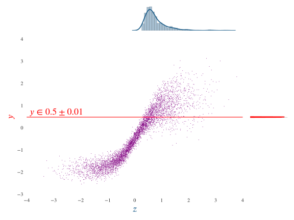
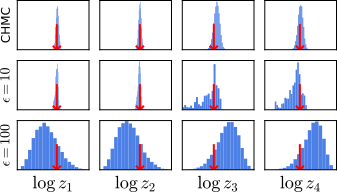

  <h1 class='title-heading'> 
    Inference in differentiable generative models
  </h1>
  
  
  
  
   
**Matt Graham &lt;[matt-graham.github.io](http://matt-graham.github.io)&gt;**


---

### Task: inference

Calculate probable values of unobserved variables $\mathbf{z}$ given observations $\mathbf{x}$ of system

<div class='fragment' data-fragment-index="1" style='padding: 5px;'>
  $\underset{\textrm{observed pixels}}{\mathbf{x}} =$
   
  $\qquad \Rightarrow  \qquad  \underset{\textrm{other pixels}}{\mathbf{z}} = \textrm{?}$
</div>

<div class='fragment' data-fragment-index="2" style='padding: 5px;'>
  $\underset{\textrm{2D projection}}{\boldsymbol{x}}= ~~$
   
  $\qquad \Rightarrow  \qquad \underset{\textrm{3D pose}}{\mathbf{z}} ~=~ \textrm{?}$
</div>

<div class='fragment' data-fragment-index="3" style='padding: 5px;'>
  $\underset{\textrm{population data}}{\boldsymbol{x}}= ~~$
   
  $\qquad \Rightarrow  \qquad \underset{\textrm{parameters}}{\mathbf{z}} = \textrm{?}$
</div>

---

### Bayesian inference

$\mathbf{x}$ : observed variables  <!-- .element: class="fragment" data-fragment-index="0" -->  

$\mathbf{z}$ : latent / unobserved variables <!-- .element: class="fragment" data-fragment-index="1" -->

$$
  \underbrace{
    \mathbb{P} \left[ \mathbf{z} = \boldsymbol{z} \,|\, \mathbf{x} = \boldsymbol{x} \right]
  }\_{\textrm{posterior}}
  =
  \frac{
    \overbrace{
      \mathbb{P}\left[ \mathbf{x} = \boldsymbol{x} \,|\, \mathbf{z} = \boldsymbol{z} \right]
    }^{\textrm{likelihood}}
    \,
    \overbrace{
      \mathbb{P}\left[ \mathbf{z} = \boldsymbol{z} \right]
    }^{\textrm{prior}}
  }{
    \underbrace{\mathbb{P}\left[ \mathbf{x} = \boldsymbol{x} \right]}\_
    {\textrm{evidence}}
  }
$$<!-- .element: class="fragment" data-fragment-index="2" -->

How to sample $\mathbf{z}$ from posterior? <!-- .element: class="fragment" data-fragment-index="3" -->

---

<!-- .slide: data-background-image="images/2d-density-mcmc-0.svg" data-state="dim-bg" -->

### Markov chain Monte Carlo (MCMC)

Class of iterative sampling methods. <!-- .element: class="fragment" data-fragment-index="1" -->

Need to evaluate probability (density) function up to unknown normalising constant. <!-- .element: class="fragment" data-fragment-index="2" -->

$$
  \mathbb{P}\left[\mathbf{z} = \boldsymbol{z} \,|\, \mathbf{x} = \boldsymbol{x} \right] \propto
  \mathbb{P}\left[\mathbf{x} = \boldsymbol{x} \,|\, \mathbf{z} = \boldsymbol{z} \right]
  \mathbb{P}\left[\mathbf{z} = \boldsymbol{z} \right]
$$ <!-- .element: class="fragment" data-fragment-index="3" -->

----

<!-- .slide: data-background-image="images/2d-density-mcmc-1.svg" -->

----

<!-- .slide: data-background-image="images/2d-density-mcmc-2.svg" -->

----

<!-- .slide: data-background-image="images/2d-density-mcmc-2.svg" data-state="dim-bg" -->

### Markov chain Monte Carlo (MCMC)

Requires that we can evaluate likelihood $\mathbb{P}\left[\mathbf{x} = \boldsymbol{x} \,|\, \mathbf{z} = \boldsymbol{z} \right]$ and prior $\mathbb{P}\left[\mathbf{z} = \boldsymbol{z}\right]$.  

How to perform inference when we cannot do this? <!-- .element: class="fragment" data-fragment-index="1" -->

---

### Differentiable generator networks

Generative model learnt from data by gradient descent. <!-- .element: class="fragment" data-fragment-index="1" -->

 <!-- .element: class="fragment" data-fragment-index="2" -->
 
e.g. decoder of variational autoencoder or generator of generative adversarial network. <!-- .element: class="fragment" data-fragment-index="3" -->

----

### Example: MNIST images


----

### Example: Human poses


$$
  \overset{\textrm{camera parameters}}{\boldsymbol{\phi}},
  \overset{\textrm{joint angles}}{\boldsymbol{\psi}},
  \overset{\textrm{bone lengths}}{\boldsymbol{\ell}}
  = \mathbf{f}(\boldsymbol{u}_0)
$$ <!-- .element: class="fragment current-visible" data-fragment-index="1" -->
 
$$
    \overset{\textrm{2D joint}}{\boldsymbol{x}_i} = 
    \overset{\textrm{camera matrix}}{\mathbf{C}\left[\boldsymbol{\psi}\right]}
    \overset{\textrm{3D joint}}{
    \mathbf{r}_i\left[
        \boldsymbol{\psi},\,
        \boldsymbol{\ell}
    \right]} + 
    \overset{\textrm{obs. noise}}{\sigma\,\boldsymbol{u}_i} 
    \quad\forall i \in \lbrace 1 \dots N \rbrace
$$ <!-- .element: class="fragment current-visible" data-fragment-index="2" -->

$$
    \boldsymbol{y} = 
    \left[ 
      \left\lbrace\boldsymbol{x}^{(i)}\right\rbrace;\,
      \boldsymbol{\phi};\,
      \boldsymbol{\psi};\,\boldsymbol{\ell}
    \right]
$$ <!-- .element: class="fragment" data-fragment-index="3" -->

---

### Simulator models

Many simulators with continuous outputs can also be expressed as differentiable generators. <!-- .element: class="fragment" data-fragment-index="1" -->

Usually defined procedurally in code:<!-- .element: class="fragment" data-fragment-index="2" -->

```Python
def generator(rng):
    params = sample_from_prior(rng)
    outputs = simulate(params, rng)
    return outputs, params
```
<!-- .element: class="fragment" data-fragment-index="2" -->

----

### Example: Lotka-Volterra model


 

Model of prey ($x_1$) and predator ($x_2$) populations

$$
    \textrm{d} x_1 = (\theta_1 x_1 - \theta_2 x_1 x_2) \textrm{d} t + \textrm{d} n_1
$$ <!-- .element: class="fragment" data-fragment-index="1" -->

$$
    \textrm{d} x_2 = (-\theta_3 x_2 + \theta_4 x_1 x_2) \textrm{d} t + \textrm{d} n_2
$$ <!-- .element: class="fragment" data-fragment-index="1" -->

where $n_1$ and $n_2$ are white noise processes. <!-- .element: class="fragment" data-fragment-index="2" -->

----

### Example: Lotka-Volterra model

Simulate at $T$ discrete time-steps

```Python
def sample_from_prior(rng):
  return np.exp(rng.normal(size=4) - mu)
    
def simulate(thetas, rng):
  x1_seq, x2_seq = [], []
  x1, x2 = x1_init, x2_init
  for t in range(T):
    x1 += ( thetas[0]*x1 - thetas[1]*x2) * dt + rng.normal()*dt**.5
    x2 += (-\theta[2]*x2 + thetas[3]*x3) * dt + rng.normal()*dt**.5
    x1_seq.append(x1)
    x2_seq.append(x2)
  return np.array(x1_seq), np.array(x2_seq)
```
<!-- .element: class="fragment" data-fragment-index="1" -->


$$
    \boldsymbol{u} = \left[ \textrm{draws from random number generator} \right]
    \qquad
    \boldsymbol{y} = \left[ \boldsymbol{x};\,\boldsymbol{\theta} \right]
$$ <!-- .element: class="fragment" data-fragment-index="2" -->

----

### Example: Lotka-Volterra model


---

<!-- .slide: data-transition="none" -->
### Approximate Bayesian Computation


----

<!-- .slide: data-transition="none" -->
### Approximate Bayesian Computation

 

----

<!-- .slide: data-transition="none" -->
### Approximate Bayesian Computation

 

----

<!-- .slide: data-transition="none" -->
### Approximate Bayesian Computation

 

----

<!-- .slide: data-transition="none" -->
### Approximate Bayesian Computation

 
 

----

### Approximate Bayesian Computation

  * Not asymptotically exact. <!-- .element: class="fragment" data-fragment-index="1" -->
  * Tolerance $\epsilon$ between simulations and data controls bias. <!-- .element: class="fragment" data-fragment-index="2" -->
  * Inefficient in high dimensions particularly for small $\epsilon$. <!-- .element: class="fragment" data-fragment-index="3" -->


----

### Gradient based inference

Gradient information often key to performing inference in high-dimensional spaces.  <!-- .element: class="fragment" data-fragment-index="1" -->

How to calculate derivatives of arbitrary simulator models?  <!-- .element: class="fragment" data-fragment-index="2" --> 

<div class="fragment" data-fragment-index="3">
  
  
</div>

----

### Automatic differentiation


Image source: Wikipedia <!-- .element: style="font-size: 50%" -->

----

### Hamiltonian Monte Carlo (HMC) <small>Duane et al., 1987</small>

<video loop autoplay width='800px'>
  <source data-src="images/2d-density-hmc.mp4" type="video/mp4" />
</video>

---

### Conditioning as a constraint


---

### Constrained Hamiltonian Monte Carlo <small>Brubaker et al., 2012</small>

<video autoplay loop>
  <source data-src="images/chmc-animation.mp4" type="video/mp4" />
</video>

---

### Experiments

  1. Parameter inference in Lotka-Volterra model
  2. Monocular pose and camera model inference
  3. Digit image in-painting with MNIST model

All generative models coded using Theano. <!-- .element: class="fragment" data-fragment-index="1" -->

----

### Lokta-Volterra parameter inference

 <!-- .element: class="fragment" data-fragment-index="1" -->
 <!-- .element: class="fragment" data-fragment-index="2" -->
 <!-- .element: class="fragment" data-fragment-index="3" -->

----

### Binocular pose estimation

  <!-- .element: class="fragment current-visible" data-fragment-index="1" -->

  <!-- .element: class="fragment" data-fragment-index="2" -->

----

### Monocular pose estimation


----

### MNIST in-painting


---

### Current work

Complex simulations common in science and engineering

<div>
    
    <!-- .element: class="fragment" data-fragment-index="1" -->
    
    <!-- .element: class="fragment" data-fragment-index="2" -->
</div>

<div>
    
    <!-- .element: class="fragment" data-fragment-index="3" -->
    
    <!-- .element: class="fragment" data-fragment-index="4" -->
</div>

----

### Differentiable fluid simulation


Fluid simulation implemented in Theano.  <!-- .element: class="fragment" data-fragment-index="1" -->

Currently derivative calculation very slow.  <!-- .element: class="fragment" data-fragment-index="2" -->

---

### Conclusions

  * Inference method for differentiable generative models.  <!-- .element: class="fragment" data-fragment-index="1" -->
  * Consider conditioning as constraint on inputs. <!-- .element: class="fragment" data-fragment-index="2" -->
  * Use of gradients allows high-dimensional inference. <!-- .element: class="fragment" data-fragment-index="3" -->
  * Asymptotically exact alternative to ABC. <!-- .element: class="fragment" data-fragment-index="4" -->

---

<h2 style='font-size: 250%;'>References</h2>

<!-- .slide: style="font-size: 50%" -->

> M. A. Brubaker, M. Saelzmann, and R. Urtasun.
> A family of MCMC methods on implicitly defined manifolds. 
> *AISTATS*, 2012.

> I. Goodfellow, Y. Bengio, and A. Courville. 
> Deep learning, Chapter 20: Deep Generative Models. 
> *Book in preparation for MIT Press*, 2016.

> D. P. Kingma and M. Welling. 
> Auto-encoding variational Bayes. 
> *ICLR*, 2014.

> I. Goodfellow, J. Pouget-Abadie, M. Mirza, B. Xu, D. Warde-Farley, S. Ozair, 
> A. Courville, and Y. Bengio.
> Generative adversarial nets. 
> *NIPS*, 2014.

> I. Akhter and M. J. Black. 
> Pose-conditioned joint angle limits for 3D human pose reconstruction. 
> *IEEE CVPR*, 2015.

> J.-M. Marin, P. Pudlo, C. P. Robert, and R. J. Ryder. 
> Approximate Bayesian computational methods. 
> *Statistics and Computing*, 2012.

---

### Acknowledgements


<div style='display: inline-block; padding: 10px;'>
   
   <div><small>Amos Storkey</small></div>
</div>


<div style='display: inline-block;'>
   
   <div style='display: inline-block; width: 200px; vertical-align: middle; text-transform: uppercase; font-size: 35%;'>
       Doctoral Training Centre in Neuroinformatics and Computational Neuroscience
   </div> 
</div>

<div>
   
   
    
</div>

---

## Thanks for listening. 
## Any questions?

<br />

`python` constrained HMC code

http://github.com/matt-graham/hmc

Paper pre-print with more details

http://arxiv.org/abs/1605.07826
