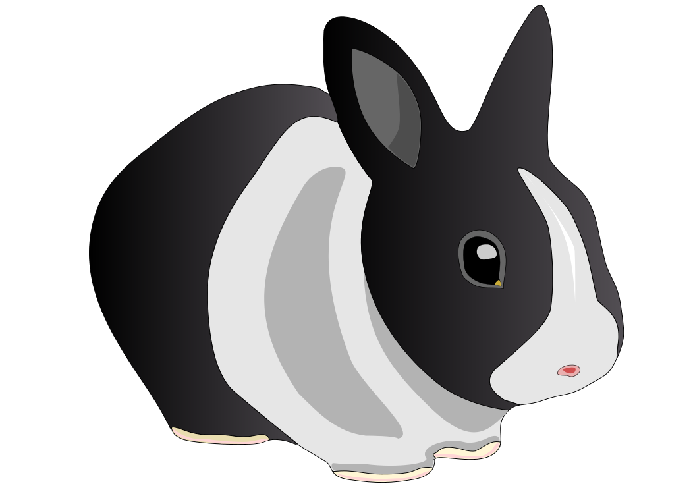
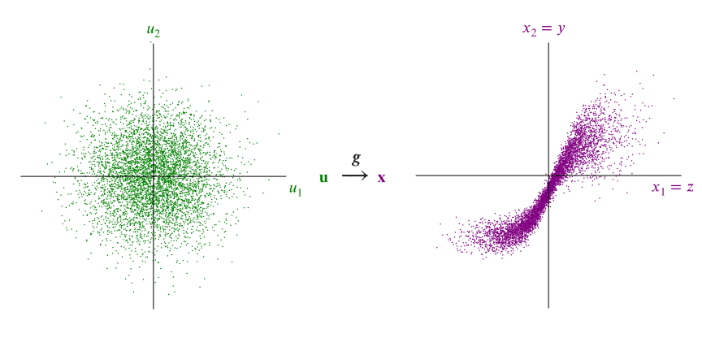
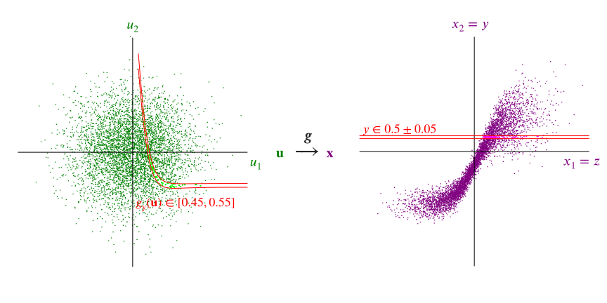
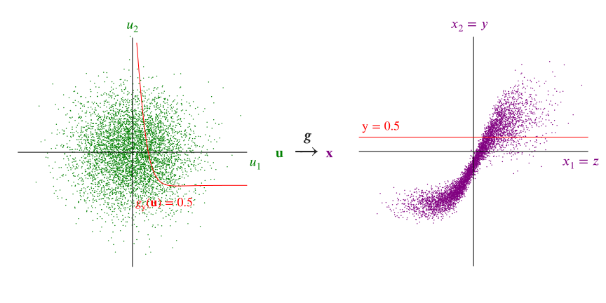
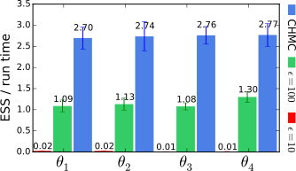

<h1 class='title-heading'> 
  Inference in differentiable generative models
</h1>


   
<p style='font-size: 90%; font-weight: bold;'>
  Matt Graham &lt;[matt-graham.github.io](http://matt-graham.github.io)&gt;
</p>

<p style='font-size: 80%; font-style: italic;'>
  Joint work with Amos Storkey
</p>


---

### Task: inference

Calculate probable values of unobserved variables $\latent{\rvct{z}}$ given observations $\observed{\rvct{y} = \vct{y}_{\textrm{obs}}}$ of system

<table class='align-table' width='100%'>
  <tr class='fragment' data-fragment-index="1">
    <td>
      $\observed{\underset{\textrm{observed pixels}}{\rvct{y}}}$
    </td>
    <td>
      $\observed{=}$
    </td>
    <td>
      
    </td>
    <td>
      $\Rightarrow$
    </td>
    <td>
      $\latent{\underset{\textrm{other pixels}}{\rvct{z}}}$
    </td>
    <td>
      $\latent{= \textrm{?}}$
    </td>
  </tr>
  <tr class='fragment' data-fragment-index="2">
    <td>
      $\observed{\underset{\textrm{2D projection}}{\mathbf{y}}}$
    </td>
    <td>
      $\observed{=}$
    </td>
    <td>
      
    </td>
    <td>
      $\Rightarrow$
    </td>
    <td>
      $\latent{\underset{\textrm{3D pose}}{\latent{\rvct{z}}}}$
    </td>
    <td>
      $\latent{= \textrm{?}}$
    </td>
  </tr>
  <tr class='fragment' data-fragment-index="3">
    <td>
      $\observed{\underset{\textrm{population data}}{\rvct{y}}}$
    </td>
    <td>
      $\observed{=}$
    </td>
    <td>
       
    </td>
    <td>
      $\Rightarrow$
    </td>
    <td>
      $\latent{\underset{\textrm{parameters}}{\latent{\rvct{z}}}}$
    </td>
    <td>
      $\latent{= \textrm{?}}$
    </td>
  </tr>
</table>

---

### Bayesian inference

<p class="fragment" data-fragment-index="0">
  $\observed{\rvct{y}}$ 
  <span class="observed">: observed variables</span>
</p>

<p class="fragment" data-fragment-index="1">
  $\latent{\rvct{z}}$ 
  <span class="latent">: latent / unobserved variables</span>
</p>

$$
  \underbrace{
    \pden{ 
      \latent{\rvct{z} = \vct{z}} \gvn
      \observed{\rvct{y} = \vct{y}\_{\textrm{obs}}} 
    }
  }\_{\textrm{posterior}}
  =
  \frac{
    \overbrace{
      \pden{ 
        \observed{\rvct{y} = \vct{y}\_{\textrm{obs}}} \gvn
        \latent{\rvct{z} = \vct{z}} 
      }
    }^{\textrm{likelihood}}
    \,
    \overbrace{
      \pden{
        \latent{\rvct{z} = \vct{z}}
      }
    }^{\textrm{prior}}
  }{
    \underbrace{
      \pden{
        \observed{\rvct{y} = \vct{y}\_{\textrm{obs}}}
      }
    }\_
    {\textrm{evidence}}
  }
$$<!-- .element: class="fragment" data-fragment-index="2" -->

How to sample $\latent{\rvct{z}}$ from posterior? <!-- .element: class="fragment" data-fragment-index="3" -->

---

<!-- .slide: data-background-image="images/2d-density-mcmc-0.svg" data-state="dim-bg" -->

### Markov chain Monte Carlo (MCMC)

Class of iterative sampling methods. <!-- .element: class="fragment" data-fragment-index="1" -->

Need to evaluate probability (density) function up to unknown normalising constant. <!-- .element: class="fragment" data-fragment-index="2" -->

$$
  \pden{
    \latent{\rvct{z} = \vct{z}} \gvn
    \observed{\mathbf{y} = \vct{y}\_{\textrm{obs}}}
  } \propto
  \pden{
    \observed{\rvct{y} = \vct{y}\_{\textrm{obs}}} ,\,
    \latent{\rvct{z} = \vct{z}}
  }
$$ <!-- .element: class="fragment" data-fragment-index="3" -->

----

<!-- .slide: data-background-image="images/2d-density-mcmc-1.svg" -->

----

<!-- .slide: data-background-image="images/2d-density-mcmc-2.svg" -->

----

<!-- .slide: data-background-image="images/2d-density-mcmc-2.svg" data-state="dim-bg" -->

### Markov chain Monte Carlo (MCMC)

Requires that we can evaluate joint $\pden{\observed{\rvct{y} = \vct{y}_{\textrm{obs}}} ,\,
  \latent{\rvct{z} = \vct{z}}}$.  

How to perform inference when we cannot do this? <!-- .element: class="fragment" data-fragment-index="1" -->

---

### Differentiable generative models

Model defined by a differentiable *generator function* $\vctfunc{g}$
and *random inputs* $\input{\rvct{u}}$ drawn from a *base density* $\rho(\input{\vct{u}})$.

$$
  \input{\rvct{u}} \sim \rho
  \qquad
  \output{\rvct{x}} = \vctfunc{g}(\input{\rvct{u}})
  \qquad
  \output{\rvct{x}} = \left[\observed{\rvct{y}};\,\latent{\rvct{z}}\right]
$$

<br />

 <!-- .element: class="fragment" data-fragment-index="1" -->

---

### Simulator models

Many simulators with continuous outputs are differentiable generative models. <!-- .element: class="fragment" data-fragment-index="1" -->

Usually defined procedurally in code:<!-- .element: class="fragment" data-fragment-index="2" -->

```Python
def generator(rng):
    z = sample_from_prior(rng)
    y = simulate(z, rng)
    return y, z
```
<!-- .element: class="fragment" data-fragment-index="2" -->

----

### Example: Lotka-Volterra model


 

Continuous variant of model of prey ($\observed{y_1}$) and predator ($\observed{y_2}$) populations

$$
    \textrm{d} \observed{y_1} = 
    (\latent{z_1} \observed{y_1} - \latent{z_2} \observed{y_1 y_2}) \textrm{d} t + 
    \textrm{d} n_1
$$ <!-- .element: class="fragment" data-fragment-index="1" -->

$$
    \textrm{d} \observed{y_2} = 
    (-\latent{z_3} \observed{y_2} + \latent{z_4} \observed{y_1 y_2}) \textrm{d} t + 
    \textrm{d} n_2
$$ <!-- .element: class="fragment" data-fragment-index="1" -->

where $n_1$ and $n_2$ are white noise processes. <!-- .element: class="fragment" data-fragment-index="2" -->

----

### Example: Lotka-Volterra model

Simulate at $T$ discrete time-steps

```Python
def sample_from_prior(rng):
    return np.exp(rng.normal(size=4) - mu)
    
def simulate(z, rng):
    y1_seq, y2_seq = [], []
    y1, y2 = y1_init, y2_init
    for t in range(T):
        y1 += ( z[0]*y1 - z[1]*y2) * dt + rng.normal()*dt**0.5
        y2 += (-z[2]*y2 + z[3]*y1) * dt + rng.normal()*dt**0.5
        y1_seq.append(y1)
        y2_seq.append(y2)
    return np.array(y1_seq), np.array(y2_seq)
```
<!-- .element: class="fragment" data-fragment-index="1" -->


$$
    \input{\rvct{u}} = 
    \lsb \input{\textrm{random number generator draws}} \rsb
$$  <!-- .element: class="fragment" data-fragment-index="2" -->

$$
    \output{\rvct{x}} = 
    \lsb 
      \observed{
        \rvar{y}^{(1)}_1,\,\rvar{y}^{(1)}_2,
        \,\dots\,
        \rvar{y}^{(T)}_1,\,\rvar{y}^{(T)}_2
      }
      ;\, 
      \latent{
        \rvar{z_1},\,\rvar{z_2},\,\rvar{z_3},\,\rvar{z_4}
      } 
    \rsb
$$ <!-- .element: class="fragment" data-fragment-index="2" -->

----

### Example: Lotka-Volterra model


----


----

### Example: Hodgkin-Huxley model


<span style='font-size: 80%;'>
\begin{align}
-C\_m \td{V}{t} &= 
\bar{g}\_{\ell}(V - E\_{\ell}) +
\observed{\overbrace{\bar{g}\_{\textrm{Na}} h m^3}^{g\_{\textrm{Na}}}} 
(V - E\_{\textrm{Na}}) +
\observed{\overbrace{\bar{g}\_{\textrm{K}} n^3}^{g\_{\textrm{K}}}} 
(V - E\_{\textrm{K}})
\\\\
\td{x}{t} &=
\alpha\_x(V)\, (1 - x) - \beta\_x(V)\, x
\\quad \forall x \in \lbr{h,\,m,\,n}\rbr
\end{align}
</span>

----

### Example: Hodgkin-Huxley model <small>Daly et al. 2015</small>

Latent variables $\latent{\rvct{z}}$: gate voltage dependence parameters

<span style='font-size: 80%;'>
\begin{align}
\alpha\_h(V) &= 
\latent{k\_{\alpha\_h,0}} \exp\lsb -\frac{V}{\latent{k\_{\alpha\_h,1}}}\rsb &
\beta\_h(V) &= 
\frac{1}{1 + \exp\lsb-\frac{V - \latent{k\_{\beta\_h,0}}}{\latent{k\_{\beta\_h,1}}}\rsb}\\\\
\alpha\_m(V) &= 
\frac{\latent{k\_{\alpha\_m,0}} (V - \latent{k\_{\alpha\_m,1}})}
{1 -\exp\lsb-\frac{V - \latent{k\_{\alpha\_m,1}}}{\latent{k\_{\alpha\_m,2}}}\rsb} &
\beta\_m(V) &= 
\latent{k\_{\beta\_m,0}} \exp\lsb -\frac{V}{\latent{k\_{\beta\_m,1}}}\rsb\\\\
\alpha\_n(V) &= 
\frac{\latent{k\_{\alpha\_n,0}} (V - \latent{k\_{\alpha\_n,1}})}
{1 -\exp\lsb-\frac{V - \latent{k\_{\alpha\_n,1}}}{\latent{k\_{\alpha\_n,2}}}\rsb} &
\beta\_n(V) &= 
\latent{k\_{\beta\_n,0}} \exp\lsb -\frac{V}{\latent{k\_{\beta\_n,1}}}\rsb
\end{align}
</span>

----

### Example: Hodgkin-Huxley model

Observed data $\observed{\vct{y}\_{\textrm{obs}}}$: sodium and potassium conductances


----

### Example: Hodgkin-Huxley model

Generator $\vct{g}$: simulated voltage clamp experiments coupling proportional-integral controller to Hodgkin-Huxley model


---

<!-- .slide: data-transition="none" -->
### Approximate Bayesian Computation <small>Beaumont et al. 2002</small>


----

<!-- .slide: data-transition="none" -->
### Approximate Bayesian Computation <small>Beaumont et al. 2002</small>

 

----

<!-- .slide: data-transition="none" -->
### Approximate Bayesian Computation <small>Beaumont et al. 2002</small>

 

----

<!-- .slide: data-transition="none" -->
### Approximate Bayesian Computation <small>Beaumont et al. 2002</small>

 

----

<!-- .slide: data-transition="none" -->
### Approximate Bayesian Computation <small>Beaumont et al. 2002</small>

 
 

----

### ABC challenges

  * Not asymptotically exact. <!-- .element: class="fragment" data-fragment-index="1" -->
  * Tolerance $\epsilon$ between simulations and data controls bias. <!-- .element: class="fragment" data-fragment-index="2" -->
  * Inefficient in high dimensions particularly for small $\epsilon$. <!-- .element: class="fragment" data-fragment-index="3" -->

---

<!-- .slide: data-transition="none" -->
### ABC in input space

 

----

<!-- .slide: data-transition="none" -->
### ABC in input space

 

----

<!-- .slide: data-transition="none" -->
### ABC in input space

 

----

<!-- .slide: data-transition="none" -->
### Conditioning as a constraint

 

---

### Gradient based inference

Gradient information often key to scaling inference to high-dimensional spaces.  <!-- .element: class="fragment" data-fragment-index="1" -->

How to calculate derivatives of arbitrary simulator models?  <!-- .element: class="fragment" data-fragment-index="2" --> 

<div class="fragment" data-fragment-index="3">
  
  
  
</div>

----

<!-- .slide: data-background-video="images/2d-density-hmc.mp4" data-background-video-loop="true" data-state="dim-bg-video" -->

### Hamiltonian Monte Carlo (HMC) <small>Duane et al. 1987</small>

---

### Constrained Hamiltonian Monte Carlo <small>Brubaker et al. 2012</small>

<video controls loop>
  <source data-src="images/chmc-animation-io.mp4" type="video/mp4" />
</video>

---

### Lotka-Volterra parameter inference

<div class='fragment' data-fragment-index='1' style='padding-bottom: 1em;'>
$\input{\rvct{u} = [\rvct{u}\_{\mathrm{z}};\, \rvct{u}\_{\mathrm{y}}]}$ with $\rho(\input{\vct{u}}) = \mathcal{N}\lpa\input{\vct{u}};\,\vct{0},\,\mtx{I}\rpa$
</div>

<div class='fragment' data-fragment-index='2' style='padding-bottom: 1em;'>
$\vctfunc{g}\_{\latent{\rvct{z}}}(\input{\vct{u}\_{\rvct{z}}}) = \exp(\input{\vct{u}\_{\rvct{z}}} - \vct{\mu})$  
$\latent{\rvct{z} = [ z_1,\, z_2,\, z_3,\, z_4]}$
</div>

<div class='fragment' data-fragment-index='3' style='padding-bottom: 1em;'>
$\vctfunc{g}\_{\observed{\rvct{y}}}(\latent{\vct{z}},\,\input{\vct{u}_{\rvct{y}}})$: Euler-Maruyama integration of SDEs  

$\observed{\rvct{y} = [ \rvar{y}_1^{(1)}, \, \rvar{y}_2^{(1)},\,\dots \rvar{y}_1^{(50)},\, \rvar{y}_2^{(50)} ]}$
</div>

<p class='fragment' data-fragment-index='4' style='padding-bottom: 1em;'>
Compare to ABC MCMC approach using pseudo-marginal slice sampling <small>(Murray and Graham, 2016)</small>.
</p>

----

### Lotka-Volterra parameter inference

 

----

### Lotka-Volterra parameter inference


----

### Lotka-Volterra parameter inference




----

### Hodgkin-Huxley parameter inference


---

### Conclusions

  * Inference method for differentiable generative models.  <!-- .element: class="fragment" data-fragment-index="1" -->
  * Consider conditioning as constraint on inputs. <!-- .element: class="fragment" data-fragment-index="2" -->
  * Use of gradients allows high-dimensional inference. <!-- .element: class="fragment" data-fragment-index="3" -->
  * Asymptotically exact alternative to ABC where applicable. <!-- .element: class="fragment" data-fragment-index="4" -->

---

<!-- .slide: style="font-size: 50%" -->

<h3 style='font-size: 200%;'>References</h3>
   
*  M. A. Beaumont, W. Zhang and D. J. Balding.  
   Approximate Bayesian Computation in Population Genetics.  
   *Genetics*, 2002.
   
*  M. A. Brubaker, M. Saelzmann, and R. Urtasun.  
   A family of MCMC methods on implicitly defined manifolds.  
   *AISTATS*, 2012.
   
*  A. C. Daly, D. J. Gavaghan, C. Holmes and J. Cooper.  
   Hodgkin-Huxley revisited: reparameterization and identifiability analysis of classic actional potential model with approximate Bayesian methods.  
   *Royal Society open science*, 2015.
   
*  S. Duane, A. D. Kennedy, B. J. Pendleton and D. Roweth.    
   Hybrid Monte Carlo.  
   *Physics Letters B*, 1987.
   
*  A. L. Hodgkin and A. F. Huxley.  
   A quantitative description of membrance current and its application to conduction and excitation in nerve.  
   *Journal of Physiology*, 1952.

*  I. Murray and M. M. Graham.  
   Pseudo-marginal slice sampling.  
   *AISTATS*, 2016.

---

### Acknowledgements


<div style='display: inline-block; padding: 10px;'>
   
   <div><small>Amos Storkey</small></div>
</div>


<div style='display: inline-block;'>
   
   <div style='display: inline-block; width: 200px; vertical-align: middle; text-transform: uppercase; font-size: 35%;'>
       Doctoral Training Centre in Neuroinformatics and Computational Neuroscience
   </div> 
</div>

<div>
   
   
    
</div>

---

## Thanks for listening. 
## Any questions?

<br />

<i class="fa fa-github fa-fw"></i> http://git.io/dgm

<i class="ai ai-arxiv fa-fw"></i> http://arxiv.org/abs/1605.07826
