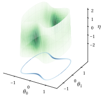
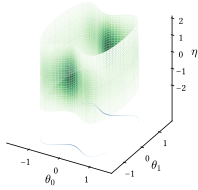
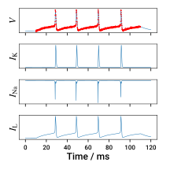
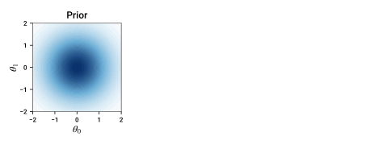
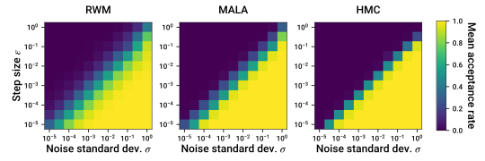
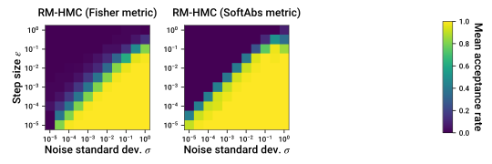
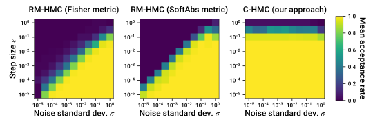
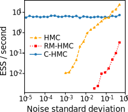
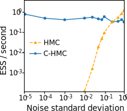

## MCMC methods for inverse problems with highly informative observations






<span style='color: #666; font-size: 85%;'>
  Matt Graham <a href="https://matt-graham.github.io">&lt;matt-graham.github.io&gt;</a>
</span>


---

## Collaborators

<div style="margin-top: 0.5em; width: 45%; float: left; text-align: right;">
  
  <p>Au Khai Xiang</p>
</div>
<div style="margin-top: 2.25em; width: 10%; float: left; text-align: center;">
  &amp;
</div>
<div style="margin-top: 0.5em; width: 45%; float: left; text-align: left;">
  
  <p>Alex Thiery</p>
</div>


---

## Motivation

<div style="position:relative; width:100%; height:150px;">
  <p class="fragment fade-out" data-fragment-index="2" style="width:100%; height: 100%; position:absolute;top:0;left:0;" >
    In many scientific and engineering settings we are interested in solving *inverse problems*.
  </p>
  <p class="fragment fade-in-then-out" data-fragment-index="2" style="width:100%; height: 100%; position:absolute;top:0;left:0;" >
    Typically inverse problems are *ill-posed* and observations noisy $\rightarrow$ uncertainty about unknowns.
  </p>
  <p class="fragment fade-in" data-fragment-index="3" style="width:100%; height: 100%; position:absolute;top:0;left:0;" >
    *Setting of interest*: high signal-to-noise ratio but uncertainty remains due to non-identifiability.
  </p>
</div>


<div style="position:relative; width:100%; height:400px;">
  <div data-fragment-index="0" style="width:100%; height: 100%; position:absolute; top:0; left:0; vertical-align: middle;" class="fragment fade-in-then-out">
     
    $$\nabla \cdot (\rho \nabla h) = f$$
  </div>
  <div data-fragment-index="1" style="width:100%; height: 100%; position:absolute; top:0; left:0; vertical-align: middle;" class="fragment fade-in">
     
    
    $C_M \td{V}{t} = \frac{E_\mathrm{Na} - V}{R_\mathrm{Na}} + \frac{E_\mathrm{K} - V}{R_\mathrm{K}} + \frac{E_\mathrm{L} - V}{R_\mathrm{L}}$
  </div>
</div>


Note:

Inverse problems - that is inferring the configuration of a model of a physical system given observations - are extremely common in scientific and engineering settings. For example:

We might have hydraulic head readings from a sensor network distributed across an aquifier, and want to infer what the underlying hydraulic conductivity field is in the aquifier which gives rise to these measurements. If we assume the system is in a steady state, a reasonable model may be a non-linear Poisson partial differential equation with prescribed boundary conditions, which we could numerically solve for example with a finite-element method. 

As a second example, would be given recordings of the membrane voltage of a neuronal cell, for example from an in vitro patch-clamp experiment, the task of inferring the parameters of an electrophysiological model of action potential generation in the cell . In this case a simple single compartment model would be described by a system of ordinary differential equations governing the evolution of the membrane voltage, and voltage-gated ion channels in the cell.

Typically, inverse problems are ill-posed with the observed data partial and subject to noise. In such settings, Bayesian methodology offers a principled approach for combining prior knowledge with observations to infer the posterior distribution of plausible configurations of the model. 

A particularly challenging setting is where the data are individually highly informative with a large signal-to-noise ratio but because of the inherent non-identifiability of the model, or sparsity of the observations, there is still significant remaining uncertainty. As we will see, such observations lead to a posterior which concentrates around a lower-dimensional manifold embedded in the model configuration space. The high-fidelity sparse observation regime is common in engineering settings where often the measurement process is carefully designed to minimise the effects of noise. 

---

## Problem statement

<p class="fragment fade-in" data-fragment-index="1">
  **Task**: Infer the unknown variables $\vct{\theta} \in \Theta \subseteq \mathbb{R}^{d_{\Theta}}$ given *noisy* observations $\vct{y} \in \set{Y} \subseteq \mathbb{R}^{d_{\set{Y}}}$ with
</p>

$$
  \vct{y} = F(\vct{\theta}) + \sigma \vct{\eta}
  \quad\text{and}\quad
  \vct{\eta} \sim \set{N}(\vct{0},\mathbf{I}_{d_{\set{Y}}}),
$$ <!-- .element: class="fragment fade-in" data-fragment-index="1" -->

<p class="fragment fade-in" data-fragment-index="2">where $F : \Theta \to \set{Y}$ generally *non-linear* and $\sigma > 0$.</p> 

----

## Example: toy 2D model

Running example with $d_{\Theta} = 2$ and $d_{\set{Y}} = 1$ and

<span class="fragment fade-in" data-fragment-index="1">$\displaystyle F(\vct{\theta}) = \theta_1^2 + 3 \theta_0^2 \, (\theta_1^2 - 1)$, </span>
<span class="fragment fade-in" data-fragment-index="2">$\displaystyle y = 1$, </span> 
<span class="fragment fade-in" data-fragment-index="3">$\displaystyle \sigma = 0.1$</span>


<div style="position:relative; width:100%; height:400px;">
  
  
  
  
  
</div>

----

## Bayesian approach

*Prior* beliefs about $\vct{\theta}$ &ndash; e.g. scale, smoothness &ndash; specified by a distribution with density $\rho$.  

<p class="fragment fade-in" data-fragment-index="1">*Posterior* distribution then</p>

$$
  \underbrace{
    \vphantom{-\tfrac{1}{2\sigma^2}}
    \pi^\sigma(\dr\vct{\theta})
  }_{\text{posterior}}
  \propto
  \underbrace{
    \exp(-\tfrac{1}{2\sigma^2} \Vert\vct{y} -  F(\vct{\theta})\Vert^2)
  }_{\text{likelihood}}
  \,
  \underbrace{
    \vphantom{-\tfrac{1}{2\sigma^2}}
    \rho(\vct{\theta}) \,\dr\boldsymbol{\theta}
  }_{\text{prior}}.
$$
<!-- .element: class="fragment fade-in" data-fragment-index="1" -->

----

## Posterior in toy 2D model

$\vct{\theta} \stackrel{\textrm{prior}}{\sim} \mathcal{N}(\vct{0}, \mathbf{I}_{d_\Theta}) \implies \rho(\vct{\theta}) \propto \exp(-\tfrac{1}{2}\Vert\vct{\theta}\Vert^2)$


<div style="position:relative; width:100%; height:350px;">
  
  
  
</div>


----

## Posterior geometry as $\sigma \to 0$

In the small noise limit posterior concentrates on $\set{S} = \lbrace \vct{\theta} \in \Theta : F(\vct{\theta}) = \vct{y} \rbrace$.

<div style="position:relative; width:100%; height:300px;">
  
  
  
</div>

<p class="fragment fade-in" data-fragment-index="3">**Aim**: design Markov chain Monte Carlo (MCMC) method which remains efficient in $\sigma \to 0$ limit.</p>

---

## MCMC in toy 2D model

<div style="position:relative; width:100%; height:120px;">
  <p class="fragment fade-out" data-fragment-index="0" style="width:100%; height: 100%; position:absolute;top:0;left:0;" >
    MCMC methods generate a sequence of *dependent* samples that asymptotically are distributed according to target distribution $\pi^\sigma$.
  </p>
  <p class="fragment fade-in" data-fragment-index="0" style="width:100%; height: 100%; position:absolute;top:0;left:0;" >
    MCMC algorithms on $\mathbb{R}^{d_\Theta}$ include *random-walk Metropolis* (RWM), *Metropolis-adjusted Langevin algorithm* (MALA) &amp; *Hamiltonian Monte Carlo* (HMC)
  </p>
</div>


<video class="fragment fade-in" data-fragment-index="0" width="1300" height="500" autoplay loop>
  <source src="videos/toy-example-mcmc-sigma-0.5.mp4" type="video/mp4">
  Your browser does not support the video tag.
</video>

----

## MCMC in toy 2D model

<div style="position:relative; width:100%; height:80px;">
  <p class="fragment fade-out" data-fragment-index="0" style="width:100%; height: 100%; position:absolute;top:0;left:0;" >
    All of RWM, MALA and HMC have a step size $\epsilon$ controlling scale of proposals.
  </p>
  <p class="fragment fade-in" data-fragment-index="0" style="width:100%; height: 100%; position:absolute;top:0;left:0;" >
    As $\sigma$ become smaller $\epsilon$ needs to made smaller, reducing mixing speed.
  </p>
</div>


<video class="fragment fade-in" data-fragment-index="0" width="1300" height="500" autoplay loop>
  <source src="videos/toy-example-rwm.mp4" type="video/mp4">
  Your browser does not support the video tag.
</video>

----

## MCMC in toy 2D model

How does acceptance probability vary with $\sigma$ &amp; $\epsilon$?



----

## Manifold MCMC methods

<div style="position:relative; width:100%; height:120px;">
  <p class="fragment fade-out" data-fragment-index="0" style="width:100%; height: 100%; position:absolute;top:0;left:0;" >
    Anisotropic scaling of target distribution motivation for Riemannian-manifold (RM) MALA and HMC methods <small>(Girolami &amp; Calderhead, 2011; Xifara+, 2014)</small>.
  </p>
  <p class="fragment fade-in-then-out" data-fragment-index="0" style="width:100%; height: 100%; position:absolute;top:0;left:0;" >
    However in practice performance of RM-MALA and RM-HMC still degenerates as $\sigma \to 0$.
  </p>
  <p class="fragment fade-in" data-fragment-index="1" style="width:100%; height: 100%; position:absolute;top:0;left:0;" >
    We propose an alternative approach which *lifts the distribution* onto a manifold embedded in extended space and uses a *constrained* HMC method.
  </p>
</div>

<br />

<div style="position:relative; width:100%; height:370px;">
  
  
</div>

---

## Lifting the posterior distribution

<div style="position:relative; width:100%; height:130px;">
  <p class="fragment fade-out" data-fragment-index="0" style="width:100%; height: 100%; position:absolute;top:0;left:0;" >
    Consider extended space $(\vct{\theta},\vct{\eta}) \in \Theta \times \set{Y}$ 
  </p>
  <p class="fragment fade-in-then-out" data-fragment-index="0" style="width:100%; height: 100%; position:absolute;top:0;left:0;" >
    Define a manifold embedded in the extended space
    $$\displaystyle
      \set{M}^\sigma = \lbrace (\vct{\theta},\vct{\eta}) \in \Theta \times \set{Y} : F(\vct{\theta}) + \sigma \vct{\eta} = \vct{y} \rbrace
    $$
  </p>
  <p class="fragment fade-in-then-out" data-fragment-index="1" style="width:100%; height: 100%; position:absolute;top:0;left:0;" >
    Define a manifold embedded in the extended space
    $$
      \set{M}^\sigma = \lbrace (\vct{\theta},\vct{\eta}) \in \Theta \times \set{Y} : \vct{\eta} = \tfrac{1}{\sigma}(\vct{y} - F(\vct{\theta})) \rbrace
    $$
  </p>
  <p class="fragment fade-in-then-out" data-fragment-index="2" style="width:100%; height: 100%; position:absolute;top:0;left:0;" >
    Posterior distribution $\pi^\sigma$ on $\Theta$ can be 'lifted' to a distribution $\bar{\pi}^\sigma$ on to $\set{M}^\sigma$.
  </p>
  <p class="fragment fade-in" data-fragment-index="3" style="width:100%; height: 100%; position:absolute;top:0;left:0;" >
    Can also consider $\bar{\pi}^\sigma$ as prior $\rho(\dr\vct{\theta}) \otimes \mathcal{N}(\mathbf{0}, \mathbf{I}_{d_\mathcal{Y}})$ on extended space $\Theta \times \set{Y}$ *restricted* to $\set{M}^\sigma$.
  </p>
</div>

<div style="position:relative; width:100%; height:370px;">
  
  
  
  
  
</div>

----

## Lifting the posterior distribution

<div class="third-column">
  <span style='font-size: 50%;'>$\sigma = 0.5$</span>
  
</div>
<div class="third-column fragment fade-in" data-fragment-index="0">
  <span style='font-size: 50%;'>$\sigma = 0.1$</span>
  
</div>
<div class="third-column fragment fade-in" data-fragment-index="1">
  <span style='font-size: 50%;'>$\sigma = 0.02$</span>
  
</div>

<p class="fragment fade-in" data-fragment-index="2">**Key point:** lifted posterior distribution $\bar{\pi}^
\sigma$ remains diffuse as $\sigma \to 0$.</p>

---

<h2 style="line-height: 80%;">Constrained Hamiltonian Monte Carlo <small>(Hartmann &amp; Schutte, 2005; Brubaker+, 2012; Leli&egrave;vre+, 2019)</small> </h2>

MCMC method based on simulating Hamiltonian dynamics constrained to an embedded manifold.  <!-- .element: class="fragment fade-in-then-semi-out" data-fragment-index="1" -->

<p class="fragment fade-in-then-out" data-fragment-index="2" >
Dynamics can be simulated using constraint-preserving integrators from molecular dynamics literature such as RATTLE <small>(Andersen, 1983)</small>.
</p>

----

## Constrained HMC on lifted distribution

<video width="540" height="540" autoplay loop>
  <source src="videos/constrained-hmc-on-lifted-distribution.mp4" type="video/mp4">
  Your browser does not support the video tag.
</video>

----

## Manifold MCMC methods in Python


Available on Github at [git.io/mici.py](https://git.io/mici.py) or 

```pip install mici```

---

## Sampling efficiency

<div class='third-column fragment fade-in-then-semi-out' data-fragment-index="0">
  <p style='font-size: 60%; text-align: center;'>&nbsp;&nbsp;&nbsp;&nbsp;&nbsp;Running 2D example</p>
  
</div>
<div class='third-column fragment fade-in' data-fragment-index="1">
  <p style='font-size: 60%; text-align: center;'>ODE parameter inference</p>
  
</div>
<div class='third-column fragment fade-in' data-fragment-index="1">
  <p style='font-size: 60%; text-align: center;'>&nbsp;&nbsp;&nbsp;&nbsp;&nbsp;PDE inverse problem</p>
  
</div>


---

## Summary

  * Propose an MCMC method with efficiency that remains efficient as $\sigma \to 0$. <!-- .element: class="fragment semi-fade-out" data-fragment-index="1" -->
  * Relies on forward function $F$ being differentiable. <!-- .element: class="fragment fade-in-then-semi-out" data-fragment-index="1" -->
  * Cost scales as $\mathcal{O}(\min(d_\mathcal{Y}^2 d_\Theta, d_\mathcal{Y} d_\Theta^2))$. <!-- .element: class="fragment fade-in" data-fragment-index="2" -->

----

## Summary

  * Combining with dynamic HMC algorithms and step size adaptation gives tuning-free approach. <!-- .element: class="fragment fade-in-then-semi-out" data-fragment-index="1" -->
  * Straightforward to generalise to models with non-isotropic / variable noise: $\boldsymbol{y} = F(\boldsymbol{\theta}) + S(\boldsymbol{\theta}) \boldsymbol{\eta}$. <!-- .element: class="fragment fade-in" data-fragment-index="2" -->

---

## Thank you for listening!

Preprint <i class="ai ai-arxiv fa-fw"></i> [arxiv.org/abs/2003.03950](https://arxiv.org/abs/2003.03950)

Code <i class="fa fa-github fa-fw"></i> [git.io/man-lift](https://git.io/man-lift)

----

## References

<ul style="font-size: 70%;">
   <li>
     K. X. Au, M. M. Graham and A. H. Thiery. 
     Manifold lifting: scaling MCMC methods to the vanishing noise regime. 
     *arxiv:2003.03950*, 2020.
   </li>
   <li>
     M. Girolami and B. Calderhead. 
     Riemann manifold Langevin and Hamiltonian Monte Carlo methods. 
     *J-RSS (Series B)*, 2011.
   </li>
   <li>
     T. Xifara, C. Sherlock, S. Livingstone, S. Byrne and M. Girolami. 
     Langevin diffusions and the Metropolis-adjusted Langevin algorithm.  
     *Statistics &amp; Probability Letters*, 2014.
   </li>
   <li>
     H. C. Andersen. 
     RATTLE: A 'velocity' version of the SHAKE algorithm for molecular dynamics calculations. 
     *Journal of Comp. Physics*, 1983.
   </li>
</div>

----

## References

<ul style="font-size: 70%;">
   <li>
     C. Hartmann and C. Schutte. 
     A constrained hybrid Monte Carlo algorithm and the problem of calculating the free energy in several variables. 
     *ZAMM-Zeitschrift f&uuml;r Angewandte Mathematik*, 2005.
   </li>
   <li>
     M. A. Brubaker, M. Salzmann and R. Urtasun. 
     A family of MCMC methods on implicitly defined manifolds. 
     *AISTATS*, 2012.
   </li>
   <li>
     T. Leli&egrave;vre, M. Rousset and G. Stoltz. 
     Hybrid Monte Carlo methods for sampling probability measures on submanifolds. 
     *Numerische Mathematik*, 2019.
   </li>
</div>
