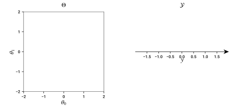
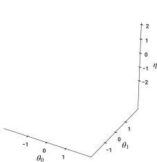
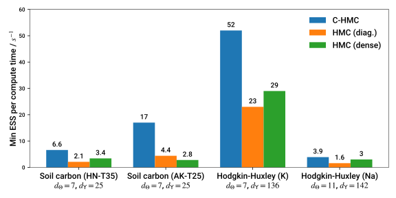

<h2 style="font-size: 140%;"><span style='color: #666;'>Lift and flow:</span> manifold MCMC methods for efficient inference in stiff posteriors</h2>


<div style='margin-top: -50px; display: flex; justify-content: space-between;; align-items: flex-end;'>
<span style='color: #666; font-size: 85%; display: inline-block;'>
  Matt Graham <a href="https://matt-graham.github.io">&lt;matt-graham.github.io&gt;</a>
</span>
<div style="width: 200px; display: inline-block;">

<p style="font-family: Arial; text-transform: uppercase; font-weight: bold; font-size: 11pt; margin: 0;">Research Software Development Group</p>
</div>
</div>


---

## Collaborators

<div style="margin: 0.25em; width: 40%; display: inline-block; text-align: center;">
  
  <p style="font-size: 80%;">Au Khai Xiang</p>
  
</div>
<div style="margin: 0.25em; width: 40%; display: inline-block; text-align: center;">
  
  <p style="font-size: 80%;">Alexandre Thiery</p>
  
</div>

---

## Stiff posterior distributions

<div style="position:relative; width:100%; height:150px;">
  <p class="fragment fade-out" data-fragment-index="0" style="width:100%; height: 100%; position:absolute;top:0;left:0;" >
    Challenging regime for approximate Bayesian inference: observed data constrains only some directions in the latent space.
  </p>
  <p class="fragment fade-in-then-out" data-fragment-index="0" style="width:100%; height: 100%; position:absolute;top:0;left:0;" >
    Gives rise to posteriors with varying scales across the latent space and complex geometrical features.
  </p>
  <p class="fragment fade-in-then-out" data-fragment-index="1" style="width:100%; height: 100%; position:absolute;top:0;left:0;" >
    In analogy with the usage for differential equations will term such posteriors as 'stiff'.
  </p>
  <p class="fragment fade-in-then-out" data-fragment-index="2" style="width:100%; height: 100%; position:absolute;top:0;left:0;" >
    Typically step size parameters for MCMC methods limited by smallest posterior scale.
  </p>
  <p class="fragment fade-in" data-fragment-index="3" style="width:100%; height: 100%; position:absolute;top:0;left:0;" >
    Results in slow exploration of non-constrained directions / regions of space.
  </p>
</div>

<div class="fragment fade-in" data-fragment-index="0" style="margin-top: 30px;">
  
  
</div>


---

## Example: Inverse problems

<div style="position:relative; width:100%; height:150px;">
  <p class="fragment fade-out" data-fragment-index="2" style="width:100%; height: 100%; position:absolute;top:0;left:0;" >
    In many scientific and engineering settings we are interested in solving *inverse problems*.
  </p>
  <p class="fragment fade-in-then-out" data-fragment-index="2" style="width:100%; height: 100%; position:absolute;top:0;left:0;" >
    Typically inverse problems are *ill-posed* and observations noisy $\rightarrow$ uncertainty about unknowns.
  </p>
  <p class="fragment fade-in-then-out" data-fragment-index="3" style="width:100%; height: 100%; position:absolute;top:0;left:0;" >
    In some cases high signal-to-noise ratio but uncertainty remains due to non-identifiability.
  </p>
  <p class="fragment fade-in" data-fragment-index="4" style="width:100%; height: 100%; position:absolute;top:0;left:0;" >
   Posterior may be concentrated in neigbourhood of a lower-dimensional manifold.
  </p>
</div>


<div style="position:relative; width:100%; height:400px;">
  <div data-fragment-index="0" style="width:100%; height: 100%; position:absolute; top:0; left:0; vertical-align: middle;" class="fragment fade-in-then-out">
    
    $$\nabla \cdot (\rho \nabla h) = f$$
  </div>
  <div data-fragment-index="1" style="width:100%; height: 100%; position:absolute; top:0; left:0; vertical-align: middle;" class="fragment fade-in">
    
    
    $C_M \td{V}{t} = \frac{E_\mathrm{Na} - V}{R_\mathrm{Na}} + \frac{E_\mathrm{K} - V}{R_\mathrm{K}} + \frac{E_\mathrm{L} - V}{R_\mathrm{L}}$
  </div>
</div>


Note:

Inverse problems - that is inferring the configuration of a model of a physical system given observations - are extremely common in scientific and engineering settings. For example:

We might have hydraulic head readings from a sensor network distributed across an aquifier, and want to infer what the underlying hydraulic conductivity field is in the aquifier which gives rise to these measurements. If we assume the system is in a steady state, a reasonable model may be a non-linear Poisson partial differential equation with prescribed boundary conditions, which we could numerically solve for example with a finite-element method.

As a second example, would be given recordings of the membrane voltage of a neuronal cell, for example from an in vitro patch-clamp experiment, the task of inferring the parameters of an electrophysiological model of action potential generation in the cell . In this case a simple single compartment model would be described by a system of ordinary differential equations governing the evolution of the membrane voltage, and voltage-gated ion channels in the cell.

Typically, inverse problems are ill-posed with the observed data partial and subject to noise. In such settings, Bayesian methodology offers a principled approach for combining prior knowledge with observations to infer the posterior distribution of plausible configurations of the model.

A particularly challenging setting is where the data are individually highly informative with a large signal-to-noise ratio but because of the inherent non-identifiability of the model, or sparsity of the observations, there is still significant remaining uncertainty. As we will see, such observations lead to a posterior which concentrates around a lower-dimensional manifold embedded in the model configuration space. The high-fidelity sparse observation regime is common in engineering settings where often the measurement process is carefully designed to minimise the effects of noise.

---

## Initial simplified setting

<p class="fragment fade-in" data-fragment-index="1">
  **Task**: Infer the unknown variables $\vct{\theta} \in \Theta \subseteq \mathbb{R}^{d_{\Theta}}$ given *noisy* observations $\vct{y} \in \set{Y} \subseteq \mathbb{R}^{d_{\set{Y}}}$ with
</p>

$$
  \vct{y} = F(\vct{\theta}) + \sigma \vct{\eta}
  \quad\text{and}\quad
  \vct{\eta} \sim \set{N}(\vct{0},\mathbf{I}_{d_{\set{Y}}}),
$$ <!-- .element: class="fragment fade-in" data-fragment-index="1" -->

<p class="fragment fade-in" data-fragment-index="2">where $F : \Theta \to \set{Y}$ generally *non-linear* and $\sigma > 0$.</p>

<p class="fragment fade-in" data-fragment-index="3">**Key assumption**: $F$ is differentiable.</p>

----

## Example: toy 2D model

Running example with $d_{\Theta} = 2$ and $d_{\set{Y}} = 1$ and

<span class="fragment fade-in" data-fragment-index="1">$\displaystyle F(\vct{\theta}) = \theta_1^2 + 3 \theta_0^2 \, (\theta_1^2 - 1)$, </span>
<span class="fragment fade-in" data-fragment-index="2">$\displaystyle y = 1$, </span>
<span class="fragment fade-in" data-fragment-index="3">$\displaystyle \sigma = 0.1$</span>


<div style="position:relative; width:100%; height:400px;">
  
  
  
  
  
</div>

----

## Bayesian approach

*Prior* beliefs about $\vct{\theta}$ &ndash; e.g. scale, smoothness &ndash; specified by a distribution with density $\rho$.

<p class="fragment fade-in" data-fragment-index="1">*Posterior* distribution then</p>

$$
  \underbrace{
    \vphantom{-\tfrac{1}{2\sigma^2}}
    \pi^\sigma(\dr\vct{\theta})
  }_{\text{posterior}}
  \propto
  \underbrace{
    \exp(-\tfrac{1}{2\sigma^2} \Vert\vct{y} -  F(\vct{\theta})\Vert^2)
  }_{\text{likelihood}}
  \,
  \underbrace{
    \vphantom{-\tfrac{1}{2\sigma^2}}
    \rho(\vct{\theta}) \,\dr\boldsymbol{\theta}
  }_{\text{prior}}.
$$
<!-- .element: class="fragment fade-in" data-fragment-index="1" -->

----

## Posterior in toy 2D model

$\vct{\theta} \stackrel{\textrm{prior}}{\sim} \mathcal{N}(\vct{0}, \mathbf{I}_{d_\Theta}) \implies \rho(\vct{\theta}) \propto \exp(-\tfrac{1}{2}\Vert\vct{\theta}\Vert^2)$


<div style="position:relative; width:100%; height:350px;">
  
  
  
</div>


----

## Posterior geometry as $\sigma \to 0$

In the small noise limit posterior concentrates on $\set{S} = \lbrace \vct{\theta} \in \Theta : F(\vct{\theta}) = \vct{y} \rbrace$.

<div style="position:relative; width:100%; height:300px;">
  
  
  
</div>

<p class="fragment fade-in" data-fragment-index="3">**Aim**: design Markov chain Monte Carlo (MCMC) method which remains efficient in $\sigma \to 0$ limit.</p>

---

## MCMC in toy 2D model

<div style="position:relative; width:100%; height:120px;">
  <p class="fragment fade-out" data-fragment-index="0" style="width:100%; height: 100%; position:absolute;top:0;left:0;" >
    MCMC methods generate a sequence of *dependent* samples that asymptotically are distributed according to target distribution $\pi^\sigma$.
  </p>
  <p class="fragment fade-in" data-fragment-index="0" style="width:100%; height: 100%; position:absolute;top:0;left:0; font-size: 90%;" >
    MCMC algorithms on $\mathbb{R}^{d_\Theta}$ include *random-walk Metropolis* (RWM), *Metropolis-adjusted Langevin algorithm* (MALA) &amp; *Hamiltonian Monte Carlo* (HMC)
  </p>
</div>


<video class="fragment fade-in" data-fragment-index="0" width="1300" height="500" controls loop>
  <source src="videos/toy-example-mcmc-sigma-0.5.mp4" type="video/mp4">
  Your browser does not support the video tag.
</video>

----

## MCMC in toy 2D model

<div style="position:relative; width:100%; height:80px;">
  <p class="fragment fade-out" data-fragment-index="0" style="width:100%; height: 100%; position:absolute;top:0;left:0;" >
    All of RWM, MALA and HMC have a step size $\epsilon$ controlling scale of proposals.
  </p>
  <p class="fragment fade-in" data-fragment-index="0" style="width:100%; height: 100%; position:absolute;top:0;left:0;" >
    As $\sigma$ become smaller $\epsilon$ needs to made smaller, reducing mixing speed.
  </p>
</div>


<video class="fragment fade-in" data-fragment-index="0" width="1300" height="500" controls loop>
  <source src="videos/toy-example-rwm.mp4" type="video/mp4">
  Your browser does not support the video tag.
</video>

----

## MCMC in toy 2D model

How does acceptance probability vary with $\sigma$ &amp; $\epsilon$?


----

## Manifold MCMC methods

<div style="position:relative; width:100%; height:120px;">
  <p class="fragment fade-out" data-fragment-index="0" style="width:100%; height: 100%; position:absolute;top:0;left:0;" >
    Anisotropic scaling of target distribution motivation for Riemannian-manifold (RM) MALA and HMC methods <small>(Girolami &amp; Calderhead, 2011; Xifara+, 2014)</small>.
  </p>
  <p class="fragment fade-in-then-out" data-fragment-index="0" style="width:100%; height: 100%; position:absolute;top:0;left:0;" >
    However in practice performance of RM-MALA and RM-HMC still degenerates as $\sigma \to 0$.
  </p>
  <p class="fragment fade-in" data-fragment-index="1" style="width:100%; height: 100%; position:absolute;top:0;left:0;" >
    We propose an alternative approach which *lifts the distribution* onto a manifold embedded in extended space and uses a *constrained* HMC method.
  </p>
</div>

<br />

<div style="position:relative; width:100%; height:370px;">
  
  
</div>

---

## Lifting the posterior distribution

<div style="position:relative; width:100%; height:130px;">
  <p class="fragment fade-out" data-fragment-index="0" style="width:100%; height: 100%; position:absolute;top:0;left:0;" >
    Consider extended space $(\vct{\theta},\vct{\eta}) \in \Theta \times \set{Y}$
  </p>
  <p class="fragment fade-in-then-out" data-fragment-index="0" style="width:100%; height: 100%; position:absolute;top:0;left:0;" >
    Define a manifold embedded in the extended space
    $$\displaystyle
      \set{M}^\sigma = \lbrace (\vct{\theta},\vct{\eta}) \in \Theta \times \set{Y} : F(\vct{\theta}) + \sigma \vct{\eta} = \vct{y} \rbrace
    $$
  </p>
  <p class="fragment fade-in-then-out" data-fragment-index="1" style="width:100%; height: 100%; position:absolute;top:0;left:0;" >
    Define a manifold embedded in the extended space
    $$
      \set{M}^\sigma = \lbrace (\vct{\theta},\vct{\eta}) \in \Theta \times \set{Y} : \vct{\eta} = \tfrac{1}{\sigma}(\vct{y} - F(\vct{\theta})) \rbrace
    $$
  </p>
  <p class="fragment fade-in-then-out" data-fragment-index="2" style="width:100%; height: 100%; position:absolute;top:0;left:0;" >
    Posterior distribution $\pi^\sigma$ on $\Theta$ can be 'lifted' to a distribution $\bar{\pi}^\sigma$ on to $\set{M}^\sigma$.
  </p>
  <p class="fragment fade-in" data-fragment-index="3" style="width:100%; height: 100%; position:absolute;top:0;left:0;" >
    Intuitively can consider $\bar{\pi}^\sigma$ as extended prior $\rho(\dr\vct{\theta}) \otimes \mathcal{N}(\mathbf{0}, \mathbf{I}_{d_\mathcal{Y}})$ on $\Theta \times \set{Y}$ *restricted* to $\set{M}^\sigma$.
  </p>
</div>

<div style="position:relative; width:100%; height:370px;">
  
  
  
  
  
</div>

----

## Lifting the posterior distribution

<div class="third-column">
  <span style='font-size: 50%;'>$\sigma = 0.5$</span>
  
</div>
<div class="third-column fragment fade-in" data-fragment-index="0">
  <span style='font-size: 50%;'>$\sigma = 0.1$</span>
  
</div>
<div class="third-column fragment fade-in" data-fragment-index="1">
  <span style='font-size: 50%;'>$\sigma = 0.02$</span>
  
</div>

<p class="fragment fade-in" data-fragment-index="2">**Key point:** lifted posterior distribution $\bar{\pi}^
\sigma$ remains diffuse as $\sigma \to 0$.</p>

----

## Lifted posterior density

Manifold $\set{M}^\sigma$ has zero Lebesgue measure therefore $\bar{\pi}^\sigma$ has no Lebesgue density.

<p class="fragment fade-in" data-fragment-index="1">
However, $\bar{\pi}^\sigma$ has a density with respect to the $d_\Theta$-dimensional Hausdorff measure $\set{H}_{d_\Theta}$ on the ambient space $\Theta \times \set{Y}$ <small>(Diaconis+, 2011)</small>
</p>

$$
\bar{\pi}^\sigma(\dr\vct{\theta}, \dr\vct{\eta}) \propto
\frac{
  \exp(-{\textstyle\frac{1}{2}\Vert\vct{\eta}\Vert^2})
  \rho(\vct{\theta})
}{
|\mathbf{D} F(\vct{\theta}) \mathbf{D} F(\vct{\theta})\tr + \sigma^2\mathbf{I}_{d_{\set{Y}}}|^{\frac{1}{2}}
}
\,\set{H}_{d_\Theta}(\dr\vct{\theta}, \dr\vct{\eta}).
$$ <!-- .element: class="fragment fade-in" data-fragment-index="2" -->

---

## Computational cost

Evaluating lifted density requires computing

  * $\mathbf{D}F(\vct{\theta})$: $\mathcal{O}(\min(d_\set{Y}, d_\set{\Theta})) \times \,$ cost of computing $F$ <!-- .element: class="fragment fade-in" data-fragment-index="1" -->
  * $|\mathbf{D} F(\vct{\theta}) \mathbf{D} F(\vct{\theta})\tr + \sigma^2\mathbf{I}_{d_{\set{Y}}}|$: $\mathcal{O}(\min(d_\set{Y}d_\Theta^2, d_\Theta d_\set{Y}^2))$ <!-- .element: class="fragment fade-in" data-fragment-index="2" -->

Often one of $d_\mathcal{Y}$ or $d_\Theta$ is 'small'. <!-- .element: class="fragment fade-in" data-fragment-index="3" -->

<p class="fragment fade-in" data-fragment-index="4">
In more general cases we can often exploit sparsity in $\mathbf{D}F$ to reduce costs, e.g. Markovian structure in state space models / diffusions <small>(G, Thiery & Beskos, 2020)</small>. </p>

---

<h2 style="line-height: 80%;">Constrained Hamiltonian Monte Carlo <small>(Hartmann &amp; Schutte, 2005; Brubaker+, 2012; Leli&egrave;vre+, 2019)</small> </h2>

MCMC method based on simulating constrained Hamiltonian dynamics defined by DAEs <!-- .element: class="fragment fade-in-then-semi-out" data-fragment-index="0" -->

$$
  \dot{\vct{q}} = \vct{p},
  ~~
  \dot{\vct{p}} = -\nabla U(\vct{q}) + \mathbf{D} C(\vct{q})\tr\vct{\lambda},
  ~~
  C(\vct{q}) = \vct{0},
$$ <!-- .element: class="fragment fade-in-then-semi-out" data-fragment-index="0" -->

<div style="position:relative; width:100%; height:120px;">
  <p class="fragment fade-in-then-out" data-fragment-index="1" style="width:100%; height: 100%; position:absolute;top:0;left:0;" >
    Dynamics marginally leave distribution with density $\exp(-U(\vct{q}))$ with respect to Hausdorff measure on constraint manifold $\lbrace \vct{q}: C(\vct{q}) = \vct{0}\rbrace$, invariant.
  </p>
  <p class="fragment fade-in-then-out" data-fragment-index="2" style="width:100%; height: 100%; position:absolute;top:0;left:0;" >
    In our case: $\vct{q} = (\vct{\theta}, \vct{\eta})$, $C(\vct{\theta},\vct{\eta}) = F(\vct{\theta}) + \sigma\vct{\eta} - \vct{y}$ and 
    $U(\vct{\theta},\vct{\eta}) = -\log\bar{\pi}^\sigma(\vct{\theta},\vct{\eta})$.
    <!--
    <span style='font-size: 87%;'>$U(\vct{\theta},\vct{\eta}) = -\log\rho(\vct{\theta}) + {\textstyle \frac{1}{2}}\Vert\vct{\eta}\Vert^2 +  {\textstyle \frac{1}{2}}\log|\mathbf{D} F(\vct{\theta})\mathbf{D} F(\vct{\theta})\tr + \sigma^2\mathbf{I}|$</span>.
    -->
  </p>
  <p class="fragment fade-in" data-fragment-index="3" style="width:100%; height: 100%; position:absolute;top:0;left:0;" >
    Simulate using a constraint-preserving symplectic integrator such as RATTLE <small>(Andersen, 1983)</small> or geodesic methods <small>(Leimkuhler &amp; Matthews, 2016)</small>.
  </p>
</div>

----

## Constrained HMC on lifted distribution

<video width="540" height="540" controls loop>
  <source src="videos/constrained-hmc-on-lifted-distribution.mp4" type="video/mp4">
  Your browser does not support the video tag.
</video>

----

## Manifold MCMC methods in Python


<div style="position:relative; width:100%; height:120px;">
  <p class="fragment fade-out" data-fragment-index="0" style="width:100%; height: 100%; position:absolute;top:0;left:0;">
    High level interface for running manifold MCMC methods - only need to define prior density and constraint function. 
  </p>
  <p class="fragment fade-in-then-out" data-fragment-index="0" style="width:100%; height: 100%; position:absolute;top:0;left:0;"> 
    Derivatives can be partially or fully automatically computed using algorithmic differentiation.
  </p>
  <p class="fragment fade-in-then-out" data-fragment-index="1" style="width:100%; height: 100%; position:absolute;top:0;left:0;">
    Implements equivalent algorithms to *Stan* to adaptively tune step size and number of steps per transition <small>(Hoffman &amp; Gelman, 2014; Betancourt, 2017)</small>.
  </p>
  <p class="fragment fade-in" data-fragment-index="2" style="width:100%; height: 100%; position:absolute;top:0;left:0;">
    Available on Github at [git.io/mici.py](https://git.io/mici.py) or  

    ```pip install mici```
  </p>
</div>

---

## Extending to a more a general setting

Straightforward to extend approach to variable / unknown noise scale and non-Gaussian noise

$$
  \vct{y} = F(\vct{\theta}) + S(\vct{\theta}) \vct{\eta}
  \quad\text{and}\quad
  \vct{\eta} \sim \nu,
$$ <!-- .element: class="fragment fade-in" data-fragment-index="0" -->

<div style="position:relative; width:100%; height:130px;">
  <p class="fragment fade-in-then-out" data-fragment-index="1" style="width:100%; height: 100%; position:absolute;top:0;left:0;" >
    Assume $F$ and $S$ both differentiable and $\nu$ has a differentiable Lebesgue density function.
  </p>
  <p class="fragment fade-in-then-out" data-fragment-index="2" style="width:100%; height: 100%; position:absolute;top:0;left:0;" >
    Manifold in the extended space
    $$\displaystyle
      \set{M} = \lbrace (\vct{\theta},\vct{\eta}) \in \Theta \times \set{Y} : F(\vct{\theta}) + S(\vct{\theta}) \vct{\eta} = \vct{y} \rbrace
    $$
  </p>
  <p class="fragment fade-in-then-out" data-fragment-index="3" style="width:100%; height: 100%; position:absolute;top:0;left:0;" >
    Manifold in the extended space
    $$
      \set{M} = \lbrace (\vct{\theta},\vct{\eta}) \in \Theta \times \set{Y} : \vct{\eta} = S(\vct{\theta})^{-1}(\vct{y} - F(\vct{\theta})) \rbrace
    $$
  </p>
  <p class="fragment fade-in" data-fragment-index="4" style="width:100%; height: 100%; position:absolute;top:0;left:0;" >
    Posterior distribution $\pi$ on $\Theta$ can be 'lifted' to a distribution $\bar{\pi}$ on to $\set{M}$.
  </p>
</div>


----

## Toy example: 'funnel' distribution

$$ y = \theta_0 + \exp(\theta_1) \eta , \quad \vct{\theta} \sim \nrm(\vct{0}, \idmtx_{2}), \quad \eta \sim \nrm(0, 1)$$

Assume we observe $y = 0$ <!-- .element: class="fragment fade-in" data-fragment-index="1" -->


----

## MCMC in funnel distribution

<video style="margin-top: -10px;" width="900" loop controls>
  <source src="videos/funnel-example-hmc.mp4" type="video/mp4">
  Your browser does not support the video tag.
</video>

----

## Lifting the funnel distribution

<video style="margin-top: -10px;" width="500" height="500" controls loop>
  <source src="videos/lifting-funnel-distribution-square.mp4" type="video/mp4">
  Your browser does not support the video tag.
</video>


----

## Constrained HMC in funnel 
<video style="margin-top: -10px;" width="500" height="500" controls loop>
  <source src="videos/constrained-hmc-on-funnel-distribution.mp4" type="video/mp4">
  Your browser does not support the video tag.
</video>

---

## Numerical experiments

----

## Simulated data with fixed $\sigma$

<div class='third-column fragment fade-in-then-semi-out' data-fragment-index="0">
  <p style='font-size: 60%; text-align: center;'>&nbsp;&nbsp;&nbsp;&nbsp;&nbsp;Running 2D example</p>
  
</div>
<div class='third-column fragment fade-in' data-fragment-index="1">
  <p style='font-size: 60%; text-align: center;'>ODE parameter inference</p>
  
</div>
<div class='third-column fragment fade-in' data-fragment-index="1">
  <p style='font-size: 60%; text-align: center;'>&nbsp;&nbsp;&nbsp;&nbsp;&nbsp;PDE inverse problem</p>
  
</div>


----

## Real data with unknown $\sigma$

ODE models for soil carbon flow and neuronal ion channel dynamics fitted to experimental data.




---

## Summary

  * Propose MCMC method that remains efficient in 'stiff' posteriors with varying scales. <!-- .element: class="fragment semi-fade-out" data-fragment-index="1" -->
  * Combining with dynamic HMC algorithm and step size adaptation gives tuning-free approach. <!-- .element: class="fragment fade-in-then-semi-out" data-fragment-index="1" -->
  * Key requirement is for forward function $F$ to be differentiable - e.g. not applicable to discrete $\vct{y}$. <!-- .element: class="fragment fade-in-then-semi-out" data-fragment-index="2" -->
  * In general cost scales as $\mathcal{O}(\min(d_\mathcal{Y}^2 d_\Theta, d_\mathcal{Y} d_\Theta^2))$. <!-- .element: class="fragment fade-in-then-semi-out" data-fragment-index="3" -->
  * By exploiting local dependence structure can scale to higher dimensional latent spaces. <!-- .element: class="fragment fade-in" data-fragment-index="4" -->

---

## Thank you for listening!

Preprints  <i class="ai ai-arxiv fa-fw"></i>  
[arxiv.org/abs/1912.02982](https://arxiv.org/abs/1912.02982)
[arxiv.org/abs/2003.03950](https://arxiv.org/abs/2003.03950)

Code <i class="fa fa-github fa-fw"></i>   
[git.io/man-lift](https://git.io/man-lift)

----

## References

<ul style="font-size: 50%;">
   <li>
     H. C. Andersen.
     RATTLE: A 'velocity' version of the SHAKE algorithm for molecular dynamics calculations.
     *Journal of Comp. Physics*, 1983.
   </li>
   <li>
     C. Hartmann and C. Schutte.
     A constrained hybrid Monte Carlo algorithm and the problem of calculating the free energy in several variables.
     *ZAMM-Zeitschrift f&uuml;r Angewandte Mathematik*, 2005.
   </li>
   <li>
     M. Girolami and B. Calderhead.
     Riemann manifold Langevin and Hamiltonian Monte Carlo methods.
     *J-RSS (Series B)*, 2011.
   </li>
   <li>
     M. A. Brubaker, M. Salzmann and R. Urtasun.
     A family of MCMC methods on implicitly defined manifolds.
     *AISTATS*, 2012.
   </li>
   <li>
     P. Diaconis, S. Holmes and M. Shahshahani. 
     Sampling from a Manifold. 
     *Advances in Modern Statistical Theory and Applications*, 2013.
   </li>
   <li>
     M. D. Hoffman and A. Gelman. The  No-U-turn sampler: adaptively setting path lengths in Hamiltonian Monte 
     Carlo. *Journal of Machine Learning Research*, 15(1), pp.1593-1623, 2014.
   </li>
   <li>
     T. Xifara, C. Sherlock, S. Livingstone, S. Byrne and M. Girolami.
     Langevin diffusions and the Metropolis-adjusted Langevin algorithm.
     *Statistics &amp; Probability Letters*, 2014.
   </li>
   <li>
     B. Leimkuhler and C. Matthews. Efficient molecular dynamics using geodesic integration and solvent–solute splitting. *Proceedings of the Royal Society A: Mathematical, Physical and Engineering Sciences*, 472(2189), 2016.
   </li>
   <li>
     M. Betancourt. A conceptual introduction to Hamiltonian Monte Carlo. *arXiv 1701.02434*,  2017.
   </li>
   <li>
     E. Zappa, M. Holmes-Cerfon and J. Goodman. Monte Carlo on manifolds: sampling densities and integrating functions. *Communications on Pure and Applied Mathematics*, 71(12), 2609-2647, 2018.
   </li>
   <li>
    T. Leli&egrave;vre, M. Rousset and G. Stoltz.
    Hybrid Monte Carlo methods for sampling probability measures on submanifolds.
    *Numerische Mathematik*, 2019.
  </li>
</div>


---

## Equivalent dynamic in latent space $\Theta$

Manifold $\set{M}^\sigma$ is graph of $\tfrac{1}{\sigma}(\vct{y} - F(\vct{\theta}))$ over $\Theta$. <!-- .element: class="fragment fade-in-then-semi-out" data-fragment-index="1" -->

Defining  $\gamma(\vct{\theta}) = (\vct{\theta}, \tfrac{1}{\sigma}(\vct{y} - F(\vct{\theta}))$ then $\set{M}^\sigma = \gamma(\Theta)$. <!-- .element: class="fragment fade-in-then-semi-out" data-fragment-index="2" -->

If $F$ is smooth then $\gamma$ is a diffeomorphism and $\set{M}^\sigma$ is diffeomorphic to $\Theta$. <!-- .element: class="fragment fade-in" data-fragment-index="3" -->

----

## Equivalent dynamic in latent space $\Theta$

<div style="position:relative; width:100%; height:120px;">
  <div class="fragment fade-out" data-fragment-index="0" style="width:100%; height: 100%; position:absolute;top:0;left:0;">

    <p>Constrained Hamiltonian dynamic on $\set{M}^\sigma$ </p> 

    $$
      (\dot{\vct{\theta}}, \dot{\vct{\eta}}) = (\vct{p}_{\vct{\theta}}, \vct{p}_{\vct{\eta}}),
      \\\\
      (\dot{\vct{p}}_{\vct{\theta}}, \dot{\vct{p}}_{\vct{\eta}})= \nabla \log\bar{\pi}^\sigma(\vct{\theta}, \vct{\eta}) + \begin{bmatrix}\mathbf{D} F(\vct{\theta}) &\sigma\mathbf{I}\end{bmatrix}\tr\vct{\lambda},
      \\\\
      F(\vct{\theta}) + \sigma \vct{\eta} = \vct{y}.
    $$
  </div>
  <div class="fragment fade-in-then-out" data-fragment-index="0" style="width:100%; height: 100%; position:absolute;top:0;left:0;"> 
    <p>Equivalent under $\gamma$ to Hamiltonian dynamic on $\Theta$  </p>

    $$
      \dot{\vct{\theta}} = \mtx{M}(\vct{\theta})^{-1} \vct{p}_{\vct{\theta}},
      \\\\
      \dot{\vct{p}}_{\vct{\theta}} = 
      \nabla\log\pi^\sigma(\vct{\theta})
      -\tfrac{1}{2}\nabla\log\|\mtx{M}(\vct{\theta})\|,
      \\\\
      \mtx{M}(\vct{\theta}) = \tfrac{1}{\sigma^2}\mathbf{D}F(\vct{\theta})\mathbf{D}F(\vct{\theta})\tr + \mathbf{I}.
     $$
  </div>
  <div class="fragment fade-in" data-fragment-index="2" style="width:100%; height: 100%; position:absolute;top:0;left:0;">
  
    <p class="fragment fade-in-then-semi-out" data-fragment-index="2">Constrained HMC dynamic therefore equivalent to RM-HMC dynamic for specific choice of metric.</p>
    <p class="fragment fade-in-then-semi-out" data-fragment-index="3">However, fixed point iterations in implicit integrators used with RM-HMC are slower to converge and less robust than Newton-based projection step in geodesic integrator.</p>
    <p class="fragment fade-in" data-fragment-index="4">For fixed $\sigma$ setting with $\rho = \nrm(\vct{0},\mathbf{I})$, metric  equal to expected Fisher information plus prior covariance.</p>
  </div>
</div>


----

## Geodesic integrator step


<div style="position:relative; width:100%; height:120px;">
  <p class="fragment fade-out" data-fragment-index="0" style="width:100%; height: 100%; position:absolute;top:0;left:0;">
    To enforce constraints in each step solve non-linear equations to project $\vct{q}$ on to manifold and linear equations to *project* $\vct{p}$ on to tangent space $\set{T}_\set{M}(\vct{q})$.
  </p>
  <p class="fragment fade-in-then-out" data-fragment-index="0" style="width:100%; height: 100%; position:absolute;top:0;left:0;">
    Non-linear system can be efficiently solved using Newton's method: typically converges within 5&ndash;10 iterations.
  </p>
  <p class="fragment fade-in" data-fragment-index="1" style="width:100%; height: 100%; position:absolute;top:0;left:0;">
    *Important implementation detail*:  
    Need to do reversibility check <small>(Zappa+, 2018)</small> by also running time-reversed step.
  </p>
</div>


----

## Example posterior: Hodgkin-Huxley (K)


----

## Example posterior: Soil (AK-T25)


