## <span style='color: #aaa;'>Manifold lifting:</span> Scaling MCMC to the vanishing noise regime


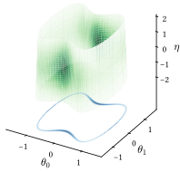
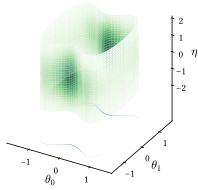

<span style='color: #666; font-size: 85%;'>
  Matt Graham - <span style='color: #444;'>Newcastle University &amp; Alan Turing Institute</apan>
</span>

---

## Collaborators

<div style="margin-top: 0.5em; width: 45%; float: left; text-align: right;">
  
  <p>Khai Xiang Au</p>
</div>
<div style="margin-top: 2.25em; width: 10%; float: left; text-align: center;">
  &amp;
</div>
<div style="margin-top: 0.5em; width: 45%; float: left; text-align: left;">
  
  <p>Alex Thiery</p>
</div>


---

## Problem statement

<p class="fragment fade-in" data-fragment-index="1">
  **Task**: Infer a latent vector $\vct{\theta} \in \Theta \subseteq \mathbb{R}^{d_{\Theta}}$ given noisy observations $\vct{y} \in \set{Y} = \mathbb{R}^{d_{\set{Y}}}$ with
</p>

$$
  \vct{y} = F(\vct{\theta}) + \sigma \vct{\eta}
  \quad\text{and}\quad
  \vct{\eta} \sim \set{N}(\vct{0},\mathbf{I}_{d_{\set{Y}}}),
$$ <!-- .element: class="fragment fade-in" data-fragment-index="1" -->

where $F : \Theta \to \set{Y}$ generally non-linear and $\sigma > 0$. <!-- .element: class="fragment fade-in" data-fragment-index="2" -->

----

## Problem statement

**Bayesian approach**: Assume prior beliefs given as a distribution with density $\rho$ wrt Lebesgue measure.  

Posterior distribution then<!-- .element: class="fragment fade-in" data-fragment-index="1" -->

$$
  \pi^\sigma(\dr\vct{\theta}) \propto
  \sigma^{-d_\set{Y}}
  \exp\big(
    {\textstyle-\frac{1}{2 \sigma^2}} \Vert\vct{y} -  F(\vct{\theta})\Vert^2
  \big) 
  \,\rho(\vct{\theta}) \,\dr\boldsymbol{\theta}.
$$
<!-- .element: class="fragment fade-in" data-fragment-index="1" -->

<p class="fragment fade-in" data-fragment-index="2">**Aim**: design approximate inference method which remains efficient in $\sigma \to 0$ limit.</p>

---

## Toy 2D model

Running example with $d_{\Theta} = 2$ and $d_{\set{Y}} = 1$ and

$$ 
  \vct{\theta} \stackrel{\textrm{prior}}{\sim} \set{N}(\vct{0}, \mathbf{I}_{d_\Theta}), 
  ~~ 
  F(\vct{\theta}) = 
  \theta_1^2 + 3 \theta_0^2 \, (\theta_1^2 - 1),
  ~~
  y = 1.
$$

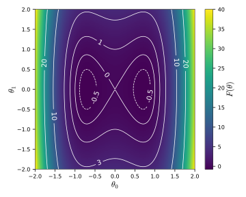


---

## Posterior geometry as $\sigma \to 0$

In the vanishing noise limit posterior concentrates on $\set{S} = \lbrace \vct{\theta} \in \Theta : F(\vct{\theta}) = \vct{y} \rbrace$.<!-- .element: class="fragment fade-in" data-fragment-index="1" -->

<div class="third-column fragment fade-in" data-fragment-index="2">
  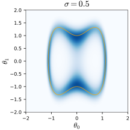
</div>
<div class="third-column fragment fade-in" data-fragment-index="3">
  
</div>
<div class="third-column fragment fade-in" data-fragment-index="4">
  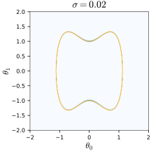
</div>

Strong anisotropy tangential and normal to $\set{S}$: challenging regime for MCMC methods.<!-- .element: class="fragment fade-in" data-fragment-index="5" -->

---

## MCMC performance in original space

Most general purpose MCMC algorithms on $\mathbb{R}^{d_\Theta}$ have a step size $\epsilon$ controlling scale of proposals.<!-- .element: class="fragment fade-in-then-semi-out" data-fragment-index="1" -->

How does acceptance probability vary with $\sigma$ &amp; $\epsilon$?<!-- .element: class="fragment fade-in-then-semi-out" data-fragment-index="2" -->

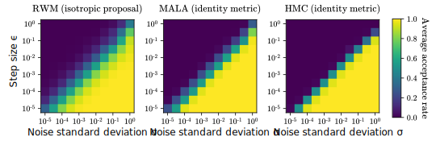

----

## Manifold MCMC methods

<div style="position:relative; width:100%; height:120px;">
  <p class="fragment fade-in-then-out" data-fragment-index="0" style="width:100%; height: 100%; position:absolute;top:0;left:0;" >
    Anisotropic scaling of target distribution motivation behind Riemannian-manifold Langevin and HMC methods <small>(Girolami &amp; Calderhead, 2011; Xifara+, 2014)</small>.
  </p>
  <p class="fragment fade-in-then-out" data-fragment-index="1" style="width:100%; height: 100%; position:absolute;top:0;left:0;" >
    However when discretised with implicit leapfrog method performance still degenerates as $\sigma \to 0$.
  </p>
  <p class="fragment fade-in" data-fragment-index="2" style="width:100%; height: 100%; position:absolute;top:0;left:0;" >
    Instead of specifying manifold geometry intrinsically via metric, *embed in extended space* and use *constrained leapfrog integrator*.
  </p>
</div>

<br />

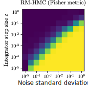
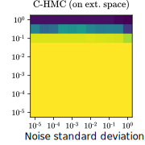

---

## Lifting the posterior distribution

Consider extended space $(\vct{\theta},\vct{\eta}) \in \Theta \times \set{Y}$ and define embedded manifold<!-- .element: class="fragment fade-in-then-semi-out" data-fragment-index="1" -->

$$
  \set{M}^\sigma = \lbrace (\vct{\theta},\vct{\eta}) \in \Theta \times \set{Y} : F(\vct{\theta}) + \sigma \vct{\eta} = \vct{y} \rbrace.
$$
<!-- .element: class="fragment fade-in-then-semi-out" data-fragment-index="1" -->

Posterior distribution $\pi^\sigma$ on $\Theta$ can be 'lifted' to distribution $\bar{\pi}^\sigma$ on to $\set{M}^\sigma$<!-- .element: class="fragment fade-in" data-fragment-index="2" -->

$$
  \bar{\pi}^\sigma(\dr\vct{\theta}, \dr\vct{\eta}) \propto
  \frac{
    \exp(-{\textstyle\frac{1}{2}\Vert\vct{\eta}\Vert^2})
    \rho(\vct{\theta}) \mathbb{1}_{\mathcal{M}^\sigma}(\dr\boldsymbol{\theta})
  }{
  |\mathbf{D} F(\vct{\theta}) \mathbf{D} F(\vct{\theta})\tr + \sigma^2\mathbf{I}_{d_{\set{Y}}}|^{\frac{1}{2}}
  }
  \,\set{H}_{d_\Theta}(\dr\vct{\theta}, \dr\vct{\eta}).
$$
<!-- .element: class="fragment fade-in" style="font-size: 85%;" data-fragment-index="2" -->

----

## Lifting the posterior distribution

Lifted distribution $\bar{\pi}^
\sigma$ (green) and original posterior $\pi^
\sigma$ (blue) for running example<!-- .element: class="fragment fade-in" data-fragment-index="1" -->

<div class="third-column fragment fade-in" data-fragment-index="2">
  <span style='font-size: 50%;'>$\sigma = 0.5$</span>
  
</div>
<div class="third-column fragment fade-in" data-fragment-index="3">
  <span style='font-size: 50%;'>$\sigma = 0.1$</span>
  
</div>
<div class="third-column fragment fade-in" data-fragment-index="4">
  <span style='font-size: 50%;'>$\sigma = 0.02$</span>
  
</div>

<p class="fragment fade-in" data-fragment-index="5">**Key point:** lifted posterior distribution $\bar{\pi}^
\sigma$ remains diffuse as $\sigma \to 0$.</p>

---

<h2 style="line-height: 80%;">Constrained Hamiltonian Monte Carlo <small>(Hartmann &amp; Schutte, 2005; Brubaker+, 2012; Leli&egrave;vre+, 2019)</small> </h2>

MCMC method based on simulating constrained Hamiltonian dynamics defined by DAEs <!-- .element: class="fragment fade-in-then-semi-out" data-fragment-index="1" -->

$$
  \dot{\vct{q}} = \vct{p},
  ~~
  \dot{\vct{p}} = -\nabla U(\vct{q}) + \mathbf{D} C(\vct{q})\tr\vct{\lambda},
  ~~
  C(\vct{q}) = \vct{0},
$$ <!-- .element: class="fragment fade-in-then-semi-out" data-fragment-index="1" -->

<div style="position:relative; width:100%; height:120px;">
  <p class="fragment fade-in-then-out" data-fragment-index="2" style="width:100%; height: 100%; position:absolute;top:0;left:0;" >
    In our case: $\vct{q} = (\vct{\theta}, \vct{\eta})$, $C(\vct{\theta},\vct{\eta}) = F(\vct{\theta}) + \sigma\vct{\eta} - \vct{y}$ and <span style='font-size: 87%;'>$U(\vct{\theta},\vct{\eta}) = -\log\rho(\vct{\theta}) + {\textstyle \frac{1}{2}}\Vert\vct{\eta}\Vert^2 +  {\textstyle \frac{1}{2}}\log|\mathbf{D} F(\vct{\theta})\mathbf{D} F(\vct{\theta})\tr + \sigma^2\mathbf{I}|$</span>.
  </p>
  <p class="fragment fade-in-then-out" data-fragment-index="3" style="width:100%; height: 100%; position:absolute;top:0;left:0;" >
    Simulate using a constraint-preserving symplectic integrator such as RATTLE <small>(Andersen, 1983)</small>.
  </p>
  <p class="fragment fade-in" data-fragment-index="4" style="width:100%; height: 100%; position:absolute;top:0;left:0;">
    To enforce constraints in each step solve non-linear equations to project $\vct{q}$ on to manifold and linear equations to *project* $\vct{p}$ on to tangent space $\set{T}_\set{M}(\vct{q})$.
  </p>
</div>

----

## Constrained HMC on lifted distribution

<video width="540" height="540" autoplay loop>
  <source src="videos/constrained-hmc-on-lifted-distribution.mp4" type="video/mp4">
  Your browser does not support the video tag.
</video>

----

## Manifold MCMC methods in Python


Available on Github at [git.io/mici.py](https://git.io/mici.py) or 

```pip install mici```

---

## Sampling efficiency

<div class='third-column fragment fade-in-then-semi-out' data-fragment-index="0">
  <p style='font-size: 60%; text-align: center;'>&nbsp;&nbsp;&nbsp;&nbsp;&nbsp;Running 2D example</p>
  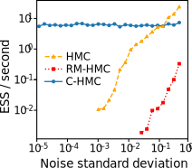
</div>
<div class='third-column fragment fade-in' data-fragment-index="1">
  <p style='font-size: 60%; text-align: center;'>ODE parameter inference</p>
  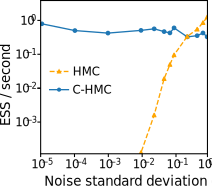
</div>
<div class='third-column fragment fade-in' data-fragment-index="1">
  <p style='font-size: 60%; text-align: center;'>&nbsp;&nbsp;&nbsp;&nbsp;&nbsp;PDE inverse problem</p>
  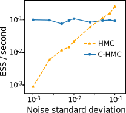
</div>


----

## Conclusions

  * Propose an MCMC method with efficiency that remains efficient as $\sigma \to 0$. <!-- .element: class="fragment semi-fade-out" data-fragment-index="1" -->
  * Relies on forward function $F$ being differentiable. <!-- .element: class="fragment fade-in-then-semi-out" data-fragment-index="1" -->
  * Cost scales as $\mathcal{O}(\min(d_\mathcal{Y}^2 d_\Theta, d_\mathcal{Y} d_\Theta^2))$. <!-- .element: class="fragment fade-in-then-semi-out" data-fragment-index="2" -->
  * Combining with dynamic HMC algorithms and step size adaptation gives tuning-free approach. <!-- .element: class="fragment fade-in-then-semi-out" data-fragment-index="3" -->
  * Straightforward to generalise to models with non-isotropic / variable noise: $\boldsymbol{y} = F(\boldsymbol{\theta}) + S(\boldsymbol{\theta}) \boldsymbol{\eta}$. <!-- .element: class="fragment fade-in" data-fragment-index="4" -->


---

## References

<ul style="font-size: 70%;">
   <li>
     K. X. Au, M. M. Graham and A. H. Thiery. 
     Manifold lifting: scaling MCMC methods to the vanishing noise regime. 
     *arxiv:2003.03950*, 2020.
   </li>
   <li>
     M. Girolami and B. Calderhead. 
     Riemann manifold Langevin and Hamiltonian Monte Carlo methods. 
     *J-RSS (Series B)*, 2011.
   </li>
   <li>
     T. Xifara, C. Sherlock, S. Livingstone, S. Byrne and M. Girolami. 
     Langevin diffusions and the Metropolis-adjusted Langevin algorithm.  
     *Statistics &amp; Probability Letters*, 2014.
   </li>
   <li>
     H. C. Andersen. 
     RATTLE: A 'velocity' version of the SHAKE algorithm for molecular dynamics calculations. 
     *Journal of Comp. Physics*, 1983.
   </li>
</div>

----

## References

<ul style="font-size: 70%;">
   <li>
     C. Hartmann and C. Schutte. 
     A constrained hybrid Monte Carlo algorithm and the problem of calculating the free energy in several variables. 
     *ZAMM-Zeitschrift f&uuml;r Angewandte Mathematik*, 2005.
   </li>
   <li>
     M. A. Brubaker, M. Saelzmann and R. Urtasun. 
     A family of MCMC methods on implicitly defined manifolds. 
     *AISTATS*, 2012.
   </li>
   <li>
     T. Leli&egrave;vre, M. Rousset and G. Stoltz. 
     Hybrid Monte Carlo methods for sampling probability measures on submanifolds. 
     *Numerische Mathematik*, 2019.
   </li>
</div>
