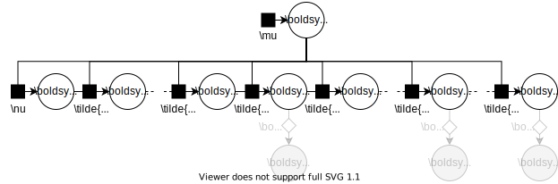
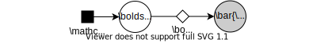
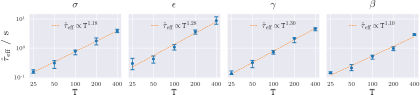

# Manifold MCMC methods for inference in diffusion models


<h2> <span style='font-size: 80%'>Matt Graham, Newcastle University</span> </h2>
<h2> <small>Joint work with Alex Thiery (NUS) and Alex Beskos (UCL)</small> </h2>


Note: 

Hello. I am going to talk today about a method for performing Bayesian inference in diffusion models using manifold Markov chain Monte Carlo methods. This is joint work I completed in collaboration with Alex Thiery at the National University of Singapore and Alex Beskos at University College London.

---

## High-level summary

<p class="fragment fade-in-then-semi-out" data-fragment-index="0">**Task:** infer the posterior on the parameters of a diffusion given partial observations at $\intg{T}$ times.</p>


**Why this is a challenging problem:**<!-- .element: class="fragment fade-in" data-fragment-index="1" -->

  * Transition densities generally intractable. <!-- .element: class="fragment fade-in" data-fragment-index="2" -->
  * Necessitates using a time-discretisation. <!-- .element: class="fragment fade-in" data-fragment-index="3" -->
  * Resulting latent space very high-dimensional. <!-- .element: class="fragment fade-in" data-fragment-index="4" -->
  * Strong dependencies between variables. <!-- .element: class="fragment fade-in" data-fragment-index="5" -->

Note:

I will start off with a high-level summary of the problem and a sketch of our proposed approach to help give a feel for the idea, and also so that you can decide whether its worthing sticking out the next 30 minutes!

The problem we consider is that of inferring the posterior distribution on the parameters of a diffusion process, given partial observations of that process at a set of T discrete times.

This is a challenging inferential task for several reasons.

In general non-linear diffusion models we will not be able to exactly evaluate the transition densities of the latent process.

This intractability typically requires us to instead work with an approximate time-discretisation of the latent process, and use a data-augmentation approach in which we jointly infer the discretised latent process and parameters.

As we want to use a fine-discretisation to control the approximation error this typically results in a very high dimensional latent space.

Further the parameters and latent process are often strongly coupled under the posterior, which leads to a challenging posterior geometry for MCMC methods to explore, with Gibbs-like schemes in which we alternate updating the parameters and latent process often mixing poorly.

---

## Sketch of proposed approach

  1. Formulate generative model as a differentiable map from latent variables to observations. <!-- .element: class="fragment fade-in" data-fragment-index="0" -->
  2. Recognise posterior as a distribution with known density on an embedded manifold. <!-- .element: class="fragment fade-in" data-fragment-index="1" -->
  3. Apply constrained Hamiltonian Monte Carlo method to sample from posterior. <!-- .element: class="fragment fade-in" data-fragment-index="2" -->
  4. Exploit Markovian structure of diffusions to reduce $\widetilde{\mathcal{O}}(\intg{T}^3)$ constrained HMC cost to $\widetilde{\mathcal{O}}(\intg{T})$. <!-- .element: class="fragment fade-in" data-fragment-index="3" -->

Note:

Using a data-augmentation approach we formulate a non-centered parameterisation of the diffusion model as a deterministic and differentiable map from the parameters and Wiener noise increments to the observations. 

Under this formulation the posterior has support on a manifold corresponding to the pre-image of the observations under the forward map, and we can evaluate a density for this posterior with respect to an appropriate reference measure.

This has the advantage of being applicable to a very wide-class of diffusion models, requiring minimal assumptions on the diffusion process, time-discretisation and observation model, and can be straight-forwardly applied to cases which can be challenging for other approachs such as noiseless non-linear observations of the latent state and hypoelliptic diffusion processes with a degenerate diffusion coefficient.

To generate samples from the manifold-supported posterior distribution we use a constrained Hamiltonian Monte Carlo algorithm which uses first and second order derivative information to efficiently explore the joint parameter and latent process space.

A direct application of this approach gives a method with cost per effective sample which scales roughly cubically in the number of observation times T. A main contribution of this work to show how this could be reduced to a cost which scales approximately linearly with T by exploiting the Markovianity of diffusions.

---

## Diffusions

Model defined by stochastic differential equation <!-- .element: class="fragment semi-fade-out" data-fragment-index="3" -->

$$
  \diff\rvct{x}_\tau =
  \vctfunc{a}(\rvct{x}_\tau, \rvct{z}) \diff \tau +
  \opfunc{B}(\rvct{x}_\tau, \rvct{z}) \diff \rvct{w}_\tau
  \quad
  \forall \tau \in \set{T},
$$ <!-- .element: class="fragment semi-fade-out" data-fragment-index="3" -->

  * $\intg{X}$-dimensional state process $\rvct{x}_{\set{T}}$, <!-- .element: class="fragment fade-in-then-semi-out" data-fragment-index="0" -->
  * $\intg{W}$-dimensional Wiener noise process $\rvct{w}_{\set{T}}$, <!-- .element: class="fragment fade-in-then-semi-out" data-fragment-index="1" -->
  * $\intg{Z}$-dimensional parameters $\rvct{z}$. <!-- .element: class="fragment fade-in-then-semi-out" data-fragment-index="2" -->

Solutions define a family of Markov kernels $\kappa_{\set{T}}$ <!-- .element: class="fragment fade-in" data-fragment-index="3" -->

$$
  \rvct{x}_\tau \gvn \left(
    \rvct{x}_0 = \vct{x}, \rvct{z} = \vct{z} \right)
  \sim \kappa_\tau(\vct{x},\vct{z})
  \quad\forall \tau \in \set{T}.
$$ <!-- .element: class="fragment fade-in" data-fragment-index="3" -->

Note:

As I just said in the introduction, we are interested in performing inference in diffusions. To make things more explicit and to set out the notation I'll use in the rest of the talk: a diffusion is a continuous time process defined by a stochastic differential equation of the form shown, with x the vector-valued state process, w a vector-valued Wiener noise and z the model parameters.

The solutions to the stochastic differential equation are characterised by a family of Markov kernels kappa giving the probability of the state being in some set at time tau given a known value for the state at time zero.

---

## Example applications


<div style="position:relative; width:100%; height:350px;">
  Many real-world processes with noisy dynamics can be modelled as diffusions, e.g.
  <ul>
    <li class="fragment fade-in" data-fragment-index="1" >neuronal dynamics with stochastic ion channels,</li>
    <li class="fragment fade-in" data-fragment-index="2" >biochemical reaction networks,</li>
    <li class="fragment fade-in" data-fragment-index="3" >electrical circuits subject to thermal noise.</li>
    <!-- <li class="fragment fade-in" data-fragment-index="4" >asset prices in financial markets.</li> -->
  </ul>
</div>

Note:

Diffusions are used to model noisy processes in a range of scientific and engineering applications for example

  * in neuroscience models of actional potential generation via stochastic ion channels,
  * in systems biology, the kinetics of biochemical reaction networks can be approximated via the Chemical Langevin equation,
  * in electronics, electrical circuits and semi-conductor devices subject to thermal fluctuations can also be modelled as diffusion processes.

---

## Parameter inference


<div style="position:relative; width:100%; height:350px;">
  <p class="fragment fade-out" data-fragment-index="0" style="width:100%; height: 100%; position:absolute;top:0;left:0;">A common task is given partial observations $\rvct{y}_{\range{\intg{T}}}$ of the process $\rvct{x}_{\set{T}}$ at discrete times to infer the posterior distribution of the model parameters $\rvct{z}$.</p>
  <p class="fragment fade-in-then-out" data-fragment-index="0" style="width:100%; height: 100%; position:absolute;top:0;left:0;">Concentrate on case where $\rvct{y}_\intg{t} = \vctfunc{h}(\rvct{x}_{\Delta\intg{t}})~\forall \intg{t}\in\range{\intg{T}}$ with $\vctfunc{h} : \reals^\intg{X} \to \reals^\intg{Y}$ potentially non-linear and $\intg{Y} < \intg{X}$.</p>
  <p class="fragment fade-in" data-fragment-index="1" style="width:100%; height: 100%; position:absolute;top:0;left:0;">Simple to extend to noisy observations.  Manifold MCMC methods particularly advantageous in small noise regime <span class="ref">(Au, Graham &amp; Thiery, 2020)</span>.</p>
</div>

Note:

Often we will only be able to partially observe the state at a discrete set of times. Given such observations we would then like to find the posterior distribution on the model parameters. 

Here we will concentrate on the particularly challenging case where the observations correspond to direct noiseless observation of the latent state via a potentially non-linear and non-injective observation operator. Due to lack of an explicit likelihood in such settings, alternative approaches would typically need to make some further approximation such as the relaxation made in an Approximate Bayesian Computation context of conditioning simulated and observed data to only be close to each other in some sense, not equal. 

While a complete absence of measurement noise may be implausible from a modelling perspective, a perhaps more realistic assumption of highly informative observations subject to low-intensity noise also creates a similarly challenging posterior geometry. The extension of our proposed approach to this setting is straightforward, and in separate recent work we showed that manifold MCMC methods are also well suited to this low-noise informative observations regime.

---

## Joint prior model

<div style="position:relative; width:100%; height:340px;">
  
  
</div>

<div style="position:relative; width:100%; height:100px;">
  <div class="fragment fade-out" data-fragment-index="0" style="width:100%; height: 100%; position:absolute;top:0;left:0;" >
    Parameters $\rvct{z}$ and initial state $\rvct{x}_0$ given priors
    $$
      \rvct{z} \sim \mu,
      \quad
      \rvct{x}_0 \sim \nu(\rvct{z}).
    $$
  </div>
  <div class="fragment fade-in-then-out" data-fragment-index="0" style="width:100%; height: 100%; position:absolute;top:0;left:0;" >
    State observed at $\intg{T}$ equispaced times $\tau_{\intg{t}} = \intg{t}\Delta$
    $$
      \rvct{x}_{\intg{t}\Delta} \sim \kappa_{\Delta}(\rvct{x}_{(\intg{t}-1)\Delta}, \rvct{z}) \quad \forall \intg{t} \in \range{\intg{T}}
    $$
  </div>
  <div class="fragment fade-in-then-out" data-fragment-index="1" style="width:100%; height: 100%; position:absolute;top:0;left:0;" >
    \begin{align}
      &\bar{\pi}_0(\diff\vct{z},\diff\vct{x}_0, \diff\vct{x}_{(\range{\intg{T}})\Delta}) =\,\\\\[-5pt]
      &\qquad
        \mu(\diff\vct{z})\nu(\diff\vct{x}_0\gvn\vct{z})\prod_{\intg{t}=1}^{\intg{T}} \kappa_\delta(\diff\vct{x}_{\intg{t}\Delta}\gvn\vct{x}_{(\intg{t}-1)\Delta})
    \end{align}
  </div>
  <div class="fragment fade-in" data-fragment-index="2" style="width:100%; height: 100%; position:absolute;top:0;left:0;" >
    However typically we can neither exactly sample from $\kappa_\Delta$ nor evaluate its density.
  </div>
</div>

Note:

We can represent our diffusion model generative model diagramatically using an augmented factor graph notation where filled squares as usual denote probabilistic factors, while open diamonds denote deterministic relationships between variables, and shaded nodes indicate observed variables.

The parameters and initial state state are assumed to have tractable prior distributions mu and nu$ respectively.

A sequence of T states are then generated at equally spaced time intervals delta.

Finally the observed vectors are computed deterministically from the states via some possibly non-linear and non-injective observation function h.

Togther this defines a factorised joint prior distribution on the latent variables.

However in general for most diffusions it will be intractable to both exactly sample from the kernel kappa and evaluate it density and so we are unable to work with this distribution in practice.

---

## Data augmentation <small>(Roberts &amp; Stramer, 2001; Elerian, Chib + Shepard, 2001)</small>

<div style="position:relative; width:100%; height:120px;">
  <div class="fragment fade-out" data-fragment-index="0" style="width:100%; height: 100%; position:absolute;top:0;left:0;" >
    We instead use a numerical integration scheme - defines a kernel $\tilde{\kappa}_\delta \approx \kappa_{\delta}$ for small time step $\delta$.
  </div>
  <div class="fragment fade-in-then-out" data-fragment-index="0" style="width:100%; height: 100%; position:absolute;top:0;left:0;" >
    Split each inter-observation interval into $\intg{S}$ steps $\delta = \frac{\Delta}{\intg{S}}$ with approximation error $\to 0$ as $\intg{S} \to \infty$.
  </div>
  <div class="fragment fade-in-then-out" data-fragment-index="1" style="width:100%; height: 100%; position:absolute;top:0;left:0;" >
    For small $\delta$ states and parameters highly correlated $\implies$ challenging for MCMC.
  </div>  
  <div class="fragment fade-in" data-fragment-index="2" style="width:100%; height: 100%; position:absolute;top:0;left:0;" >
    Further $\tilde{\kappa}_\delta$ may not have a known closed-form density function for some SDE integrator schemes.
  </div>
</div>



Note:

Rather than work with the exact kernel kappa we therefore instead work with an approximate kernel tilde-kappa defined by a numerical integrator such as the Euler-Maruyama method.

We then use a data augmentation approach of splitting each inter-observation interval into S smaller time steps, which for suitable choices of the approximate kernel tilde-kappa will mean the approximation error tends to zero as the number of steps S tends to infinity.

However an issue with this approach is that for small time steps nearby states in the sequence will be strongly correlated, with these correlations having an adverse impact on the mixing performance of MCMC methods. Further the plausible values of the parameters will be strongly coupled to the states, with in particular the parameters of the diffusion coefficient being increasingly tightly constrained as delta to zero, leading to naive Gibbs schemes becoming reducible in the limit.

As a side-note for some higher-order numerical approximations, while we can sample from tilde-kappa, it may not be trivial to evaluate a density function for it.

---

## Noise parameterisation <small>(Chib, Pitt &amp; Shepard, 2004)</small>

<div style="position:relative; width:100%; height:120px;">
  <div class="fragment fade-out" data-fragment-index="0" style="width:100%; height: 100%; position:absolute;top:0;left:0;" >
    Typically $\tilde{\kappa}_{\delta}$ defined via a generative process
    $$
      \rvct{v} \sim \nrm(\vct{0},\idmtx_{\intg{V}}), ~~
      \rvct{x} = \vctfunc{f}_\delta(\vct{x},\vct{z},\vct{v})
      \implies
      \rvct{x} \sim \tilde{\kappa}_\delta(\vct{x},\vct{z}).
    $$
  </div>
  <div class="fragment fade-in-then-out" data-fragment-index="0" style="width:100%; height: 100%; position:absolute;top:0;left:0;" >
    For example for the Euler-Maruyama method
    $$
      \vctfunc{f}_\delta(\vct{x},\vct{z},\vct{v}) = 
      \vct{x} + \delta \vctfunc{a}(\vct{x},\vct{z}) + 
      \delta^{\frac{1}{2}} \opfunc{B}(\vct{x},\vct{z})\vct{v}.
    $$
  </div>
  <div class="fragment fade-in" data-fragment-index="1" style="width:100%; height: 100%; position:absolute;top:0;left:0;" >
    We can reparameterise the model in terms of the random vectors $\rvct{v}_{\range{\intg{TS}}}$ used to generate $\rvct{x}^\delta_{\range{\intg{TS}}}$.
  </div>
</div>


Note:

We can overcome both these issues by reparameterising the model in terms of the noise vectors used to simulate the diffusion process.

The approximate kernel tilde-kappa will typically be defined via a function which takes the current state, parameters and a standard normal vector and outputs an approximate sample of the state at the next time step.

For instance the simplest case of an Euler-Maruyma integrator, the update function is defined as the following.

Importantly we can reparameterise the model in terms of the apriori independent and standard normal distributed random vectors used to generate the state sequence.  This is similar to the innovation scheme proposed by Chib, Pitt and Shepard for a Gibbs update to the parameters of a diffusion model which overcomes some of the dependency issues previously mentioned. Here however we reparameterise with the aim of finding a space in which we can efficiently update the whole latent state.

For convenience we will also assume that the initial state and parameters can be reparameterised in terms of standard normal vectors, though in practice this is not essential. 

----

## Non-centred reparametrisation <small>(Papaspiliopoulos, Roberts + Sk&ouml;ld, 2003)</small>

Assume that $\rvct{x}_0$ and $\rvct{z}$ can also be reparametrised in terms of standard normal vectors $\rvct{v}_0$ and $\rvct{u}$.


----

<h2 style="line-height: 80%;">Differentiable generative model <small>(Graham &amp; Storkey, 2017)</small></h2>

Observations are computed as a deterministic function of latent inputs with tractable prior density

<div style="position:relative; width:100%; height:400px;">
  
  
  <div class="fragment fade-in" data-fragment-index="1" style="width:100%; height: 100%; position:absolute;top:0;left:0;">
  
  <br />
  $$\intg{Q} = \intg{Z} + \intg{X} + \intg{STV} \quad\otext{and}\quad \bar{\intg{Y}} = \intg{TY}.$$
  <br />
  Assume that $\vctfunc{g}_{\bar{\rvct{y}}} : \reals^\intg{Q} \to \reals^{\bar{\intg{Y}}}$ is differentiable and has a surjective differential almost everywhere.
  </div>
</div>

Note:

Reorganising the factor graph a bit we can see that we now have a generative model where the observations are computed as a deterministic function of the latent inputs. Further all the latent variables are now apriori independent and with standard normal distributions, giving a simple tractable prior density.

We concatenate the latent variables into a vector q and observations in to a vector bar-y.

We assume that the generative function is differentiable and its Jacobian has full row-rank almost everywhere, i.e. its differential is surjective. This requires for example that the observation operators are themselves differentiable and surjective.

---

<h2 style="line-height: 80%;">Posterior on a manifold <small>(Diaconis+, 2011)</small></h2>

Posterior $\pi$ on $\rvct{q} \gvn \bar{\rvct{y}} = \bar{\vct{y}}$ supported on implicitly defined manifold $\vctfunc{g}_{\bar{\rvct{y}}}^{-1}(\bar{\vct{y}}) = \lbrace \vct{q} \in \reals^\intg{Q} : \vctfunc{g}_{\bar{\rvct{y}}}(\vct{q}) = \bar{\vct{y}} \rbrace$. <!-- .element: class="fragment semi-fade-out" data-fragment-index="0" -->

<div class="fragment fade-in" data-fragment-index="0" style="position:relative; width:100%; height:140px;">
  <div class="fragment fade-out" data-fragment-index="1" style="width:100%; height: 100%; position:absolute;top:0;left:0;" >
    $\vctfunc{g}_{\bar{\rvct{y}}}^{-1}(\bar{\vct{y}})$ has zero Lebesgue measure $\implies \pi$ has no density with respect to Lebesgue measure on $\reals^\intg{Q}$.
  </div>
  <div class="fragment fade-in-then-semi-out" data-fragment-index="1" style="width:100%; height: 100%; position:absolute;top:0;left:0;" >
    However $\pi$ has a density with respect to $\haum{\intg{D}}{\intg{Q}}$, the $\intg{D} = \intg{Q}-\bar{\intg{Y}}$ dimensional Hausdorff measure on $\reals^\intg{Q}$
  </div>
</div>

$$
  \td{\pi}{\haum{\intg{D}}{\intg{Q}}}(\vct{q}) \propto 
  \exp(-\phi(\vct{q})) \,
  \ind{\vctfunc{g}^{-1}_{\bar{\rvct{y}}}(\bar{\vct{y}})}(\vct{q}),
$$ <!-- .element: class="fragment fade-in" data-fragment-index="1" -->

$$
  \phi(\vct{q}) = 
  \frac{1}{2}\vct{q}\tr\vct{q} + 
  \frac{1}{2}\log\big|
    \jacob\vctfunc{g}_{\bar{\rvct{y}}}(\vct{q}) \jacob\vctfunc{g}_{\bar{\rvct{y}}}(\vct{q})\tr
  \big|.
$$ <!-- .element: class="fragment fade-in" data-fragment-index="2" -->

Note:

For a model of this form, the posterior distribution on the latent state will be supported on an implicitly defined manifold embedded in the latent space corresponding to the pre-image of the observed vector under the generator function.

This manifold has zero Lebesgue measure and so the posterior is not absolutely continuous with respect to the Lebesgue measure. However the posterior does have a density with respect to a Hausdorff measure on the latent space of dimension equal to the manifold dimension.

This density is restricted to be non-zero only on the manifold, and phi, the negative log density on the manifold, consists of a term due to the prior and a Jacobian log-determinant term which roughly speaking accounts for the variation in the infintesimal 'thickness' of the manifold.

If we can compute the generator function and its Jacobian we can evaluate this posterior density, and we can apply a class of MCMC methods for sampling from distributions on implicitly defined manifolds to perform inference.

---

<h2 style="line-height: 80%;">Constrained Hamiltonian Monte Carlo <small>(Hartmann &amp; Schutte, 2005; Brubaker+, 2012; Leli&egrave;vre+, 2019)</small> </h2>

MCMC method based on simulating a constrained Hamiltonian dynamic defined by DAEs <!-- .element: class="fragment fade-in-then-semi-out" data-fragment-index="1" -->

$$
  \dot{\vct{q}} = \vct{p},
  ~
  \dot{\vct{p}} = -\grad\phi(\vct{q})\tr + \jacob\vctfunc{g}_{\bar{\rvct{y}}}(\vct{q})\tr\vct{\lambda},
  ~
  \vctfunc{g}_{\bar{\rvct{y}}}(\vct{q}) = \bar{\vct{y}},
$$ <!-- .element: class="fragment fade-in-then-semi-out" data-fragment-index="1" -->

<div style="position:relative; width:100%; height:120px;">
  <p class="fragment fade-in-then-out" data-fragment-index="2" style="width:100%; height: 100%; position:absolute;top:0;left:0;" >
    Simulate using a constraint-preserving symplectic integrator such as RATTLE <small>(Andersen, 1983)</small>.
  </p>
  <p class="fragment fade-in" data-fragment-index="3" style="width:100%; height: 100%; position:absolute;top:0;left:0;">
    To enforce constraints in each step solve $\bar{\intg{Y}}$ non-linear equations to *retract* $\vct{q}$ on to manifold and $\bar{\intg{Y}}$ linear equations to *project* $\vct{p}$ on to cotangent space.
  </p>
</div>

Note:

To perform inference we use a Markov chain Monte Carlo method to generate approximate samples from the posterior on the manifold. To construct an Markov kernel which leaves $\pi$ invariant we use a Hamiltonian Monte Carlo approach based on simulating a constrained Hamiltonian dynamic defined by a set of differential algebraic equations.

This constrained dynamic can be numerically simulated using a constraint preserving symplectic integrator such as the RATTLE scheme, which has the required properties of time-reversibility and volume preservation.

Each integration steps requires solving a system of bar-Y non-linear equations to retract the latent state q on to the manifold, and solving a bar-Y dimensional linear system to project the auxiliary momentum vector p into the cotangent space.

---

## Constrained HMC implementation


<p class="fragment fade-in" data-fragment-index="0">Available on Github at [git.io/mici.py](https://git.io/mici.py) or</p>

```pip install mici```<!-- .element: class="fragment fade-in" data-fragment-index="0" -->

Note:

There are some subtleties to ensuring an efficient and robust constrained HMC implementation, in particular the choice of the iterative non-linear solver is key to getting good performance, and additionally due to the possibility of this solver not converging we need to do some extra checks to ensure the integrator remains reversible.

The Python package *Mici* implements various MCMC methods based on simulating Hamiltonian dynamics on a manifold including the constrained HMC method, and defines a high-level interface meaning the user just needs to define the model functions and their derivatives, which can be automatically computed using an algorithmic differentiation package.

Mici is available on Github or via the Python packaging index and any feedback on the package in the form emails or issues or even pull-requests on Github are very welcome!


---

## Constrained HMC computational cost

Dominant costs are evaluating $\mathcal{O}(\intg{T}) \times \mathcal{O}(\intg{ST})$ Jacobian $\partial\vctfunc{g}_{\bar{\rvct{y}}}(\vct{q})$ and Gram matrix $\jacob\vctfunc{g}_{\bar{\rvct{y}}}(\vct{q}) \jacob\vctfunc{g}_{\bar{\rvct{y}}}(\vct{q})\tr$. <!-- .element: class="fragment semi-fade-out" data-fragment-index="0" -->

Using reverse-mode algorithmic differentiation evaluating $\partial\vctfunc{g}_{\bar{\rvct{y}}}(\vct{q})$ costs $\mathcal{O}(\intg{T})$ evaluations of $\vctfunc{g}_{\bar{\rvct{y}}}(\vct{q})$. <!-- .element: class="fragment fade-in-then-semi-out" data-fragment-index="0" -->

Cost of evaluating $\vctfunc{g}_{\bar{\rvct{y}}}(\vct{q})$ i.e. forward simulating from model is $\mathcal{O}(\intg{S}\intg{T})$ $\therefore$ $\partial\vctfunc{g}_{\bar{\rvct{y}}}(\vct{q})$ has $\mathcal{O}(\intg{S}\intg{T}^2)$ cost. <!-- .element: class="fragment fade-in-then-semi-out" data-fragment-index="1" -->

As $\partial\vctfunc{g}_{\bar{\rvct{y}}}(\vct{q})$ has limited sparsity, evaluating $\jacob\vctfunc{g}_{\bar{\rvct{y}}}(\vct{q}) \jacob\vctfunc{g}_{\bar{\rvct{y}}}(\vct{q})\tr$ is $\mathcal{O}(\intg{S}\intg{T}^3)$. <!-- .element: class="fragment fade-in" data-fragment-index="2" --> 

Note:

The main costs in each constrained integrator step are the evaluation of the generator Jacobian, which has order T rows and ST columns, and evaluation of the Gram matrix and a matrix decomposition to compute its determinant and inverse.

The generator Jacobian can be evaluated using reverse-mode algorithmic differentiation at a cost of order T evaluations of the generator function itself. 

As each generator evaluation involves forward integrating ST steps the overall cost of evaluating the Jacobian is order ST^2.

Evaluating the Gram matrix requires a dense matrix-matrix product which has a order ST^3 cost. The resulting overall complexity of each constrained step therefore scales linearly with the number of time steps per observation S but cubically with the number of observation times T.

----

## Blocking scheme

<div style="position:relative; width:100%; height:150px;">
  <p class="fragment fade-out" data-fragment-index="0" style="width:100%; height: 100%; position:absolute;top:0;left:0;">
  However by exploiting Markovianity can reduce complexity to linear in $\intg{S}$ and quasi-linear in $\intg{T}$.
  </p>
  <p class="fragment fade-in-then-out" data-fragment-index="0" style="width:100%; height: 100%; position:absolute;top:0;left:0;">
  For adjacent pairs of observation times we condition on the second full latent state of the pair.
  </p> 
  <p class="fragment fade-in-then-out" data-fragment-index="1" style="width:100%; height: 100%; position:absolute;top:0;left:0;">
  Generalise by splitting into subsequences or *blocks* of $\intg{R}$ observation times.
  </p>
  <p class="fragment fade-in-then-out" data-fragment-index="2" style="width:100%; height: 100%; position:absolute;top:0;left:0;">
  Group the noise vectors and observations / conditioned states in each block.
  </p>
  <p class="fragment fade-in-then-out" data-fragment-index="3" style="width:100%; height: 100%; position:absolute;top:0;left:0;">
  Each 'observation' block then only depends on the correspond noise vector block and parameters.
  </p>
  <p class="fragment fade-in-then-out" data-fragment-index="4" style="width:100%; height: 100%; position:absolute;top:0;left:0;">
  For 'blocked' generator $\vctfunc{g}_{\bar{\rvct{y}}_:}$, evaluation of $\partial\vctfunc{g}_{\bar{\rvct{y}}_:}(\vct{q})$ is $\mathcal{O}(\intg{RST})$ and  $\jacob\vctfunc{g}_{\bar{\rvct{y}}_:}(\vct{q}) \jacob\vctfunc{g}_{\bar{\rvct{y}}_:}(\vct{q})\tr$ is $\mathcal{O}(\intg{R^2ST})$ cost.
  </p>
  <p class="fragment fade-in-then-out" data-fragment-index="5" style="width:100%; height: 100%; position:absolute;top:0;left:0;">
  Blocking strategy similar to that used in methods using Gibbs updates, e.g. <span class='ref'>Golightly &amp; Wilkinson (2006)</span>.
  </p>
  <p class="fragment fade-in-then-out" data-fragment-index="6" style="width:100%; height: 100%; position:absolute;top:0;left:0;">
  In practice need to alternate updates using two blocking partitions for ergodicity.
  </p>
</div>

<div class="fragment fade-in" data-fragment-index="0" style="position:relative; width:100%; height:400px;">
  
  
  
</div>

Note:

However, by exploiting Markovian nature of model and fully conditioning on subsets of intermediate states, the generator Jacobian gains a tractable sparse structure and we can reduce complexity to linear in both the number of integrator steps S and number of observations T.

We first consider splitting the state sequence into subsequences between each pair of observations times, and fully condition on the second latent state in each pair while retaining the intermediate partial observation at the first state. Due to the Markovian nature of the model, the state subsequences between each fully conditioned pair of states become conditionally independent given the parameters.

We can also generalise this approach by splitting into subsequences between every Rth observation time, then fully conditioning just on the final state in each subsequence or block, but retaining the partial observations for the other R-1 observation times. In general we will also need to adjust the first and last block lengths if R is not a factor of T. 

We group the noise vectors in each block in to vectors, with an example shown in green, and correspondingly also group the conditioned observations and states in each block, with an example shown in red.

If we relayout the model to show all noise vector and observation blocks, we can then visualise the resulting conditional independence more clearly. Importantly as each observation block only depends on the corresponding noise vector block the corresponding generator Jacobian has a sparse structure.

This results in a cost of evaluating the blocked generator Jacobian and Gram matrix which scales linearly in both S and T providing we keep the block length R fixed with respect to T. Under a weak assumption of a decay of temporal correlations property in the model, the effect of the additional conditioning on mixing performance for a fixed R will be minimal.

This blocking scheme is similar in spirit to that used existing Gibbs-based MCMC methods for inference in diffusion models, however here the focus is different as we still jointly update the parameters and latent process, instead using the conditioning to produce sparsity in the generator Jacobian.

In practice to ensure all latent states are updated we alternate updates based on two different overlapping blocking partitions.

---

## FitzHugh-Nagumo example

Simplified neural model defined by hypoelliptic system of stochastic differential equations <!-- .element: class="fragment semi-fade-out" data-fragment-index="0" -->

$$
  \begin{bmatrix} 
    \diff \rvar{x}_0 \\\\
    \diff \rvar{x}_1 
  \end{bmatrix} =
  \begin{bmatrix}
    \epsilon^{-1}(\rvar{x}_1 - \rvar{x}_2^3 - \rvar{x}_2) \\\\
    \gamma \rvar{x}_1 - \rvar{x}_2 + \beta
  \end{bmatrix}
  \diff\tau +
  \begin{bmatrix} 0 \\\\ \sigma \end{bmatrix}
  \diff\rvar{w}.
$$ <!-- .element: class="fragment semi-fade-out" data-fragment-index="0" -->

Weakly informative priors on $\rvct{z} = [\sigma;~\epsilon;~\gamma;~\beta]$ &amp; $\rvct{x}_0$. <!-- .element: class="fragment fade-in-then-semi-out" data-fragment-index="0" -->

Observations $\rvar{y}_{\intg{t}} = \rvar{x}_{0,\Delta\intg{t}}~~\forall \intg{t}\in\range{\intg{T}}$ with $\Delta = 0.5$. <!-- .element: class="fragment fade-in" data-fragment-index="1" -->

Use strong-order 1.5 Taylor scheme for time-discretisation $\rvct{x}^\delta_{\range{\intg{ST}}}$ with $\delta = \frac{\Delta}{\intg{S}}$. <!-- .element: class="fragment fade-in" data-fragment-index="2" -->

---

## Simulated data $\intg{T} = 400$ and $\intg{S} = 25$


---

## Experiments

Measure average wall-clock time per integrator step $\hat{\tau}_{\mathrm{step}}$ and per effective sample $\hat{\tau}_{\mathrm{eff}}$ for

  1. $\intg{S} \in \lbrace 25, 50, 100, 200, 400 \rbrace$ and fixed $\intg{T} = 100$.
  2. $\intg{T} \in \lbrace 25, 50, 100, 200, 400 \rbrace$ and fixed $\intg{S} = 25$.

In both cases use a fixed block size of $\intg{R} = 5$.

---

## Compute time per integrator step


---

## Compute time per effective sample




---

## Example posterior marginals $\intg{T} = 100$


---

## Conclusions

  * Framework for performing inference in partially observed diffusions with minimal assumptions required on model and discretisation scheme. <!-- .element: class="fragment semi-fade-out" data-fragment-index="0" -->
  * Jointly updating both parameters and latent process using a gradient-based constrained HMC method leads to rapidly mixing chains.  <!-- .element: class="fragment fade-in-then-semi-out" data-fragment-index="0" -->
  * By exploiting Markovian nature of model remains efficient for large numbers of observation times and dense time discretisations. <!-- .element: class="fragment fade-in" data-fragment-index="1" -->


Note:

In conclusion, in this work we have proposed a general framework for performing inference in a wide class of partially observed diffusion models, with minimal assumptions required on the model dynamics and time discretisation.

A key factor in the efficiency of the approach is that both the parameters and latent process are jointly updated using an efficient constrained HMC method which uses both first and second-order derivative information to rapidly explore the high-dimensional latent space.

While the most direct application of the approach already gives a linear scaling in the number of integrator time steps, allowing application to dense time discretisations, by further exploiting the Markovian structure of the model we also exhibit a linear scaling in computational cost with the number of observation times.

<!--

  * Approach can be extended to models with other dependency structures: e.g. spatial meshes, trees / directed acyclic graphs.

The approach proposed here can be easily extended to various other generative models, and we can make similar gains in computational efficiency in models with other dependency structures such as tree-like factor graphs or spatial meshes.
-->

---

## Thanks for listening!

Preprint <i class="ai ai-arxiv fa-fw"></i> [arxiv.org/abs/1912.02982](https://arxiv.org/abs/1912.02982)

Code <i class="fa fa-github fa-fw"></i> [git.io/m-mcmc](https://git.io/mici.py)

Slides <i class="fa fa-television fa-fw"></i> [matt-graham.github.io/#talks](https://matt-graham.github.io/#talks)

---

## References

<ul style="font-size: 65%;">
   <li>
     H. C. Andersen. 
     RATTLE: A 'velocity' version of the SHAKE algorithm for molecular dynamics calculations. 
     *Journal of Comp. Physics*, 1983.
   </li>
   <li>
     G. O. Roberts and O. Stramer. 
     On inference for partially observed non-linear diffusion models using the Metropolis-Hastings algorithm.
     *Biometrika*, 2001.
   </li>
   <li>
     O. Elerian, S. Chib and N. Shephard. 
     Likelihood inference for discretely observed nonlinear diffusions.  
     *Econometrica*, 2001.
   </li>
   <li>
      O. Papaspiliopoulos, G. O. Roberts and M. Sk&ouml;ld. 
      Non-centered parameterizations for hierarchical models and data augmentation. 
      *Bayesian Statistics*, 2003.
   </li>
   <li>
     S. Chib, M. K. Pitt and N. Shephard. 
     Likelihood based inference for diffusion driven models. 
     *Economic Papers - Nuffield College*, 2004.
   </li>
   <li>
     C. Hartmann and C. Schutte. 
     A constrained hybrid Monte Carlo algorithm and the problem of calculating the free energy in several variables. 
     *ZAMM-Zeitschrift f&uuml;r Angewandte Mathematik*, 2005.
   </li>
</div>

----

## References

<ul style="font-size: 70%;">
   <li>
     A. Golightly and D. J. Wilkinson. 
     Bayesian sequential inference for non-linear multivariate diffusions. 
     *Statistics and Computing*, 2006.
   </li>
   <li>
     P. Diaconis, S. Holmes and M. Shahshahani. 
     Sampling from a Manifold. 
     *Advances in Modern Statistical Theory and Applications*, 2013.
   </li>
   <li>
     M. A. Brubaker, M. Saelzmann and R. Urtasun. 
     A family of MCMC methods on implicitly defined manifolds. 
     *AISTATS*, 2012.
   </li>
   <li>
     M. M. Graham and A. J. Storkey. 
     Asymptotically exact inference in differentiable generative models. 
     *Electronic Journal of Statistics*, 2017.
   </li>
   <li>
     T. Leli&egrave;vre, M. Rousset and G. Stoltz. 
     Hybrid Monte Carlo methods for sampling probability measures on submanifolds. 
     *Numerische Mathematik*, 2019.
   </li>
   <li> 
     K. X. Au, M. M. Graham and A. H. Thiery. 
     Manifold lifting: scaling MCMC methods to the vanishing noise regime. 
     *arXiv:2003.03950*, 2020.
   </li>

</div>
