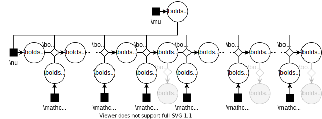

# Manifold MCMC methods for inference in diffusion models

## Matt Graham, National University of Singapore
## <small>Joint work with Alex Thiery (NUS) and Alex Beskos (UCL)</small>

Note: 

Hello. I am going to give a short overview of a project I am currently working on with Alex Thiery at NUS and Alex Beskos at UCL of applying Markov chain Monte Carlo methods on manifolds to calibrate partially observed diffusion models.

---

## Diffusions

Model defined by stochastic differential equation <!-- .element: class="fragment semi-fade-out" data-fragment-index="3" -->

$$
  \diff\rvct{x}_\tau =
  \vctfunc{a}(\rvct{x}_\tau, \rvct{z}) \diff \tau +
  \opfunc{B}(\rvct{x}_\tau, \rvct{z}) \diff \rvct{w}_\tau
  \quad
  \forall \tau \in \set{T},
$$ <!-- .element: class="fragment semi-fade-out" data-fragment-index="3" -->

  * $\intg{X}$-dimensional state process $\rvct{x}_{\set{T}}$, <!-- .element: class="fragment fade-in-then-semi-out" data-fragment-index="0" -->
  * $\intg{W}$-dimensional Wiener noise process $\rvct{w}_{\set{T}}$, <!-- .element: class="fragment fade-in-then-semi-out" data-fragment-index="1" -->
  * $\intg{Z}$-dimensional parameters $\rvct{z}$. <!-- .element: class="fragment fade-in-then-semi-out" data-fragment-index="2" -->

Solutions define a family of Markov kernels $\kappa_{\set{T}}$ <!-- .element: class="fragment fade-in" data-fragment-index="3" -->

$$
  \rvct{x}_\tau \gvn \left(
    \rvct{x}_0 = \vct{x}, \rvct{z} = \vct{z} \right)
  \sim \kappa_\tau(\vct{x},\vct{z})
  \quad\forall \tau \in \set{T}.
$$ <!-- .element: class="fragment fade-in" data-fragment-index="3" -->

Note:

We are interested in performing inference in diffusions. To set out notation, a diffusion is a continuous time process defined by a stochastic differential equation of the form shown, with $\rvct{x}_\tau$ the vector-valued state process, $\rvct{w}_\tau$ a vector-valued Wiener noise and $\rvct{z}$ the model parameters.

The solutions to the stochastic differential equation are characterised by a family of Markov kernels $\kappa_\tau$ giving the probability of the state being in some set at time $\tau$ given a known value for the state at time zero.

---

## Example applications

  Many real-world processes with noisy dynamics can be modelled as diffusions, e.g.
  <ul>
    <li class="fragment fade-in" data-fragment-index="1" >neuronal dynamics with stochastic ion channels,</li>
    <li class="fragment fade-in" data-fragment-index="2" >biochemical reaction networks,</li>
    <li class="fragment fade-in" data-fragment-index="3" >electrical circuits subject to thermal noise.</li>
    <!-- <li class="fragment fade-in" data-fragment-index="4" >asset prices in financial markets.</li> -->
  </ul>

Note:

Diffusions are used to model noisy processes in a range of scientific and engineering applications for example

  * in neuroscience models of actional potential generation via stochastic ion channels,
  * in systems biology, the kinetics of biochemical reaction networks can be approximated via the Chemical Langevin equation,
  * in electronics, electrical circuits and semi-conductor devices subject to thermal fluctuations can also be modelled as diffusion processes.

---

## Parameter inference

  
A common task is given partial observations $\rvct{y}_{\range{\intg{T}}}$ of the process $\rvct{x}_{\set{T}}$ at discrete times to infer the posterior distribution of the model parameters $\rvct{z}$.

  
Challenging problem - existing approaches limit class of models or do not exactly condition on $\rvct{y}_{\range{T}}$.

Note:

Often we will only be able to partially observe the state at a discrete set of times. Given such observations we would then like to find the posterior distribution on the model parameters. <!--Here we will consider the case where the observation process is not subject to additional noise, however the framework we propose can be easily extended to noisy observations.-->

This is a challenging inferential task, with current approximate inference approaches to the problem typically requiring strong assumptions on the underlying SDE or discarding information from the observations to make the inference more tractable as in ABC approaches.

---

<h2 style="line-height: 80%;">Differentiable generative models <small>(Graham &amp; Storkey, 2017)</small></h2>

Consider a generative model with a $\reals^\intg{Q}$-valued latent state $\rvct{q}$ and $\reals^{\intg{R}}$-valued observed vector $\rvct{r}$  <!-- .element: class="fragment semi-fade-out" data-fragment-index="0" -->

  

  $$\otext{where} \quad \rvct{q} \sim \pi_0 \quad \otext{and} \quad \rvct{r} = \vctfunc{g}(\rvct{q}).$$
  

  

    
  

Assume prior $\pi_0$ has a density $\rho_0$ with respect to Lebesgue measure and $\vctfunc{g} : \reals^\intg{Q} \to \reals^\intg{R}$ is surjective and differentiable almost everywhere. <!-- .element: class="fragment fade-in" data-fragment-index="2" -->

Note:

The framework we use to perform inference, will be to view the diffusion as what we term a differentiable generative model. 

This assumes that if we concatenate the observations into a vector $\rvct{r}$ and latent variables in to a vector $\rvct{q}$, we can generate the observed vector $\rvct{r}$ as a deterministic function $\vctfunc{g}$ of the latent vector $\rvct{q}$.

We can represent this diagramatically using an augmented factor graph notation where filled squares as usual denote probabilistic factors, while open diamonds denote deterministic relationships between variables, and shaded nodes indicate observed variables.

The key assumptions we will make are that the prior distribution on the latent space has a tractable density function with respect to the Lebesgue measure and that the generator function is surjective and differentiable almost everywhere.

---

<h2 style="line-height: 80%;">Posterior on a manifold <small>(Diaconis+, 2011)</small></h2>

Posterior $\pi$ on $\rvct{q} \gvn \rvct{r} = \vct{r}$ supported on an implicitly defined manifold $\vctfunc{g}^{-1}(\vct{r}) := \lbrace \vct{q} \in \reals^\intg{Q} : \vctfunc{g}(\vct{q}) = \vct{r} \rbrace$. <!-- .element: class="fragment semi-fade-out" data-fragment-index="0" -->

  

    $\vctfunc{g}^{-1}(\vct{r})$ has zero Lebesgue measure $\implies \pi$ has no density with respect to Lebesgue measure on $\reals^\intg{Q}$.
  

  

    However $\pi$ has a density with respect to $\haum{\intg{D}}{\intg{Q}}$, the $\intg{D} = \intg{Q}-\intg{R}$ dimensional Hausdorff measure on $\reals^\intg{Q}$
  

  

    $$
      \td{\pi}{\haum{\intg{D}}{\intg{Q}}}(\vct{q}) \propto
      \color{lightgrey}{
      \rho_0(\vct{q})\,
      \ind{\vctfunc{g}^{-1}(\vct{r})}(\vct{q})\,
      \big|
        \jacob\vctfunc{g}(\vct{q})
        \jacob\vctfunc{g}(\vct{q})\tr
      \big|^{-\frac{1}{2}}.
      }
    $$
  

  

    $$
      \color{lightgrey}{
      \td{\pi}{\haum{\intg{D}}{\intg{Q}}}(\vct{q}) \propto }
      \rho_0(\vct{q})\,
      \color{lightgrey}{
      \ind{\vctfunc{g}^{-1}(\vct{r})}(\vct{q})\,
      \big|
        \jacob\vctfunc{g}(\vct{q})
        \jacob\vctfunc{g}(\vct{q})\tr
      \big|^{-\frac{1}{2}}.
      }
    $$
  

  

    $$
      \color{lightgrey}{
      \td{\pi}{\haum{\intg{D}}{\intg{Q}}}(\vct{q}) \propto
      \rho_0(\vct{q})\,
      }
      \ind{\vctfunc{g}^{-1}(\vct{r})}(\vct{q})\,
      \color{lightgrey}{
      \big|
        \jacob\vctfunc{g}(\vct{q})
        \jacob\vctfunc{g}(\vct{q})\tr
      \big|^{-\frac{1}{2}}.
      }
    $$
  

  

    $$
      \color{lightgrey}{
      \td{\pi}{\haum{\intg{D}}{\intg{Q}}}(\vct{q}) \propto
      \rho_0(\vct{q})\,
      \ind{\vctfunc{g}^{-1}(\vct{r})}(\vct{q})\,
      }
      \big|
        \jacob\vctfunc{g}(\vct{q})
        \jacob\vctfunc{g}(\vct{q})\tr
      \big|^{-\frac{1}{2}}.
    $$
  

  

    $$
      \td{\pi}{\haum{\intg{D}}{\intg{Q}}}(\vct{q}) \propto
      \rho_0(\vct{q})\,
      \ind{\vctfunc{g}^{-1}(\vct{r})}(\vct{q})\,
      \big|
        \jacob\vctfunc{g}(\vct{q})
        \jacob\vctfunc{g}(\vct{q})\tr
      \big|^{-\frac{1}{2}}.
    $$
  

Note:

For a model of this form, the posterior distribution on the latent state will be supported on an implicitly defined manifold embedded in the latent space corresponding to the pre-image of the observed vector under the generator function.

This manifold has zero Lebesgue measure and so the posterior is not absolutely continuous with respect to the Lebesgue measure. However the posterior does have a density with respect to a Hausdorff measure on the latent space of dimension equal to the manifold dimension.

This density is formed of a term for the prior density, restricted to be non-zero only on the manifold and then divided by a generalised Jacobian determinant term which roughly speaking accounts for the variation in the infintesimal 'thickness' of the manifold.

If we can compute the generator function we can evaluate this posterior density, and we can apply a class of MCMC methods for sampling from distributions on implicitly defined manifolds to perform inference.

---

## Joint model

  
  
  

  

    Parameters $\rvct{z}$ and initial state $\rvct{x}_0$ prior distributions
    $$
      \rvct{z} \sim \mu,
      \quad
      \rvct{x}_0 \sim \nu(\rvct{z}).
    $$
  

  

    State observed at $\intg{T}$ equispaced times $\tau_{\intg{t}} = \intg{t}\Delta$
    $$
      \rvct{x}_{\intg{t}\Delta} \sim \kappa_{\Delta}(\rvct{x}_{(\intg{t}-1)\Delta}, \rvct{z}) \quad \forall \intg{t} \in \range{\intg{T}}
    $$
  

  

    $\intg{Y}$-dimensional partial ($\intg{Y} < \intg{X}$) observations of state
    $$
      \rvct{y}_{\intg{t}} = \vct{h}(\rvct{x}_{\intg{t}\Delta}) \quad \forall \intg{t} \in \range{\intg{T}}
    $$
  

  

    \begin{align}
      &\bar{\pi}_0(\diff\vct{z},\diff\vct{x}_0, \diff\vct{x}_{(\range{\intg{T}})\Delta}) =\,\\\\[-5pt]
      &\qquad
        \mu(\diff\vct{z})\nu(\diff\vct{x}_0\gvn\vct{z})\prod_{\intg{t}=1}^{\intg{T}} \kappa_\delta(\diff\vct{x}_{\intg{t}\Delta}\gvn\vct{x}_{(\intg{t}-1)\Delta})
    \end{align}
  

  

    However typically we can neither sample from $\kappa_\Delta$ nor evaluate its density.
  

Note:

Returning to the diffusion setting, we define our overall joint generative model as follows. The parameters and initial state state are assumed to have tractable prior distributions $\mu$ and $\nu$ respectively.

A sequence of $\intg{T}$ states are then generated at equally spaced time intervals $\Delta$.

Finally the observed vectors are computed deterministically from the states via some possibly non-linear and non-injective observation function $\vctfunc{h}$.

Togther this defines a factorised joint prior distribution on the latent variables.

However in general for most diffusions it will be intractable to both exactly sample from the kernel $\kappa$ and evaluate it density and so we are unable to work with this distribution in practice.

---

## Approximate joint model

  

    We instead use a numerical integration scheme - defines a kernel $\chi_\delta \approx \kappa_{\delta}$ for small time step $\delta$.
  

  

    Split each inter-observation interval into $\intg{S}$ steps $\delta = \frac{\Delta}{\intg{S}}$ with approximation error $\to 0$ as $\intg{S} \to \infty$.
  

  

    For small $\delta$ nearby states in sequence are strongly correlated $\implies$ challenging for MCMC.
  
  
  

    Further $\chi_\delta$ still may not have a known closed-form density function.
  

Note:

Rather than work with the exact kernel $\kappa$ we therefore instead work with an approximate kernel $\chi$ defined by a numerical integrator such as the Euler-Maruyama method.

We then use a data augmentation approach of splitting each inter-observation interval into $\intg{S}$ smaller time steps, which for suitable choices of the approximate kernel $\chi$ will mean the approximation error tends to zero as the number of steps $\intg{S}$ tends to infinity.

However an issue with this approach is that for small time steps nearby states in the sequence will be strongly correlated, with these correlations having an adverse impact on the mixing performance of MCMC methods.

Further in some cases while we can sample from $\chi_\delta$, we may not be able to evaluate a density function for it.

---

## Non-centred parameterisation

  

    Typically $\chi_{\delta}$ defined via a generative process
    $$
      \rvct{v} \sim \nrm(\vct{0},\idmtx_{\intg{V}}), ~~
      \rvct{x} = \vctfunc{f}_\delta(\vct{x},\vct{z},\vct{v})
      \implies
      \rvct{x} \sim \chi_\delta(\vct{x},\vct{z}).
    $$
  

  

    For example for the Euler-Maruyama method
    $$
      \vctfunc{f}_\delta(\vct{x},\vct{z},\vct{v}) = 
      \vct{x} + \delta \vctfunc{a}(\vct{x},\vct{z}) + 
      \delta^{\frac{1}{2}} \opfunc{B}(\vct{x},\vct{z})\vct{v}.
    $$
  

  

    We can reparameterise the model in terms of the random vectors $\rvct{v}_{\range{\intg{TS}}}$ used to generate $\rvct{x}^\delta_{\range{\intg{TS}}}$.
  

  

    Assume that $\rvct{x}_0$ and $\rvct{z}$ can also be reparametrised in terms of standard normal vectors $\rvct{v}_0$ and $\rvct{u}$.
  

  
  

Note:

We can overcome both these issues by using what a non-centred parameterisation.

The approximate kernel $\chi_\delta$ will typically be defined via a function which takes the current state, parameters and a standard normal vector and outputs an approximate sample of the state at the next time step.

For instance the simplest case of an Euler-Maruyma integrator, the update function is defined as the following.

Importantly we can reparameterise the model in terms of the apriori independent and standard normal distributed random vectors used to generate the state sequence.

For notational convenience we will also assume that the initial state and parameters can be reparameterised in terms of standard normal vectors, though in practice this is not essential.

---

## Non-centred parameterisation

Observations are computed as a differentiable function of latent inputs with tractable prior density

  
  

Note:

Reorganising the factor graph a bit we can see that we now have something of the form we assumed earlier for a differentiable generative model, with the observations computed as a differentiable function of the latent inputs. Further all the latent variables are now apriori independent and with standard normal distributions, giving a simple tractable prior density.

As previously we concatenate the latent variables into a vector $\rvct{q}$ and observations in to a vector $\rvct{r}$.

---

## Non-centred parameterisation

$$\intg{Q} = \intg{Z} + \intg{X} + \intg{STV} \quad\otext{and}\quad \intg{R} = \intg{TY}$$ <!-- .element: class="fragment fade-out" data-fragment-index="0" -->

$$
  \td{\pi}{\haum{\intg{D}}{\intg{Q}}}(\vct{q}) \propto 
  \exp(-\phi(\vct{q})) \,
  \ind{\vctfunc{g}^{-1}(\vct{r})}(\vct{q}),
$$ <!-- .element: class="fragment fade-in" data-fragment-index="0" -->

$$
  \phi(\vct{q}) = 
  \frac{1}{2}\vct{q}\tr\vct{q} + 
  \frac{1}{2}\log\big|
    \jacob\vctfunc{g}(\vct{q}) \jacob\vctfunc{g}(\vct{q})\tr
  \big|.
$$ <!-- .element: class="fragment fade-in" data-fragment-index="0" -->

Note:

Our model now has the canonical form shown.

The posterior distribution on the latent vector has a density with respect to the Hausdorff measure, with $\phi$ here being the negative log density on the manifold.

---

<h2 style="line-height: 80%;">Constrained Hamiltonian Monte Carlo <small>(Hartmann &amp; Schutte, 2005; Brubaker+, 2012; Leli&egrave;vre+, 2012)</small> </h2>

MCMC method based on simulating a constrained Hamiltonian dynamic defined by DAEs <!-- .element: class="fragment fade-in-then-semi-out" data-fragment-index="1" -->

$$
  \td{\vct{q}}{t} = \vct{p},
  ~~
  \td{\vct{p}}{t} = -\grad\phi(\vct{q})\tr + \jacob\vctfunc{g}(\vct{q})\tr\vct{\lambda},
  ~~
  \vctfunc{g}(\vct{q}) = \vct{r},
$$ <!-- .element: class="fragment fade-in-then-semi-out" data-fragment-index="1" -->

  

    Simulate using a constraint-preserving symplectic integrator such as RATTLE <small>(Andersen, 1983)</small>.
  

  

    To enforce constraints in each step solve $\intg{R}$ non-linear equations to *retract* $\vct{q}$ on to manifold and $\intg{R}$ linear equations to *project* $\vct{p}$ on to cotangent space.
  

Note:

To perform inference we use a Markov chain Monte Carlo method to generate approximate samples from the posterior on the manifold. To construct an Markov kernel which leaves $\pi$ invariant we use a Hamiltonian Monte Carlo approach based on simulating a constrained Hamiltonian dynamic defined by a set of differential algebraic equations.

This constrained dynamic can be numerically simulated using a constraint preserving symplectic integrator such as the RATTLE scheme, which has the required properties of time-reversibility and volume preservation.

Each integration steps requires solving a system of $\intg{R}$ non-linear equations to retract the latent state $\rvct{q}$ on to the manifold, and solving a $\intg{R}$ dimensional linear system to project the auxiliary momentum vector $\rvct{p}$ into the cotangent space.

---

## Computational cost

Dominant costs are evaluating $\partial\vctfunc{g}$ and $\mathcal{O}(\intg{R}^3)$ linear algebra operations with Gram matrix $\jacob\vctfunc{g}(\vct{q}) \jacob\vctfunc{g}(\vct{q})\tr$. <!-- .element: class="fragment semi-fade-out" data-fragment-index="0" -->

This results in a algorithmic complexity which scales linearly with $\intg{S}$ and $\intg{Z}$ but cubically with $\intg{T}$. <!-- .element: class="fragment fade-in-then-semi-out" data-fragment-index="0" -->

By exploiting Markovian nature of model can reduce complexity to linear in both $\intg{S}$ and $\intg{T}$ (at cost of cubic scaling in $\intg{Z}$).<!-- .element: class="fragment fade-in" data-fragment-index="1" -->

Note:

For most models the main costs in each constrained step are the evaluation of the generator Jacobian, which using reverse-mode AD can be done at a cost of $\intg{R}$ evaluations of the generator function itself, and order $\intg{R}^3$ linear algebra operations involving the $\intg{R}\times\intg{R}$ Gram matrix.

The resulting overall complexity of each constrained step scales linearly with the number of diffusion time steps $\intg{S}$ and number of parameters $\intg{Z}$ but cubically with the number of observation times $\intg{T}$.

However, by exploiting Markovian nature of model and fully conditioning on subsets of intermediate states, the generator Jacobian gains a tractable sparse structure and we can reduce complexity to linear in both the number of integrator steps $\intg{S}$ and number of observations $\intg{T}$ but at a cost of cubic scaling in the number of parameters $\intg{Z}$. As the number of parameters is typically much less than the number of observation times this will usually be a worthwhile tradeoff, and under a weak assumption of a decay of temporal correlations property in the model, the additional conditioning minimally effects mixing performance.

---

## Conclusions

  * Framework for performing inference in partially observed diffusions with minimal assumptions required on model and discretisation scheme. <!-- .element: class="fragment semi-fade-out" data-fragment-index="0" -->
  * By exploiting Markovian nature of model remains efficient for large numbers of observation times and dense time discretisations. <!-- .element: class="fragment fade-in-then-semi-out" data-fragment-index="0" -->
  * Approach can be extended to models with other dependency structures: e.g. spatial meshes, trees / directed acyclic graphs. <!-- .element: class="fragment fade-in" data-fragment-index="1" -->

Note:

In conclusion, in this work we have proposed a general framework for performing inference in a wide class of partially observed diffusion models, with minimal assumptions required on the model dynamics and time discretisation.

While the most direct application of the approach already gives a linear scaling in the number of integrator time steps, allowing application to dense time discretisations, by further exploiting the Markovian structure of the model we also exhibit a linear scaling in computational cost with the number of observation times.

The approach proposed here can be easily extended to various other generative models, and we can make similar gains in computational efficiency in models with other dependency structures such as tree-like factor graphs or spatial meshes.

---

## References

<ul style="font-size: 70%;">
   <li>
     M. M. Graham and A. J. Storkey. 
     Asymptotically exact inference in differentiable generative models. 
     *Electronic Journal of Statistics*, 2017.
   </li>
   <li>
     P. Diaconis, S. Holmes and M. Shahshahani. 
     Sampling from a Manifold. 
     *Advances in Modern Statistical Theory and Applications*, 2013.
   </li>
   <li>
     H. C. Andersen. 
     RATTLE: A 'velocity' version of the SHAKE algorithm for molecular dynamics calculations. 
     *Journal of Comp. Physics*, 1983.
   </li>
   <li>
     C. Hartmann and C. Schutte. 
     A constrained hybrid Monte Carlo algorithm and the problem of calculating the free energy in several variables. 
     *ZAMM-Zeitschrift f&uuml;r Angewandte Mathematik*, 2005.
   </li>
   <li>
     M. A. Brubaker, M. Saelzmann and R. Urtasun. 
     A family of MCMC methods on implicitly defined manifolds. 
     *AISTATS*, 2012.
   </li>
   <li>
     T. Leli&egrave;vre, M. Rousset and G. Stoltz. 
     Langevin dynamics with constraints and computation of free energy differences. 
     *Mathematics of Computation*, 2012.
   </li>

---

## FitzHugh-Nagumo example

Simplified neural model defined by hypoelliptic system of stochastic differential equations <!-- .element: class="fragment semi-fade-out" data-fragment-index="0" -->

$$
  \begin{bmatrix} 
    \diff \rvar{x}_0 \\\\
    \diff \rvar{x}_1 
  \end{bmatrix} =
  \begin{bmatrix}
    \epsilon^{-1}(\rvar{x}_0 - {x}_1^3 - \rvar{x}_1 + \beta) \\\\
    \gamma ( \rvar{x}_0 - \rvar{x}_1 + \alpha)
  \end{bmatrix}
  \diff\tau +
  \begin{bmatrix} 0 \\\\ \sigma \end{bmatrix}
  \diff\rvar{w}.
$$ <!-- .element: class="fragment semi-fade-out" data-fragment-index="0" -->

Five parameters to be inferred $\rvct{z} = [\alpha;~\beta;~\gamma;~\epsilon;~\sigma]$. <!-- .element: class="fragment fade-in-then-semi-out" data-fragment-index="0" -->

Simualte data at $\intg{T} = 40$ observation times with $\intg{S} = 40$ steps between each observation and each observation $\rvar{y}_{\intg{t}} = \rvar{x}^\delta_{0,\\intg{tS}}~~\forall \intg{t}\in\range{\intg{T}}$. <!-- .element: class="fragment fade-in" data-fragment-index="1" -->

