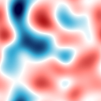
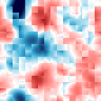
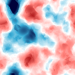
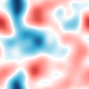
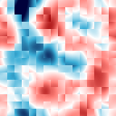

# Smooth and scalable local particle filtering

#### NUS DSAP Seminar: 13th March 2019

*Matt Graham* and Alex Thiery
  

---

## Introduction

*Problem of interest*: state inference in spatially extended dynamical systems modelled by stochastic
partial differential equations (SPDEs).

*Example applications*: ocean modelling, numerical weather prediction (NWP).

*Challenges*: very high dimensional state spaces, computational limits on number of simulations, non-Gaussian state distributions.

----

## Notation

For each time index $t \in \range{1}{\cns{T}}$ 
<!-- .element: class="fragment semi-fade-out" data-fragment-index="1" -->

\begin{alignat}{1}
\textsf{system state} \quad & \rvct{x}_t \in \set{X},
\\\\[-1em]
\textsf{observation} \quad & \rvct{y}_t \in \set{Y},
\\\\[-1em]
\textsf{state noise} \quad & \rvct{u}_t \in \set{U},
\\\\[-1em]
\textsf{observation noise} \quad & \rvct{v}_t \in \set{V}.
\end{alignat}
<!-- .element: class="fragment semi-fade-out" data-fragment-index="1" -->

$\cns{D}_{\set{X}} = \dim(\set{X})$ and $\cns{D}_{\set{Y}} = \dim(\set{Y})$. 
<!-- .element: class="fragment fade-in-then-semi-out" data-fragment-index="1" -->

$\square_{1:\cns{N}} \equiv \lbrace \square_{n} \rbrace_{n=1}^{\cns{N}}$ and
$\square^{1:\cns{N}} \equiv \lbrace \square^{n} \rbrace_{n=1}^{\cns{N}}$. 
<!-- .element: class="fragment" data-fragment-index="2" -->

----

## State-space model (SSM)

State dynamics assumed to be Markovian and specified by a set of 
*state-update operators* $\op{F}_{1:\cns{T}}$ 
<!-- and *state noise distributions* $\mu_{1:\cns{T}}$ -->

\begin{alignat}{2}
  \label{eq:generate-initial-state}
  \rvct{x}_{1} &= \op{F}_{1}(\rvct{u}_{1}),
  &&\quad \rvct{u}_{1} \sim \mu_{1}&,
  \\\\
  \label{eq:generate-next-state}
  \rvct{x}_{t} &= \op{F}_{t}(\rvct{x}_{t-1}, \rvct{u}_{t}),
  &&\quad \rvct{u}_{t} \sim \mu_{t}
  &\quad \forall t \in \range{2}{\cns{T}},
\end{alignat}<!-- .element: class="fragment fade-in-then-semi-out" data-fragment-index="1" -->

Observations are assumed to depend only on the current state via 
*obervation operators* $\op{G}_{1:\cns{T}}$ 
<!-- and *observation noise distributions* $\nu_{1:\cns{T}}$ -->

\begin{alignat}{2}
  \label{eq:generate-observation}
  \rvct{y}_{t} &= \op{G}_t(\rvct{x}_{t}, \rvct{v}_{t}),
  &&\quad \rvct{v}_{t} \sim \nu_{t}
  &\quad \forall t \in \range{1}{\cns{T}}.
\end{alignat}
<!-- .element: class="fragment" data-fragment-index="3" -->

----

## Linear-Gaussian SSM

Common tractable special case

\begin{alignat}{2}
  \rvct{x}_{1} &= \rvct{u}_{1},
  &&\quad \rvct{u}_{1} \sim \nrm(\vct{m}_1, \mtx{C}_1)&,
  \\\\
  \rvct{x}_{t} &= \mtx{F}_{t}\rvct{x}_{t-1} + \rvct{u}_{t},
  &&\quad \rvct{u}_{t} \sim \nrm(\vct{0}, \mtx{Q}_t)
  &\quad \forall t \in \range{2}{\cns{T}},
  \\\\
  \rvct{y}_{t} &= \mtx{H}_t\rvct{x}_{t} + \rvct{v}_{t},
  &&\quad \rvct{v}_{t} \sim \nrm(\vct{0}, \mtx{R}_t)
  &\quad \forall t \in \range{1}{\cns{T}}.
\end{alignat}<!-- .element: class="fragment fade-in-then-semi-out" data-fragment-index="1" -->

Efficient exact inference possible using Kalman Filter (KF) with $\mathcal{O}(\cns{D}_\set{Y}\cns{D}_\set{X}^2)$ computation and 
$\mathcal{O}(\cns{D}_\set{X}^2)$ memory costs assuming $\cns{D}_\set{X} > \cns{D}_{\set{Y}}$.

----

## Distributions

Observation distribution
<!-- .element: class="fragment semi-fade-out" data-fragment-index="1" -->

\begin{equation}\label{eq:observation-density}
  g_t(\vct{y}\gvn \vct{x}_t) \, \upsilon(\dr\vct{y}) =
  \prob(\rvct{y}_t \in \dr\vct{y} \gvn \rvct{x}_t = \vct{x}_t).
\end{equation}
<!-- .element: class="fragment semi-fade-out" data-fragment-index="1" -->

Filtering distribution
<!-- .element: class="fragment fade-in-then-semi-out" data-fragment-index="1" -->

\begin{equation}\label{eq:filtering-distribution}
  \pi_{t}(\dr\vct{x}) =
  \prob(
    \rvct{x}_t \in \dr\vct{x}
    \gvn
    \rvct{y}_{1:t}=\vct{y}_{1:t}
  ).
\end{equation}
<!-- .element: class="fragment fade-in-then-semi-out" data-fragment-index="1" -->

Predictive distribution
<!-- .element: class="fragment" data-fragment-index="2" -->

\begin{equation}\label{eq:predictive-distribution}
  \pred{\pi}_{t+1}(\dr\vct{x}) =
  \prob(
    \rvct{x}_{t+1} \in \dr\vct{x}
    \gvn
    \rvct{y}_{1:t}=\vct{y}_{1:t}
  ).
\end{equation}
<!-- .element: class="fragment" data-fragment-index="2" -->

---

## Spatial systems

Let $\set{S}$ be a compact space with distance $d: \set{S} \times \set{S} \to \reals_{\geq 0}$ 
representing the spatial domain. 
<!-- .element: class="fragment semi-fade-out" data-fragment-index="1" -->

System states are functions (spatial fields) $\rvct{z}_t : \set{S} \to \set{Z} ~~\forall t \in \range{1}{\cns{T}}$.
<!-- .element: class="fragment fade-in-then-semi-out" data-fragment-index="1" -->

State space is then an (infinite-dimensional) function space - 
challenging from both a computational and theoretical standpoint!
<!-- .element: class="fragment" data-fragment-index="2" -->

----

## Spatial systems

In practice the state fields are represented as a linear combination of $\cns{M}$ basis functions $\beta_{m} : \set{S} \to \reals$
<!-- .element: class="fragment semi-fade-out" data-fragment-index="2" -->

\begin{equation}\label{eq:spatial-field-basis-expansion}
  \rvct{z}_t(s) = \sumrange{m}{1}{\cns{M}}\rvct{x}_{t,m} \beta_m(s),
  ~~
  \rvct{x}_{t,m} \in \set{Z} ~~\forall m \in \range{1}{\cns{M}}.
\end{equation}
<!-- .element: class="fragment fade-in-then-semi-out" data-fragment-index="1" -->

Typically a *mesh* of $\cns{M}$ *nodes* at locations $s_{1:\cns{M}}$
is constructed and the $\beta_{1:\cns{M}}$ chosen such that

\begin{equation}
  \beta_m(s_m) = 1,
  ~~
  \beta_m(s_n) = 0 
  ~~
  \forall 
  m \in \range{1}{\cns{M}},\,
  n \in \range{1}{\cns{M}} \setminus m,
\end{equation}
<!-- .element: class="fragment" data-fragment-index="2" -->

$$\implies \rvct{z}_t(s_m) = \rvar{x}_{t,m} ~\forall m\in\range{1}{\cns{M}}.$$
<!-- .element: class="fragment" data-fragment-index="2" -->

----

## Spatial systems

Therefore consider the state space to be a $\cns{M}\cns{N}$ dimensional vector space $\set{X} = \set{Z}^{\cns{M}}$,
<!-- .element: class="fragment semi-fade-out" data-fragment-index="2" -->

$$\rvct{x}_t\tr = \begin{bmatrix} \rvct{x}_{t,1}\tr & \rvct{x}_{t,2}\tr & \dots & \rvct{x}_{t,\cns{M}}\tr \end{bmatrix}.$$
<!-- .element: class="fragment fade-in-then-semi-out" data-fragment-index="1" -->

We assume the system is independently observed at $\cns{L}$ spatial locations 
$s^{\mathrm{o}}_l \in \set{S} ~~\forall l\in\range{1}{\cns{L}}$ so that
<!-- .element: class="fragment" data-fragment-index="2" -->

$$
  \log g_t(\mkern2mu \vct{y}_t\gvn\vct{x}_t) = 
  \sum_{l\in 1:\cns{L}} \log g_{t,l}(\mkern2mu \vct{y}_{t,l}\gvn\vct{z}_t(s^{\mathrm{o}}_l)),
$$
<!-- .element: class="fragment" data-fragment-index="2" -->

$$\vct{y}_t\tr = \begin{bmatrix} \vct{y}_{t,1}\tr & \vct{y}_{t,2}\tr & \dots & \vct{y}_{t,\cns{L}}\tr \end{bmatrix}.$$
<!-- .element: class="fragment" data-fragment-index="2" -->

----

## Example: 2D Navier-Stokes model

<video width="1200" height="600" autplay controls>   
  <source src="videos/navier-stokes-2d-256x256-simulation.mp4" type="video/mp4">
Your browser does not support the video tag.
</video>

---

## Filtering problem

Infer the filtering distributions $\pi_{1:\cns{T}}$ given observations $\vct{y}_{1:\cns{T}}$.
<!-- .element: class="fragment semi-fade-out" data-fragment-index="1" -->

Filtering distributions can be computed recursively by iterating two updates
<!-- .element: class="fragment fade-in" data-fragment-index="1" -->

$$ 
  \cdots \longrightarrow 
  \pi_{t-1} \xrightarrow{\textsf{prediction}} 
  \pred{\pi}_{t} \xrightarrow{\textsf{assimilation}} 
  \pi_{t} \longrightarrow 
  \cdots
$$
<!-- .element: class="fragment" data-fragment-index="2" -->

----

## Prediction and assimilation updates

Prediction update:
<!-- .element: class="fragment semi-fade-out" data-fragment-index="1" -->

\begin{equation}\label{eq:prediction-update}
  \pred{\pi}_{t}(\dr\vct{x}) =
  \int_{\set{X}}\int_{\set{U}} 
    \delta_{\op{F}_{t}(\vct{x}', \vct{u})}(\dr\vct{x}) \,
  \mu_{t}(\dr\vct{u})\,\pi_{t-1}(\dr\vct{x}').
\end{equation}
<!-- .element: class="fragment semi-fade-out" data-fragment-index="1" -->

Assimilation update:
<!-- .element: class="fragment fade-in" data-fragment-index="1" -->

\begin{equation}\label{eq:assimilation-update}
  \pi_{t}(\dr\vct{x}) =
  \frac
    {g_{t}(\vct{y}_{t} \gvn \vct{x})}
    {\int_{\set{X}} g_{t}(\vct{y}_{t} \gvn \vct{x}') \, \pred{\pi}_{t}(\dr \vct{x}')}
  \pred{\pi}_{t}(\dr\vct{x}).
\end{equation}
<!-- .element: class="fragment fade-in" data-fragment-index="1" -->

----

## Ensemble filters

Ensemble of $\cns{P}$ particles $\rvct{x}^{1:\cns{P}}_{t}$ used to
approximate $\pi_{t}$ at each time index $t\in\range{1}{\cns{T}}$
<!-- .element: class="fragment semi-fade-out" data-fragment-index="1" -->

\begin{equation}\label{eq:empirical-filtering-distribution}
  \pi_{t}(\dr\vct{x}) \approx
  \frac{1}{\cns{P}} \sumrange{p}{1}{\cns{P}} \delta_{\rvct{x}^{\mkern1mu p}_{t}}(\dr\vct{x}).
\end{equation}
<!-- .element: class="fragment semi-fade-out" data-fragment-index="1" -->

Ensemble prediction update then simply
<!-- .element: class="fragment" data-fragment-index="1" -->

\begin{equation}\label{eq:empirical-prediction-update}
  \rvct{u}^p_{t} \sim \mu_{t},
  ~~
  \pred{\rvct{x}}^{p}_{t} = \op{F}_{t}(\rvct{x}^{p}_{t-1}, \rvct{u}^{p}_{t})
  \quad \forall p \in \range{1}{\cns{P}}.
\end{equation}
<!-- .element: class="fragment" data-fragment-index="1" -->

---

## Ensemble Kalman filter (EnKF)

Ensemble variant of KF introduced by <a href='#references-1'>Evensen (1994)</a> 
and <a href='#references-1'>Burgers et al. (1998)</a>.

Reduces $\mathcal{O}(\cns{D}_\set{Y}\cns{D}_\set{X}^2)$ computation and 
$\mathcal{O}(\cns{D}_\set{X}^2)$ memory costs for KF to 
$\mathcal{O}(\cns{P}^2\cns{D}_\set{X})$ in computation and $\mathcal{O}(\cns{P}\cns{D}_\set{X})$ 
in memory (assuming $\cns{D}_\set{X} > \cns{D}_{\set{Y}} \gg \cns{P}$).
<!-- .element: class="fragment fade-in-then-semi-out" data-fragment-index="1" -->

Inference only consistent as $\cns{P}\to\infty$ for linear-Gaussian SSMs however applied to more general models in practice.
<!-- .element: class="fragment" data-fragment-index="2" -->

----

## EnKF assimilation update

Generate predicted observation ensemble
<!-- .element: class="fragment semi-fade-out" data-fragment-index="1" -->

\begin{equation}\label{eq:generated-observation-ensemble}
  \rvct{v}^p_{t} \sim \nu_{t}, ~~
  \pred{\rvct{y}}^{p}_{t} = \op{G}_{t}(\pred{\rvct{x}}^{p}_{t}, \rvct{v}^{p}_{t})
  \quad \forall p \in \range{1}{\cns{P}}.
\end{equation}
<!-- .element: class="fragment semi-fade-out" data-fragment-index="1" -->

Assimilate observations
<!-- .element: class="fragment fade-in-then-semi-out" data-fragment-index="1" -->

\begin{equation}\label{eq:stochastic-enkf-assimilation-update}
  \rvct{x}^{p}_{t} =
  \pred{\rvct{x}}^p_{t} + \rmtx{K}^\cns{P}_{t} (\vct{y}_{t} - \pred{\rvct{y}}^p_{t})
  \quad \forall p \in \range{1}{\cns{P}}.
\end{equation}
<!-- .element: class="fragment fade-in-then-semi-out" data-fragment-index="1" -->

$\rmtx{K}^\cns{P}_{t}$ is a Monte Carlo estimate of Kalman gain matrix using 
$\pred{\rvct{x}}_t^{1:\cns{P}}$ and $\pred{\rvct{y}}^{1:\cns{P}}_t$.
<!-- .element: class="fragment fade-in-then-semi-out" data-fragment-index="2" -->

<!--
\begin{equation}
  \rvct{x}^{p}_{t+1} =
  \sumrange{q}{1}{\cns{P}} \left( \delta_{pq} + (\vct{y}_t-\pred{\rvct{y}}^p_t)\tr (\Delta\pred{\rmtx{Y}}_t)^+\Delta_q\right)
  \pred{\rvct{x}}^{q}_{t+1}
\end{equation}
-->

Lower variance *square-root filter* formulations typically used in practice.

----

## EnKF performance

EnKF updates based on assuming filtering distributions are Gaussian. <!-- .element: class="fragment semi-fade-out" data-fragment-index="1" -->

For models where filtering distributions are 'close' to Gaussian, EnKF methods remain effective - used in operational ensemble NWP systems. <!-- .element: class="fragment fade-in-then-semi-out" data-fragment-index="1" -->

However also desirable to have inference methods robust to non-Gaussianity in filtering distrbutions. <!-- .element: class="fragment fade-in" data-fragment-index="2" -->

----

## Spatial localisation

For large spatial systems typically state variables and observations at
distant locations will have low dependence - *decay of spatial correlations* property.

In EnKF methods this property is exploited to perform *localised* assimilation updates which are typically key to scaling to large spatial models <a href='#references-2'>(Hamill et al., 2001; Hunt et al., 2007)</a>.

The components $\rvct{x}^{1:\cns{P}}_{t,m}$ of the particles at each node $s_m$ are updated using only a local subset of $\vct{y}_{t,1:\cns{L}}$.

----

## Localisation functions

A *localisation function* $\ell_r: [0,\infty) \to [0,1]$ weights the effects of observations at each $s^{\mathrm{o}}_l$ on the state variables at $s_m$ by $\ell_r \circ d(s, s^{\mathrm{o}}_l)$.

$\ell_r(d) = 0 ~~\forall d > r$ for a *localisation radius* $r$.

---

## Particle filter (PF)

Particle filters <a href='#references-1'>(Gordon et al., 1993)</a> offer an alternative
ensemble filtering approach that is consistent as $\cns{P} \to \infty$ for general SSMs.

Importance weights are computed
<!-- .element: class="fragment fade-in-then-semi-out" data-fragment-index="1" -->

\begin{equation}\label{eq:bootstrap-particle-weights}
  \rvar{w}^{\mkern1mu p}_{t} = \frac
    {g_{t}(\mkern2mu \vct{y}_{t}\gvn\pred{\rvct{x}}^{\mkern1mu p}_{t})}
    {\sumrange{q}{1}{\cns{P}} g_{t}(\mkern2mu \vct{y}_{t}\gvn\pred{\rvct{x}}^q_{t})}
  ~~ \forall p \in \range{1}{\cns{P}},
\end{equation}
<!-- .element: class="fragment fade-in-then-semi-out" data-fragment-index="1" -->

giving 
$\displaystyle
  \pi_{t}(\dr\vct{x}) \approx
  \sumrange{p}{1}{\cns{P}} \rvar{w}^{\mkern1mu p}_{t} \delta_{\pred{\rvct{x}}^{\mkern1mu p}_{t}}(\dr\vct{x}).
$ <!-- .element: class="fragment" data-fragment-index="2" -->

----

## PF assimilation update

To retain stability in the approximation over time, particles are resampled at each time index

\begin{equation}\label{eq:resampling-assimilation-update}
  \rvct{x}^{\mkern1mu p}_{t} = \sumrange{q}{1}{\cns{P}} \rvar{r}^{\mkern1mu p,q}_{t} \pred{\rvct{x}}^q_{t}
  \quad \forall p \in \range{1}{\cns{P}},
\end{equation}

where $\rvar{r}^{1:\cns{P},1:\cns{P}}_{t}$ are a set of 
$\lbrace 0, 1 \rbrace$-valued random variables satisfying $\forall p \in \range{1}{\cns{P}}$
<!-- .element: class="fragment" data-fragment-index="1" -->

\begin{equation}\label{eq:resampling-variable-conditions}
  \sumrange{q}{1}{\cns{P}}
  \rvar{r}^{\mkern1mu p,q}_{t} = 1,
  ~~
  \expc\bigg[
    \sumrange{q}{1}{\cns{P}}
    \rvar{r}^{q,p}_{t}
    \gvn
    \rvar{w}^{\mkern1mu p}_{t} = w^{\mkern1mu p}_{t}
  \bigg] =
  \cns{P} w^{\mkern1mu p}_{t}.
\end{equation}
<!-- .element: class="fragment" data-fragment-index="2" -->

----

## PFs in high dimensions

When $\cns{D}_{\set{Y}}$ is high, importance weights 
will tend to be degenerate - with high probability only one particle will have a non-negligible weight.
<!-- .element: class="fragment semi-fade-out" data-fragment-index="1" -->

<a href='#references-2'>Snyder et al. (2008)</a> showed for a simple Gaussian model the required ensemble size to avoid
degeneracy scales exponentially with $\cns{D}_{\set{Y}}$.

This has limited applications of PFs to spatial models as the max. feasible $\cns{P}$ is typically $\ll \cns{D}_{\set{Y}}$.
<!-- .element: class="fragment" data-fragment-index="2" -->

---

## Local PFs

Given the importance of localisation to scaling EnKFs to large spatial models it is natural to consider whether it can be applied in PFs.
<!-- .element: class="fragment semi-fade-out" data-fragment-index="1" -->

Intuitively using only a small subset of observations to calculate local
particle weights will hopefully result in less degenerate (local) weights.
<!-- .element: class="fragment fade-in-then-semi-out" data-fragment-index="1" -->

----

## Block particle filter

<a href='#references-2'>Rebeschini et al. (2015)</a> considered a simple
algorithm where $\set{S}$ is partitioned into blocks.

An independent PF is run on the state variables at the nodes in each block, 
computing importance weights using only observations within the block.

Under *local mixing* assumptions on the model this 'block' PF gives an approximation 
error bound independent of the observation dimension $\cns{D}_{\set{Y}}$.

----

## Gaussian field example

<table class='image-table align-table'>

<tr>
  <td>True state $\vct{z}_t$</td>
  <td>Noisy observations $\vct{y}_t$</td>
</tr>

<tr>
  <td>
    
  </td>
  <td>
    
  </td>
</tr>

</table>

----

## Gaussian field example

<table class='image-table align-table'>

<tr>
  <td>Prior sample $\pred{\vct{z}}^{1}_t$</td>
  <td>Prior sample $\pred{\vct{z}}^{2}_t$</td>
  <td>Prior sample $\pred{\vct{z}}^{3}_t$</td>
</tr>

<tr>
  <td>
    
  </td>
  <td>
    
  </td>
  <td>
    
  </td>
</tr>

</table>

----

## Gaussian field example - block PF

<table class='image-table align-table'>

<tr>
  <td>Posterior sample ${\vct{z}}^{1}_t$</td>
  <td>Posterior sample ${\vct{z}}^{2}_t$</td>
  <td>Posterior sample ${\vct{z}}^{3}_t$</td>
</tr>

<tr>
  <td>
    
  </td>
  <td>
    
  </td>
  <td>
    
  </td>
</tr>

</table>

----

## Computing local weights

Using a localisation function we can compute per-node importance weights
<!-- .element: class="fragment" data-fragment-index="1" -->

\begin{gather}\label{eq:local-particle-log-weights}
  \log\tilde{\rvar{w}}^{p}_{t,m} =
  \sumrange{l}{1}{\cns{L}} 
    \log g_{t,l}\left(
      \vct{y}_{t,l}\gvn\pred{\rvct{z}}^{p}_{t}(s^{\mathrm{o}}_l)
    \right)
    \ell_r(d(s_m, s_l^{\textrm{o}}))\\\\
  \quad \forall p \in \range{1}{\cns{P}},\, m\in\range{1}{\cns{M}},
\end{gather}
<!-- .element: class="fragment" data-fragment-index="2" -->

\begin{equation}\label{eq:local-particle-normalised-weights}
  \rvar{w}^{p}_{t,m} = 
  \frac{\tilde{\rvar{w}}^{p}_{t,m}}{ 
    \sumrange{q}{1}{\cns{P}} \tilde{\rvar{w}}^{q}_{t,m}}
  \quad \forall p \in \range{1}{\cns{P}},\, m\in\range{1}{\cns{M}}.
\end{equation}
<!-- .element: class="fragment" data-fragment-index="3" -->

----

## Local PF assimilation updates

Given local weights $\rvar{w}^{1:\cns{P}}_{t,1:\cns{M}}$ how to update $\pred{\rvct{x}}^{1:\cns{P}}_{t,m}$?
<!-- .element: class="fragment semi-fade-out" data-fragment-index="1" -->

A naive scheme would be to independently resample the particle values at each node <!-- .element: class="fragment fade-in" data-fragment-index="1" -->
<!-- according to the local normalised weights -->

\begin{equation}
  \rvct{x}^{\mkern1mu p}_{t,m} = 
  \mkern-6mu\sumrange{q}{1}{\cns{P}} \rvar{r}^{\mkern1mu p,q}_{t,m} \, \pred{\rvct{x}}^q_{t,m}
  ~~ \forall p \in \range{1}{\cns{P}}, m\in\range{1}{\cns{M}},
\end{equation}
<!-- .element: class="fragment" data-fragment-index="2" -->

\begin{equation}\label{eq:local-resampling-variable-conditions}
  \text{s.t. }
  \sumrange{q}{1}{\cns{P}}\mkern-3mu
  \rvar{r}^{\mkern1mu p,q}_{t,m} = 1,
  ~
  \expc\bigg[
    \sumrange{q}{1}{\cns{P}}\mkern-3mu
    \rvar{r}^{q,p}_{t,m}
    \gvn
    \rvar{w}^p_{t,m} = w^p_{t,m}
  \bigg] =
  \cns{P} w^{\mkern1mu p}_{t,m}.
\end{equation}
<!-- .element: class="fragment" data-fragment-index="3" -->

----

## Local PF assimilation updates

Independently resampling at each node however introduces non-plausible spatial noise.

<table class='image-table align-table'>

<tr>
  <td>
    
  </td>
  <td>
    
  </td>
  <td>
    
  </td>
</tr>

</table>

----

## Local PF assimilation updates

<a href='#references-2'>Robert and Kunsch (2017)</a> suggested resampling with a common random uniform across all nodes.

<table class='image-table align-table'>

<tr>
  <td>
    
  </td>
  <td>
    
  </td>
  <td>
    
  </td>
</tr>

</table>

----

## Local PF assimilation updates

<a href='#references-3'>Poterjoy (2016)</a> combine coupled resampling with smoothing of per-node weights.

<table class='image-table align-table'>

<tr>
  <td>
    
  </td>
  <td>
    
  </td>
  <td>
    
  </td>
</tr>

</table>

---

## Ensemble transform PF (ETPF)

<a href='#references-1'>Reich (2013)</a> proposed an alternative to resampling 
which instead uses an optimal transport (OT) map.

The following discrete OT problem is solved
<!-- .element: class="fragment fade-in-then-semi-out" data-fragment-index="1" -->

$$\DeclareMathOperator*{\argmin}{argmin}
  \rho^{1:\cns{P},1:\cns{P}}_{t} =
  \argmin_{\varrho^{1:\cns{P},1:\cns{P}} \in [0,1]^{P\times P}}
  \sum_{p\in1:\cns{P}}\sum_{q\in 1:\cns{P}} \varrho^{\mkern1mu p,q}\left|\,\pred{\rvct{x}}^p_{t}-\pred{\rvct{x}}^q_{t}\right|_2^2
$$
<!-- .element: class="fragment fade-in-then-semi-out" data-fragment-index="2" -->

s.t. $
    \sumrange{q}{1}{\cns{P}}\varrho^{\mkern1mu p,q} = 1,\mkern-2mu
    \sumrange{q}{1}{\cns{P}}\varrho^{\mkern1mu q,p} = \cns{P} \rvar{w}_{t}^{\mkern1mu p}
        ~\forall p\in\range{1}{\cns{P}}
$.<!-- .element: class="fragment fade-in-then-semi-out" data-fragment-index="2" -->

Can be solved exactly at a $\tilde{\mathcal{O}}(\cns{P}^3)$ cost.<!-- .element: class="fragment" data-fragment-index="3" -->

----

## ETPF assimilation update

The assimilation update is then
<!-- .element: class="fragment semi-fade-out" data-fragment-index="1" -->

$$
  \rvct{x}^{\mkern1mu p}_{t} = \sumrange{q}{1}{\cns{P}} \rho^{\mkern1mu p,q}_{t} \pred{\rvct{x}}^q_{t}
  \quad \forall p \in \range{1}{\cns{P}}.
$$
<!-- .element: class="fragment semi-fade-out" data-fragment-index="1" -->

As $\cns{P}\to\infty$, optimal transport map becomes increasingly sparse, with $\rho^{\mkern1mu p,q}_{t} \in \lbrace 0, 1 \rbrace$ in the limit, and so ETPF update remains consistent.
<!-- .element: class="fragment fade-in-then-semi-out" data-fragment-index="1" -->

<!-- Consistent for $\cns{P}\to\infty$ however for finite $\cns{P}$ underestimates ensemble spread. -->

Removes stochasticity due to resampling. <!-- .element: class="fragment" data-fragment-index="2" -->

----

## Local ETPF

ETPF can be localised by computing a separate OT map at each mesh node <a href='#references-3'>(Cheng &amp; Reich, 2015)</a>.

<table class='image-table align-table fragment' data-fragment-index="1">

<tr>
  <td>
    
  </td>
  <td>
    
  </td>
  <td>
    
  </td>
</tr>

</table>

Updates per node deterministic: no spatial noise. <!-- .element: class="fragment" data-fragment-index="2" -->

However still non-smooth and $\tilde{\mathcal{O}}(\cns{M}\cns{P}^3)$ cost. <!-- .element: class="fragment" data-fragment-index="3" -->

---

## Partitions of unity

A partition of unity (PoU) on a compact space $\set{S}$ is a set of $\cns{B}$
*bump functions* $\phi_b: \set{S} \to [0,1]$ where

$$ \sum_{b\in 1:\cns{B}} \phi_b(s) = 1 \quad \forall s \in \set{S}.$$
<!-- .element: class="fragment semi-fade-out" data-fragment-index="1" -->

<!-- Defines a natural way of (softly) partioning $\set{S}$ independent of particular mesh discretisation used. -->

Generalises block PF partitioning - rather than disjoint blocks now consider overlapping patches $\hat{\set{S}}_{1:\cns{B}}$ corresponding to supports of $\phi_{1:\cns{B}}$. <!-- .element: class="fragment" data-fragment-index="1" -->

----

## Constructing PoUs

If $\set{S}_{1:\cns{B}}$ is a partition of $\set{S}$ and $\varphi : \set{S} \to \reals_{\geq 0}$ is a 
*mollifier* function satisfying $ \int_{\set{S}} \varphi(s) \,\dr s = 1 $ 
then we can define a PoU $\phi_{1:\cns{B}}$ on $\set{S}$ via 

\begin{equation}\label{eq:mollified-partition-pou}
  \phi_b(s) = (\indc{\set{S}_b} \ast \varphi)(s) = \int_{\set{S}} \indc{\set{S}_b}(s) \varphi(s - s')\,\dr s'.
\end{equation} <!-- .element: class="fragment" data-fragment-index="1" -->

$\phi_{1:\cns{B}}$ will inherit smoothness of $\varphi$. <!-- .element: class="fragment" data-fragment-index="2" -->

----

## Example 1D PoU

$\set{S} = [0,1]$ and $\cns{B}=9$

---

## Spatially smooth local ETPF

Given a  set of per-patch coefficients $\rho^{1:\cns{P},1:\cns{P}}_{t,1:\cns{B}}$
we can use a PoU to define a spatially smooth local assimilation update
$\forall p\in\range{1}{\cns{P}}, m\in\range{1}{\cns{M}}$
<!-- .element: class="fragment semi-fade-out" data-fragment-index="1" -->

\begin{equation}\label{eq:sletf-assimilation-update}
  \rvct{x}^{p}_{t,m} =
  \sumrange{q}{1}{\cns{P}} \sumrange{b}{1}{\cns{B}}
    \rho^{p,q}_{t,b} \,\phi_b(s_m) \pred{\rvct{x}}^{\,q}_{t,m}
\end{equation}
<!-- .element: class="fragment semi-fade-out" data-fragment-index="1" -->

or equivalently in terms of the state fields
<!-- .element: class="fragment" data-fragment-index="1" -->

\begin{equation}\label{eq:sletf-assimilation-update-fields}
  \rvct{z}^{p}_{t}(s_m) =
  \sumrange{q}{1}{\cns{P}} \sumrange{b}{1}{\cns{B}}
    \rho^{p,q}_{t,b} \,\phi_b(s_m) \pred{\rvct{z}}^{\,q}_{t}(s_m).
\end{equation}
<!-- .element: class="fragment" data-fragment-index="1" -->

----

## Spatially smooth local ETPF

----

## Spatially smooth local ETPF

----

## Spatially smooth local ETPF

----

## Spatially smooth local ETPF

----

## Spatially smooth local ETPF

We also need to choose how to compute $\rho^{1:\cns{P},1:\cns{P}}_{t,1:\cns{B}}$.
<!-- .element: class="fragment semi-fade-out" data-fragment-index="1" -->

Define the distance between a subset and a point 
<!-- .element: class="fragment fade-in-then-semi-out" data-fragment-index="1" -->

\begin{equation}\label{eq:distance-set-to-point}
  \underline{d\mkern-2mu}\mkern2mu(\set{S}', s) = \inf_{s' \in \set{S}'} d(s', s)
  \quad \forall s \in \set{S}, \set{S}' \subseteq \set{S}.
\end{equation}
<!-- .element: class="fragment fade-in-then-semi-out" data-fragment-index="1" -->

The per-patch importance weights ${\rvar{w}}^{1:\cns{P}}_{t,1:\cns{B}}$ are then
<!-- .element: class="fragment" data-fragment-index="2" -->

\begin{gather}\label{eq:per-patch-particle-log-weights}
  \log\tilde{\rvar{w}}^{p}_{t,b} =
  \sumrange{l}{1}{\cns{L}}
    \log g_{t,l}\left(
      \vct{y}_{t,l}\gvn\pred{\rvct{z}}^{p}_{t}(s^{\mathrm{o}}_l)
    \right)
    \ell_r(\underline{d\mkern-2mu}\mkern2mu(\hat{\set{S}}_b, s_l^{\mathrm{o}})),
\\\\
  \rvar{w}^{p}_{t,b} = 
  \tilde{\rvar{w}}^{p}_{t,b} \,/\,
  \left( {\textstyle \sumrange{q}{1}{\cns{P}} \tilde{\rvar{w}}^{q}_{t,b}} \right).
\end{gather}
<!-- .element: class="fragment" data-fragment-index="2" -->

----

## Spatially smooth local ETPF

Per-patch transport costs can be defined by
<!-- .element: class="fragment semi-fade-out" data-fragment-index="1" -->

\begin{equation}\label{eq:per-patch-transport-costs-coefficients-integral}
  \rvar{c}^{p,q}_{t,b} = 
  \int_{\set{S}}
    \left| \rvct{z}^{p}_{t}(s) - \rvct{z}^{q}_{t}(s)\right|_2^2\,
    \ell'_{r'}(\underline{d\mkern-2mu}\mkern2mu(\hat{\set{S}}_b, s))
  \,\dr s.
\end{equation}
<!-- .element: class="fragment semi-fade-out" data-fragment-index="1" -->

In practice we approximate the integrals with summations across
a subset of the nodes
<!-- .element: class="fragment" data-fragment-index="1" -->

\begin{equation}\label{eq:per-patch-transport-costs-coefficients}
  \hat{\rvar{c}}^{p,q}_{t,b} = 
  \sum_{n\in\set{M}}
    \left| \rvct{x}^{p}_{t,n} - \rvct{x}^{q}_{t,n}\right|_2^2
    \ell'_{r'}(\underline{d\mkern-2mu}\mkern2mu(\hat{\set{S}}_b, s_n)),
    \set{M} \subset \range{1}{\cns{M}}.
\end{equation}
<!-- .element: class="fragment" data-fragment-index="1" -->

----

## Spatially smooth local ETPF

We then solve a OT problem for each patch $b\in\range{1}{\cns{B}}$
<!-- .element: class="fragment semi-fade-out" data-fragment-index="1" -->

\begin{gather}
\DeclareMathOperator*{\argmin}{argmin}
  \rho^{1:\cns{P},1:\cns{P}}_{t,b} =
  \argmin_{\varrho^{1:\cns{P},1:\cns{P}} \in [0,1]^{P\times P}}
  \sum_{p\in1:\cns{P}}\sum_{q\in 1:\cns{P}} \varrho^{\mkern1mu p,q} \, \hat{\rvar{c}}^{p,q}_{t,b}
\\\\
\text{s.t. }
    \sumrange{q}{1}{\cns{P}}\varrho^{\mkern1mu p,q} = 1,\mkern-2mu
    \sumrange{q}{1}{\cns{P}}\varrho^{\mkern1mu q,p} = \cns{P} \rvar{w}_{t,b}^{\mkern1mu p}
        ~\forall p\in\range{1}{\cns{P}}.
\end{gather}
<!-- .element: class="fragment semi-fade-out" data-fragment-index="1" -->

Computational cost of assimilation update now
<!-- .element: class="fragment" data-fragment-index="1" -->

$$
  \tilde{\mathcal{O}}(
    \underbrace{\cns{B}\cns{P}^3}_{\text{OT solves}} + 
    \underbrace{|\set{M}|\cns{P}^2}_{\text{trans. costs}} + 
    \underbrace{\cns{M}\cns{P}}_{\text{state update}}
).$$
<!-- .element: class="fragment" data-fragment-index="1" -->

----

## Gaussian field example

Smooth PoU with $\cns{B} = 8 \times 8 = 64$

<table class='image-table align-table fragment' data-fragment-index="1">

<tr>
  <td>
    
  </td>
  <td>
    
  </td>
  <td>
    
  </td>
</tr>

</table>

----

## Gaussian field comparison

<table class='image-table align-table'>

<tr style='font-size: 80%;'>
<td>True state</td>
<td>Block PF </td>
<td>Local ETPF</td>
<td>Smooth local ETPF</td>
</tr>

<tr>
<td>

</td>
<td>

</td>
<td>

</td>
<td>

</td>
</tr>

</table>

---

## Kuramoto-Sivashinsky SPDE model

SPDE on a 1D periodic domain $\set{S} = [0, S]$ based on 4th order non-linear PDE with chaotic behaviour

\begin{equation}
  \dr\rvar{\zeta} = -\left(
  \left( \partial^2_s + \partial^4_s \right) \rvar{\zeta} + \theta \rvar{\zeta} +
  \frac{1}{2} \partial_s \left( \rvar{\zeta}^2 \right) \right) \dr\tau+
  \dr\rvar{n}
\end{equation}
<!-- .element: class="fragment" data-fragment-index="2" -->

with $\rvar{\zeta} : \set{S} \times \set{T} \to \reals$ the system state at time $\tau \in \set{T}$ and $\rvar{n} : \set{S} \times \set{T} \to \reals$ a Gaussian process which is uncorrelated in time and correlated in space.
<!-- .element: class="fragment" data-fragment-index="2" -->

----

## Kuramoto-Sivashinsky SPDE model

Use a spectral spatial discretisation with $\cns{M} = 512$ nodes in space 

$$
  \rvar{z}_t(s) = \rvar{\zeta}(s, \tau_t) = \sumrange{m}{1}{\cns{M}} \rvar{x}_{t,m} \exp\left(i \frac{2\pi m s}{S}\right)
$$
 
and fixed $\dr\tau = 0.25$ for time-stepping using 10 steps between each observed timepoint such that $\tau_{t} - \tau_{t-1} = 2.5~~\forall t\in\range{1}{200}, \, \tau_0 = 0$.
<!-- .element: class="fragment" data-fragment-index="2" -->

----

## Kuramoto-Sivashinsky SPDE model

Non-linear observations made at $\cns{L} = 64$ regularly spaced locations $s^{\textrm{o}}_l = \frac{\cns{M}}{\cns{L}} l S$

$$ \rvar{y}_{t,l} = \tanh(\rvar{z}_t(s^{\textrm{o}}_l)) + \rvar{v}_{t,l}, ~~ \rvar{v}_{t,l} \sim \nrm(0, \sigma^2)$$

'Ground truth' for filtering distributions computed using MCMC (around 1 week on a 32-core server).
<!-- .element: class="fragment" data-fragment-index="2" -->

Compare to local EnKF, local ETPF and smooth local ETPF, all with $\cns{P} = 100$ particles.
<!-- .element: class="fragment" data-fragment-index="3" -->

----

## Kuramoto-Sivashinsky SPDE model

True state $\vct{z}(s, \tau)$

----

## Kuramoto-Sivashinsky SPDE model

Observations $\vct{y}_{1:200}$

----

## KS SPDE model - local EnKF

Time 46 s, RMSE in mean 0.41, RMSE in std. 0.30

----

## KS SPDE model - local EnKF

Time 46 s, RMSE in mean 0.41, RMSE in std. 0.30

----

## KS SPDE model - local EnKF

Time 46 s, RMSE in mean 0.41, RMSE in std. 0.30

----

## KS SPDE model - local ETPF

Time 86 s, RMSE in mean 0.37, RMSE in std. 0.28

----

## KS SPDE model - local ETPF

Time 86 s, RMSE in mean 0.37, RMSE in std. 0.28

----

## KS SPDE model - local ETPF

Time 86 s, RMSE in mean 0.37, RMSE in std. 0.28

----

## KS SPDE model - SL ETPF ($\cns{B} = 64$)

Time 31 s, RMSE in mean 0.37, RMSE in std. 0.23

----

## KS SPDE model - SL ETPF ($\cns{B} = 64$)

Time 31 s, RMSE in mean 0.37, RMSE in std. 0.23

----

## KS SPDE model - SL ETPF ($\cns{B} = 64$)

Time 31 s, RMSE in mean 0.37, RMSE in std. 0.23

---

## Stochastic Navier-Stokes model

Example model: incompressible Navier-Stokes on a torus using a $\cns{M} = 128\times 128 = 16384$ node mesh, observing at $\cns{L} = 32 \times 32 = 1024$ locations.

Compare local EnkF with smooth local ETPF with $\cns{B} = 8\times 8 = 64$ patch PoU with $\cns{P} = 50$.
<!-- .element: class="fragment" data-fragment-index="1" -->

----

## Navier-Stokes - local EnKF

Time 34 minutes

<video width="1200" height="400" autplay controls>   
  <source src="videos/navier-stokes-2d-128x128-letkf.mp4" type="video/mp4">
Your browser does not support the video tag.
</video>

----

## Navier-Stokes - smooth local ETPF

Time 10 minutes

<video width="1200" height="400" autoplay controls>   
  <source src="videos/navier-stokes-2d-128x128-sletpf.mp4" type="video/mp4">
Your browser does not support the video tag.
</video>

---

## Conclusions

  * Proposed a spatially smooth ETPF scheme for filtering in SPDE models. <!-- .element: class="fragment" data-fragment-index="1" -->
  * As well as preserving smoothness, the scheme also significantly reduces computational cost of assimilation updates. <!-- .element: class="fragment" data-fragment-index="2" -->
  * Introduces extra algorithmic parameters in choice of partition of unity. <!-- .element: class="fragment" data-fragment-index="3" -->

----

<!-- .slide: id="references-1" -->

## References <a href="javascript:history.go(-2)">&laquo;</a>

<ul class='reference-list'>

<li>
  Evensen, G. (1994). Sequential data assimilation with a nonlinear quasi-geostrophic model
  using Monte Carlo methods to forecast error statistics. <em>Journal of Geophysical Research: Oceans</em> <strong>99</strong> 10143&ndash;10162.
</li>
<li>
  Burgers, G., van Leeuwen, P. J. and Evensen, G. (1998). Analysis scheme in the ensemble
  Kalman filter. <em>Monthly weather review</em> <strong>126</strong> 1719&ndash;1724.
</li>
<li>
  Gordon, N. J., Salmond, D. J. and Smith, A. F. (1993). Novel approach to nonlinear/non-
  Gaussian Bayesian state estimation. In <em>IEE Proceedings F (Radar and Signal Processing)</em> <strong>140</strong>
  107&ndash;113. IET.
</li>
<li>
  Reich, S. (2013). A nonparametric ensemble transform method for Bayesian inference. 
  <em>SIAM Journal on Scientific Computing</em> <strong>35</strong> A2013&ndash;A2024.
</li>

</ul>

----

<!-- .slide: id="references-2" -->

## References <a href="javascript:history.go(-2)">&laquo;</a>

<ul class='reference-list'>

<li>
  Snyder, C., Bengtsson, T., Bickel, P. and Anderson, J. (2008). Obstacles to high-
  dimensional particle filtering. <em>Monthly Weather Review</em> <strong>136</strong> 4629&ndash;4640.
</li>
<li>
  Hamill, T. M., Whitaker, J. S. and Snyder, C. (2001). Distance-dependent filtering of
  background error covariance estimates in an ensemble Kalman filter. 
  <em>Monthly Weather Review</em> <strong>129</strong> 2776&ndash;2790.
</li>
<li>
  Hunt, B. R., Kostelich, E. J. and Szunyogh, I. (2007). Efficient data 
  assimilation for spatiotemporal chaos: A local ensemble transform Kalman filter. 
  <em>Physica D: Nonlinear Phenomena</em> <strong>230</strong> 112&ndash;126. 
</li>
<li>
  Rebeschini, P., Van Handel, R. (2015). Can local particle filters beat the curse of
  dimensionality? <em>The Annals of Applied Probability</em> <strong>25</strong> 2809&ndash;2866.
</li>

</ul>

----

<!-- .slide: id="references-3" -->

## References <a href="javascript:history.go(-2)">&laquo;</a>

<ul class='reference-list'>

<li>
  Robert,  S. and K&uuml;nsch, H. R. (2017). Localizing the ensemble Kalman particle filter. 
  <em> Tellus A: Dynamic Meteorology &amp; Oceanography</em>, <strong>69</strong>.
</li>
<li>
  Poterjoy, J. (2016). A localized particle filter for high-dimensional nonlinear systems. 
  <em>Monthly Weather Review</em> 14459&ndash;76.
</li>
<!--
<li>
  Van Leeuwen, P. J. (2009). Particle filtering in geophysical systems. 
  <em>Monthly Weather Review</em> <strong>137</strong> 4089&ndash;4114.
</li>
-->
<li>
  Cheng, Y. and Reich, S. (2015). Assimilating data into scientific models: An optimal coupling
  perspective. In <em>Nonlinear Data Assimilation</em> 75&ndash;118. Springer.
</li>
<li>
  Majda, A.J. and Harlim, J., (2012). 
  <em>Filtering complex turbulent systems</em>. Cambridge Universtiy Press.
</li>

</ul>
