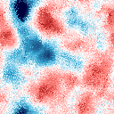
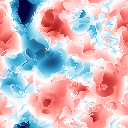
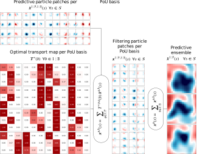

# Spatially smooth local ensemble transform particle filtering

#### IMS Bayesian Computation workshop

*Matt Graham* and Alex Thiery
  

----

## Introduction

*Problem of interest*: state inference in spatially extended dynamical systems modelled by (stochastic)
partial differential equation models.

Many applications in engineering and geosciences e.g. numerical weather prediction, ocean modelling.

*Challenges*: very high dimensional state space, computation limited ensemble sizes, 
non-Gaussian state distributions due to non-linear dynamics.

---

## Notation

For each time index $t \in \range{1}{\cns{T}}$ 
<!-- .element: class="fragment semi-fade-out" data-fragment-index="1" -->

\begin{alignat}{1}
\textsf{system state} \quad & \rvct{x}_t \in \set{X},
\\\\[-1em]
\textsf{observation} \quad & \rvct{y}_t \in \set{Y},
\\\\[-1em]
\textsf{state noise} \quad & \rvct{m}_t \in \set{M},
\\\\[-1em]
\textsf{observation noise} \quad & \rvct{n}_t \in \set{N}.
\end{alignat}
<!-- .element: class="fragment semi-fade-out" data-fragment-index="1" -->

$\cns{D}_{\set{X}} = \dim(\set{X})$ and $\cns{D}_{\set{Y}} = \dim(\set{Y})$. 
<!-- .element: class="fragment fade-in-then-semi-out" data-fragment-index="1" -->

$\square_{1:\cns{N}} \equiv \lbrace \square_{n} \rbrace_{n=1}^{\cns{N}}$ and
$\square^{1:\cns{N}} \equiv \lbrace \square^{n} \rbrace_{n=1}^{\cns{N}}$. 
<!-- .element: class="fragment" data-fragment-index="2" -->

----

## Model definition

State dynamics assumed to be Markovian and specified by a set of 
*state-update operators* $\op{F}_{1:\cns{T}}$ 
<!-- and *state noise distributions* $\mu_{1:\cns{T}}$ -->

\begin{alignat}{2}
  \label{eq:generate-initial-state}
  \rvct{x}_{1} &= \op{F}_{1}(\rvct{m}_{1}),
  &&\quad \rvct{m}_{1} \sim \mu_{1}&,
  \\\\
  \label{eq:generate-next-state}
  \rvct{x}_{t} &= \op{F}_{t}(\rvct{x}_{t-1}, \rvct{m}_{t}),
  &&\quad \rvct{m}_{t} \sim \mu_{t}
  &\quad \forall t \in \range{2}{\cns{T}},
\end{alignat}<!-- .element: class="fragment fade-in-then-semi-out" data-fragment-index="1" -->

Observations are assumed to depend only on the current state via 
*obervation operators* $\op{G}_{1:\cns{T}}$ 
<!-- and *observation noise distributions* $\nu_{1:\cns{T}}$ -->

\begin{alignat}{2}
  \label{eq:generate-observation}
  \rvct{y}_{t} &= \op{G}_t(\rvct{x}_{t}, \rvct{n}_{t}),
  &&\quad \rvct{n}_{t} \sim \nu_{t}
  &\quad \forall t \in \range{1}{\cns{T}}.
\end{alignat}
<!-- .element: class="fragment" data-fragment-index="3" -->

----

## Distributions

Observation distribution
<!-- .element: class="fragment semi-fade-out" data-fragment-index="1" -->

\begin{equation}\label{eq:observation-density}
  g_t(\vct{y}\gvn \vct{x}_t) \, \upsilon(\dr\vct{y}) =
  \prob(\rvct{y}_t \in \dr\vct{y} \gvn \rvct{x}_t = \vct{x}_t).
\end{equation}
<!-- .element: class="fragment semi-fade-out" data-fragment-index="1" -->

Filtering distribution
<!-- .element: class="fragment fade-in-then-semi-out" data-fragment-index="1" -->

\begin{equation}\label{eq:filtering-distribution}
  \pi_{t}(\dr\vct{x}) =
  \prob(
    \rvct{x}_t \in \dr\vct{x}
    \gvn
    \rvct{y}_{1:t}=\vct{y}_{1:t}
  ).
\end{equation}
<!-- .element: class="fragment fade-in-then-semi-out" data-fragment-index="1" -->

Predictive distribution
<!-- .element: class="fragment" data-fragment-index="2" -->

\begin{equation}\label{eq:predictive-distribution}
  \tilde{\pi}_{t+1}(\dr\vct{x}) =
  \prob(
    \rvct{x}_{t+1} \in \dr\vct{x}
    \gvn
    \rvct{y}_{1:t}=\vct{y}_{1:t}
  ).
\end{equation}
<!-- .element: class="fragment" data-fragment-index="2" -->

----

## Filtering problem

Infer the filtering distributions $\pi_{1:\cns{T}}$ given observations $\vct{y}_{1:\cns{T}}$.
<!-- .element: class="fragment semi-fade-out" data-fragment-index="1" -->

Filtering distributions can be computed recursively by iterating two updates:
<!-- .element: class="fragment fade-in" data-fragment-index="1" -->

$$ 
  \cdots \longrightarrow 
  \pi_{t} \xrightarrow{\textsf{prediction}} 
  \tilde{\pi}_{t+1} \xrightarrow{\textsf{assimilation}} 
  \pi_{t+1} \longrightarrow 
  \cdots
$$
<!-- .element: class="fragment" data-fragment-index="2" -->

----

## Prediction and assimilation updates

Prediction update:
<!-- .element: class="fragment semi-fade-out" data-fragment-index="1" -->

\begin{equation}\label{eq:prediction-update}
  \tilde{\pi}_{t+1}(\dr\vct{x}) =
  \int_{\set{X}}\int_{\set{M}} 
    \delta_{\op{F}_{t+1}(\vct{x}', \vct{m})}(\dr\vct{x}) \,
  \mu_{t+1}(\dr\vct{m})\,\pi_{t}(\dr\vct{x}').
\end{equation}
<!-- .element: class="fragment semi-fade-out" data-fragment-index="1" -->

Assimilation update:
<!-- .element: class="fragment fade-in" data-fragment-index="1" -->

\begin{equation}\label{eq:assimilation-update}
  \pi_{t+1}(\dr\vct{x}) =
  \frac
    {g_{t+1}(\vct{y}_{t+1} \gvn \vct{x})}
    {\int_{\set{X}} g_{t+1}(\vct{y}_{t+1} \gvn \vct{x}') \, \tilde{\pi}_{t+1}(\dr \vct{x}')}
  \tilde{\pi}_{t+1}(\dr\vct{x}).
\end{equation}
<!-- .element: class="fragment fade-in" data-fragment-index="1" -->

----

## Ensemble filters

Ensemble of $\cns{P}$ particles $\vct{x}^{1:\cns{P}}_{t}$ used to
approximate $\pi_{t}$ at each time index $t\in\range{1}{\cns{T}}$
<!-- .element: class="fragment semi-fade-out" data-fragment-index="1" -->

\begin{equation}\label{eq:empirical-filtering-distribution}
  \pi_{t}(\dr\vct{x}) \approx
  \frac{1}{\cns{P}} \sumrange{p}{1}{\cns{P}} \delta_{\vct{x}^{\mkern1mu p}_{t}}(\dr\vct{x}).
\end{equation}
<!-- .element: class="fragment semi-fade-out" data-fragment-index="1" -->

Ensemble prediction update then simply
<!-- .element: class="fragment" data-fragment-index="1" -->

\begin{equation}\label{eq:empirical-prediction-update}
  \vct{m}^p_{t+1} \leftarrow \mu_{t+1},
  ~~
  \tilde{\vct{x}}^{p}_{t+1} = \op{F}_{t+1}(\vct{x}^{p}_{t}, \vct{m}^{p}_{t+1})
  \quad \forall p \in \range{1}{\cns{P}}.
\end{equation}
<!-- .element: class="fragment" data-fragment-index="1" -->

----

## Ensemble Kalman filter (EnKF)

Ensemble variant of Kalman Filter (KF) introduced by <a href='#references-1'>Evensen (1994)</a> 
and <a href='#references-1'>Burgers et al. (1998)</a>.

Reduces $\mathcal{O}(\cns{D}_\set{Y}\cns{D}_\set{X}^2)$ computation and 
$\mathcal{O}(\cns{D}_\set{X}^2)$ memory costs for KF to 
$\mathcal{O}(\cns{P}^2\cns{D}_\set{X})$ in computation and $\mathcal{O}(\cns{P}\cns{D}_\set{X})$ 
in memory (assuming $\cns{D}_\set{X} > \cns{D}_{\set{Y}} \gg \cns{P}$).
<!-- .element: class="fragment fade-in-then-semi-out" data-fragment-index="1" -->

Inference only consistent for $\cns{P}\to\infty$ when $\op{F}_t$ and $\op{G}_t$ are linear 
and $\mu_t$ and $\nu_t$ Gaussian however applied to more general models in practice.
<!-- .element: class="fragment" data-fragment-index="2" -->

----

## Stochastic EnkF update

Generate predicted observation ensemble
<!-- .element: class="fragment semi-fade-out" data-fragment-index="1" -->

\begin{equation}\label{eq:generated-observation-ensemble}
  \vct{n}^p_{t+1} \leftarrow \nu_{t+1}, ~~
  \vct{y}^{p}_{t+1} = \op{G}_{t+1}(\tilde{\vct{x}}^{p}_{t+1}, \vct{n}^{p}_{t+1})
  \quad \forall p \in \range{1}{\cns{P}}.
\end{equation}
<!-- .element: class="fragment semi-fade-out" data-fragment-index="1" -->

Assimilate observations
<!-- .element: class="fragment fade-in-then-semi-out" data-fragment-index="1" -->

\begin{equation}\label{eq:stochastic-enkf-assimilation-update}
  \vct{x}^{p}_{t+1} =
  \tilde{\vct{x}}^p_{t+1} + \hat{\mtx{K}}^\cns{P}_{t+1} (\vct{y}_{t+1} - \vct{y}^p_{t+1})
  \quad \forall p \in \range{1}{\cns{P}}.
\end{equation}
<!-- .element: class="fragment fade-in-then-semi-out" data-fragment-index="1" -->

$\hat{\mtx{K}}^\cns{P}_{t+1}$ is a Monte Carlo estimate of Kalman gain matrix using 
$\tilde{\vct{x}}_t^{1:\cns{P}}$ and $\vct{y}^{1:\cns{P}}_t$.
<!-- .element: class="fragment fade-in-then-semi-out" data-fragment-index="2" -->

Lower variance square-root filter formulations typically used in practice.
<!-- .element: class="fragment" data-fragment-index="3" -->

----

## Particle filter (PF)

Particle filters <a href='#references-1'>(Gordon et al., 1993)</a> offer an alternative
ensemble filtering approach that is consistent as $\cns{P} \to \infty$ in more general models.

Importance weights are computed
<!-- .element: class="fragment fade-in-then-semi-out" data-fragment-index="1" -->

\begin{equation}\label{eq:bootstrap-particle-weights}
  {w}^{\mkern1mu p}_{t+1} = \frac
    {g_{t+1}(\mkern2mu \vct{y}_{t+1}\gvn\tilde{\vct{x}}^{\mkern1mu p}_{t+1})}
    {\sumrange{q}{1}{\cns{P}} g_{t+1}(\mkern2mu \vct{y}_{t+1}\gvn\tilde{\vct{x}}^q_{t+1})}
  ~~ \forall p \in \range{1}{\cns{P}},
\end{equation}
<!-- .element: class="fragment fade-in-then-semi-out" data-fragment-index="1" -->

giving 
$\displaystyle
  \pi_{t+1}(\dr\vct{x}) \approx
  \sumrange{p}{1}{\cns{P}} {w}^{\mkern1mu p}_{t+1} \delta_{\tilde{\vct{x}}^{\mkern1mu p}_{t+1}}(\dr\vct{x}).
$ <!-- .element: class="fragment" data-fragment-index="2" -->

----

## Resampling

To reduce weight degeneracy particles are resampled at each time index to equalise weights:

\begin{equation}\label{eq:resampling-assimilation-update}
  \vct{x}^{\mkern1mu p}_{t+1} = \sumrange{q}{1}{\cns{P}} \rvar{R}^{\mkern1mu p,q}_{t+1} \tilde{\vct{x}}^q_{t+1}
  \quad \forall p \in \range{1}{\cns{P}},
\end{equation}

where $\rvar{R}^{1:\cns{P},1:\cns{P}}_{t+1}$ are a set of 
$\lbrace 0, 1 \rbrace$-valued random variables satisfying
<!-- .element: class="fragment" data-fragment-index="1" -->

\begin{equation}\label{eq:resampling-variable-conditions}
  \sumrange{q}{1}{\cns{P}}
  \rvar{R}^{\mkern1mu p,q}_{t+1} = 1,
  ~~
  \expc\bigg[
    \sumrange{q}{1}{\cns{P}}
    \rvar{R}^{q,p}_{t+1}
  \bigg] =
  \cns{P} w^{\mkern1mu p}_{t+1}
  ~~ \forall p \in \range{1}{\cns{P}}.
\end{equation}
<!-- .element: class="fragment" data-fragment-index="2" -->

----

## Ensemble transform PF (ETPF)

<a href='#references-1'>Reich (2013)</a> proposed an alternative to resampling 
which instead uses an optimal transport (OT) map.

The following discrete OT problem is solved
<!-- .element: class="fragment" data-fragment-index="1" -->

$$\DeclareMathOperator*{\argmin}{argmin}
  \mtx{T}_{t+1} =
  \argmin_{\mtx{T} \in [0,1]^{P\times P}}
  \sum_{p\in1:\cns{P}}\sum_{q\in1:\cns{P}} T^{p,q}\left|\,\tilde{\vct{x}}^p_{t+1}-\tilde{\vct{x}}^q_{t+1}\right|_2^2
$$
<!-- .element: class="fragment" data-fragment-index="1" -->

subject to $\displaystyle
    \sum_{q\in 1:\cns{P}}\mkern-5mu T^{p,q} = 1,\mkern-2mu
    \sum_{q\in 1:\cns{P}}\mkern-5mu T^{q,p} = \cns{P} w_{t+1}^{\mkern1mu p}
    ~\forall p\in\range{1}{\cns{P}}
$. <!-- .element: class="fragment" data-fragment-index="2" -->

<!--
\begin{gather}
\DeclareMathOperator*{\argmin}{argmin}\DeclareMathOperator{\trace}{tr}
  \mtx{P}_{t+1} = 
  \argmin_{\mtx{P}\in\set{P}_{\cns{P}}(w^{1:\cns{P}})} \trace(\mtx{P}\mtx{C}_{t+1}),
  \\\\
  \set{P}_{\cns{P}}(\vct{w}) = 
  \lbrace 
    \mtx{P} \in [0,1]^{\cns{P}\times\cns{P}} :
    \mtx{P}\vct{1} = \vct{1},
    \mtx{P}\tr\vct{1} = \cns{P}\vct{w}
  \rbrace.
\end{gather}
-->

----

## Ensemble transform PF (ETPF)

The assimilation update is then
<!-- .element: class="fragment semi-fade-out" data-fragment-index="1" -->

$$
  \vct{x}^{\mkern1mu p}_{t+1} = \sumrange{q}{1}{\cns{P}} T^{\mkern1mu p,q}_{t+1} \tilde{\vct{x}}^q_{t+1}
  \quad \forall p \in \range{1}{\cns{P}}.
$$
<!-- .element: class="fragment semi-fade-out" data-fragment-index="1" -->

As $\cns{P}\to\infty$, optimal transport map becomes increasingly sparse, 
$T^{p,q}_{t+1} \in \lbrace 0, 1 \rbrace$ in the limit.
<!-- .element: class="fragment fade-in-then-semi-out" data-fragment-index="1" -->

<!-- Consistent for $\cns{P}\to\infty$ however for finite $\cns{P}$ underestimates ensemble spread. -->

Defines a *deterministic update* which will be important when localising.

----

## Spatially extended systems

Let $\set{S}$ be a compact space equipped with distance $d: \set{S} \times \set{S} \to [0,\infty)$ 
representing the spatial domain the state and observations are defined on. 
<!-- .element: class="fragment semi-fade-out" data-fragment-index="1" -->

We assume the system is independently observed at $\cns{L}$ spatial locations 
$s_l \in \set{S} ~~\forall l\in\range{1}{\cns{L}}$ so that
<!-- .element: class="fragment fade-in-then-semi-out" data-fragment-index="1" -->

$$
  \log g_t(\mkern2mu \vct{y}_t\gvn\vct{x}) = 
  \sum_{l\in 1:\cns{L}} \log g_{t,l}(\mkern2mu \vct{y}_t(s_l)\gvn\vct{x}).
$$
<!-- .element: class="fragment fade-in-then-semi-out" data-fragment-index="1" -->

In practice $\set{S}$ discretised to a mesh such that $\set{X}$ is of finite but 
high dimension.
<!-- .element: class="fragment" data-fragment-index="2" -->

----

## Particle filtering in high dimensions

When the observation dimensionality is high particle importance weights 
will tend to be degenerate - with high probability only one particle will have a non-negligible weight.
<!-- .element: class="fragment semi-fade-out" data-fragment-index="1" -->

<a href='#references-2'>Snyder et al. (2008)</a> showed for a simple Gaussian model the required ensemble size to avoid
degeneracy scales exponentially with dimension.

This has limited applications of PFs to spatial models as the max. feasible $\cns{P}$ is typically $\ll \cns{D}_{\set{Y}}$.
<!-- .element: class="fragment" data-fragment-index="2" -->

----

## Spatial localisation

For large spatial systems typical state variables and observations at 
distant points will have low dependence - *decay of correlations* property.

In EnKF methods this property is exploited to perform *localised* assimilation updates which are typically key to scaling to large spatial models <a href='#references-2'>(Hamill et al., 2001; Hunt et al., 2007)</a>.

----

## Localisation kernels

A *localisation kernel* $k: [0,\infty) \to [0,1]$ weights the effects of observations at each $s_l$ on the state variables at $s$ by $k\circ d(s, s_l)$. The kernel is chosen such  $k(r) = 0 ~~\forall r > R$ for a *localisation radius* $R$.

----

## Localised particle filters

Given the importance of localisation to scaling EnKFs to large spatial models it is natural to consider whether it can be applied in PFs.
<!-- .element: class="fragment semi-fade-out" data-fragment-index="1" -->

Intuitively using only a small subset of observations to calculate local
particle weights will hopefully result in less degenerate (local) weights.
<!-- .element: class="fragment fade-in-then-semi-out" data-fragment-index="1" -->

----

## Block particle filter

<a href='#references-2'>Rebeschini et al. (2015)</a> considered a simple
algorithm where $\set{S}$ is partitioned into disjoint blocks with an
independent PF run on each block, assimilating only observations
within the block.

Under *local mixing* assumptions on the model this 'block' PF gives an approximation 
error bound independent of the model dimension.

----

## Block particle filter

However bias is introduced at boundaries between blocks due to ignoring inter-block dependencies.

----

## Computing local weights

----

## Local PF assimilation updates

Given local weight fields $w^{1:\cns{P}}_t(s) ~\forall s \in \set{S}$ how to update predictive ensemble using weights?
<!-- .element: class="fragment semi-fade-out" data-fragment-index="1" -->

A naive scheme would be to independently resample the particle values at each $s\in\set{S}$ <!-- .element: class="fragment fade-in" data-fragment-index="1" -->
<!-- according to the local normalised weights -->

\begin{equation}
  \vct{x}^{\mkern1mu p}_{t}(s) = 
  \mkern-6mu\sumrange{q}{1}{\cns{P}} \rvar{R}^{\mkern1mu p,q}_{t}(s) \, \tilde{\vct{x}}^q_{t}(s)
  ~~ \forall p \in \range{1}{\cns{P}},
\end{equation}
<!-- .element: class="fragment" data-fragment-index="2" -->

\begin{equation}\label{eq:local-resampling-variable-conditions}
  \sumrange{q}{1}{\cns{P}}\mkern-3mu
  \rvar{R}^{\mkern1mu p,q}_{t}(s) = 1,
  ~
  \expc\bigg[
    \sumrange{q}{1}{\cns{P}}\mkern-3mu
    \rvar{R}^{q,p}_{t}(s)
  \bigg] =
  \cns{P} w^{\mkern1mu p}_{t}(s)
  ~~ \forall p \in \range{1}{\cns{P}}.
\end{equation}
<!-- .element: class="fragment" data-fragment-index="3" -->

----

## Local PF assimilation updates

Independently resampling at each $s\in\set{S}$ however introduces non-plausible spatial white noise.

<a href='#references-2'>Robert and Kunsch (2017)</a> suggested using a systematic resampling with a single common random uniform across all $s\in\set{S}$.

----

## Local ETPF

An alternative is to compute a transport map for each $s\in\set{S}$ as in the ETPF <a href='#references-3'>(Cheng &amp; Reich, 2015)</a>.

As the updates at each $s\in\set{S}$ are deterministic no spatial noise is introduced in to assimilated particles however still produces discontinuities. <!-- .element: class="fragment" data-fragment-index="1" -->

----

## Partitions of unity

A partition of unity (PoU) on a compact space $\set{S}$ is a set of $\cns{B}$
basis functions $f_b: \set{S} \to [0,1]$ where

$$ \sum_{b\in 1:\cns{B}} f_b(s) = 1 \quad \forall s \in \set{S}.$$

<!-- Defines a natural way of (softly) partioning $\set{S}$ independent of particular mesh discretisation used. -->

Generalises block PF partitioning - rather than disjoint blocks can now consider overlapping patches weighted by (smooth) compact $f_b$. <!-- .element: class="fragment" data-fragment-index="1" -->

----

## Example 2D PoU

$\set{S} = [0,1]^2$ with periodic boundaries and $\cns{B}=16$

----

## Spatially smooth ETPF

----

## Per basis probabilities

----

## Per basis transport costs

----

## Computing per basis transport maps

----

## Transforming and merging patches

----

## Gaussian field comparison

<table class='image-table align-table'>
<tr>
<td>

</td>
<td>

</td>
<td>

</td>
<td>

</td>
</tr>

<tr style='font-size: 60%;'>
<td>True state</td>
<td>Local PF </td>
<td>Local ETPF</td>
<td>Smooth local ETPF</td>
</tr>

</table>

----

## Transormed linear-Gaussian model

As an initial test model we consider a bijective non-linear transofrmation of a linear-Gaussian model.

For a smooth bijection $\vct{\phi} : \set{X} \to \set{X}$ simulate model with state update and observation operators <!-- .element: class="fragment" data-fragment-index="1" -->

\begin{align}
  \op{F}_t(\vct{x},\vct{m}) &= 
  \vct{\phi}\left(
    \mtx{A}\vct{\phi}^{-1}(\vct{x}) + \mtx{B}\vct{m}
  \right),
  \\\\
  \op{G}_t(\vct{x},\vct{n}) &= \mtx{H}\vct{\phi}^{-1}(\vct{x}) + \vct{n}
\end{align}
<!-- .element: class="fragment" data-fragment-index="1" -->

and Gaussian state and observation noise distributions $\mu_{1:\cns{T}}$ and $\nu_{1:\cns{T}}$.
<!-- .element: class="fragment" data-fragment-index="2" -->

----

## Stochastic Navier-Stokes model

Example model: incompressible Navier-Stokes on a torus using a $64\times 64$ grid,  $\cns{D}_{\set{X}} = 4096$, $\cns{D}_{\set{Y}} = 1024$.

Compare local EnkF with smooth local ETPF with $8\times 8$ grid of PoU basis functions.
<!-- .element: class="fragment" data-fragment-index="1" -->

----

## Navier-Stokes - EnKF

<video width="1200" height="400" autplay controls>   
  <source src="images/navier-stokes-2d-64x64-letkf.mp4" type="video/mp4">
Your browser does not support the video tag.
</video>

----

## Navier-Stokes - smooth local ETPF

<video width="1200" height="400" autoplay controls>   
  <source src="images/navier-stokes-2d-64x64-letpf-sc-8x8-pou.mp4" type="video/mp4">
Your browser does not support the video tag.
</video>

----

## Conclusions

  * Proposed a localised ensemble transport particle filter scheme which ensures smoothness of assimilated particles. <!-- .element: class="fragment" data-fragment-index="1" -->
  * Currently performance only empirically studied. <!-- .element: class="fragment" data-fragment-index="2" -->
  * Requires extra algorithmic choices in functional form and number of PoU basis functions. <!-- .element: class="fragment" data-fragment-index="3" -->

---

<!-- .slide: id="references-1" -->

## References <a href="javascript:history.go(-2)">&laquo;</a>

<ul class='reference-list'>

<li>
  Evensen, G. (1994). Sequential data assimilation with a nonlinear quasi-geostrophic model
  using Monte Carlo methods to forecast error statistics. <em>Journal of Geophysical Research: Oceans</em> <strong>99</strong> 10143&ndash;10162.
</li>
<li>
  Burgers, G., van Leeuwen, P. J. and Evensen, G. (1998). Analysis scheme in the ensemble
  Kalman filter. <em>Monthly weather review</em> <strong>126</strong> 1719&ndash;1724.
</li>
<li>
  Gordon, N. J., Salmond, D. J. and Smith, A. F. (1993). Novel approach to nonlinear/non-
  Gaussian Bayesian state estimation. In <em>IEE Proceedings F (Radar and Signal Processing)</em> <strong>140</strong>
  107&ndash;113. IET.
</li>
<li>
  Reich, S. (2013). A nonparametric ensemble transform method for Bayesian inference. 
  <em>SIAM Journal on Scientific Computing</em> <strong>35</strong> A2013&ndash;A2024.
</li>

</ul>

---

<!-- .slide: id="references-2" -->

## References <a href="javascript:history.go(-2)">&laquo;</a>

<ul class='reference-list'>

<li>
  Snyder, C., Bengtsson, T., Bickel, P. and Anderson, J. (2008). Obstacles to high-
  dimensional particle filtering. <em>Monthly Weather Review</em> <strong>136</strong> 4629&ndash;4640.
</li>
<li>
  Hamill, T. M., Whitaker, J. S. and Snyder, C. (2001). Distance-dependent filtering of
  background error covariance estimates in an ensemble Kalman filter. 
  <em>Monthly Weather Review</em> <strong>129</strong> 2776&ndash;2790.
</li>
<li>
  Hunt, B. R., Kostelich, E. J. and Szunyogh, I. (2007). Efficient data 
  assimilation for spatiotemporal chaos: A local ensemble transform Kalman filter. 
  <em>Physica D: Nonlinear Phenomena</em> <strong>230</strong> 112&ndash;126. 
</li>
<li>
  Rebeschini, P., Van Handel, R. (2015). Can local particle filters beat the curse of
  dimensionality? <em>The Annals of Applied Probability</em> <strong>25</strong> 2809&ndash;2866.
</li>

</ul>

---

<!-- .slide: id="references-3" -->

## References <a href="javascript:history.go(-2)">&laquo;</a>

<ul class='reference-list'>

<li>
  Robert,  S. and K&uuml;nsch, H. R. (2017). Localizing the ensemble Kalman particle filter. <em> Tellus A: Dynamic Meteorology and Oceanography</em>, <strong>69</strong>.
</li>
<!--
<li>
  Van Leeuwen, P. J. (2009). Particle filtering in geophysical systems. 
  <em>Monthly Weather Review</em> <strong>137</strong> 4089&ndash;4114.
</li>
-->
<li>
  Cheng, Y. and Reich, S. (2015). Assimilating data into scientific models: An optimal coupling
  perspective. In <em>Nonlinear Data Assimilation</em> 75&ndash;118. Springer.
</li>
<li>
  Majda, A.J. and Harlim, J., (2012). 
  <em>Filtering complex turbulent systems</em>. CUP.
</li>

</ul>
