<h1 class='title-heading' style='font-size:140%;'> 
  Auxiliary variable Markov chain Monte Carlo methods
</h1>

<span style="display:block; height: 20px;"></span>

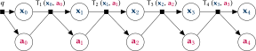

<span style="display:block; height: 20px;"></span>

<p  style='font-size:90%;'>PhD viva presentation - 11<sup style='font-size:80%;'>th</sup> October 2017</p>

<p style='font-size: 90%;'>
  <small>Candidate:</small> Matthew Graham
  <span style="display:inline-block; width: 10px;"></span>
  <small>Supervisor:</small> Amos Storkey
</p>


---

### Unifying theme

<ul>
  <li class="fragment" data-fragment-index="1">
    Development of **Markov chain Monte Carlo** methods for **approximate inference** in probabilistic models.
  </li>
  <!--
  <li class="fragment" data-fragment-index="2">
    Key idea: central importance of **parameterisation** of Markov chain state and controlling updates to all variables to **efficiency** and **robustness** of MCMC inference.
  </li>
  -->
  <li class="fragment" data-fragment-index="3">
   Focus on methods which **reparametrise chain state** by
    <ul>
      <li class="fragment" data-fragment-index="4"> introducing **auxiliary variables** and </li>
      <li class="fragment" data-fragment-index="5">update **transformations** of existing variables.</li>
    </ul>
  </li>
</ul>

---

### Key contributions

  * Auxiliary pseudo-marginal framework <small>(collaboration with Iain Murray)</small> 
    * Approach for improving robustness and efficiency of pseudo-marginal MCMC methods. <!-- .element: class="fragment" data-fragment-index="1" -->
    * Separates updates to target variables and auxiliary variables used in density estimator. <!-- .element: class="fragment" data-fragment-index="2" -->
    * Minimal implementation overhead - easy plug-in method that can simplify tuning of proposal distribution and aid in diagnosis of chain issues. <!-- .element: class="fragment" data-fragment-index="3" -->

----

### Key contributions

  * Inference in differentiable generative models
    * Approach for performing inference in differentiable sub-class of implicit / simulator models. <!-- .element: class="fragment" data-fragment-index="1" -->
    * Consider generative model as deterministic transformation of random inputs. <!-- .element: class="fragment" data-fragment-index="2" -->
    * Alternative to ABC inference - condition generative model output to be arbitrarily close to observed data. <!-- .element: class="fragment" data-fragment-index="3" -->
    * Inference remains tractable when using full data rather than reduced-dimensionality summary statistics. <!-- .element: class="fragment" data-fragment-index="4" -->

----

### Key contributions

  * Continuous tempering
    * Improved exploration of multi-modal distributions and estimation of normalising constants. <!-- .element: class="fragment" data-fragment-index="1" -->
    * Use of continuous rather than discrete auxiliary temperature variable - gradient-based updates. <!-- .element: class="fragment" data-fragment-index="2" -->
    * Exploit cheap variational approximations to improve exploration of temperature space. <!-- .element: class="fragment" data-fragment-index="3" -->
    * Easy to integrate in to existing probabilistic programming frameworks like PyMC3 and Stan. <!-- .element: class="fragment" data-fragment-index="4" -->

---

## Auxiliary pseudo-marginal methods

  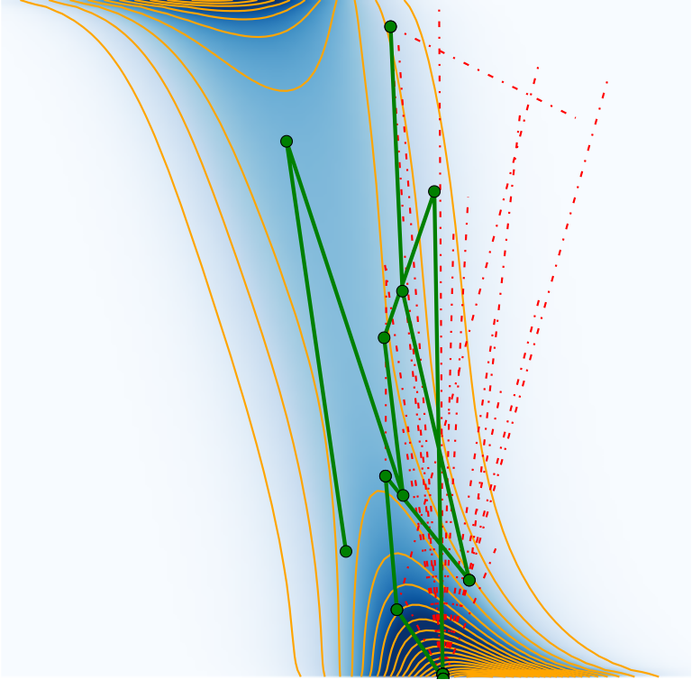

----

### Pseudo-marginal framework

<div class="fragment" data-fragment-index="1">
*Standard approximate inference*: Target distribution $P$ with unnormalised density $\tilde{p}$ wrt reference measure $\mu$

<span style="display:block; height: 5px;"></span>

$$P(\set{A}) = \frac{1}{C} \int_{\set{A}} \tilde{p}(\vct{x})\,\mu(\dr \vct{x}).$$
</div>

<span style="display:block; height: 5px;"></span>

<div class="fragment" data-fragment-index="2">

*Pseudo-marginal inference*: Cannot evaluate $\tilde{p}$ directly only compute unbiased and non-negative estimates $\hat{\rvar{p}}$

<span style="display:block; height: 5px;"></span>

$$\tilde{p}(\vct{x}) = \int\_0^{\infty} \hat{p} \,\prob{\hat{\rvar{p}}|\rvct{x}}(\dr \hat{p} \gvn \vct{x}).$$

</div>


----

### Example application

<div class="fragment" data-fragment-index="1">

Hierarchical latent variable model


</div>

<span style="display:block; height: 2px;"></span>

<div class="fragment" data-fragment-index="2">

Target density $p(\vct{x}) = \pden{\rvct{x}|\rvct{y}}(\vct{x}\gvn\vct{y}) \implies \tilde{p}(\vct{x}) = \pden{\rvct{x},\rvct{y}}(\vct{x},\vct{y})$.

</div>

<span style="display:block; height: 2px;"></span>

<div class="fragment" data-fragment-index="3">

Marginalising out $\rvct{z}$ intractable, however can estimate $\pden{\rvct{x},\rvct{y}}$

$$\hat{\rvar{p}} = \frac{1}{N} \sum\_{n=1}^N \frac{\pden{\rvct{x},\rvct{y},\rvct{z}}(\rvct{x},\vct{y},\rvct{z}^{(n)})}{q(\rvct{z}^{(n)}\gvn \rvct{x},\vct{y})}, \quad \rvct{z}^{(n)} \sim q(\cdot\gvn\rvct{x},\vct{y}) ~\forall n.$$

</div>

----

### Pseudo-marginal Metropolis-Hastings

<span class='ref'>(Beaumont 2003, Andrieu &amp; Roberts 2009)</span>

<div style='font-size: 80%;'>
\begin{align}
& \vct{x}' \sim r(\cdot \gvn \vct{x}\_n) & 
\textrm{Sample proposed update.}\\\\
& \hat{p}' \sim \prob{\hat{\rvar{p}}|\rvct{x}}(\cdot \gvn \vct{x}') &
\textrm{Estimate target density at proposal.}\\\\
& a \sim \mathcal{U}(0,1)\\\\
&\textbf{if}~ a < \frac{r(\vct{x}\_n\gvn\vct{x}')\,\hat{p}'}{r(\vct{x}'\gvn\vct{x}\_n)\,\hat{p}\_n}: &
\textrm{Metropolis-Hastings acceptance test.}\\\\
&\qquad \vct{x}\_{n+1},\hat{p}\_{n+1} \gets \vct{x}',\,\hat{p}' &
\textrm{Accept proposal.}\\\\
&\textbf{else}:\\\\
&\qquad \vct{x}\_{n+1},\hat{p}\_{n+1} \gets \vct{x}\_n,\,\hat{p}\_n &
\textrm{Reject proposal}.
\end{align}
</div>

----

### Challenges

<div class="fragment" data-fragment-index="1">
  <p>Propensity of chains to 'stick'</p>
  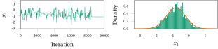
</div>

<div class="fragment" data-fragment-index="2">
  <p>Difficulty of tuning proposal distribution</p>
  
 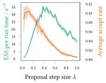
</div>

----

### Reparameterising the density estimator

Factor out auxiliary variables $\rvct{u}$ used in density estimator

$$\hat{\rvar{p}} = \varepsilon(\rvct{x},\rvct{u}), \qquad \rvct{u} \sim \rho(\cdot),$$

requirement that $\hat{\rvar{p}}$ unbiased estimator $\Rightarrow$

$$\tilde{p}(\vct{x}) = \int_{\set{U}} \varepsilon(\vct{x},\vct{u})\,\\rho(\vct{u})\,\nu(\dr\vct{u}).$$

---

### Reparameterising the density estimator

Define Markov chain on augmented state $(\vct{x},\vct{u})$


with unique invariant distribution with density 

$$\pi(\vct{x},\vct{u}) = \frac{1}{C} \varepsilon(\vct{x},\vct{u})\,\rho(\vct{u}).$$

with $P$ by construction marginal distribution on $\vct{x}$.

----

### Reparameterised pseudo-marginal M-H


<div style='font-size: 75%;'>
\begin{align}
& \vct{x}' \sim r(\cdot \gvn \vct{x}\_n) & 
\textrm{Propose new tgt. variables.}\\\\
& \vct{u}' \sim \rho(\cdot) &
\textrm{Propose new aux. variables.}\\\\
& a \sim \mathcal{U}(0,1)\\\\
&\textbf{if}~ a < \frac
{r(\vct{x}\_n\gvn\vct{x}')\,\rho(\vct{u}\_n)\phantom{\cancel{(}}\,\varepsilon(\vct{x}',\vct{u}')\,\rho(\vct{u}')}
{r(\vct{x}'\gvn\vct{x}\_n)\,\rho(\vct{u}')\phantom{\cancel{(}}\,\varepsilon(\vct{x}\_n,\vct{u}\_n)\,\rho(\vct{u}\_n)}: &
\textrm{M-H acceptance test.}\\\\
&\qquad \vct{x}\_{n+1},\,\vct{u}\_{n+1} \gets \vct{x}',\,\vct{u}' &
\textrm{Accept proposal.}\\\\
&\textbf{else}:\\\\
&\qquad \vct{x}\_{n+1},\,\vct{u}\_{n+1} \gets \vct{x}\_n,\,\vct{u}\_n &
\textrm{Reject proposal}.
\end{align}
</div>

----

### Reparameterised pseudo-marginal M-H


<div style='font-size: 75%;'>
\begin{align}
& \vct{x}' \sim r(\cdot \gvn \vct{x}\_n) & 
\textrm{Propose new tgt. variables.}\\\\
& \vct{u}' \sim \rho(\cdot) &
\textrm{Propose new aux. variables.}\\\\
& a \sim \mathcal{U}(0,1)\\\\
&\textbf{if}~ a < \frac
{r(\vct{x}\_n\gvn\vct{x}')\,\cancel{\rho(\vct{u}\_n)}\,\varepsilon(\vct{x}',\vct{u}')\,\cancel{\rho(\vct{u}')}}
{r(\vct{x}'\gvn\vct{x}\_n)\,\cancel{\rho(\vct{u}')}\,\varepsilon(\vct{x}\_n,\vct{u}\_n)\,\cancel{\rho(\vct{u}\_n)}}: &
\textrm{M-H acceptance test.}\\\\
&\qquad \vct{x}\_{n+1},\,\vct{u}\_{n+1} \gets \vct{x}',\,\vct{u}' &
\textrm{Accept proposal.}\\\\
&\textbf{else}:\\\\
&\qquad \vct{x}\_{n+1},\,\vct{u}\_{n+1} \gets \vct{x}\_n,\,\vct{u}\_n &
\textrm{Reject proposal}.
\end{align}
</div>

----

### Auxiliary pseudo-marginal framework

Apply alternative transition operators leaving $\pi$ invariant?

<div class="fragment" data-fragment-index="2">
<p>Simple scheme:</p>
<ol>
  <li> update auxiliary variables $\rvct{u}$ with $\rvct{x}$ fixed, </li>
  <li> update target variables $\rvct{x}$ with $\rvct{u}$ fixed, </li>
  <li> repeat. </li>
</ol>
</div>

Naming: APM T1+T2 where T1 is abbreviation for update in step 1 and T2 is abbreviation for update in step 2. <!--.element: class="fragment" data-fragment-index="3"-->

----

### Example - APM MI+MH

Metropolis independence (MI) updates to aux. variables $\rvct{u}$ + <!--.element: class="fragment" data-fragment-index="1"-->

Metropolis-Hastings (MH) updates to target variables $\rvct{x}$. <!--.element: class="fragment" data-fragment-index="2"-->

Minor tweak to reparameterised pseudo-marginal MH update - split update into two separate accept steps. <!--.element: class="fragment" data-fragment-index="3"-->

----

### Example - APM MI+MH

<div style='font-size: 65%;'>
\begin{align}
& \vct{u}' \sim \rho(\cdot) &
\textrm{Propose new aux. variables.}\\\\
& a\_1 \sim \mathcal{U}(0,1)\\\\
&\textbf{if}~ a\_1 < \frac
{\varepsilon(\vct{x}\_n,\vct{u}')\,}
{\varepsilon(\vct{x}\_n,\vct{u}\_n)}: &
\textrm{MI acceptance test.}\\\\
&\qquad \vct{u}\_{n+1} \gets \,\vct{u}' &
\textrm{Accept aux var. proposal.}\\\\
&\textbf{else}:\\\\
&\qquad \vct{u}\_{n+1} \gets \vct{u}\_n &
\textrm{Reject aux var. proposal}.\\\\
& \vct{x}' \sim r(\cdot\gvn\vct{x}\_n) &
\textrm{Propose new tgt. variables.}\\\\
& a\_2 \sim \mathcal{U}(0,1)\\\\
&\textbf{if}~ a\_2 < \frac
{r(\vct{x}\_n\gvn\vct{x}')\,\varepsilon(\vct{x}\_n,\vct{u}\_{n+1})\,}
{r(\vct{x}'\gvn\vct{x}\_n)\,\varepsilon(\vct{x}\_n,\vct{u}\_{n+1})}: &
\textrm{MH acceptance test.}\\\\
&\qquad \vct{x}\_{n+1} \gets \,\vct{x}' &
\textrm{Accept tgt var. proposal.}\\\\
&\textbf{else}:\\\\
&\qquad \vct{x}\_{n+1} \gets \vct{x}\_n &
\textrm{Reject tgt var. proposal}.
\end{align}
</div>

----

### APM MI+MH results

<div class="fragment" data-fragment-index="1">
  <p>Reduced sticking artifacts</p>
  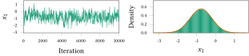
</div>

<div class="fragment" data-fragment-index="2">
  <p>Able to tune proposals using standard heuristics</p>
  
 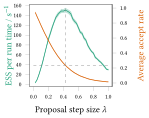
</div>

----

### Pseudo-marginal slice sampling

APM framework also allows use of adaptive algorithms like slice sampling <span class='ref'>(Neal 2003, Murray+ 2010)</span> for updates.

Can be applied to both auxiliary and target variable updates.

----

### Slice sampling target variables

Tradeoff lower peak efficiency for reduced need for tuning.

<div class='img-col'>
<p>APM MI+MH</p>

</div>
<div class='img-col'>
<p>APM MI+SS</p>
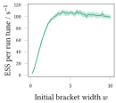
</div>

----

### Slice sampling auxiliary variables

<p>APM MI+MH</p>

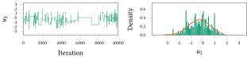

<p>APM SS+MH</p>
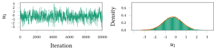


---

## Differentiable generative models


----

### Problem description

<div class="fragment" data-fragment-index="0">

*Given:* Probabilistic model of 

<p>
    $\observed{\rvct{x}}$ <span class="observed">: observed variables $\in \observed{\set{X}}$,</span>
</p>
<p>
    $\latent{\rvct{z}}$ <span class="latent">: latent variables $\in \latent{\set{Z}}$.</span>
</p>

</div>

<p class="fragment" data-fragment-index="2">
  *Task:* estimate conditional expectations
</p>

$$\expc{\,f(\latent{\rvct{z}}) \gvn \observed{\rvct{x} = \vct{x}}}.$$ <!-- .element: class="fragment" data-fragment-index="2" -->

----

### Generative models

Probabilistic models specified by a generative process.

<div  class="fragment" data-fragment-index="1">
Examples:

<ul>
  <li> Quantile distributions. </li>
  <li> Simulators of physical and biological processes. </li>
  <li> Models specified by differentiable networks (GANs, VAEs). </li>
  
</ul>

</div>

Often $\pden{\observed{\rvct{x}},\latent{\rvct{z}}}$ not explicitly defined. How to perform inference? <!-- .element: class="fragment" data-fragment-index="2" -->

----

### Generative models as transformations

Most (all?) generative models can be expressed in the form 

$$
  \input{\rvct{u}} \sim \rho
  \qquad
  \latent{\rvct{z}} = \vctfunc{g}\_{\latent{\rvct{z}}}(\input{\rvct{u}})
  \qquad
  \observed{\rvct{x}} = \vctfunc{g}\_{\observed{\rvct{x}}}(\input{\rvct{u}})
$$

where

<ul>
<li class="fragment" data-fragment-index="1">
  $\rho$ is density of distribution of *random inputs* $\input{\rvct{u}} \in \input{\set{U}}$,
</li>
<li class="fragment" data-fragment-index="2"> $\vctfunc{g}\_{\latent{\rvct{z}}} : \input{\set{U}} \to \latent{\set{Z}}$ and $\vctfunc{g}\_{\observed{\rvct{x}}} : \input{\set{U}} \to \observed{\set{X}}$ are *generator functions*. </li>
</ul>

----

### Differentiable generative models

Restricted case whereby

  * Variables real-valued $\input{\set{U}} \subseteq \reals^M$, $\observed{\set{X}} \subseteq \reals^{N\_{\rvct{x}}}$, $\latent{\set{Z}} \subseteq \reals^{N\_{\rvct{z}}}$
  * Input density gradient $\pd{\rho}{\input{\vct{u}}}$ exists almost everywhere,
  * Generator Jacobian $\pd{\vctfunc{g}\_{\observed{\rvct{x}}}}{\input{\vct{u}}}$ exists almost everywhere.

----

### Simulator models

Many simulators with continuous observed and latent variables can be expressed as differentiable generative models. <!-- .element: class="fragment" data-fragment-index="1" -->

Usually defined procedurally in code:<!-- .element: class="fragment" data-fragment-index="2" -->

```Python
def generator(rng):
    z = sample_from_prior(rng)
    x = simulate(z, rng)
    return x, z
```
<!-- .element: class="fragment" data-fragment-index="2" -->

----

### Example: Lotka-Volterra model


 

Continuous variant of model of prey ($\observed{x_1}$) and predator ($\observed{x_2}$) populations

$$
    \textrm{d} \observed{x_1} = 
    (\latent{z_1} \observed{x_1} - \latent{z_2} \observed{x_1 x_2}) \textrm{d} t + 
    \textrm{d} n_1
$$ <!-- .element: class="fragment" data-fragment-index="1" -->

$$
    \textrm{d} \observed{x_2} = 
    (-\latent{z_3} \observed{x_2} + \latent{z_4} \observed{x_1 x_2}) \textrm{d} t + 
    \textrm{d} n_2
$$ <!-- .element: class="fragment" data-fragment-index="1" -->

where $n_1$ and $n_2$ are white noise processes. <!-- .element: class="fragment" data-fragment-index="1" -->

----

### Example: Lotka-Volterra model

Simulate at $T$ discrete time-steps

```Python
def sample_from_prior(rng):
    return np.exp(rng.normal(size=4) - mu)
    
def simulate(z, rng):
    x1_seq, x2_seq = [], []
    x1, x2 = x1_init, x2_init
    for t in range(T):
        x1 += ( z[0]*x1 - z[1]*x2) * dt + rng.normal()*dt**0.5
        x2 += (-z[2]*x2 + z[3]*x1) * dt + rng.normal()*dt**0.5
        x1_seq.append(x1)
        x2_seq.append(x2)
    return np.array(x1_seq), np.array(x2_seq)
```
<!-- .element: class="fragment" data-fragment-index="1" -->


$$
    \input{\rvct{u}} = 
    \lsb \input{\textrm{random number generator draws}} \rsb
$$  <!-- .element: class="fragment" data-fragment-index="2" -->

$$
    \observed{\rvct{x}} = 
    \lsb 
      \observed{
        \rvar{x}^{(1)}_1,\,\rvar{x}^{(1)}_2,
        \,\dots\,
        \rvar{x}^{(T)}_1,\,\rvar{x}^{(T)}_2
      }
   \rsb,
   \quad
   \latent{\rvct{z}} =
   \lsb
      \latent{
        \rvar{z_1},\,\rvar{z_2},\,\rvar{z_3},\,\rvar{z_4}
      } 
    \rsb
$$ <!-- .element: class="fragment" data-fragment-index="2" -->

----

### Example: Lotka-Volterra model


----

<!-- .slide: data-transition="none" -->
### Toy example

 

----

<!-- .slide: data-transition="none" -->
### Toy example

 

----

<!-- .slide: data-transition="none" -->
### ABC in input space

 

----

<!-- .slide: data-transition="none" -->
### ABC in input space

 

----

<!-- .slide: data-transition="none" -->
### ABC in input space

 

----

<!-- .slide: data-transition="none" -->
### ABC MCMC <span class='ref'>(Marjoram+ 2003)</span>

Perturbatively update $\latent{\rvct{z}}$, independently sample $\observed{\rvct{x}}\gvn\latent{\rvct{z}}$

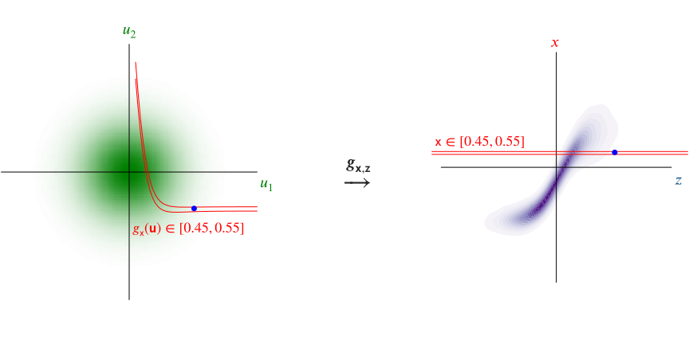 

Instance of pseudo-marginal Metropolis-Hastings. 

----

<!-- .slide: data-transition="none" -->
### ABC MCMC <span class='ref'>(Marjoram+ 2003)</span>

Perturbatively update $\latent{\rvct{z}}$, independently sample $\observed{\rvct{x}}\gvn\latent{\rvct{z}}$

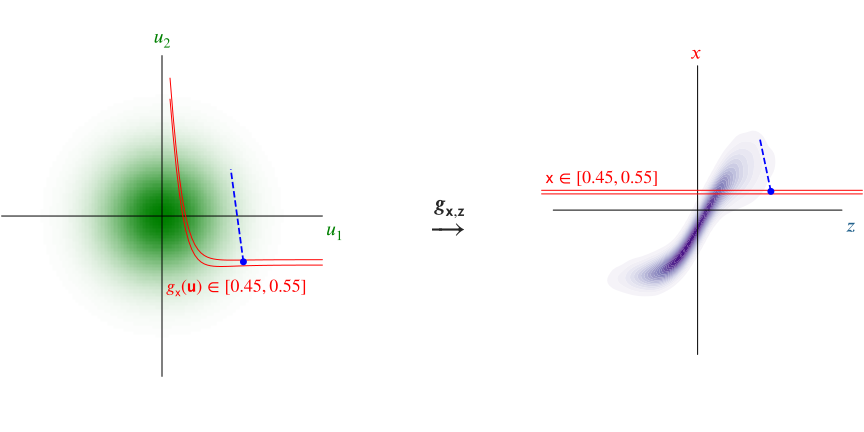

Instance of pseudo-marginal Metropolis-Hastings. 

----

### ABC expectations in input space

ABC approximates expectations by introducing *kernel* e.g.

\begin{equation}
k\_{\epsilon}\lpa\,\observed{\vct{y}};\,\observed{\vct{x}}\rpa
\propto
\mathbb{I}\lsb \left|\observed{\vct{y}} - \observed{\vct{x}}| < \epsilon\right|\rsb / \epsilon^{N\_{\rvct{x}}}
\end{equation}<!-- .element: class="fragment current-visible" data-fragment-index="1" -->

\begin{equation}
  \expc{\,f(\latent{\rvct{z}}) \gvn \observed{\rvct{x} = \vct{y}}} = \\\\
  \lim\_{\epsilon \to 0}
  \frac{1}{C}
  \int\_{\latent{\set{Z}}}\int\_{\observed{\set{X}}}
    \hspace{-0.2em}
    f(\latent{\vct{z}})\,
    k\_{\epsilon}\lpa\,
      \observed{\vct{y}};\,
      \observed{\vct{x}}
    \rpa
    \prob{\observed{\rvct{x}},\latent{\rvct{z}}}(\observed{\dr\vct{x}},\latent{\dr\vct{z}})
\end{equation}<!-- .element: class="fragment" data-fragment-index="2" -->

ABC expectations can be rewritten as<!-- .element: class="fragment" data-fragment-index="3" -->

\begin{equation}
  \expc{\,f(\latent{\rvct{z}}) \gvn \observed{\rvct{x} = \vct{y}}} =
  \lim\_{\epsilon \to 0}
  \frac{1}{C}
  \int\_{\input{\set{U}}}
    \hspace{-0.2em}
    f \circ \vctfunc{g}\_{\latent{\rvct{z}}}(\input{\vct{u}})\,
    k\_{\epsilon}\lpa\,
      \observed{\vct{y}};\,
      \vctfunc{g}\_{\observed{\rvct{x}}}(\input{\vct{u}})
    \rpa\,
    \rho(\input{\vct{u}})\,
  \dr\input{\vct{u}}
\end{equation}<!-- .element: class="fragment" data-fragment-index="3" -->

----

### Alternative ABC MCMC operators

Construct an MCMC operator which leaves the distribution with density

$$\pi\_{\epsilon}(\vct{u}) = \frac{1}{C} k\_{\epsilon}\lpa\,
  \observed{\vct{x}};\,
  \vctfunc{g}\_{\observed{\rvct{x}}}(\input{\vct{u}})
\rpa\,
\rho(\input{\vct{u}}),$$

invariant, e.g. Hamiltonian Monte Carlo, slice sampling. 


----

<!-- .slide: data-transition="none" -->
### $\epsilon \to 0$ : conditioning as a constraint

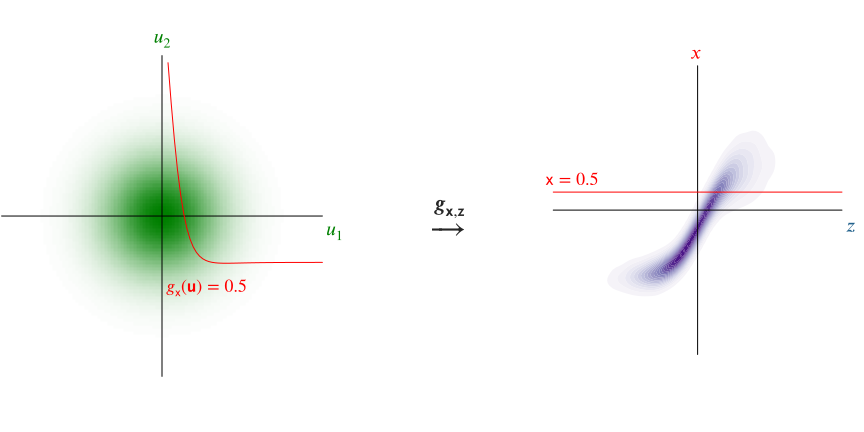 

----

### Asymptotically exact inference

<div class="fragment" data-fragment-index="0" style='padding-bottom: 1em;'>
Define a manifold embedded in input space

$$
  \vctfunc{g}\_{\observed{\rvct{x}}}^{-1}[\observed{\vct{x}}] = \lbr \input{\vct{u}} \in \input{\set{U}} : \vctfunc{g}\_{\observed{\rvct{x}}}(\input{\vct{u}}) = \observed{\vct{x}} \rbr.
$$
</div>

<div class="fragment" data-fragment-index="1">
Conditional expectations are integrals over $\vctfunc{g}\_{\observed{\rvct{x}}}^{-1}[\observed{\vct{x}}]$
  
<div style='padding-top:10px'>
\begin{equation}
  \expc{\,f(\latent{\rvct{z}}) \gvn \observed{\rvct{x} = \vct{x}}} = \\\\
  \frac{1}{C}
  \int\_{\vctfunc{g}\_{\observed{\rvct{x}}}^{-1}[\observed{\vct{x}}]}
    f \circ \vctfunc{g}\_{\latent{\rvct{z}}}(\input{\vct{u}})\,
    \left| 
      \pd{\vctfunc{g}\_{\observed{\rvct{x}}}}{\input{\vct{u}}}
      \pd{\vctfunc{g}\_{\observed{\rvct{x}}}}{\input{\vct{u}}}^{\rm{T}}
    \right|^{-\frac{1}{2}}\hspace{-0.2em}
    \rho(\input{\vct{u}})\,
  \mathcal{H}^{M-N_{\rvct{x}}}\lpa\dr\input{\vct{u}}\rpa
\end{equation}
</div>

<span class='ref'>(Diaconis, Holmes & Shahshahani; 2013)</span>
</div>

----

### Asymptotically exact inference

If we can sample $\lbr \input{\vct{u}^{(s)}} \rbr_{s=1}^S$ from a Markov chain such that:

<p class="fragment" data-fragment-index="1"> all samples are restricted to $\vctfunc{g}\_{\observed{\rvct{x}}}^{-1}[\observed{\vct{x}}]$, </p>

<p class="fragment" data-fragment-index="2">
  and stationary distribution has density proportional to $\pi(\input{u}) \propto \rho(\input{\vct{u}})\,
    \left| 
      \pd{\vctfunc{g}\_{\observed{\rvct{x}}}}{\input{\vct{u}}} 
      \pd{\vctfunc{g}\_{\observed{\rvct{x}}}}{\input{\vct{u}}}\tr
    \right|^{-\frac{1}{2}} $,
</p>

<div class="fragment" data-fragment-index="3">
then we can calculate consistent estimators

$$
  \expc{\,f(\latent{\rvct{z}}) \gvn \observed{\rvct{x} = \vct{x}}} = 
  \lim\_{S \to \infty} \frac{1}{S} \sum\_{s=1}^S \lbr f \circ {\vctfunc{g}\_{\latent{\rvct{z}}}}\lpa\input{\vct{u}^{(s)}}\rpa \rbr.
$$
</div>

----

### Constrained Hamiltonian Monte Carlo <span class='ref' style='font-size: 80%;'>Hartmann &amp; Schutte 2005, Leli&egrave;vre 2012; Brubaker+ 2012</span>

Use simulated constrained Hamiltonian dynamic to propose moves on implicitly defined embedded manifold $\vctfunc{g}\_{\observed{\rvct{x}}}^{-1}[\observed{\vct{x}}]$. <!-- .element: class="fragment" data-fragment-index="1" -->

$$
  \td{\input{\vct{u}}}{t} = \vct{p}
  \qquad
  \td{\vct{p}}{t} = \pd{\log \pi}{\input{\vct{u}}} - \pd{\vctfunc{g}\_{\observed{\rvct{x}}}}{\input{\vct{u}}}\tr\vct{\lambda}
$$ <!-- .element: class="fragment" data-fragment-index="2" -->

subject to $\vctfunc{g}\_{\observed{\rvct{x}}}(\input{\vct{u}}) = \observed{\vct{x}}$ and $\pd{\vctfunc{g}\_{\observed{\rvct{x}}}}{\input{\vct{u}}}\vct{p} = \vct{0}$. <!-- .element: class="fragment" data-fragment-index="2" -->

<p class="fragment" data-fragment-index="3">Integrators such as RATTLE <span class='ref' style='font-size: 80%;' >(Andersen 1983)</span> time-reversible and measure preserving <span class='ref' style='font-size: 80%;' >(Leimkuhler &amp; Skeel, 1994)</span>.</p>

----

### Constrained HMC in toy example

<video controls loop>
  <source data-src="images/chmc-animation-io.mp4" type="video/mp4" />
</video>

----

### Lotka-Volterra parameter inference

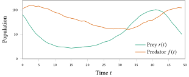 

----

### Lotka-Volterra parameter inference

Full observed data: ABC reject and ABC MCMC unusable.

However using 9 dimensional summary statistics ABC MCMC (uniform ball kernel, $\epsilon = 2.5$) appears to converge.

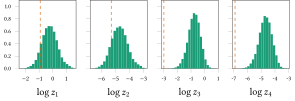 

----

### Lotka-Volterra parameter inference

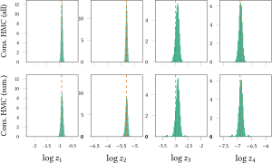 

----

### Lotka-Volterra parameter inference

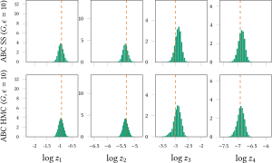 

----

### Lotka-Volterra parameter inference

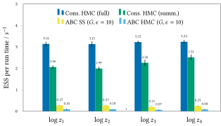 

---

## Continuous tempering

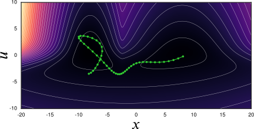 

----

<!-- .slide: data-background-image="images/bimodal-geometric-bridge-visualisation.svg" data-background-size="auto 95%" data-state="dim-bg" -->

### Thermodynamic methods

Introduce inverse temperature $\beta$<!-- .element: class="fragment" data-fragment-index="1" -->

<p class="fragment" data-fragment-index="2">and simple normalised <em>base density</em> $\exp\lpa-\psi(\vct{x})\rpa$. </p>

\[
  p\lpa \vct{x} \gvn \beta \rpa \propto
  \exp\lpa -\beta \phi(\vct{x}) - (1 - \beta) \psi(\vct{x}) \rpa
\] <!-- .element: class="fragment" data-fragment-index="3" -->

----

<!-- .slide: data-background-image="images/bimodal-geometric-bridge-visualisation.svg" data-background-size="auto 95%" -->

----

<!-- .slide: data-background-image="images/simulated-tempering-0.svg" data-background-size="auto 95%"  -->

<div style='background-color: rgba(255, 255, 255, 0.3);'>
<h3 style='font-size: 110%;'>Simulated tempering (ST) <span class='ref'>Marinari &amp; Parisi 1992</span></h3>
</div>

----

<!-- .slide: data-background-image="images/simulated-tempering-1.svg" data-background-size="auto 95%"  -->

----

<!-- .slide: data-background-image="images/simulated-tempering-2.svg" data-background-size="auto 95%"  -->

----

<!-- .slide: data-background-image="images/simulated-tempering-3.svg" data-background-size="auto 95%"  -->

----

<!-- .slide: data-background-image="images/simulated-tempering-4.svg" data-background-size="auto 95%"  -->

----

<!-- .slide: data-background-image="images/simulated-tempering-5.svg" data-background-size="auto 95%"  -->

----

<!-- .slide: data-background-image="images/simulated-tempering-6.svg" data-background-size="auto 95%"  -->

----

<!-- .slide: data-background-image="images/rb-simulated-tempering-0.svg" data-background-size="auto 95%"  -->

<div style='background-color: rgba(255, 255, 255, 0.3);'>
<h3 style='font-size: 100%;'>Rao-Blackwellized tempered sampling <span class='ref'>Carlson+ 2016</span></h3>
</div>

----

### Continuous tempering

Use continuous inverse temperature variable $\beta \in [0,1] \Rightarrow$

Avoid need to choose inverse temperature 'ladder'.

\[
  p(\vct{x},\beta) \propto \exp\lpa-\beta \lpa \phi(\vct{x}) + \log\zeta\rpa - (1- \beta)\psi(\vct{x})\rpa
\]<!-- .element: class="fragment" data-fragment-index="1" -->


<p style='color: #888; font-size: 80%;' class="fragment" data-fragment-index="2">$\log \zeta \approx \log Z$ $\Rightarrow$ $\frac{p(\beta=1)}{p(\beta=0)} \approx 1$</p>


----

### Continuous tempering

Conditional density $\beta \gvn \vct{x}$ : truncated exponential

\[
  p(\beta\gvn\vct{x}) = \frac{\exp(-\beta \Delta(\vct{x}))\Delta(\vct{x})}{1- \exp(-\beta\Delta(\vct{x}))},
\]

\[
  \Delta(\vct{x}) = \phi(\vct{x}) + \log\zeta - \psi(\vct{x})
\]

Can generate independent samples from $p(\beta\gvn\vct{x})$.<!-- .element: class="fragment" data-fragment-index="1" -->

----

### Rao-Blackwellisation

If $\lbrace \vct{x}^{(s)} \rbrace_{s=1}^S$ samples from joint $p(\vct{x},\beta)$<!-- .element: class="fragment" data-fragment-index="1" -->

\[
  Z  \approx \sum_{s=1}^S \frac{p(\beta=1|\vct{x}^{(s)})}{p(\beta=0|\vct{x}^{(s)})} \,\zeta
\]<!-- .element: class="fragment" data-fragment-index="2" -->


\[
  \int\_{\set{X}} f(\vct{x})\,\pi(\vct{x})\,\dr\vct{x}  \approx \sum_{s=1}^S \frac{p(\beta=1|\vct{x}^{(s)}) \,f(\vct{x}^{(s)})}{p(\beta=1|\vct{x}^{(s)})}.
\]<!-- .element: class="fragment" data-fragment-index="3" -->


----

<!-- .slide: data-background-image="images/gibbs-continuous-tempering-0.svg" data-background-size="auto 95%"  -->

<div style='background-color: rgba(255, 255, 255, 0.3);'>
<h3 style='font-size: 110%;'>Gibbs continuous tempering (Gibbs-CT)</h3>
</div>

----

<!-- .slide: data-background-image="images/gibbs-continuous-tempering-1.svg" data-background-size="auto 95%"  -->

----

<!-- .slide: data-background-image="images/gibbs-continuous-tempering-2.svg" data-background-size="auto 95%"  -->

----

<!-- .slide: data-background-image="images/gibbs-continuous-tempering-3.svg" data-background-size="auto 95%"  -->

----

<!-- .slide: data-background-image="images/gibbs-continuous-tempering-4.svg" data-background-size="auto 95%"  -->

----

<!-- .slide: data-background-image="images/gibbs-continuous-tempering-5.svg" data-background-size="auto 95%"  -->

----

### Joint continuous tempering (joint-CT)

Jointly update $\beta$ and $\vct{x}$ with HMC? <!-- .element: class="fragment" data-fragment-index="1" -->


Reparameterise $\beta \in [0, 1] \to u \in \reals$ <!-- .element: class="fragment" data-fragment-index="2" -->

e.g. $\beta(u) = \frac{1}{1 + \exp(-u)}$ <!-- .element: class="fragment" data-fragment-index="3" -->

<div style='font-size: 90%;' class="fragment" data-fragment-index="4">
\[
  p(\vct{x},u) \propto \left|\pd{\beta}{u}\right| \exp\lpa\beta(u) \lpa \phi(\vct{x}) + \log\zeta \rpa - (1 - \beta(u)) \psi(\vct{x})\rpa 
\]
</div>


----

<!-- .slide: data-background-image="images/joint-continuous-tempering-0.svg" data-background-size="auto 95%"  -->

<div style='background-color: rgba(255, 255, 255, 0.3);'>
<h3 style='font-size: 110%;'>Joint continuous tempering (joint-CT)</h3>
</div>

----

<!-- .slide: data-background-image="images/joint-continuous-tempering-1.svg" data-background-size="auto 95%"  -->

----

<!-- .slide: data-background-image="images/joint-continuous-tempering-2.svg" data-background-size="auto 95%"  -->


----

<!-- .slide: data-background-image="images/joint-continuous-tempering-3.svg" data-background-size="auto 95%"  -->


----

<!-- .slide: data-background-image="images/joint-continuous-tempering-4.svg" data-background-size="auto 95%"  -->


----

<!-- .slide: data-background-image="images/fitting-base-distribution-0.svg"  data-state="dim-bg"-->

### Choosing a base density

Important in determining how flat $p(\beta)$ is.<!-- .element: class="fragment" data-fragment-index="1" -->

Ideally $\exp\lpa-\phi(\vct{x})\rpa \approx \zeta \exp\lpa-\psi(\vct{x})\rpa$.<!-- .element: class="fragment" data-fragment-index="2" -->

Smaller $\mathbb{D}_{\textrm{KL}}\lsb \exp\lpa-\psi(\vct{x})\rpa \,\Vert\, \frac{1}{Z}\exp\lpa-\phi(\vct{x})\rpa\rsb$ $\Rightarrow$ flatter $p(\beta)$.<!-- .element: class="fragment" data-fragment-index="3" -->


----

<!-- .slide: data-background-image="images/fitting-base-distribution-1.svg" -->

<div style='background-color: rgba(255, 255, 255, 0.3); margin-left:-500px; padding-left:500px; margin-right:-500px; padding-right:500px;'>
  <p> 
    $\exp\lpa-\psi(\vct{x})\rpa =$ prior?
  </p>
</div>

----

<!-- .slide: data-background-image="images/fitting-base-distribution-2.svg" -->

<div style='background-color: rgba(255, 255, 255, 0.5); margin-left:-500px; padding-left:500px; margin-right:-500px; padding-right:500px;'>
  <p> 
    $\exp\lpa-\psi(\vct{x})\rpa =$ Gaussian variational approximation?
  </p>
</div>

----

<!-- .slide: data-background-image="images/fitting-base-distribution-3.svg" -->

<div style='background-color: rgba(255, 255, 255, 0.5); margin-left:-500px; padding-left:500px; margin-right:-500px; padding-right:500px;'>
  <p> 
    $\exp\lpa-\psi(\vct{x})\rpa =$ mixture of approximations?
  </p>
</div>

----

<!-- .slide: data-background-image="images/fitting-base-distribution-4.svg" -->

<div style='background-color: rgba(255, 255, 255, 0.5); margin-left:-500px; padding-left:500px; margin-right:-500px; padding-right:500px;'>
  <p> 
    $\exp\lpa-\psi(\vct{x})\rpa =$ Gaussian moment-matched to mixture of approximations?
  </p>
</div>

----

<!-- .slide: data-background-video="images/20d-bmr-example-1.mp4" data-background-video-loop="true" -->

### Boltzmann machine relaxations 

<p class="fragment" data-fragment-index="1">Continuous relaxation of Boltzmann machine corresponding to structure Gaussian mixture model <span class='ref'>(Zhang+ 2012)</span>.</p>

10 generated frustrated 30-unit systems - highly multimodal.<!-- .element: class="fragment" data-fragment-index="2" -->

Ground truth for $Z$ and $\expc{\vct{x}}$ by exhaustive summation.<!-- .element: class="fragment" data-fragment-index="3" -->

Base density: Gaussian moment matched to mixture of mean-field approximations.<!-- .element: class="fragment" data-fragment-index="4" -->

----

### Boltzmann machine relaxation results

\[ \log Z \]

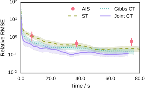

----

### Boltzmann machine relaxation results

\[ \expc{\vct{x}} \]

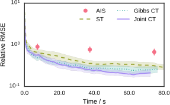

----

### Hierarchical regression model 

<p class="fragment" data-fragment-index="1">Hierarchical linear regression model applied to household Radon measurement dataset <span class='ref'>(Gelman & Hill 2006)</span>.</p>

<p class="fragment" data-fragment-index="2">919 data points and 92 free parameters.</p>


<p class="fragment" data-fragment-index="4">Use ADVI <span class='ref'>(Kucukelbir+ 2016)</span> to fit base density.</p>

<p class="fragment" data-fragment-index="4">Use NUTS <span class='ref'>(Hoffman & Gelman 2014)</span> in augmented space.</p>

----

### Hierarchical regression model results

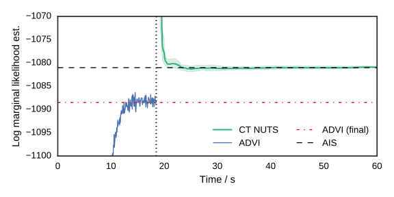

---

## Summary

<ul>
  <li class="fragment" data-fragment-index="1">*Auxiliary pseudo marginal framework*: easy to apply extension to standard pseudo-marginal methods with improved robustness, tunability and sampling efficiency.</li>
  <li class="fragment" data-fragment-index="2">*Constrained HMC in differentiable generative models*: novel alternative to ABC in restricted class of simulator models allowing efficient inference as $\epsilon \to 0$ and conditioning on full data rather than summaries. </li>
  <li class="fragment" data-fragment-index="3">*Continuous tempering*: alternative to simulated tempering which is easy to implement in existing HMC-based inference software with reduced need for user tuning and more efficient use of computation. </li>
</ul>
